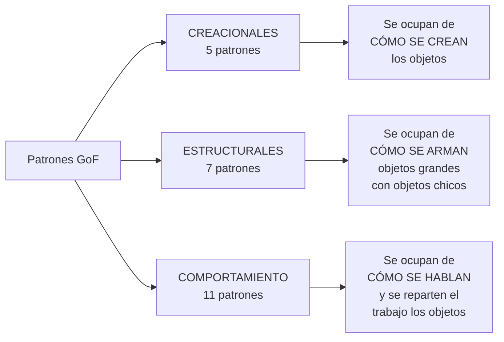
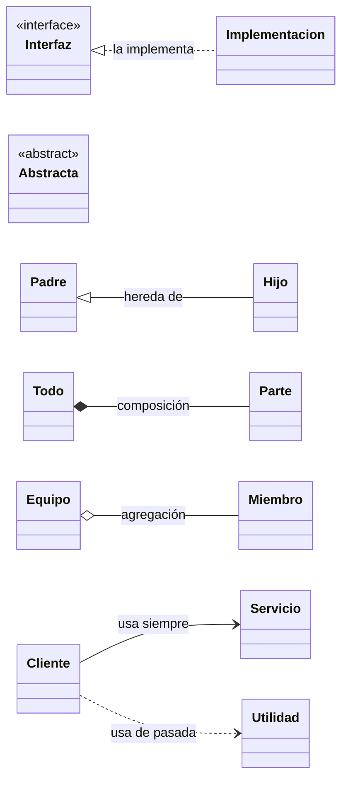

[← Volver al índice](README.md)

# 00 · Qué es un patrón de diseño (y qué NO es)

---

## En una frase

Un patrón de diseño es **una solución con nombre y apellido a un problema que ya le pasó
a mucha gente antes que a ti**.

No es código que copias y pegas. Es una **forma de organizar tus clases** que la industria
ya probó, le puso nombre, y ahora todo el mundo entiende cuando lo mencionas.

---

## La analogía

Imagina que eres arquitecto y necesitas conectar dos lados de un río.

Nadie inventa un puente desde cero cada vez. Existen tipos de puente conocidos:
colgante, atirantado, en arco. Cada uno resuelve un caso distinto (río muy ancho, terreno
blando, presupuesto corto), tiene un nombre, y cuando le dices a otro arquitecto
*"hagamos uno colgante"*, él ya sabe exactamente de qué hablas.

**Los patrones de diseño son eso, pero para clases y objetos.**

Cuando en una reunión dices *"eso se resuelve con un Strategy"*, tus cuatro compañeros
ya se imaginaron la misma estructura en la cabeza. Ese es el 80% del valor de aprenderlos:
**vocabulario compartido**.

---

## Qué NO es un patrón de diseño

| No es... | Porque... |
|---|---|
| Una librería | No lo instalas con Maven. Lo escribes tú, adaptado a tu caso. |
| Código para copiar y pegar | Es una *forma*, no un archivo. Cambia en cada proyecto. |
| Una regla obligatoria | Si tu código está bien sin patrón, déjalo así. |
| Algo específico de Java | Existen en C#, Python, Go, TypeScript... con matices. |
| Un framework | Spring *usa* patrones. Spring no *es* un patrón. |

---

## Las 3 familias

Los 23 patrones clásicos vienen del libro *Design Patterns* (1994) de cuatro autores a
los que se les conoce como la **"Gang of Four"** (GoF). Los agruparon en tres familias
según **qué problema resuelven**:



### Cómo identificar a cuál familia pertenece un problema

Hazte esta pregunta:

- *"El problema está en el momento de hacer `new`"* → **Creacional**
  (tengo `new` repartidos por todo el código, no sé qué clase concreta instanciar,
  el constructor tiene 12 parámetros...)

- *"El problema está en cómo conecto piezas"* → **Estructural**
  (esta librería externa no encaja con mi interfaz, necesito agregarle funciones a un
  objeto sin tocarlo, necesito tratar igual a un archivo y a una carpeta...)

- *"El problema está en quién hace qué y cuándo"* → **Comportamiento**
  (un `if` gigante que crece cada sprint, muchos módulos que deben enterarse de un
  evento, quiero poder deshacer acciones...)

---

## El único criterio para aplicar un patrón

> **¿Qué parte de este código voy a tener que modificar la próxima vez?**

Esa parte es la que se saca a una clase o interfaz aparte. Todo lo demás es decoración.

Ejemplo mental rápido:

```java
// Cada vez que agregan un medio de pago, TOCO ESTE MÉTODO. Duele.
if (medio.equals("TARJETA"))      { /* ... */ }
else if (medio.equals("PSE"))     { /* ... */ }
else if (medio.equals("NEQUI"))   { /* ... */ }
// ... y el mes que viene: DAVIPLATA, BRE-B, ...
```

Lo que cambia = **el medio de pago**.
Lo que se saca a una interfaz = **el medio de pago**.
El patrón que resulta = **Strategy**.

Así de mecánico es. Todos los patrones nacen de esa misma pregunta.

---

## Cómo leer los diagramas de este material

Todos los diagramas están hechos en **Mermaid**, que GitHub, GitLab y la mayoría de
editores Markdown renderizan solos. Las flechas significan cosas muy concretas y las
explicamos en detalle en el siguiente capítulo, pero aquí va la chuleta de bolsillo:



| Flecha | Se lee | Significa |
|---|---|---|
| `<\|..` (punteada, triángulo) | "implementa" | La clase cumple el contrato de una interfaz. |
| `<\|--` (sólida, triángulo) | "hereda de" | La clase extiende a otra clase. |
| `*--` (rombo relleno) | "está compuesto por" | La parte **no vive** sin el todo. |
| `o--` (rombo vacío) | "agrega a" | La parte **sí vive** sin el todo. |
| `-->` (flecha simple) | "tiene un" | Asociación: guarda una referencia. |
| `..>` (punteada) | "usa" | Dependencia pasajera: parámetro, variable local. |

Todo esto está desarrollado con calma en
[01-relaciones-entre-clases.md](01-relaciones-entre-clases.md).

---

## Errores típicos al empezar con patrones

1. **Patronitis aguda.** Aplicar patrones donde no hay dolor. Un `switch` de 3 casos
   estable no necesita nada. Recuerda: los patrones agregan clases, y las clases
   agregan costo de lectura.

2. **Confundir el nombre con la estructura.** Llamar `UsuarioFactory` a una clase que
   no es una fábrica de nada. El nombre debe ganárselo la estructura.

3. **Memorizar los 23 en vez de entender 5.** Con Strategy, Factory Method, Adapter,
   Observer y Decorator bien entendidos resuelves el 70% de lo que verás en un año.

4. **Creer que el patrón es el diagrama.** El diagrama es la foto. El patrón es la
   *intención*: qué problema resuelve y por qué.

5. **No ver que ya los estás usando.** `List` + `ArrayList` es programar contra
   interfaces. `Comparator` es Strategy. `StringBuilder` es Builder.
   `InputStreamReader` es Adapter. `BufferedReader` es Decorator.
   Los patrones ya viven dentro del JDK que usas todos los días.

---

## Java 21: lo que vamos a usar en los ejemplos

Los ejemplos aprovechan características modernas del lenguaje. Si alguna no la conoces,
esta tabla te salva:

| Característica | Para qué sirve aquí | Ejemplo |
|---|---|---|
| `record` | Clase de datos inmutable en una línea. | `record Cliente(String id, String nombre) {}` |
| `sealed interface` | Solo ciertas clases pueden implementarla. El compilador lo verifica. | `sealed interface Pago permits Tarjeta, Pse {}` |
| `switch` con patrones | `switch` que además de valores compara *tipos*. | `case Tarjeta t -> t.numero()` |
| Bloques de texto (`"""`) | Strings de varias líneas sin `\n`. | `var sql = """ SELECT ... """;` |
| `var` | Inferencia de tipo en variables locales. | `var lista = new ArrayList<String>();` |
| Métodos `default` en interfaces | Comportamiento por defecto sin clase abstracta. | `default void log() { ... }` |

---

## Siguiente paso

Antes de tocar cualquier patrón, entiende cómo se relacionan las clases entre sí.
Es literalmente el alfabeto con el que están escritos los 23.

➡️ **[01 · Relaciones entre clases](01-relaciones-entre-clases.md)**

---

[← Volver al índice](README.md)
