[← Volver al índice](README.md)

# 01 · Relaciones entre clases

> Este es **el capítulo más importante de todo el material**. Los 23 patrones no son
> más que combinaciones distintas de las 6 relaciones que verás aquí. Si entiendes
> esto, los patrones dejan de ser magia y pasan a ser sentido común.

---

## El resumen en una tabla

| Relación | Se lee | Fuerza del vínculo | En Java se ve como | Flecha |
|---|---|---|---|---|
| **Herencia** | "*es un*" | 🔴 Máxima | `class Hijo extends Padre` | `<\|--` |
| **Implementación** | "*cumple el contrato de*" | 🟠 Alta | `class X implements Y` | `<\|..` |
| **Composición** | "*está hecho de*" | 🟠 Alta | Campo creado dentro (`new` interno) | `*--` |
| **Agregación** | "*tiene un*" (prestado) | 🟡 Media | Campo recibido por constructor | `o--` |
| **Asociación** | "*conoce a*" | 🟡 Media | Campo con referencia | `-->` |
| **Dependencia** | "*usa de pasada*" | 🟢 Mínima | Parámetro o variable local | `..>` |

**La regla mental:** mientras más arriba en la tabla, más difícil es cambiar de opinión
después. Herencia es matrimonio sin divorcio; dependencia es saludar a alguien en el pasillo.

---

## Vista general

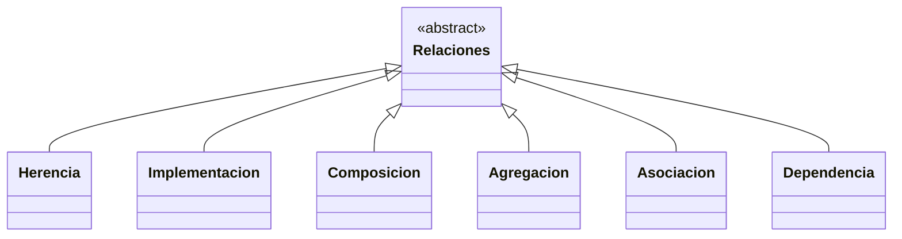

Vamos una por una, de la más débil a la más fuerte (así se entiende mejor).

---

# 1. Dependencia — "usa de pasada"

## Qué es

Una clase A **usa** a B momentáneamente: la recibe como parámetro, la crea como variable
local dentro de un método, o usa un método estático suyo. Cuando el método termina, la
relación se acabó.

**A no guarda a B en ningún campo.**

## Diagrama

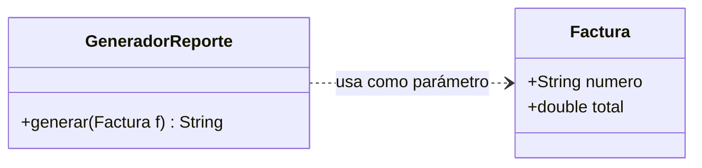

## En código

```java
class GeneradorReporte {
    // Factura entra, se usa, y se va. No queda guardada en ningún lado.
    String generar(Factura factura) {
        return "Factura " + factura.numero() + " por " + factura.total();
    }
}
```

## Cuándo la ves en la vida real

- Un servicio que recibe un DTO en un método.
- Usar `LocalDate.now()` dentro de un método.
- Cualquier `Utils.algo(...)`.

## La señal de alarma

Si un método depende de **más de 4 o 5 clases distintas**, probablemente está haciendo
demasiadas cosas. Es la relación más barata, pero abusar de ella también ensucia.

---

# 2. Asociación — "conoce a"

## Qué es

A **guarda una referencia** a B en un campo, de forma permanente. Ambos objetos son
independientes: existen por su cuenta y ninguno "manda" sobre la vida del otro.

Puede ser **unidireccional** (A conoce a B, B no sabe que A existe) o **bidireccional**
(los dos se conocen).

## Diagrama

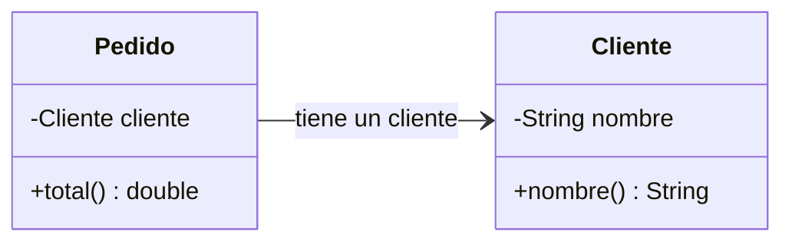

## En código

```java
class Pedido {
    private final Cliente cliente;   // referencia permanente

    Pedido(Cliente cliente) {
        this.cliente = cliente;
    }
}
```

## Cardinalidad (los numeritos del diagrama)

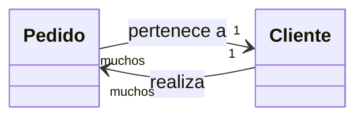

- `1 --> 1`: un pedido, un cliente.
- `1 --> muchos`: un cliente, muchos pedidos (en Java: `List<Pedido>`).
- `muchos --> muchos`: un estudiante ve muchos cursos, un curso tiene muchos estudiantes.

## Consejo práctico

**Evita las asociaciones bidireccionales si puedes.** Si `Pedido` conoce a `Cliente` y
`Cliente` conoce a `Pedido`, cada vez que agregues un pedido tienes que acordarte de
actualizar los dos lados. Es la fuente número uno de bugs de consistencia (y de bucles
infinitos al serializar a JSON).

---

# 3. Agregación — "tiene un, pero prestado"

## Qué es

Es una asociación con un matiz: A **contiene** a B, pero **B existe antes y después de A**.
Si destruyes A, B sigue vivo tan campante.

La clave: **A recibe a B desde afuera** (por constructor o setter). A no lo creó.

## La analogía

Un **equipo de fútbol** y sus **jugadores**.
Si el equipo se disuelve, los jugadores no desaparecen: se van a otro equipo.

## Diagrama

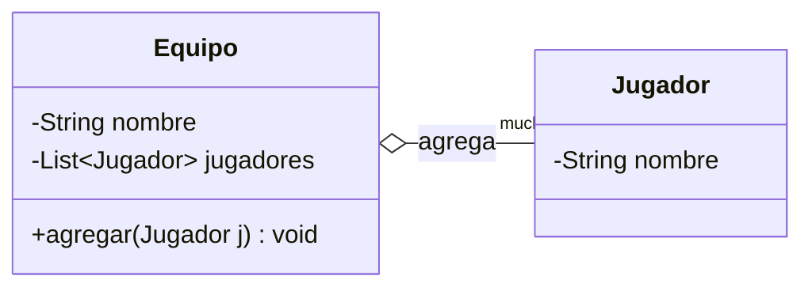

## En código

```java
class Equipo {
    private final List<Jugador> jugadores = new ArrayList<>();

    // Los jugadores LLEGAN de afuera. El equipo no los fabrica.
    void agregar(Jugador jugador) {
        jugadores.add(jugador);
    }
}

// Uso:
var james = new Jugador("James");
var equipo = new Equipo("Selección");
equipo.agregar(james);
// equipo = null;  ->  james sigue existiendo perfectamente
```

## Cómo la reconoces en el código

> **El objeto contenido entra por el constructor o por un setter.**

Eso es todo. Si te lo pasan, es agregación.

---

# 4. Composición — "está hecho de"

## Qué es

A **contiene** a B y **B no tiene sentido sin A**. Si destruyes A, B se va con él.
La clave: **A crea a B por dentro** (`new` dentro de la propia clase) y no lo expone.

## La analogía

Una **casa** y sus **habitaciones**.
Si demueles la casa, las habitaciones no se mudan a otro lado: dejan de existir.

## Diagrama

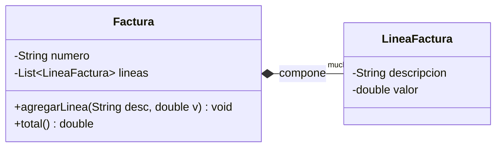

## En código

```java
class Factura {
    private final List<LineaFactura> lineas = new ArrayList<>();

    // La factura FABRICA sus propias líneas. Nadie le pasa una LineaFactura.
    void agregarLinea(String descripcion, double valor) {
        lineas.add(new LineaFactura(descripcion, valor));
    }
}
// Si la factura desaparece, sus líneas no le sirven a nadie más.
```

## Composición vs. Agregación: la única pregunta que necesitas

> **"Si borro el objeto contenedor, ¿el contenido sigue teniendo sentido por sí solo?"**

- **Sí sigue teniendo sentido** → Agregación (`o--`). Jugadores sin equipo.
- **No, se muere con él** → Composición (`*--`). Líneas sin factura.

## Truco de lectura del rombo

El rombo siempre va **del lado del "dueño"**:

- 🔷 Rombo **vacío** (`o--`) = "los tengo prestados".
- 🔶 Rombo **relleno** (`*--`) = "son míos y mueren conmigo".

---

# 5. Implementación (realización) — "cumple el contrato de"

## Qué es

Una clase se compromete a ofrecer todos los métodos que declara una **interfaz**.
La interfaz dice **qué** se puede hacer; la clase dice **cómo**.

## La analogía

Una interfaz es una **oferta de trabajo**: "se busca alguien que sepa `cobrar()` y
`reembolsar()`". Cualquiera que sepa hacer esas dos cosas puede tomar el puesto, sin
importar de dónde venga.

## Diagrama

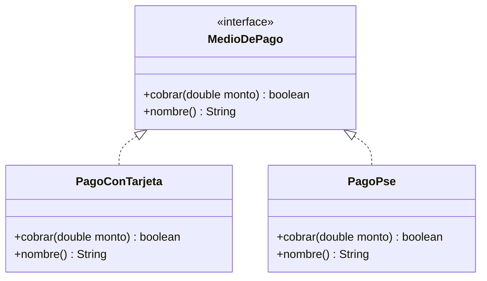

## En código

```java
interface MedioDePago {
    boolean cobrar(double monto);

    // Java 8+: método con implementación por defecto.
    default String nombre() { return getClass().getSimpleName(); }
}

class PagoConTarjeta implements MedioDePago {
    public boolean cobrar(double monto) { /* llamada a la pasarela */ return true; }
}
```

## Por qué es LA relación clave de los patrones

Casi todos los patrones se apoyan en esto: el código cliente habla con la **interfaz**,
y tú puedes cambiar la implementación sin que el cliente se entere.

```java
MedioDePago medio = new PagoConTarjeta();  // hoy
MedioDePago medio = new PagoPse();         // mañana, sin tocar nada más
```

Eso es *"programar contra interfaces"*, y es la regla #1 del material.

---

# 6. Herencia — "es un"

## Qué es

Una clase **extiende** a otra: recibe todos sus campos y métodos, y puede agregar los
suyos o sobrescribir los que existen.

## Diagrama

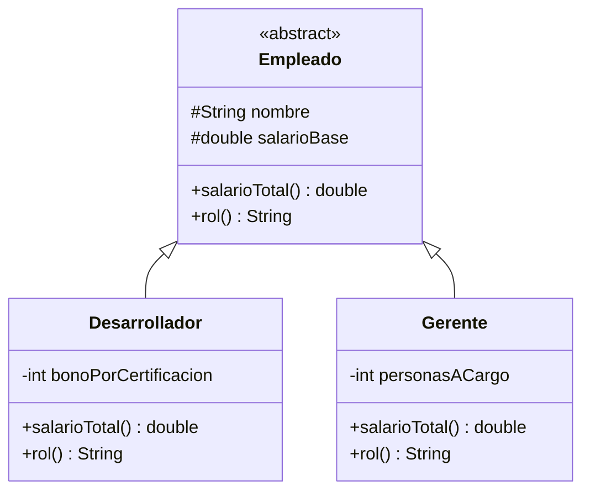

## En código

```java
abstract class Empleado {
    protected final String nombre;
    protected final double salarioBase;

    protected Empleado(String nombre, double salarioBase) {
        this.nombre = nombre;
        this.salarioBase = salarioBase;
    }

    double salarioTotal() { return salarioBase; }
    abstract String rol();       // obligatorio para los hijos
}

class Desarrollador extends Empleado {
    Desarrollador(String nombre, double base) { super(nombre, base); }

    @Override double salarioTotal() { return salarioBase * 1.10; }
    @Override String rol() { return "Desarrollador"; }
}
```

## El gran peligro de la herencia

La herencia crea el acoplamiento **más fuerte que existe en OOP**. Cuando `Hijo extends
Padre`:

- Si el padre agrega un método, el hijo lo hereda quiera o no.
- Si el padre cambia un comportamiento interno, el hijo se rompe sin haber sido tocado.
- Java **no permite herencia múltiple**: solo puedes elegir un padre, para siempre.

### El ejemplo clásico de por qué se rompe

```java
// Parece razonable...
class Rectangulo {
    protected int ancho, alto;
    void setAncho(int a) { this.ancho = a; }
    void setAlto(int a)  { this.alto = a; }
    int area() { return ancho * alto; }
}

// "Un cuadrado ES UN rectángulo", dice la geometría. Y la geometría te miente aquí.
class Cuadrado extends Rectangulo {
    @Override void setAncho(int a) { this.ancho = a; this.alto = a; }
    @Override void setAlto(int a)  { this.ancho = a; this.alto = a; }
}

// El código que rompe todo:
void probar(Rectangulo r) {
    r.setAncho(5);
    r.setAlto(4);
    assert r.area() == 20;   // ✅ con Rectangulo · ❌ con Cuadrado (da 16)
}
```

Un método que funcionaba con el padre se rompe con el hijo. Eso viola el
**Principio de Sustitución de Liskov** (la L de SOLID), y es la razón de que exista el
consejo que sigue.

---

# La regla de oro: composición > herencia

> **"Prefiere composición sobre herencia."**

## El problema con herencia

Requerimiento: notificaciones. Tenemos por email y por SMS. Después nos piden que
algunas sean **urgentes** (se reintentan 3 veces) y otras **normales**.

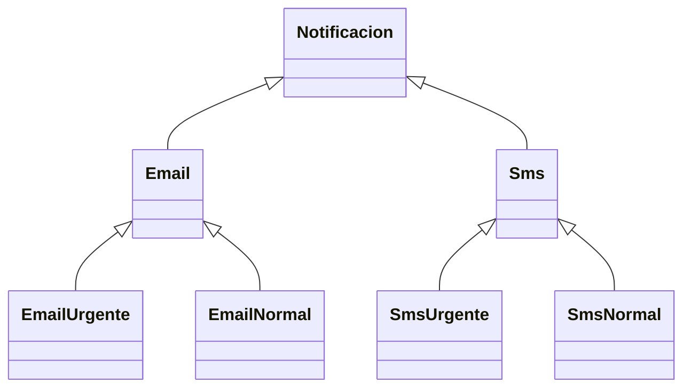

Ya vamos en 7 clases. Y ahora llega el ticket: *"agreguen WhatsApp"*, y después
*"agreguen prioridad baja"*. La explosión combinatoria es 2 canales × 2 prioridades = 4,
luego 3 × 3 = 9, luego 4 × 4 = 16... **cada eje nuevo multiplica, no suma.**

## La misma cosa con composición

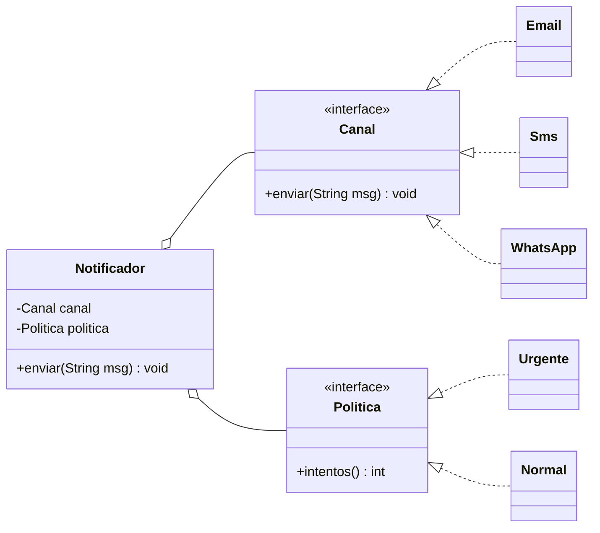

Ahora agregar un canal es **+1 clase**, no ×2. Y puedes combinarlos en **tiempo de
ejecución**, cosa que la herencia jamás te va a permitir (la herencia se decide al
compilar; la composición, mientras el programa corre).

```java
var urgentePorWhatsapp = new Notificador(new WhatsApp(), new Urgente());
var normalPorEmail     = new Notificador(new Email(),    new Normal());
```

> Este ejemplo concreto, llevado hasta el final, es el patrón
> **[Bridge](08-bridge.md)**. Y la idea de "envolver para agregar comportamiento" es
> **[Decorator](10-decorator.md)**.

---

## Cuándo SÍ usar herencia

No es que la herencia sea mala. Es que se usa mal. Úsala cuando:

1. Existe una relación **"es un"** verdadera y permanente
   (`IOException extends Exception` ✅).
2. Quieres compartir **código común** entre variantes muy parecidas, y el padre es
   `abstract` (ver **[Template Method](23-template-method.md)**).
3. Controlas al padre y al hijo (ambos son tuyos, no de una librería externa).
4. El padre está **diseñado para ser heredado**: documentado, con métodos `protected`
   pensados como puntos de extensión.

Y si no se va a heredar, **declara la clase `final`**. Es gratis y evita sorpresas.

---

## Ejemplo integrador: todas las relaciones a la vez

Un caso de trabajo típico: un módulo de facturación.

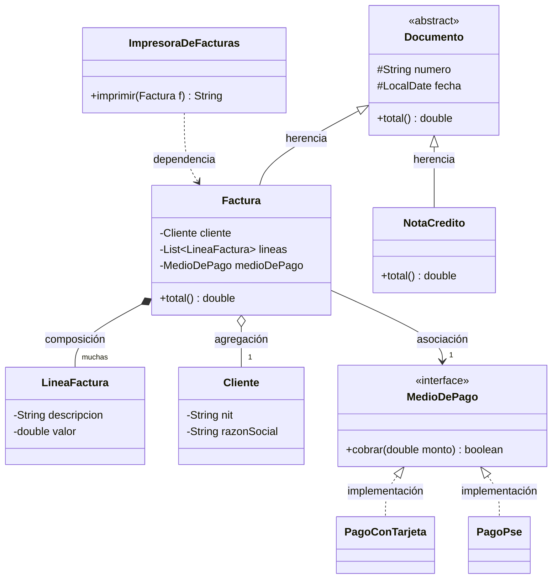

Leído en español:

- `Factura` **es un** `Documento` → **herencia**.
- `PagoConTarjeta` **cumple el contrato de** `MedioDePago` → **implementación**.
- `Factura` **está hecha de** `LineaFactura` (mueren juntas) → **composición**.
- `Factura` **tiene un** `Cliente` (que existe por su cuenta) → **agregación**.
- `Factura` **conoce a** un `MedioDePago` → **asociación**.
- `ImpresoraDeFacturas` **usa de pasada** una `Factura` → **dependencia**.

### El mismo diagrama, en Java 21

```java
import java.time.LocalDate;
import java.util.ArrayList;
import java.util.List;

// ---------- HERENCIA ----------
abstract class Documento {
    protected final String numero;
    protected final LocalDate fecha;

    protected Documento(String numero, LocalDate fecha) {
        this.numero = numero;
        this.fecha = fecha;
    }
    abstract double total();
}

// ---------- IMPLEMENTACIÓN ----------
interface MedioDePago {
    boolean cobrar(double monto);
    default String nombre() { return getClass().getSimpleName(); }
}

final class PagoConTarjeta implements MedioDePago {
    public boolean cobrar(double monto) {
        System.out.println("  Cobrando $" + monto + " a la tarjeta...");
        return true;
    }
}

final class PagoPse implements MedioDePago {
    public boolean cobrar(double monto) {
        System.out.println("  Redirigiendo a PSE por $" + monto + "...");
        return true;
    }
}

// ---------- Objetos de datos ----------
record Cliente(String nit, String razonSocial) {}          // vive por su cuenta
record LineaFactura(String descripcion, double valor) {}   // solo vive dentro de Factura

final class Factura extends Documento {
    private final Cliente cliente;                                  // AGREGACIÓN
    private final List<LineaFactura> lineas = new ArrayList<>();    // COMPOSICIÓN
    private final MedioDePago medioDePago;                          // ASOCIACIÓN

    Factura(String numero, Cliente cliente, MedioDePago medioDePago) {
        super(numero, LocalDate.now());
        this.cliente = cliente;
        this.medioDePago = medioDePago;
    }

    // La factura CREA sus líneas por dentro: nadie le pasa una LineaFactura ya hecha.
    void agregarLinea(String descripcion, double valor) {
        lineas.add(new LineaFactura(descripcion, valor));
    }

    @Override double total() {
        return lineas.stream().mapToDouble(LineaFactura::valor).sum();
    }

    boolean pagar() { return medioDePago.cobrar(total()); }

    Cliente cliente() { return cliente; }
    List<LineaFactura> lineas() { return List.copyOf(lineas); }  // copia: nadie toca las mías
    String numero() { return numero; }
}

final class NotaCredito extends Documento {
    private final double valor;
    NotaCredito(String numero, double valor) {
        super(numero, LocalDate.now());
        this.valor = valor;
    }
    @Override double total() { return -valor; }
}

// ---------- DEPENDENCIA ----------
final class ImpresoraDeFacturas {
    // Factura entra como parámetro, se usa, y se va. No queda guardada.
    String imprimir(Factura f) {
        var sb = new StringBuilder();
        sb.append("FACTURA ").append(f.numero()).append("\n");
        sb.append("Cliente: ").append(f.cliente().razonSocial()).append("\n");
        f.lineas().forEach(l -> sb.append("  - ")
                                  .append(l.descripcion())
                                  .append(": $").append(l.valor()).append("\n"));
        sb.append("TOTAL: $").append(f.total());
        return sb.toString();
    }
}

public class Demo {
    public static void main(String[] args) {
        var cliente = new Cliente("900123456-7", "Tecnología Andina S.A.S.");

        var factura = new Factura("FV-1042", cliente, new PagoConTarjeta());
        factura.agregarLinea("Licencia anual CRM", 4_800_000);
        factura.agregarLinea("Soporte premium", 1_200_000);

        System.out.println(new ImpresoraDeFacturas().imprimir(factura));
        System.out.println("\nProcesando pago:");
        factura.pagar();

        // El cliente sigue existiendo aunque la factura desaparezca (agregación)
        factura = null;
        System.out.println("\nCliente sigue vivo: " + cliente.razonSocial());
    }
}
```

**Salida:**

```
FACTURA FV-1042
Cliente: Tecnología Andina S.A.S.
  - Licencia anual CRM: $4800000.0
  - Soporte premium: $1200000.0
TOTAL: $6000000.0

Procesando pago:
  Cobrando $6000000.0 a la tarjeta...

Cliente sigue vivo: Tecnología Andina S.A.S.
```

---

## Acoplamiento y cohesión (los dos conceptos que todo esto persigue)

Todo lo anterior existe para manejar dos ideas:

### Acoplamiento — qué tanto dependen unas clases de otras

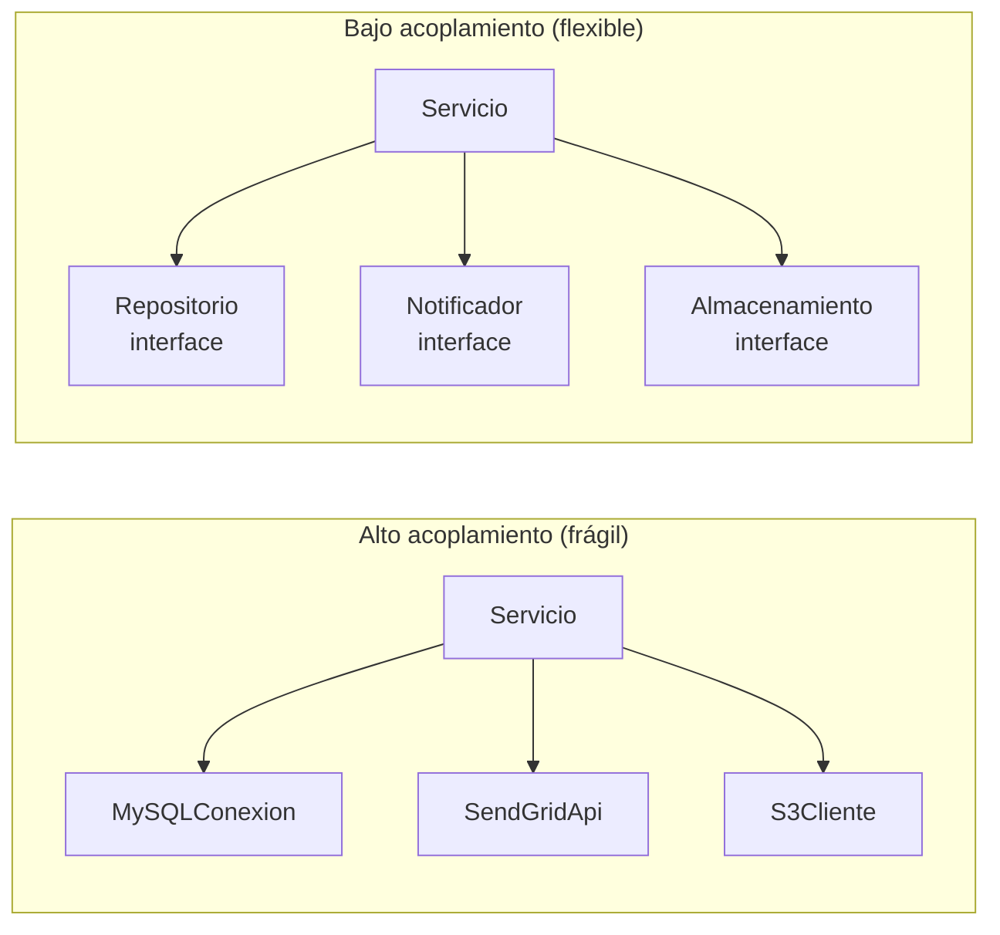

A la izquierda, cambiar de MySQL a Postgres te obliga a tocar `Servicio`.
A la derecha, escribes una clase nueva y `Servicio` ni se entera.
**Objetivo: acoplamiento BAJO.**

### Cohesión — qué tan enfocada está una clase en una sola cosa

- ❌ **Baja cohesión:** `UtilidadesGenerales` con `enviarEmail()`, `calcularIVA()`,
  `formatearFecha()` y `conectarBD()`. No tiene un tema.
- ✅ **Alta cohesión:** `CalculadoraDeImpuestos` con `calcularIVA()`,
  `calcularRetefuente()`, `calcularICA()`. Todo habla de lo mismo.

**Objetivo: cohesión ALTA.**

> Frase para recordar: **"bajo acoplamiento, alta cohesión"**.
> Los 23 patrones son, en el fondo, 23 maneras distintas de lograr eso.

---

## Chuleta final para pegar en el monitor

```
¿Cómo decido qué relación usar?

┌─ ¿La clase B solo aparece en un parámetro o variable local?
│   └─ SÍ  →  DEPENDENCIA        ..>
│
├─ ¿B es un campo, y llega desde afuera (constructor/setter)?
│   ├─ ¿B tiene vida propia?    →  AGREGACIÓN      o--
│   └─ ¿B es solo una referencia genérica? → ASOCIACIÓN  -->
│
├─ ¿B es un campo, y lo crea A por dentro con new, y muere con A?
│   └─ SÍ  →  COMPOSICIÓN       *--
│
├─ ¿A promete cumplir un contrato sin código heredado?
│   └─ SÍ  →  IMPLEMENTACIÓN    <|..
│
└─ ¿A "ES UN" B de verdad, y quieres reutilizar su código?
    └─ SÍ (y piénsalo dos veces)  →  HERENCIA      <|--
```

---

➡️ Siguiente: **[02 · Singleton](02-singleton.md)**

[← Volver al índice](README.md)
