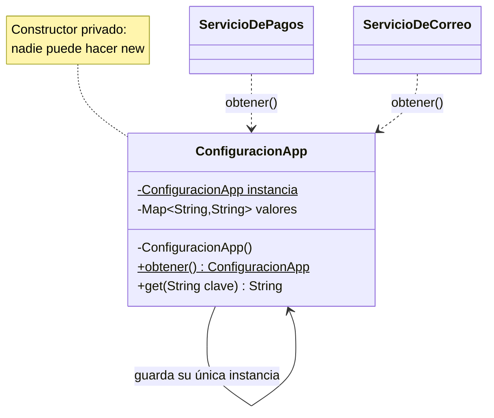

[← Volver al índice](README.md) · [← 01 Relaciones](01-relaciones-entre-clases.md) · [03 Factory Method →](03-factory-method.md)

# 02 · Singleton

> **Familia:** Creacional

---

## En una frase

**Garantiza que de una clase exista una sola instancia en toda la aplicación, y da un
punto único para llegar a ella.**

Como el gerente general de la empresa: hay uno, todos saben dónde encontrarlo, y nadie
anda por ahí creando gerentes nuevos.

---

## El enunciado

> **Ticket ARQ-118**
> La aplicación lee la configuración (URL de la base de datos, credenciales de la
> pasarela de pagos, timeouts) de un archivo `.properties`. Hoy cada servicio hace su
> propio `new ConfiguracionApp()`, lo que significa que el archivo se lee **del disco
> unas 40 veces por request**. En producción eso nos está costando 200 ms por petición.
>
> Además, cuando el equipo de infraestructura cambió un timeout en caliente, unos
> servicios quedaron con el valor viejo y otros con el nuevo. Nadie entiende por qué.
>
> **Necesitamos que la configuración se lea UNA sola vez y que todos vean lo mismo.**

---

## El código que duele

```java
class ServicioDePagos {
    private final ConfiguracionApp config = new ConfiguracionApp(); // lee el disco
}
class ServicioDeCorreo {
    private final ConfiguracionApp config = new ConfiguracionApp(); // lee el disco OTRA VEZ
}
class ServicioDeAuditoria {
    private final ConfiguracionApp config = new ConfiguracionApp(); // y otra...
}
```

Tres problemas de una vez:

1. **Desperdicio:** el mismo archivo leído N veces.
2. **Inconsistencia:** cada copia puede tener valores distintos.
3. **Nadie sabe cuántas hay:** no hay forma de controlarlo desde el código.

---

## La idea del patrón

Le quitas al mundo el derecho de hacer `new`:

1. El **constructor se vuelve `private`**. Nadie de afuera puede instanciar.
2. La clase **guarda su propia instancia** en un campo estático.
3. Ofreces un **método estático** (`getInstancia()`) que siempre devuelve la misma.

> **Regla de oro:** la clase toma control de su propio ciclo de vida.

---

## El diagrama



Fíjate en la flecha que sale y entra a la misma clase: eso es la firma visual del Singleton.

---

## La solución en Java 21

Hay tres formas correctas de hacerlo. Te las muestro todas, y te digo cuál usar.

```java
import java.util.Map;
import java.util.concurrent.atomic.AtomicInteger;

// =====================================================================
// FORMA 1 — Enum singleton. La MÁS SEGURA y la más corta.
// El JVM garantiza una sola instancia, incluso con serialización y reflexión.
// =====================================================================
enum ConfiguracionApp {
    INSTANCIA;

    private final Map<String, String> valores;

    // El constructor de un enum SIEMPRE es privado y se ejecuta una sola vez.
    ConfiguracionApp() {
        System.out.println("[Config] Leyendo application.properties del disco... (caro)");
        this.valores = Map.of(
            "db.url",          "jdbc:postgresql://prod-db:5432/ventas",
            "pagos.timeout",   "3000",
            "pagos.apiKey",    "sk_live_9f2a",
            "correo.remitente","no-reply@empresa.com"
        );
    }

    public String get(String clave) {
        return valores.getOrDefault(clave, "");
    }
}

// =====================================================================
// FORMA 2 — Initialization-on-demand holder.
// Se crea la primera vez que alguien la pide (lazy), sin synchronized,
// y es thread-safe porque el JVM garantiza la carga de clases.
// =====================================================================
final class PoolDeConexiones {

    private static final AtomicInteger CREACIONES = new AtomicInteger();
    private final int idPool;

    private PoolDeConexiones() {                 // <- nadie puede hacer new
        this.idPool = CREACIONES.incrementAndGet();
        System.out.println("[Pool] Abriendo 20 conexiones a la BD... (muy caro)");
    }

    // Esta clase interna NO se carga hasta que alguien llama a obtener().
    private static class Holder {
        private static final PoolDeConexiones INSTANCIA = new PoolDeConexiones();
    }

    static PoolDeConexiones obtener() {
        return Holder.INSTANCIA;
    }

    int idPool() { return idPool; }
    static int vecesQueSeConstruyo() { return CREACIONES.get(); }
}

// =====================================================================
// FORMA 3 — Eager (ansioso). La instancia se crea al cargar la clase.
// Úsala solo si crearla es barato y seguro que se va a usar.
// =====================================================================
final class RelojDelSistema {
    static final RelojDelSistema INSTANCIA = new RelojDelSistema();
    private RelojDelSistema() {}
    long ahora() { return System.currentTimeMillis(); }
}

// =====================================================================
// Los servicios que la consumen
// =====================================================================
final class ServicioDePagos {
    void cobrar(double monto) {
        var timeout = ConfiguracionApp.INSTANCIA.get("pagos.timeout");
        var pool = PoolDeConexiones.obtener();
        System.out.println("Pagos    -> cobrando $" + monto
            + " | timeout=" + timeout + "ms | pool #" + pool.idPool());
    }
}

final class ServicioDeCorreo {
    void enviar(String destino) {
        var remitente = ConfiguracionApp.INSTANCIA.get("correo.remitente");
        var pool = PoolDeConexiones.obtener();
        System.out.println("Correo   -> de " + remitente + " a " + destino
            + " | pool #" + pool.idPool());
    }
}

final class ServicioDeAuditoria {
    void registrar(String evento) {
        var url = ConfiguracionApp.INSTANCIA.get("db.url");
        var pool = PoolDeConexiones.obtener();
        System.out.println("Auditoría-> '" + evento + "' en " + url
            + " | pool #" + pool.idPool());
    }
}

public class Demo {
    public static void main(String[] args) {
        System.out.println("--- Arranca la aplicación ---\n");

        new ServicioDePagos().cobrar(150_000);
        new ServicioDeCorreo().enviar("cliente@correo.com");
        new ServicioDeAuditoria().registrar("PAGO_APROBADO");

        System.out.println("\n--- Verificación ---");
        System.out.println("El pool se construyó "
            + PoolDeConexiones.vecesQueSeConstruyo() + " vez/veces");
        System.out.println("¿Misma instancia de config? "
            + (ConfiguracionApp.INSTANCIA == ConfiguracionApp.INSTANCIA));
        System.out.println("¿Misma instancia de pool?   "
            + (PoolDeConexiones.obtener() == PoolDeConexiones.obtener()));
    }
}
```

### Salida

```
--- Arranca la aplicación ---

[Config] Leyendo application.properties del disco... (caro)
[Pool] Abriendo 20 conexiones a la BD... (muy caro)
Pagos    -> cobrando $150000.0 | timeout=3000ms | pool #1
Correo   -> de no-reply@empresa.com a cliente@correo.com | pool #1
Auditoría-> 'PAGO_APROBADO' en jdbc:postgresql://prod-db:5432/ventas | pool #1

--- Verificación ---
El pool se construyó 1 vez/veces
¿Misma instancia de config? true
¿Misma instancia de pool?   true
```

Fíjate: los mensajes caros (`Leyendo...`, `Abriendo 20 conexiones...`) aparecen **una sola
vez**, aunque tres servicios distintos pidieron los objetos.

---

## Qué ganamos

| Antes | Después |
|---|---|
| 40 lecturas de disco por request | 1 lectura en toda la vida del proceso |
| Cada servicio con valores distintos | Una sola fuente de verdad |
| Imposible saber cuántas instancias hay | Garantizado por el compilador y el JVM |

---

## El error clásico (y por qué no debes copiarlo)

Este es el Singleton que sale en el 90% de los tutoriales viejos:

```java
// ❌ ROTO en aplicaciones multi-hilo
class Config {
    private static Config instancia;
    static Config obtener() {
        if (instancia == null) {          // <-- dos hilos pueden entrar aquí a la vez
            instancia = new Config();     //     y crear DOS instancias
        }
        return instancia;
    }
}
```

Si dos hilos llegan al `if` al mismo tiempo, los dos ven `null` y los dos construyen.
Adiós Singleton. Y no lo arregles con `synchronized` en el método (mata el rendimiento en
cada llamada): usa el **Holder** de la Forma 2 o el **enum** de la Forma 1.

---

## ✅ Cuándo usarlo

- Configuración de la aplicación cargada una sola vez.
- Pools de conexiones o de hilos (crearlos es caro).
- Cachés en memoria compartidos por todo el proceso.
- Registros de métricas o loggers.
- Objetos que representan un recurso **físicamente único** (una impresora, un puerto serial).

## ⛔ Cuándo NO usarlo

- **Si estás en Spring, Quarkus, Micronaut o cualquier framework con inyección de
  dependencias: no lo escribas a mano.** Un `@Bean` o `@Component` ya es un singleton
  gestionado por el contenedor, y además es testeable e inyectable. Escribir el patrón
  a mano ahí es un anti-patrón.
- **Si el objeto tiene estado mutable compartido.** Un singleton mutable es una variable
  global disfrazada: cualquiera lo modifica, y depurar quién lo hizo es un infierno.
- **Si dificulta las pruebas.** El singleton se cuela como dependencia oculta: tu clase
  dice que no depende de nada, pero por dentro llama a `Config.INSTANCIA`. En un test
  no puedes reemplazarlo por un doble. Prefiere **recibirlo por constructor**.

> **La mala fama del Singleton es merecida.** Es el patrón más usado y más mal usado de
> los 23. Si dudas, pásalo por constructor y deja que el framework decida cuántos hay.

---

## Se parece a...

| Patrón | Diferencia |
|---|---|
| **[Abstract Factory](04-abstract-factory.md)** | A menudo la fábrica se implementa como singleton, pero su intención es crear familias de objetos, no controlar instancias. |
| **[Facade](11-facade.md)** | También suele haber uno solo, pero su intención es simplificar un subsistema, no restringir la creación. |
| **[Flyweight](12-flyweight.md)** | También comparte objetos, pero puede haber muchos flyweights distintos; el singleton es exactamente uno. |
| **[Prototype](06-prototype.md)** | Es literalmente lo opuesto: existe para crear copias, no para impedirlas. |

---

## Dónde ya lo has visto

- `Runtime.getRuntime()` en el JDK.
- `System.out` (una única salida estándar).
- Todo bean de Spring con scope por defecto.
- `LocalDate.now()` usa internamente un reloj compartido.

---

➡️ Siguiente: **[03 · Factory Method](03-factory-method.md)**

[← Volver al índice](README.md)
