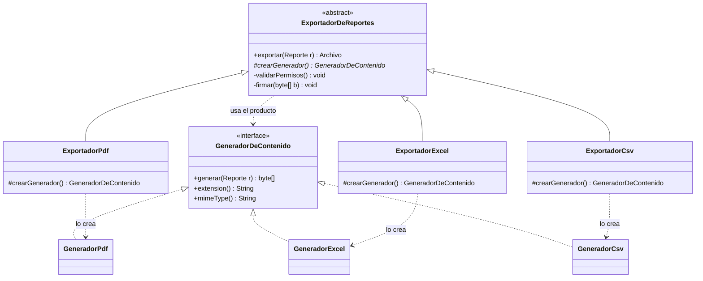

[← Volver al índice](README.md) · [← 02 Singleton](02-singleton.md) · [04 Abstract Factory →](04-abstract-factory.md)

# 03 · Factory Method

> **Familia:** Creacional

---

## En una frase

**Define un método para crear objetos, pero deja que las subclases decidan qué clase
concreta se instancia.**

Como una franquicia de restaurantes: el manual de operación es el mismo en todas las
sedes (recibir pedido → preparar → entregar), pero *qué* se prepara lo decide cada sede.

---

## El enunciado

> **Ticket EXP-204**
> El módulo de reportes debe exportar el informe de ventas en **PDF**. Ya está listo.
> Ahora Comercial pide **Excel**, Contabilidad pide **CSV** y el equipo de integraciones
> pide **JSON**.
>
> El problema: el proceso de exportación siempre es el mismo (validar permisos →
> generar el contenido → firmar el archivo → guardarlo en el bucket → registrar
> auditoría). Lo único que cambia es **cómo se genera el contenido**.
>
> **No quiero cuatro copias del mismo proceso con un método distinto en la mitad.**

---

## El código que duele

```java
class ExportadorDeReportes {
    byte[] exportar(String formato, Reporte reporte) {
        validarPermisos();

        byte[] contenido;
        if (formato.equals("PDF")) {
            contenido = generarPdf(reporte);
        } else if (formato.equals("EXCEL")) {
            contenido = generarExcel(reporte);
        } else if (formato.equals("CSV")) {
            contenido = generarCsv(reporte);
        } else {
            throw new IllegalArgumentException("Formato desconocido: " + formato);
        }
        // ... y el mes que viene: JSON, XML, Parquet, ...

        firmar(contenido);
        guardarEnBucket(contenido);
        registrarAuditoria(formato);
        return contenido;
    }
}
```

Lo que duele:

- Esta clase **crece con cada formato nuevo** → viola el principio Abierto/Cerrado.
- Sabe de PDF, de Excel, de CSV... **una clase, cuatro razones para cambiar**.
- Un error en `generarExcel` te obliga a recompilar y redesplegar todo el exportador.
- Los `import` de las cuatro librerías viven en la misma clase.

---

## La idea del patrón

Separa **el proceso** (que no cambia) de **la creación del objeto que varía** (que sí cambia):

1. Declara una interfaz común para lo que se crea (`GeneradorDeContenido`).
2. En la clase base, deja un método **abstracto** que devuelva esa interfaz:
   `abstract GeneradorDeContenido crearGenerador();` ← **este es el "factory method"**.
3. El proceso completo se escribe **una sola vez** en la clase base, usando ese método.
4. Cada subclase responde una única pregunta: *"¿qué generador uso yo?"*.

> **Regla de oro:** el padre define **cuándo** se crea el objeto; el hijo define **cuál**.

---

## El diagrama



Las dos jerarquías paralelas (**creadores** a la izquierda, **productos** a la derecha)
son la firma visual del Factory Method.

---

## La solución en Java 21

```java
import java.nio.charset.StandardCharsets;
import java.time.LocalDate;
import java.util.List;

// ---------------------------------------------------------------
// Datos del dominio
// ---------------------------------------------------------------
record Venta(String producto, int unidades, double valorUnitario) {
    double total() { return unidades * valorUnitario; }
}

record Reporte(String titulo, LocalDate fecha, List<Venta> ventas) {
    double granTotal() { return ventas.stream().mapToDouble(Venta::total).sum(); }
}

record Archivo(String nombre, String mimeType, byte[] contenido) {
    int tamanoKb() { return Math.max(1, contenido.length / 1024); }
}

// ---------------------------------------------------------------
// EL PRODUCTO: lo que las subclases van a crear
// ---------------------------------------------------------------
interface GeneradorDeContenido {
    byte[] generar(Reporte reporte);
    String extension();
    String mimeType();
}

final class GeneradorPdf implements GeneradorDeContenido {
    public byte[] generar(Reporte r) {
        var texto = """
            %%PDF-1.7 (simulado)
            %s — %s
            ------------------------------------
            %s
            ------------------------------------
            TOTAL: $%,.2f
            """.formatted(r.titulo(), r.fecha(), lineas(r), r.granTotal());
        return texto.getBytes(StandardCharsets.UTF_8);
    }
    private String lineas(Reporte r) {
        return r.ventas().stream()
                .map(v -> "  %-22s %3d x $%,10.2f = $%,12.2f"
                        .formatted(v.producto(), v.unidades(), v.valorUnitario(), v.total()))
                .reduce("", (a, b) -> a.isEmpty() ? b : a + "\n" + b);
    }
    public String extension() { return "pdf"; }
    public String mimeType()  { return "application/pdf"; }
}

final class GeneradorExcel implements GeneradorDeContenido {
    public byte[] generar(Reporte r) {
        var sb = new StringBuilder("<workbook>\n  <sheet name=\"")
                .append(r.titulo()).append("\">\n");
        r.ventas().forEach(v -> sb.append("    <row><c>").append(v.producto())
                .append("</c><c>").append(v.unidades())
                .append("</c><c>").append(v.total()).append("</c></row>\n"));
        sb.append("  </sheet>\n</workbook>");
        return sb.toString().getBytes(StandardCharsets.UTF_8);
    }
    public String extension() { return "xlsx"; }
    public String mimeType()  {
        return "application/vnd.openxmlformats-officedocument.spreadsheetml.sheet";
    }
}

final class GeneradorCsv implements GeneradorDeContenido {
    public byte[] generar(Reporte r) {
        var sb = new StringBuilder("producto;unidades;valor_unitario;total\n");
        r.ventas().forEach(v -> sb.append(v.producto()).append(';')
                .append(v.unidades()).append(';')
                .append(v.valorUnitario()).append(';')
                .append(v.total()).append('\n'));
        return sb.toString().getBytes(StandardCharsets.UTF_8);
    }
    public String extension() { return "csv"; }
    public String mimeType()  { return "text/csv"; }
}

// ---------------------------------------------------------------
// EL CREADOR: el proceso se escribe UNA sola vez
// ---------------------------------------------------------------
abstract class ExportadorDeReportes {

    // ===== EL FACTORY METHOD =====
    // "Yo no sé qué generador es. Que lo diga mi subclase."
    protected abstract GeneradorDeContenido crearGenerador();

    // El proceso completo, idéntico para todos los formatos.
    public final Archivo exportar(Reporte reporte, String usuario) {
        validarPermisos(usuario);

        var generador = crearGenerador();          // <-- aquí entra la variación
        var contenido = generador.generar(reporte);

        contenido = firmar(contenido, usuario);
        var nombre = nombreDeArchivo(reporte, generador.extension());
        guardarEnBucket(nombre, contenido);
        registrarAuditoria(usuario, nombre);

        return new Archivo(nombre, generador.mimeType(), contenido);
    }

    private void validarPermisos(String usuario) {
        System.out.println("  [1/5] Validando permisos de " + usuario + "... OK");
    }
    private byte[] firmar(byte[] contenido, String usuario) {
        System.out.println("  [2/5] Firmando digitalmente...");
        var firma = ("\n<!-- firmado por " + usuario + " -->").getBytes(StandardCharsets.UTF_8);
        var salida = new byte[contenido.length + firma.length];
        System.arraycopy(contenido, 0, salida, 0, contenido.length);
        System.arraycopy(firma, 0, salida, contenido.length, firma.length);
        return salida;
    }
    private String nombreDeArchivo(Reporte r, String ext) {
        return r.titulo().toLowerCase().replace(' ', '_') + "_" + r.fecha() + "." + ext;
    }
    private void guardarEnBucket(String nombre, byte[] contenido) {
        System.out.println("  [3/5] Subiendo a s3://reportes/" + nombre);
    }
    private void registrarAuditoria(String usuario, String nombre) {
        System.out.println("  [4/5] Auditoría: " + usuario + " exportó " + nombre);
        System.out.println("  [5/5] Listo.");
    }
}

// ---------------------------------------------------------------
// Las subclases: cada una responde UNA pregunta
// ---------------------------------------------------------------
final class ExportadorPdf extends ExportadorDeReportes {
    protected GeneradorDeContenido crearGenerador() { return new GeneradorPdf(); }
}
final class ExportadorExcel extends ExportadorDeReportes {
    protected GeneradorDeContenido crearGenerador() { return new GeneradorExcel(); }
}
final class ExportadorCsv extends ExportadorDeReportes {
    protected GeneradorDeContenido crearGenerador() { return new GeneradorCsv(); }
}

public class Demo {
    public static void main(String[] args) {
        var reporte = new Reporte("Ventas Region Andina", LocalDate.of(2026, 7, 31), List.of(
            new Venta("Licencia CRM",     12,  400_000),
            new Venta("Soporte Premium",   3, 1_200_000),
            new Venta("Capacitación",      8,   250_000)
        ));

        // El código cliente elige el exportador. El proceso es idéntico en los tres.
        List<ExportadorDeReportes> exportadores = List.of(
            new ExportadorPdf(), new ExportadorExcel(), new ExportadorCsv()
        );

        for (var exportador : exportadores) {
            System.out.println("\n=== " + exportador.getClass().getSimpleName() + " ===");
            var archivo = exportador.exportar(reporte, "osckar");
            System.out.println("  -> " + archivo.nombre()
                + " (" + archivo.mimeType() + ", ~" + archivo.tamanoKb() + " KB)");
        }
    }
}
```

### Salida

```
=== ExportadorPdf ===
  [1/5] Validando permisos de osckar... OK
  [2/5] Firmando digitalmente...
  [3/5] Subiendo a s3://reportes/ventas_region_andina_2026-07-31.pdf
  [4/5] Auditoría: osckar exportó ventas_region_andina_2026-07-31.pdf
  [5/5] Listo.
  -> ventas_region_andina_2026-07-31.pdf (application/pdf, ~1 KB)

=== ExportadorExcel ===
  ...
  -> ventas_region_andina_2026-07-31.xlsx (application/vnd...sheet, ~1 KB)

=== ExportadorCsv ===
  ...
  -> ventas_region_andina_2026-07-31.csv (text/csv, ~1 KB)
```

---

## Agregar un formato nuevo

Llega el ticket *"necesitamos JSON"*. Esto es **todo** lo que escribes:

```java
final class GeneradorJson implements GeneradorDeContenido {
    public byte[] generar(Reporte r) { /* ... */ return new byte[0]; }
    public String extension() { return "json"; }
    public String mimeType()  { return "application/json"; }
}

final class ExportadorJson extends ExportadorDeReportes {
    protected GeneradorDeContenido crearGenerador() { return new GeneradorJson(); }
}
```

**Cero líneas modificadas** en el código existente. Eso es el principio Abierto/Cerrado:
abierto a extensión, cerrado a modificación.

---

## Variante práctica: Factory Method + `sealed` + registro

Cuando el cliente recibe el formato como texto (por ejemplo desde un endpoint HTTP),
combínalo con un `switch` con patrones de Java 21 en **un solo lugar**:

```java
sealed interface Formato permits Formato.Pdf, Formato.Excel, Formato.Csv {
    record Pdf()   implements Formato {}
    record Excel() implements Formato {}
    record Csv()   implements Formato {}

    static Formato desde(String texto) {
        return switch (texto.toUpperCase()) {
            case "PDF"   -> new Pdf();
            case "EXCEL" -> new Excel();
            case "CSV"   -> new Csv();
            default -> throw new IllegalArgumentException("Formato no soportado: " + texto);
        };
    }
}

static ExportadorDeReportes exportadorPara(Formato formato) {
    return switch (formato) {                     // el compilador verifica que no falte ninguno
        case Formato.Pdf   p -> new ExportadorPdf();
        case Formato.Excel e -> new ExportadorExcel();
        case Formato.Csv   c -> new ExportadorCsv();
    };
}
```

Al ser `sealed`, si mañana agregas `Formato.Json` y olvidas el `case`,
**el compilador no te deja compilar**. Ese es el gran regalo de Java 21 aquí.

---

## Factory Method vs. Simple Factory

Mucha gente llama "Factory" a esto:

```java
class FabricaDeGeneradores {
    static GeneradorDeContenido crear(String formato) {
        return switch (formato) {
            case "PDF" -> new GeneradorPdf();
            case "CSV" -> new GeneradorCsv();
            default -> throw new IllegalArgumentException();
        };
    }
}
```

Eso es **Simple Factory** (o "static factory"), y **no es un patrón GoF**. No está mal —
es útil y muy común — pero:

| | Simple Factory | Factory Method |
|---|---|---|
| ¿Usa herencia? | No | Sí: subclases deciden |
| ¿Agregar un tipo modifica código existente? | Sí (tocas el `switch`) | No (creas una subclase) |
| Complejidad | Muy baja | Media |
| Cuándo | Pocos tipos, estables | El proceso alrededor también varía |

**Empieza con Simple Factory.** Solo pásate a Factory Method cuando el proceso completo
alrededor de la creación también deba ser reutilizable.

---

## ✅ Cuándo usarlo

- No sabes de antemano qué clase concreta necesitas (lo decide configuración, el usuario,
  el tenant, el país...).
- Quieres que otros equipos extiendan tu framework sin tocar tu código.
- Hay un **proceso común** alrededor de la creación que quieres escribir una sola vez.
- Quieres aislar los `import` de librerías pesadas en clases separadas.

## ⛔ Cuándo NO usarlo

- Solo hay **un** tipo de producto y no se ve que vayan a llegar más. Un `new` directo es
  más legible que dos jerarquías de clases.
- Los productos son tan distintos que la interfaz común queda llena de métodos que la
  mitad no usa.
- Ya usas un contenedor de inyección de dependencias que resuelve la implementación por
  perfil o por cualificador: probablemente ya tienes la solución.

---

## Se parece a...

| Patrón | Diferencia clave |
|---|---|
| **[Abstract Factory](04-abstract-factory.md)** | Factory Method crea **un** producto; Abstract Factory crea una **familia** de productos relacionados. |
| **[Template Method](23-template-method.md)** | Son primos: el Factory Method suele *ser* un paso dentro de un Template Method. Template Method varía **pasos**; Factory Method varía **objetos creados**. |
| **[Builder](05-builder.md)** | Factory Method decide *qué* crear en un paso; Builder construye *un* objeto complicado en muchos pasos. |
| **[Prototype](06-prototype.md)** | En vez de instanciar clases nuevas, clona un objeto existente. |

---

## Dónde ya lo has visto

- `Collection.iterator()`: cada colección decide qué `Iterator` concreto devuelve.
- `Calendar.getInstance()`, `NumberFormat.getInstance(Locale)`.
- `javax.xml.parsers.DocumentBuilderFactory.newDocumentBuilder()`.
- En Spring: `FactoryBean<T>`.

---

➡️ Siguiente: **[04 · Abstract Factory](04-abstract-factory.md)**

[← Volver al índice](README.md)
