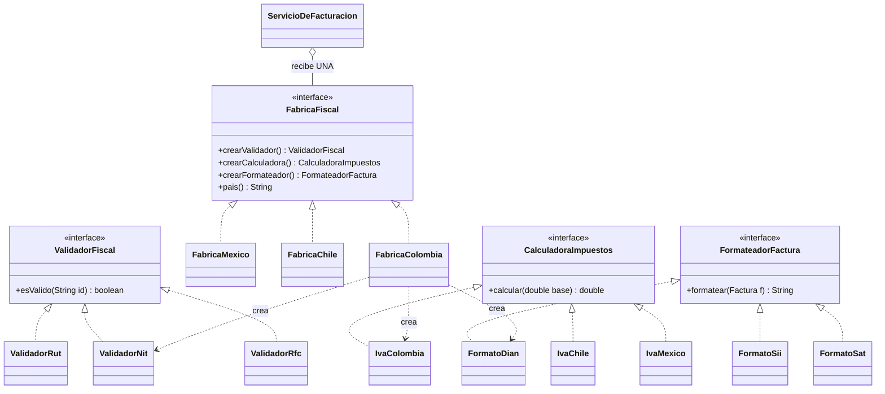

[← Volver al índice](README.md) · [← 03 Factory Method](03-factory-method.md) · [05 Builder →](05-builder.md)

# 04 · Abstract Factory

> **Familia:** Creacional

---

## En una frase

**Crea familias completas de objetos que tienen que combinar entre sí, sin que el código
cliente sepa de qué familia son.**

Como comprar muebles de una misma línea: si pides la "línea nórdica", la mesa, las sillas
y el sofá vienen del mismo estilo. Nadie termina con una mesa nórdica y un sofá barroco.

---

## El enunciado

> **Ticket LATAM-77**
> La plataforma de facturación funciona en **Colombia**. Vamos a abrir operación en
> **México** y en **Chile**.
>
> Cada país tiene su propio trío de reglas que **deben ir siempre juntas**:
> - Un **validador de identificación fiscal** (NIT en Colombia, RFC en México, RUT en Chile).
> - Una **calculadora de impuestos** (IVA 19% Colombia, IVA 16% México, IVA 19% Chile
>   pero con reglas de retención distintas).
> - Un **formateador de factura electrónica** con el formato que exige cada autoridad
>   tributaria (DIAN, SAT, SII).
>
> **El bug que ya nos pasó:** alguien mezcló el validador de México con la calculadora
> de Colombia y estuvimos facturando IVA del 19% con RFC mexicano durante dos semanas.
>
> **Necesitamos que sea imposible mezclar piezas de países distintos.**

---

## El código que duele

```java
class ServicioDeFacturacion {
    Factura emitir(String pais, Cliente cliente, List<Item> items) {
        ValidadorFiscal validador;
        CalculadoraImpuestos calculadora;
        FormateadorFactura formateador;

        if (pais.equals("CO")) {
            validador = new ValidadorNit();
            calculadora = new CalculadoraIvaColombia();
            formateador = new FormateadorDian();
        } else if (pais.equals("MX")) {
            validador = new ValidadorRfc();
            calculadora = new CalculadoraIvaMexico();
            formateador = new FormateadorDian();   // ⚠️ BUG: debería ser SAT
        }
        // ...
    }
}
```

El bug de arriba **compila perfectamente**. Nada en el lenguaje impide mezclar.
Y este `if` se va a repetir en el servicio de notas crédito, en el de anulaciones,
en el de notas débito...

---

## La idea del patrón

Agrupa la creación de toda la familia en **una sola interfaz de fábrica**:

1. Una interfaz `FabricaFiscal` con un método por cada pieza de la familia.
2. Una implementación **por familia**: `FabricaColombia`, `FabricaMexico`, `FabricaChile`.
3. El código cliente recibe **una** fábrica y le pide todas las piezas.
   Como todas salen de la misma fábrica, **es imposible mezclar países**.

> **Regla de oro:** si dos objetos siempre tienen que ir juntos, que salga de la misma
> fábrica la responsabilidad de crearlos.

---

## El diagrama



Lee el diagrama así: **una fila = una familia**. `FabricaColombia` produce toda la fila
colombiana y nada más.

---

## La solución en Java 21

```java
import java.util.List;

// ---------------------------------------------------------------
// Dominio
// ---------------------------------------------------------------
record Item(String descripcion, double valor) {}

record Cliente(String identificacion, String razonSocial) {}

record Factura(String numero, Cliente cliente, List<Item> items,
               double base, double impuestos) {
    double total() { return base + impuestos; }
}

// ---------------------------------------------------------------
// Los 3 PRODUCTOS de la familia
// ---------------------------------------------------------------
interface ValidadorFiscal {
    boolean esValido(String identificacion);
    String nombreDelDocumento();
}

interface CalculadoraImpuestos {
    double calcular(double base);
    String detalle();
}

interface FormateadorFactura {
    String formatear(Factura factura);
}

// ---------- Familia COLOMBIA ----------
final class ValidadorNit implements ValidadorFiscal {
    public boolean esValido(String id) { return id.matches("\\d{9}-\\d"); }
    public String nombreDelDocumento() { return "NIT"; }
}
final class IvaColombia implements CalculadoraImpuestos {
    public double calcular(double base) { return base * 0.19; }
    public String detalle() { return "IVA 19% (Colombia)"; }
}
final class FormatoDian implements FormateadorFactura {
    public String formatear(Factura f) {
        return """
            <FacturaElectronica xmlns="urn:dian:gov:co">
              <CUFE>%s</CUFE>
              <NIT>%s</NIT>
              <Base>%,.2f</Base>
              <IVA>%,.2f</IVA>
              <Total>%,.2f</Total>
            </FacturaElectronica>"""
            .formatted(f.numero(), f.cliente().identificacion(),
                       f.base(), f.impuestos(), f.total());
    }
}

// ---------- Familia MÉXICO ----------
final class ValidadorRfc implements ValidadorFiscal {
    public boolean esValido(String id) { return id.matches("[A-Z]{3,4}\\d{6}[A-Z0-9]{3}"); }
    public String nombreDelDocumento() { return "RFC"; }
}
final class IvaMexico implements CalculadoraImpuestos {
    public double calcular(double base) { return base * 0.16; }
    public String detalle() { return "IVA 16% (México)"; }
}
final class FormatoSat implements FormateadorFactura {
    public String formatear(Factura f) {
        return """
            <cfdi:Comprobante Version="4.0">
              <cfdi:Receptor Rfc="%s" Nombre="%s"/>
              <cfdi:SubTotal>%,.2f</cfdi:SubTotal>
              <cfdi:Impuestos TotalTrasladados="%,.2f"/>
              <cfdi:Total>%,.2f</cfdi:Total>
            </cfdi:Comprobante>"""
            .formatted(f.cliente().identificacion(), f.cliente().razonSocial(),
                       f.base(), f.impuestos(), f.total());
    }
}

// ---------- Familia CHILE ----------
final class ValidadorRut implements ValidadorFiscal {
    public boolean esValido(String id) { return id.matches("\\d{7,8}-[\\dkK]"); }
    public String nombreDelDocumento() { return "RUT"; }
}
final class IvaChile implements CalculadoraImpuestos {
    public double calcular(double base) { return base * 0.19; }
    public String detalle() { return "IVA 19% (Chile)"; }
}
final class FormatoSii implements FormateadorFactura {
    public String formatear(Factura f) {
        return """
            <DTE version="1.0">
              <Encabezado><RUTRecep>%s</RUTRecep></Encabezado>
              <MntNeto>%,.0f</MntNeto>
              <IVA>%,.0f</IVA>
              <MntTotal>%,.0f</MntTotal>
            </DTE>"""
            .formatted(f.cliente().identificacion(), f.base(), f.impuestos(), f.total());
    }
}

// ---------------------------------------------------------------
// LA FÁBRICA ABSTRACTA
// ---------------------------------------------------------------
interface FabricaFiscal {
    ValidadorFiscal      crearValidador();
    CalculadoraImpuestos crearCalculadora();
    FormateadorFactura   crearFormateador();
    String pais();

    // Punto único donde se elige la familia. Si mañana entra Perú,
    // solo se toca este método y se agrega una clase.
    static FabricaFiscal para(String codigoPais) {
        return switch (codigoPais.toUpperCase()) {
            case "CO" -> new FabricaColombia();
            case "MX" -> new FabricaMexico();
            case "CL" -> new FabricaChile();
            default -> throw new IllegalArgumentException("País sin soporte: " + codigoPais);
        };
    }
}

final class FabricaColombia implements FabricaFiscal {
    public ValidadorFiscal      crearValidador()   { return new ValidadorNit(); }
    public CalculadoraImpuestos crearCalculadora() { return new IvaColombia(); }
    public FormateadorFactura   crearFormateador() { return new FormatoDian(); }
    public String pais() { return "Colombia"; }
}
final class FabricaMexico implements FabricaFiscal {
    public ValidadorFiscal      crearValidador()   { return new ValidadorRfc(); }
    public CalculadoraImpuestos crearCalculadora() { return new IvaMexico(); }
    public FormateadorFactura   crearFormateador() { return new FormatoSat(); }
    public String pais() { return "México"; }
}
final class FabricaChile implements FabricaFiscal {
    public ValidadorFiscal      crearValidador()   { return new ValidadorRut(); }
    public CalculadoraImpuestos crearCalculadora() { return new IvaChile(); }
    public FormateadorFactura   crearFormateador() { return new FormatoSii(); }
    public String pais() { return "Chile"; }
}

// ---------------------------------------------------------------
// EL CLIENTE: no menciona ni una sola clase concreta de país
// ---------------------------------------------------------------
final class ServicioDeFacturacion {
    private final FabricaFiscal fabrica;

    ServicioDeFacturacion(FabricaFiscal fabrica) { this.fabrica = fabrica; }

    String emitir(String numero, Cliente cliente, List<Item> items) {
        var validador   = fabrica.crearValidador();
        var calculadora = fabrica.crearCalculadora();
        var formateador = fabrica.crearFormateador();

        if (!validador.esValido(cliente.identificacion())) {
            throw new IllegalArgumentException(
                validador.nombreDelDocumento() + " inválido: " + cliente.identificacion());
        }

        var base = items.stream().mapToDouble(Item::valor).sum();
        var impuestos = calculadora.calcular(base);
        var factura = new Factura(numero, cliente, items, base, impuestos);

        System.out.println("  País: " + fabrica.pais()
            + " | Documento: " + validador.nombreDelDocumento()
            + " | " + calculadora.detalle());
        return formateador.formatear(factura);
    }
}

public class Demo {
    public static void main(String[] args) {
        var items = List.of(new Item("Consultoría", 5_000_000),
                            new Item("Licencia", 2_000_000));

        emitirEn("CO", new Cliente("900123456-7", "Andina S.A.S."), items);
        emitirEn("MX", new Cliente("ABC010203XY9", "Aztecas S.A. de C.V."), items);
        emitirEn("CL", new Cliente("76543210-K", "Austral SpA"), items);

        System.out.println("\n=== Intento con documento equivocado ===");
        try {
            emitirEn("MX", new Cliente("900123456-7", "NIT en México"), items);
        } catch (IllegalArgumentException e) {
            System.out.println("  Rechazado: " + e.getMessage());
        }
    }

    static void emitirEn(String pais, Cliente cliente, List<Item> items) {
        System.out.println("\n=== Emitiendo en " + pais + " ===");
        var servicio = new ServicioDeFacturacion(FabricaFiscal.para(pais));
        System.out.println(servicio.emitir("FE-1001", cliente, items));
    }
}
```

### Salida (recortada)

```
=== Emitiendo en CO ===
  País: Colombia | Documento: NIT | IVA 19% (Colombia)
<FacturaElectronica xmlns="urn:dian:gov:co">
  <CUFE>FE-1001</CUFE>
  <NIT>900123456-7</NIT>
  <Base>7,000,000.00</Base>
  <IVA>1,330,000.00</IVA>
  <Total>8,330,000.00</Total>
</FacturaElectronica>

=== Emitiendo en MX ===
  País: México | Documento: RFC | IVA 16% (México)
<cfdi:Comprobante Version="4.0">
  ...
  <cfdi:Total>8,120,000.00</cfdi:Total>
</cfdi:Comprobante>

=== Intento con documento equivocado ===
  Rechazado: RFC inválido: 900123456-7
```

**La mezcla que causó el bug ya no es posible:** `ServicioDeFacturacion` nunca hace `new`
de una clase de país. Solo puede tener las tres piezas de la misma fábrica.

---

## Qué ganamos

| Antes | Después |
|---|---|
| `if (pais)` repetido en 6 servicios | Un solo `switch`, dentro de `FabricaFiscal.para(...)` |
| Se podían mezclar piezas de países distintos | Estructuralmente imposible |
| Agregar Perú = tocar 6 servicios | Agregar Perú = 4 clases nuevas, 1 línea modificada |

---

## El costo real del patrón (hay que decirlo)

Abstract Factory tiene un precio: **agregar un producto nuevo a la familia es caro**.

Si mañana piden *"además del validador, la calculadora y el formateador, cada país
necesita su propio generador de código QR"*, tienes que:

1. Agregar `crearGeneradorQr()` a la interfaz `FabricaFiscal`.
2. Implementarlo en **las tres** fábricas (o en las diez, si ya son diez países).

Es decir: **agregar familias es barato, agregar productos a la familia es caro.**
Si prevés que la lista de productos va a moverse mucho, este patrón te va a estorbar.

---

## ✅ Cuándo usarlo

- Tienes **familias de objetos que deben usarse juntos** y mezclarlas es un bug.
- El sistema debe funcionar con varias variantes: por país, por proveedor de nube,
  por motor de base de datos, por tenant, por tema visual (claro/oscuro).
- Quieres aislar el código de cada variante para que un equipo distinto la mantenga.

## ⛔ Cuándo NO usarlo

- Solo hay **una** pieza que varía → usa **[Factory Method](03-factory-method.md)** o
  simplemente una interfaz con varias implementaciones.
- Las variantes son muchas y la familia crece constantemente → vas a estar tocando la
  interfaz de la fábrica todo el tiempo.
- Estás con un contenedor de inyección de dependencias: perfiles (`@Profile`),
  cualificadores (`@Qualifier`) o `Map<String, Bean>` suelen resolverlo con menos código.

---

## Se parece a...

| Patrón | Diferencia clave |
|---|---|
| **[Factory Method](03-factory-method.md)** | Crea **un** producto usando herencia. Abstract Factory crea **varios productos relacionados** usando composición. De hecho, cada método de la fábrica abstracta suele ser un Factory Method. |
| **[Builder](05-builder.md)** | Builder arma **un** objeto complejo paso a paso. Abstract Factory entrega **varios** objetos ya listos, de una. |
| **[Facade](11-facade.md)** | La fábrica también simplifica, pero su intención es *crear*; la del Facade es *usar*. |
| **[Bridge](08-bridge.md)** | Bridge separa abstracción de implementación; Abstract Factory suele ser cómo se elige la implementación de un Bridge. |

---

## Dónde ya lo has visto

- `javax.xml.parsers.DocumentBuilderFactory` y `TransformerFactory`.
- `java.sql.Connection`: te da `Statement`, `PreparedStatement`, `CallableStatement`,
  todos del mismo driver.
- `javax.xml.stream.XMLInputFactory`.
- En UI: los "look and feel" de Swing (`UIManager`) producen familias completas de widgets.

---

➡️ Siguiente: **[05 · Builder](05-builder.md)**

[← Volver al índice](README.md)
