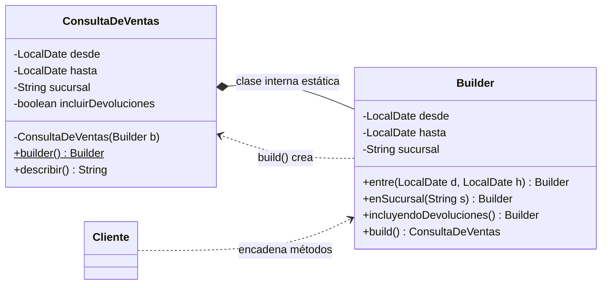
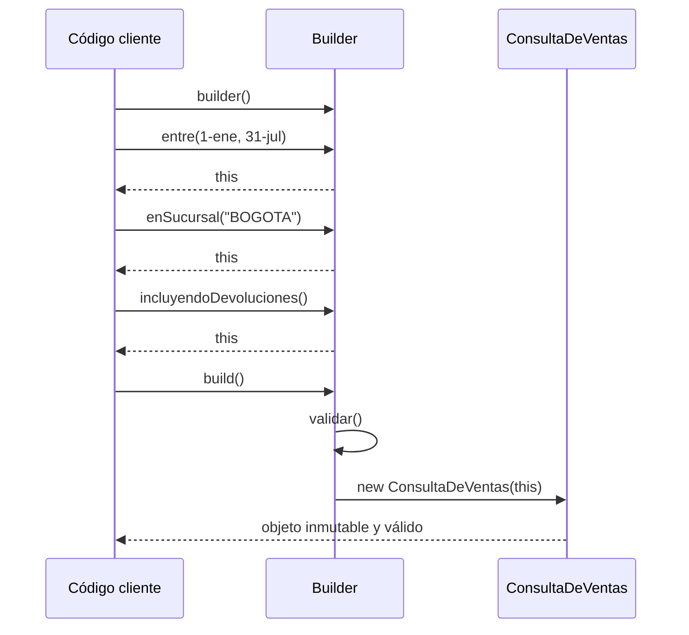

[← Volver al índice](README.md) · [← 04 Abstract Factory](04-abstract-factory.md) · [06 Prototype →](06-prototype.md)

# 05 · Builder

> **Familia:** Creacional

---

## En una frase

**Construye un objeto complicado paso a paso, con nombres legibles, en vez de un
constructor con quince parámetros.**

Como pedir un almuerzo en un restaurante de bandeja: no dices *"quiero el 3, sin el 2,
con doble 5"*. Dices *"con pollo, sin ensalada, con jugo de mora"*.

---

## El enunciado

> **Ticket RPT-311**
> El endpoint de reportes recibe filtros opcionales: rango de fechas, sucursal, línea de
> producto, vendedor, canal, si incluye devoluciones, si agrupa por mes, formato de
> salida, si envía por correo, a quién...
>
> Hoy tenemos **once constructores sobrecargados** y este monstruo:
>
> ```java
> new ConsultaDeVentas(desde, hasta, null, null, "BOGOTA", true, false, null, true, 50, 0);
> ```
>
> Nadie sabe qué es el tercer `null` ni qué significa el `true` del medio. La semana
> pasada alguien invirtió dos `boolean` y estuvimos reportando devoluciones como ventas.
>
> **Queremos que armar la consulta se lea como español.**

---

## El código que duele

```java
// El "constructor telescópico": cada variante agrega un parámetro más.
class ConsultaDeVentas {
    ConsultaDeVentas(LocalDate desde, LocalDate hasta) { ... }
    ConsultaDeVentas(LocalDate desde, LocalDate hasta, String sucursal) { ... }
    ConsultaDeVentas(LocalDate desde, LocalDate hasta, String sucursal, String linea) { ... }
    ConsultaDeVentas(LocalDate desde, LocalDate hasta, String sucursal, String linea,
                     String vendedor, boolean incluirDevoluciones, boolean agruparPorMes,
                     String canal, boolean enviarPorCorreo, int limite, int offset) { ... }
}
```

Y la alternativa que también duele, los **setters**:

```java
var consulta = new ConsultaDeVentas();
consulta.setDesde(inicio);
consulta.setHasta(fin);
// ... y aquí, entre línea y línea, el objeto está a medio armar.
// Si otro hilo lo lee ahora, ve un objeto inválido. Y nunca puede ser inmutable.
```

---

## La idea del patrón

Separa **la construcción** del **objeto construido**:

1. El objeto final tiene el **constructor privado** y todos sus campos `final`.
2. Una clase interna `Builder` acumula los valores con métodos con nombre.
3. Cada método del builder **devuelve `this`**, para poder encadenar.
4. `build()` valida todo de una y entrega el objeto **ya completo e inmutable**.

> **Regla de oro:** el objeto nunca existe a medio armar.

---

## El diagrama



Flujo de una construcción:



---

## La solución en Java 21

```java
import java.time.LocalDate;
import java.util.ArrayList;
import java.util.List;
import java.util.Optional;

enum FormatoSalida { TABLA, CSV, JSON }

final class ConsultaDeVentas {

    private final LocalDate desde;
    private final LocalDate hasta;
    private final String sucursal;          // opcional
    private final String lineaProducto;     // opcional
    private final String vendedor;          // opcional
    private final boolean incluirDevoluciones;
    private final boolean agruparPorMes;
    private final FormatoSalida formato;
    private final List<String> destinatarios;
    private final int limite;

    // Constructor PRIVADO: la única forma de crear esto es a través del builder.
    private ConsultaDeVentas(Builder b) {
        this.desde = b.desde;
        this.hasta = b.hasta;
        this.sucursal = b.sucursal;
        this.lineaProducto = b.lineaProducto;
        this.vendedor = b.vendedor;
        this.incluirDevoluciones = b.incluirDevoluciones;
        this.agruparPorMes = b.agruparPorMes;
        this.formato = b.formato;
        this.destinatarios = List.copyOf(b.destinatarios);
        this.limite = b.limite;
    }

    public static Builder builder() { return new Builder(); }

    // =============================================================
    // EL BUILDER
    // =============================================================
    public static final class Builder {
        // Obligatorios (sin valor por defecto)
        private LocalDate desde;
        private LocalDate hasta;
        // Opcionales, con sus valores por defecto declarados aquí mismo:
        private String sucursal;
        private String lineaProducto;
        private String vendedor;
        private boolean incluirDevoluciones = false;
        private boolean agruparPorMes = false;
        private FormatoSalida formato = FormatoSalida.TABLA;
        private final List<String> destinatarios = new ArrayList<>();
        private int limite = 100;

        public Builder entre(LocalDate desde, LocalDate hasta) {
            this.desde = desde;
            this.hasta = hasta;
            return this;                       // <-- esto permite encadenar
        }
        public Builder enSucursal(String sucursal) {
            this.sucursal = sucursal; return this;
        }
        public Builder deLinea(String linea) {
            this.lineaProducto = linea; return this;
        }
        public Builder delVendedor(String vendedor) {
            this.vendedor = vendedor; return this;
        }
        public Builder incluyendoDevoluciones() {
            this.incluirDevoluciones = true; return this;
        }
        public Builder agrupadoPorMes() {
            this.agruparPorMes = true; return this;
        }
        public Builder en(FormatoSalida formato) {
            this.formato = formato; return this;
        }
        public Builder enviarA(String... correos) {
            this.destinatarios.addAll(List.of(correos)); return this;
        }
        public Builder limitadoA(int limite) {
            this.limite = limite; return this;
        }

        public ConsultaDeVentas build() {
            // TODA la validación vive en un solo lugar.
            if (desde == null || hasta == null)
                throw new IllegalStateException("El rango de fechas es obligatorio");
            if (hasta.isBefore(desde))
                throw new IllegalStateException("'hasta' no puede ser anterior a 'desde'");
            if (limite <= 0 || limite > 10_000)
                throw new IllegalStateException("El límite debe estar entre 1 y 10.000");
            if (agruparPorMes && desde.plusMonths(1).isAfter(hasta))
                throw new IllegalStateException("Agrupar por mes exige un rango de al menos un mes");
            return new ConsultaDeVentas(this);
        }
    }

    // Getters que no mienten: lo opcional se ve opcional.
    public Optional<String> sucursal() { return Optional.ofNullable(sucursal); }

    public String describir() {
        var sb = new StringBuilder("SELECT * FROM ventas\n WHERE fecha BETWEEN '")
                .append(desde).append("' AND '").append(hasta).append('\'');
        if (sucursal != null)      sb.append("\n   AND sucursal = '").append(sucursal).append('\'');
        if (lineaProducto != null) sb.append("\n   AND linea = '").append(lineaProducto).append('\'');
        if (vendedor != null)      sb.append("\n   AND vendedor = '").append(vendedor).append('\'');
        if (!incluirDevoluciones)  sb.append("\n   AND tipo <> 'DEVOLUCION'");
        if (agruparPorMes)         sb.append("\n GROUP BY date_trunc('month', fecha)");
        sb.append("\n LIMIT ").append(limite);
        sb.append("\n-- formato: ").append(formato);
        if (!destinatarios.isEmpty()) sb.append(" | enviar a: ").append(destinatarios);
        return sb.toString();
    }
}

public class Demo {
    public static void main(String[] args) {

        // Caso 1: lo mínimo
        var simple = ConsultaDeVentas.builder()
                .entre(LocalDate.of(2026, 7, 1), LocalDate.of(2026, 7, 31))
                .build();
        System.out.println("--- Consulta simple ---\n" + simple.describir());

        // Caso 2: la consulta completa. Se lee como una frase.
        var completa = ConsultaDeVentas.builder()
                .entre(LocalDate.of(2026, 1, 1), LocalDate.of(2026, 7, 31))
                .enSucursal("BOGOTA")
                .deLinea("SOFTWARE")
                .incluyendoDevoluciones()
                .agrupadoPorMes()
                .en(FormatoSalida.CSV)
                .enviarA("gerencia@empresa.com", "comercial@empresa.com")
                .limitadoA(5_000)
                .build();
        System.out.println("\n--- Consulta completa ---\n" + completa.describir());

        // Caso 3: el builder atrapa el error ANTES de crear nada
        System.out.println("\n--- Consulta inválida ---");
        try {
            ConsultaDeVentas.builder()
                    .entre(LocalDate.of(2026, 7, 31), LocalDate.of(2026, 1, 1))
                    .build();
        } catch (IllegalStateException e) {
            System.out.println("  Rechazada: " + e.getMessage());
        }
    }
}
```

### Salida

```
--- Consulta simple ---
SELECT * FROM ventas
 WHERE fecha BETWEEN '2026-07-01' AND '2026-07-31'
   AND tipo <> 'DEVOLUCION'
 LIMIT 100
-- formato: TABLA

--- Consulta completa ---
SELECT * FROM ventas
 WHERE fecha BETWEEN '2026-01-01' AND '2026-07-31'
   AND sucursal = 'BOGOTA'
   AND linea = 'SOFTWARE'
 GROUP BY date_trunc('month', fecha)
 LIMIT 5000
-- formato: CSV | enviar a: [gerencia@empresa.com, comercial@empresa.com]

--- Consulta inválida ---
  Rechazada: 'hasta' no puede ser anterior a 'desde'
```

---

## Variante: obligar a los campos obligatorios con el compilador

Si quieres que sea **imposible** olvidar el rango de fechas, pídelo en el punto de entrada:

```java
public static Builder desde(LocalDate desde, LocalDate hasta) {
    return new Builder().entre(desde, hasta);
}
// Uso: ConsultaDeVentas.desde(inicio, fin).enSucursal("CALI").build();
```

Ahora no hay forma de llegar a `build()` sin fechas. Se le llama **"step builder"** cuando
se lleva al extremo, encadenando interfaces que solo exponen el siguiente paso obligatorio.

---

## Builder vs. `record` en Java 21

Java 21 tiene `record`, que ya resuelve la inmutabilidad. ¿Sigue haciendo falta Builder?

```java
// Con record: corto, inmutable... pero el sitio de llamada sigue siendo ilegible.
record ConsultaDeVentas(LocalDate desde, LocalDate hasta, String sucursal,
                        String linea, boolean incluirDevoluciones, int limite) {}

new ConsultaDeVentas(inicio, fin, null, null, true, 5000);  // ← ¿qué es ese true?
```

| Usa `record` solo | Usa `record` + Builder |
|---|---|
| 1 a 4 campos | 5 o más campos |
| Todos obligatorios | Muchos opcionales o con valor por defecto |
| Sin validaciones cruzadas | Validaciones que dependen de varios campos |
| Ningún `boolean` suelto | Dos o más `boolean` seguidos (peligro de invertirlos) |

**Buena combinación:** deja el `record` como objeto final y ponle un builder anidado.

```java
record Consulta(LocalDate desde, LocalDate hasta, String sucursal, int limite) {
    // Compact constructor: validación centralizada, gratis.
    Consulta {
        if (hasta.isBefore(desde)) throw new IllegalArgumentException("rango inválido");
    }
    static Builder builder() { return new Builder(); }

    static final class Builder {
        private LocalDate desde, hasta;
        private String sucursal;
        private int limite = 100;
        Builder entre(LocalDate d, LocalDate h) { this.desde = d; this.hasta = h; return this; }
        Builder enSucursal(String s) { this.sucursal = s; return this; }
        Builder limitadoA(int l) { this.limite = l; return this; }
        Consulta build() { return new Consulta(desde, hasta, sucursal, limite); }
    }
}
```

---

## Qué ganamos

| Antes | Después |
|---|---|
| `new Consulta(d, h, null, null, "BOGOTA", true, false, null, true, 50, 0)` | `builder().entre(d,h).enSucursal("BOGOTA").incluyendoDevoluciones().build()` |
| 11 constructores sobrecargados | 1 builder |
| Objeto mutable y a medio armar con setters | Objeto inmutable, válido desde el primer instante |
| Validaciones repartidas | Todas en `build()` |

---

## ✅ Cuándo usarlo

- El constructor tiene **más de 4 o 5 parámetros**, sobre todo si varios son opcionales.
- Hay parámetros del mismo tipo seguidos (dos `String`, dos `boolean`) → es cuestión de
  tiempo que alguien los invierta.
- Quieres el objeto **inmutable** pero con muchas combinaciones posibles.
- Hay validaciones que dependen de varios campos a la vez.
- Estás diseñando una API que otros van a leer más veces de las que van a escribir.

## ⛔ Cuándo NO usarlo

- El objeto tiene 2 o 3 campos → un `record` o un constructor normal es más claro.
- Todos los campos son obligatorios y no hay opcionales.
- El objeto es de corta vida y solo se crea en un lugar.
- Estás usando Lombok: `@Builder` te da todo esto sin escribirlo. (Pero entiende primero
  qué genera, para no usarlo a ciegas.)

---

## Se parece a...

| Patrón | Diferencia clave |
|---|---|
| **[Abstract Factory](04-abstract-factory.md)** | Devuelve productos ya listos, de inmediato. Builder devuelve el producto al final, tras varios pasos. |
| **[Factory Method](03-factory-method.md)** | Elige *qué clase* instanciar. Builder siempre construye la misma clase, pero configurada distinto. |
| **[Prototype](06-prototype.md)** | Clona un objeto ya armado. Builder lo arma desde cero. |
| **[Composite](09-composite.md)** | Builder se usa muchísimo para construir árboles Composite paso a paso. |

---

## Dónde ya lo has visto

- `StringBuilder` (el ejemplo más usado del mundo Java).
- `HttpRequest.newBuilder().uri(...).header(...).timeout(...).build()` en `java.net.http`.
- `Stream.Builder`, `Locale.Builder`, `Calendar.Builder`.
- `@Builder` de Lombok.
- Casi cualquier SDK de nube: `S3Client.builder().region(...).build()`.

---

➡️ Siguiente: **[06 · Prototype](06-prototype.md)**

[← Volver al índice](README.md)