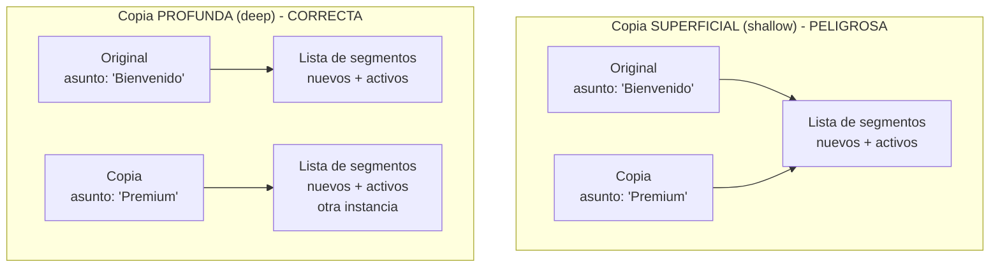
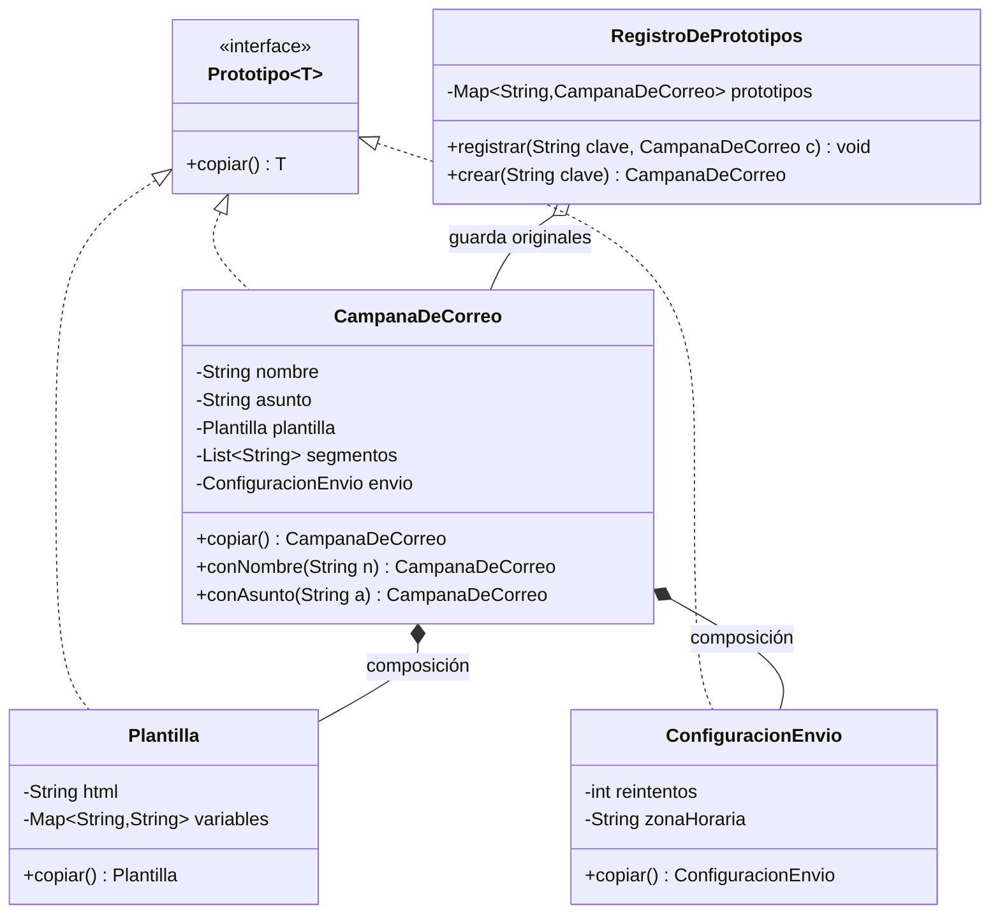

[← Volver al índice](README.md) · [← 05 Builder](05-builder.md) · [07 Adapter →](07-adapter.md)

# 06 · Prototype

> **Familia:** Creacional

---

## En una frase

**Crea objetos nuevos copiando uno que ya está armado, en vez de construirlo todo otra vez
desde cero.**

Como cuando en la oficina alguien dice *"no armes la propuesta desde cero, coge la de
Bancolombia, duplícala y cámbiale el nombre del cliente"*.

---

## El enunciado

> **Ticket MKT-455**
> El equipo de Marketing configura **campañas de correo**. Cada campaña tiene plantilla
> HTML, asunto, remitente, lista de segmentos, reglas de horario, políticas de reintento,
> configuración de tracking y adjuntos.
>
> Armar una campaña desde cero toma 20 minutos de configuración y consulta 4 servicios
> externos (validar plantilla, resolver segmentos, verificar dominio del remitente,
> cargar imágenes al CDN).
>
> El 90% de las campañas nuevas son **variaciones de una plantilla base**: "la misma de
> bienvenida, pero para clientes premium" o "la de carrito abandonado, pero en México".
>
> **Necesitamos duplicar una campaña ya configurada y cambiarle solo lo que varía —
> sin que la copia y la original se pisen los datos.**

---

## El código que duele

```java
// Volver a hacer TODO el trabajo caro, solo para cambiar el asunto:
var premium = new CampanaDeCorreo();
premium.cargarPlantillaDesdeCdn("bienvenida.html");   // 800 ms
premium.validarDominioRemitente("no-reply@empresa.com"); // 400 ms
premium.resolverSegmentos(List.of("nuevos"));          // 1200 ms
premium.configurarTracking(true, true, false);
premium.setAsunto("¡Bienvenido a Premium!");           // <- lo ÚNICO que cambia
```

Y el intento ingenuo de copiar, que es peor:

```java
var copia = original;              // ❌ NO es una copia: es el MISMO objeto
copia.setAsunto("Otro asunto");    // acabas de cambiarle el asunto al original también
```

---

## La idea del patrón

Dale al propio objeto la responsabilidad de saber copiarse:

1. Una interfaz con un método `copiar()` (o `clonar()`).
2. Cada clase implementa cómo duplicarse **correctamente**, incluidas sus partes internas.
3. Guardas objetos ya configurados en un **registro de prototipos**.
4. Cuando necesitas uno nuevo: lo pides al registro, te da una copia, y la ajustas.

> **Regla de oro:** copiar es barato; construir es caro. Copia y ajusta.

---

## Copia superficial vs. copia profunda (esto es TODO el patrón)

Es el concepto que hay que entender sí o sí:



En la copia superficial, si le agregas un segmento a la copia, **también se lo agregas al
original**: comparten la misma lista. Es la causa de los bugs más difíciles de rastrear
que produce este patrón.

---

## El diagrama



---

## La solución en Java 21

```java
import java.util.ArrayList;
import java.util.HashMap;
import java.util.LinkedHashMap;
import java.util.List;
import java.util.Map;

// ---------------------------------------------------------------
// La interfaz del patrón. Genérica, para que copiar() devuelva el tipo exacto.
// ---------------------------------------------------------------
interface Prototipo<T> {
    T copiar();
}

// ---------------------------------------------------------------
// Partes internas MUTABLES: cada una debe saber copiarse
// ---------------------------------------------------------------
final class Plantilla implements Prototipo<Plantilla> {
    private String html;
    private final Map<String, String> variables;

    Plantilla(String html, Map<String, String> variables) {
        this.html = html;
        this.variables = new LinkedHashMap<>(variables);
    }

    @Override public Plantilla copiar() {
        // El Map se copia: si no, original y copia comparten variables.
        return new Plantilla(this.html, this.variables);
    }

    void definirVariable(String clave, String valor) { variables.put(clave, valor); }
    String render() {
        var salida = html;
        for (var e : variables.entrySet()) salida = salida.replace("{{" + e.getKey() + "}}", e.getValue());
        return salida;
    }
    Map<String, String> variables() { return Map.copyOf(variables); }
}

final class ConfiguracionEnvio implements Prototipo<ConfiguracionEnvio> {
    private int reintentos;
    private String zonaHoraria;
    private boolean trackearAperturas;

    ConfiguracionEnvio(int reintentos, String zonaHoraria, boolean trackearAperturas) {
        this.reintentos = reintentos;
        this.zonaHoraria = zonaHoraria;
        this.trackearAperturas = trackearAperturas;
    }

    @Override public ConfiguracionEnvio copiar() {
        return new ConfiguracionEnvio(reintentos, zonaHoraria, trackearAperturas);
    }

    void zonaHoraria(String z) { this.zonaHoraria = z; }
    @Override public String toString() {
        return "reintentos=" + reintentos + ", tz=" + zonaHoraria + ", tracking=" + trackearAperturas;
    }
}

// ---------------------------------------------------------------
// EL PROTOTIPO principal
// ---------------------------------------------------------------
final class CampanaDeCorreo implements Prototipo<CampanaDeCorreo> {
    private String nombre;
    private String asunto;
    private String remitente;
    private final Plantilla plantilla;               // mutable -> copia profunda
    private final ConfiguracionEnvio envio;          // mutable -> copia profunda
    private final List<String> segmentos;            // mutable -> copia profunda

    // Constructor "caro": simula el trabajo pesado de armar la campaña de cero.
    CampanaDeCorreo(String nombre, String asunto, String remitente,
                    Plantilla plantilla, ConfiguracionEnvio envio, List<String> segmentos) {
        System.out.println("  [construcción costosa] validando plantilla, dominio y segmentos...");
        this.nombre = nombre;
        this.asunto = asunto;
        this.remitente = remitente;
        this.plantilla = plantilla;
        this.envio = envio;
        this.segmentos = new ArrayList<>(segmentos);
    }

    // Constructor privado de COPIA: barato, no valida nada externo.
    private CampanaDeCorreo(CampanaDeCorreo o) {
        this.nombre    = o.nombre + " (copia)";
        this.asunto    = o.asunto;
        this.remitente = o.remitente;
        this.plantilla = o.plantilla.copiar();          // <- profunda
        this.envio     = o.envio.copiar();              // <- profunda
        this.segmentos = new ArrayList<>(o.segmentos);  // <- profunda
    }

    @Override public CampanaDeCorreo copiar() { return new CampanaDeCorreo(this); }

    // Métodos de ajuste encadenables, para el "copiar y modificar"
    CampanaDeCorreo conNombre(String n)   { this.nombre = n; return this; }
    CampanaDeCorreo conAsunto(String a)   { this.asunto = a; return this; }
    CampanaDeCorreo conSegmento(String s) { this.segmentos.add(s); return this; }
    CampanaDeCorreo conVariable(String k, String v) { plantilla.definirVariable(k, v); return this; }
    CampanaDeCorreo enZonaHoraria(String z) { envio.zonaHoraria(z); return this; }

    void imprimir() {
        System.out.println("  nombre    : " + nombre);
        System.out.println("  asunto    : " + asunto);
        System.out.println("  segmentos : " + segmentos);
        System.out.println("  variables : " + plantilla.variables());
        System.out.println("  envío     : " + envio);
        System.out.println("  cuerpo    : " + plantilla.render());
    }
    List<String> segmentos() { return List.copyOf(segmentos); }
}

// ---------------------------------------------------------------
// EL REGISTRO DE PROTOTIPOS: el catálogo de "plantillas base"
// ---------------------------------------------------------------
final class RegistroDeCampanas {
    private final Map<String, CampanaDeCorreo> prototipos = new HashMap<>();

    void registrar(String clave, CampanaDeCorreo prototipo) {
        prototipos.put(clave, prototipo);
    }

    // Nunca entrega el original: siempre una copia fresca.
    CampanaDeCorreo crear(String clave) {
        var proto = prototipos.get(clave);
        if (proto == null) throw new IllegalArgumentException("No existe la plantilla: " + clave);
        return proto.copiar();
    }
}

public class Demo {
    public static void main(String[] args) {

        System.out.println("=== 1. Se arma UNA vez la campaña base (costoso) ===");
        var base = new CampanaDeCorreo(
            "Bienvenida estándar",
            "¡Bienvenido a bordo, {{nombre}}!",
            "no-reply@empresa.com",
            new Plantilla("<h1>Hola {{nombre}}</h1><p>Tu plan {{plan}} ya está activo.</p>",
                          Map.of("nombre", "cliente", "plan", "Básico")),
            new ConfiguracionEnvio(3, "America/Bogota", true),
            List.of("nuevos")
        );

        var registro = new RegistroDeCampanas();
        registro.registrar("bienvenida", base);

        System.out.println("\n=== 2. Campaña Premium: copiar y ajustar (barato) ===");
        var premium = registro.crear("bienvenida")
                .conNombre("Bienvenida Premium")
                .conAsunto("¡Bienvenido al plan Premium, {{nombre}}!")
                .conSegmento("premium")
                .conVariable("plan", "Premium");
        premium.imprimir();

        System.out.println("\n=== 3. Campaña México: copiar y ajustar (barato) ===");
        var mexico = registro.crear("bienvenida")
                .conNombre("Bienvenida México")
                .conSegmento("mx")
                .enZonaHoraria("America/Mexico_City")
                .conVariable("plan", "Básico MX");
        mexico.imprimir();

        System.out.println("\n=== 4. Verificación: el original NO fue tocado ===");
        var original = registro.crear("bienvenida").conNombre("Bienvenida estándar");
        original.imprimir();

        System.out.println("\n  ¿premium y méxico comparten la lista de segmentos? "
            + premium.segmentos().equals(mexico.segmentos()));
    }
}
```

### Salida

```
=== 1. Se arma UNA vez la campaña base (costoso) ===
  [construcción costosa] validando plantilla, dominio y segmentos...

=== 2. Campaña Premium: copiar y ajustar (barato) ===
  nombre    : Bienvenida Premium
  asunto    : ¡Bienvenido al plan Premium, {{nombre}}!
  segmentos : [nuevos, premium]
  variables : {nombre=cliente, plan=Premium}
  envío     : reintentos=3, tz=America/Bogota, tracking=true
  cuerpo    : <h1>Hola cliente</h1><p>Tu plan Premium ya está activo.</p>

=== 3. Campaña México: copiar y ajustar (barato) ===
  nombre    : Bienvenida México
  segmentos : [nuevos, mx]
  variables : {nombre=cliente, plan=Básico MX}
  envío     : reintentos=3, tz=America/Mexico_City, tracking=true
  ...

=== 4. Verificación: el original NO fue tocado ===
  nombre    : Bienvenida estándar
  segmentos : [nuevos]
  variables : {nombre=cliente, plan=Básico}
  envío     : reintentos=3, tz=America/Bogota, tracking=true

  ¿premium y méxico comparten la lista de segmentos? false
```

Fíjate en dos cosas:

- El mensaje `[construcción costosa]` aparece **una sola vez**, aunque creamos tres campañas.
- El original conserva `[nuevos]` y `plan=Básico`: **las copias no lo contaminaron.**

---

## Por qué NO usar `Cloneable` de Java

Java trae una interfaz `Cloneable` y un método `Object.clone()`. **No los uses.**

```java
// ❌ El camino viejo y roto
class Campana implements Cloneable {
    @Override protected Object clone() throws CloneNotSupportedException {
        return super.clone();   // copia SUPERFICIAL: comparte todas las listas
    }
}
```

Problemas:

- `Cloneable` es una **interfaz vacía** (no declara `clone()`). Es un marcador raro.
- `clone()` es `protected` y devuelve `Object`: toca castear.
- Lanza `CloneNotSupportedException`, una excepción chequeada que estorba.
- Hace copia **superficial** por defecto → el bug de las listas compartidas.
- No funciona bien con campos `final`.

Joshua Bloch (autor de *Effective Java* y de buena parte del JDK) recomienda directamente
**un constructor de copia o un método `copiar()` propio**, que es exactamente lo que hicimos.

---

## Truco: si el objeto es inmutable, la copia es gratis

Si tu objeto es un `record` con solo campos inmutables, el patrón se reduce a nada:

```java
record ConfiguracionEnvio(int reintentos, String zonaHoraria, boolean tracking) {
    // "Wither": devuelve una copia con un campo cambiado. Java 21 no lo genera solo.
    ConfiguracionEnvio conZonaHoraria(String z) {
        return new ConfiguracionEnvio(reintentos, z, tracking);
    }
}

var mx = base.conZonaHoraria("America/Mexico_City");   // copia segura, sin esfuerzo
```

**Moraleja:** el patrón Prototype existe sobre todo por culpa del estado mutable. Si
puedes hacer inmutables tus objetos, la mitad del problema desaparece.

---

## ✅ Cuándo usarlo

- Construir el objeto es **caro** (I/O, red, cálculos, consultas) y ya tienes uno igual.
- Necesitas **duplicar** algo configurado por el usuario: plantillas, campañas, formularios,
  reglas de negocio, configuraciones de despliegue.
- Quieres un **catálogo de configuraciones predefinidas** que el usuario clona y ajusta.
- El objeto tiene tantas combinaciones posibles que hacer una subclase por cada una sería
  absurdo.

## ⛔ Cuándo NO usarlo

- El objeto es **inmutable**: no necesitas copiarlo, compártelo. La copia sobra.
- Construirlo es barato: `new` es más claro que un registro de prototipos.
- El objeto tiene referencias circulares o recursos no copiables (una conexión abierta,
  un socket, un `FileHandle`). Copiar eso es abrir la caja de Pandora.
- El grafo de objetos es tan profundo que la copia profunda se vuelve más cara que
  construir de cero. **Mídelo antes de asumirlo.**

---

## Se parece a...

| Patrón | Diferencia clave |
|---|---|
| **[Builder](05-builder.md)** | Construye desde cero paso a paso. Prototype parte de algo ya hecho. |
| **[Factory Method](03-factory-method.md)** | Instancia una clase. Prototype copia una *instancia*. |
| **[Memento](19-memento.md)** | También hace copias del estado, pero para **restaurar** el mismo objeto, no para crear objetos nuevos. |
| **[Flyweight](12-flyweight.md)** | Lo opuesto: comparte la misma instancia en vez de duplicarla. |
| **[Singleton](02-singleton.md)** | Lo opuesto en intención: uno prohíbe copias, el otro las promueve. |

---

## Dónde ya lo has visto

- `Object.clone()` y `Cloneable` (la versión problemática).
- `ArrayList(Collection c)`, `HashMap(Map m)`: constructores de copia por todo el JDK.
- `List.copyOf(...)`, `Map.copyOf(...)`.
- `Stream.toList()` sobre un stream de otra colección.
- En git: `git clone` es literalmente este patrón aplicado a repositorios.

---

➡️ Siguiente: **[07 · Adapter](07-adapter.md)** — empieza la familia de los estructurales.

[← Volver al índice](README.md)
