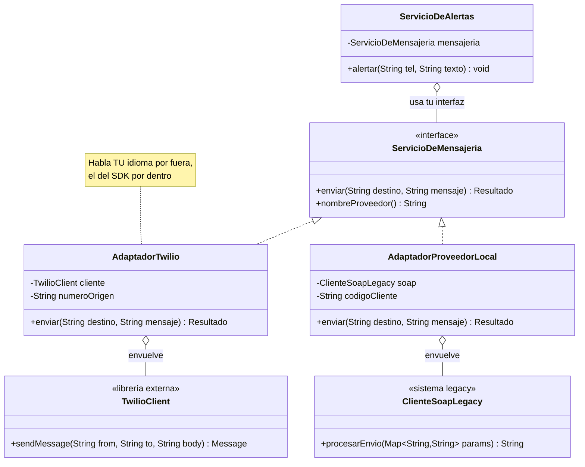

[← Volver al índice](README.md) · [← 06 Prototype](06-prototype.md) · [08 Bridge →](08-bridge.md)

# 07 · Adapter

> **Familia:** Estructural

---

## En una frase

**Un traductor que hace que dos interfaces incompatibles puedan trabajar juntas, sin
modificar ninguna de las dos.**

Como el adaptador de corriente que llevas de viaje: no le cambias el enchufe al portátil
ni le cambias el tomacorriente al hotel. Pones algo en el medio.

---

## El enunciado

> **Ticket INT-590**
> Todo el sistema envía SMS a través de nuestra interfaz `ServicioDeMensajeria`, con
> `enviar(destino, mensaje)`. Ya hay 40 lugares en el código que la usan.
>
> El proveedor actual sube tarifas y Compras nos manda a integrar dos más:
> - **Twilio**, cuyo SDK expone `sendMessage(from, to, body)` y devuelve un objeto `Message`.
> - **Un proveedor local**, con un servicio SOAP legacy cuyo método es
>   `procesarEnvio(Map<String,String> parametros)` y devuelve un `String` con un XML.
>
> Ninguno de los dos se parece a nuestra interfaz. Y **no podemos tocar el código de los
> SDK** (son librerías externas).
>
> **No quiero cambiar los 40 lugares que ya usan `ServicioDeMensajeria`.**

---

## El código que duele

```java
class ServicioDeAlertas {
    void alertar(String telefono, String texto) {
        if (proveedorActivo.equals("TWILIO")) {
            var twilio = new TwilioClient(apiKey);
            var msg = twilio.sendMessage("+15551234567", telefono, texto);
            if (!msg.getStatus().equals("queued")) { /* ... */ }
        } else if (proveedorActivo.equals("LOCAL")) {
            var params = new HashMap<String, String>();
            params.put("NUM_DEST", telefono.replace("+", ""));
            params.put("TXT", texto);
            params.put("COD_CLIENTE", "EMP001");
            var xml = soapClient.procesarEnvio(params);
            if (!xml.contains("<estado>0</estado>")) { /* ... */ }
        }
    }
}
```

Y ahora multiplica eso por los 40 lugares. Cada detalle raro de cada SDK (el `+` del
teléfono, el código de cliente, el XML de respuesta) se está filtrando a tu lógica de
negocio.

---

## La idea del patrón

Metes una clase en el medio que **habla tu idioma por fuera y el del proveedor por dentro**:

1. Tú defines la interfaz que **te conviene** (`ServicioDeMensajeria`).
2. Por cada proveedor, escribes un **adaptador** que la implementa.
3. Dentro del adaptador guardas el objeto del proveedor (**composición**) y traduces:
   nombres de métodos, formato de parámetros, manejo de errores, tipos de retorno.
4. Tu código nunca ve el SDK. Ve solo tu interfaz.

> **Regla de oro:** el adaptador absorbe toda la rareza del mundo exterior.

---

## El diagrama



La forma es siempre la misma: **implementa lo tuyo, contiene lo ajeno**.

---

## La solución en Java 21

```java
import java.util.HashMap;
import java.util.List;
import java.util.Map;

// ===============================================================
// TU INTERFAZ: la que a ti te conviene. Nunca cambia.
// ===============================================================
sealed interface Resultado permits Resultado.Ok, Resultado.Error {
    record Ok(String idMensaje, double costoUsd) implements Resultado {}
    record Error(String codigo, String descripcion) implements Resultado {}
}

interface ServicioDeMensajeria {
    Resultado enviar(String destino, String mensaje);
    String nombreProveedor();
}

// ===============================================================
// LOS "ADAPTEES": código externo que NO puedes modificar
// ===============================================================

/** SDK moderno de un proveedor internacional. */
final class TwilioClient {
    private final String apiKey;
    TwilioClient(String apiKey) { this.apiKey = apiKey; }

    record Message(String sid, String status, String errorCode, double price) {}

    Message sendMessage(String from, String to, String body) {
        System.out.println("    [Twilio SDK] POST /Messages from=" + from + " to=" + to);
        if (!to.startsWith("+")) {
            return new Message(null, "failed", "21211", 0);   // exige formato E.164
        }
        return new Message("SM" + Math.abs(body.hashCode()), "queued", null, 0.0075);
    }
}

/** Servicio SOAP legacy de un proveedor local. Formato de otro planeta. */
final class ClienteSoapLegacy {
    String procesarEnvio(Map<String, String> parametros) {
        System.out.println("    [SOAP legacy] <procesarEnvio> " + parametros);
        var destino = parametros.getOrDefault("NUM_DEST", "");
        if (destino.length() != 12) {
            return "<respuesta><estado>3</estado><msj>NUMERO INVALIDO</msj></respuesta>";
        }
        return "<respuesta><estado>0</estado><folio>F-" + destino.hashCode()
             + "</folio><valor>85.50</valor></respuesta>";
    }
}

// ===============================================================
// LOS ADAPTADORES
// ===============================================================
final class AdaptadorTwilio implements ServicioDeMensajeria {
    private final TwilioClient cliente;      // composición: envuelve el SDK
    private final String numeroOrigen;

    AdaptadorTwilio(TwilioClient cliente, String numeroOrigen) {
        this.cliente = cliente;
        this.numeroOrigen = numeroOrigen;
    }

    @Override public Resultado enviar(String destino, String mensaje) {
        // 1) Traduce el formato de entrada al que exige el SDK
        var destinoE164 = destino.startsWith("+") ? destino : "+" + destino;

        // 2) Llama con la firma del SDK
        var respuesta = cliente.sendMessage(numeroOrigen, destinoE164, mensaje);

        // 3) Traduce la respuesta a TU modelo
        return switch (respuesta.status()) {
            case "queued", "sent" -> new Resultado.Ok(respuesta.sid(), respuesta.price());
            default -> new Resultado.Error(respuesta.errorCode(), "Twilio rechazó el envío");
        };
    }

    @Override public String nombreProveedor() { return "Twilio"; }
}

final class AdaptadorProveedorLocal implements ServicioDeMensajeria {
    private static final double TRM = 4100.0;   // pesos por dólar
    private final ClienteSoapLegacy soap;
    private final String codigoCliente;

    AdaptadorProveedorLocal(ClienteSoapLegacy soap, String codigoCliente) {
        this.soap = soap;
        this.codigoCliente = codigoCliente;
    }

    @Override public Resultado enviar(String destino, String mensaje) {
        // 1) Arma el Map que el legacy espera, con sus manías
        var params = new HashMap<String, String>();
        params.put("NUM_DEST", destino.replace("+", ""));
        params.put("TXT", mensaje.length() > 160 ? mensaje.substring(0, 160) : mensaje);
        params.put("COD_CLIENTE", codigoCliente);

        // 2) Llama
        var xml = soap.procesarEnvio(params);

        // 3) Parsea el XML y lo convierte a TU modelo
        if (!xml.contains("<estado>0</estado>")) {
            return new Resultado.Error(entre(xml, "estado"), entre(xml, "msj"));
        }
        var valorPesos = Double.parseDouble(entre(xml, "valor"));
        return new Resultado.Ok(entre(xml, "folio"), valorPesos / TRM);
    }

    private String entre(String xml, String etiqueta) {
        var ini = xml.indexOf("<" + etiqueta + ">") + etiqueta.length() + 2;
        var fin = xml.indexOf("</" + etiqueta + ">");
        return (ini < 2 || fin < 0) ? "" : xml.substring(ini, fin);
    }

    @Override public String nombreProveedor() { return "ProveedorLocal (SOAP)"; }
}

// ===============================================================
// TU CÓDIGO DE NEGOCIO: nunca supo que Twilio o SOAP existen
// ===============================================================
final class ServicioDeAlertas {
    private final ServicioDeMensajeria mensajeria;

    ServicioDeAlertas(ServicioDeMensajeria mensajeria) { this.mensajeria = mensajeria; }

    void alertarPagoVencido(String telefono, String nombreCliente, double monto) {
        var texto = "Hola %s, tu factura por $%,.0f está vencida. Evita suspensión."
                        .formatted(nombreCliente, monto);

        System.out.println("  Enviando vía " + mensajeria.nombreProveedor() + "...");
        var resultado = mensajeria.enviar(telefono, texto);

        // switch con patrones de Java 21 sobre la sealed interface
        switch (resultado) {
            case Resultado.Ok ok ->
                System.out.println("  ✔ Enviado. id=" + ok.idMensaje()
                    + " costo=USD " + String.format("%.4f", ok.costoUsd()));
            case Resultado.Error err ->
                System.out.println("  ✘ Falló [" + err.codigo() + "] " + err.descripcion());
        }
    }
}

public class Demo {
    public static void main(String[] args) {
        List<ServicioDeMensajeria> proveedores = List.of(
            new AdaptadorTwilio(new TwilioClient("sk_live_x"), "+15551234567"),
            new AdaptadorProveedorLocal(new ClienteSoapLegacy(), "EMP001")
        );

        for (var proveedor : proveedores) {
            System.out.println("\n=== " + proveedor.nombreProveedor() + " ===");
            var alertas = new ServicioDeAlertas(proveedor);
            alertas.alertarPagoVencido("+573001234567", "Ana", 250_000);
            System.out.println("  -- caso con número inválido --");
            alertas.alertarPagoVencido("3001", "Luis", 90_000);
        }
    }
}
```

### Salida

```
=== Twilio ===
  Enviando vía Twilio...
    [Twilio SDK] POST /Messages from=+15551234567 to=+573001234567
  ✔ Enviado. id=SM1042... costo=USD 0.0075
  -- caso con número inválido --
  Enviando vía Twilio...
    [Twilio SDK] POST /Messages from=+15551234567 to=+3001
  ✔ Enviado. id=SM... costo=USD 0.0075

=== ProveedorLocal (SOAP) ===
  Enviando vía ProveedorLocal (SOAP)...
    [SOAP legacy] <procesarEnvio> {NUM_DEST=573001234567, TXT=Hola Ana..., COD_CLIENTE=EMP001}
  ✔ Enviado. id=F-... costo=USD 0.0209
  -- caso con número inválido --
    [SOAP legacy] <procesarEnvio> {NUM_DEST=3001, ...}
  ✘ Falló [3] NUMERO INVALIDO
```

`ServicioDeAlertas` es **exactamente el mismo código** en los dos casos. Cambiar de
proveedor es cambiar una línea de configuración.

---

## Las dos formas de Adapter

### Adapter de objeto (composición) — el que usamos, y el que debes usar

```java
class AdaptadorTwilio implements ServicioDeMensajeria {
    private final TwilioClient cliente;   // lo CONTIENE
}
```

Ventajas: puedes adaptar varias clases a la vez, cambiar el objeto envuelto en tiempo de
ejecución, y funciona con clases `final`.

### Adapter de clase (herencia múltiple) — casi imposible en Java

```java
// Solo funciona si el adaptee es una clase no final y la meta es una interfaz.
class AdaptadorTwilio extends TwilioClient implements ServicioDeMensajeria { ... }
```

Java no tiene herencia múltiple de clases, así que esta variante está muy limitada.
**En Java, Adapter = composición. Punto.**

---

## Variante moderna: adaptar con una lambda

Si tu interfaz tiene un solo método, el adaptador puede ser una lambda:

```java
@FunctionalInterface
interface EnviadorSimple { Resultado enviar(String destino, String mensaje); }

var twilio = new TwilioClient("sk");
EnviadorSimple adaptador = (destino, mensaje) -> {
    var m = twilio.sendMessage("+1555", destino, mensaje);
    return new Resultado.Ok(m.sid(), m.price());
};
```

Útil para adaptaciones triviales. Para las que tienen traducción de errores, formatos y
estados como la del ejemplo, **una clase se lee mucho mejor**.

---

## Qué ganamos

| Antes | Después |
|---|---|
| Detalles de cada SDK esparcidos en 40 archivos | Encapsulados en 1 clase por proveedor |
| Cambiar de proveedor = tocar 40 archivos | Cambiar de proveedor = 1 línea de configuración |
| El negocio conoce códigos de error de Twilio | El negocio solo conoce `Resultado.Ok` / `Resultado.Error` |
| Imposible testear sin llamar al proveedor real | Un `ServicioDeMensajeria` falso en el test y listo |

---

## ✅ Cuándo usarlo

- Integras una **librería externa o un sistema legacy** cuya interfaz no controlas.
- Estás migrando de un proveedor a otro y quieres que ambos convivan un tiempo.
- Quieres aislar tu dominio de detalles de infraestructura (esto es literalmente lo que
  hace la "capa de anticorrupción" en arquitectura hexagonal / DDD).
- Necesitas testear sin llamar servicios reales: el adaptador es el punto natural para
  poner un doble de prueba.

## ⛔ Cuándo NO usarlo

- **Puedes modificar la clase original.** Entonces cámbiala; el adaptador sobra.
- La diferencia entre las interfaces es tan grande que el adaptador termina teniendo
  lógica de negocio. Eso ya no es un adaptador: es un servicio mal ubicado.
- Estás adaptando algo que solo se usa en un lugar y no va a cambiar. No agregues una
  capa por si acaso.

---

## Se parece a...

| Patrón | Diferencia clave |
|---|---|
| **[Decorator](10-decorator.md)** | Decorator mantiene **la misma interfaz** y le agrega comportamiento. Adapter **cambia** la interfaz y no agrega nada. |
| **[Facade](11-facade.md)** | Facade simplifica un subsistema **completo** con una interfaz nueva y más cómoda. Adapter hace que **una** clase encaje en una interfaz **que ya existía**. |
| **[Proxy](13-proxy.md)** | Proxy mantiene la misma interfaz y controla el acceso. Adapter la traduce. |
| **[Bridge](08-bridge.md)** | Bridge se diseña **desde el principio** para que dos jerarquías varíen aparte. Adapter llega **después**, a arreglar algo que ya no encaja. |

---

## Dónde ya lo has visto

- `InputStreamReader`: adapta un `InputStream` (bytes) a un `Reader` (caracteres).
- `Arrays.asList(array)`: adapta un arreglo a la interfaz `List`.
- `Collections.enumeration(coleccion)`: adapta `Iterator` a `Enumeration`.
- Los `HandlerAdapter` de Spring MVC.
- Cualquier clase que en tu proyecto se llame `XxxClient`, `XxxGateway` o `XxxAdapter`.

---

➡️ Siguiente: **[08 · Bridge](08-bridge.md)**

[← Volver al índice](README.md)
