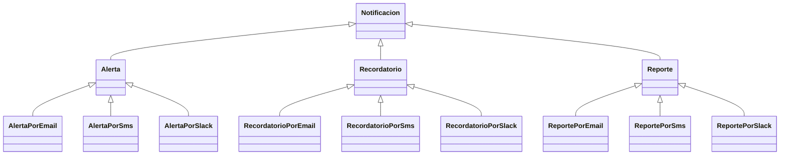
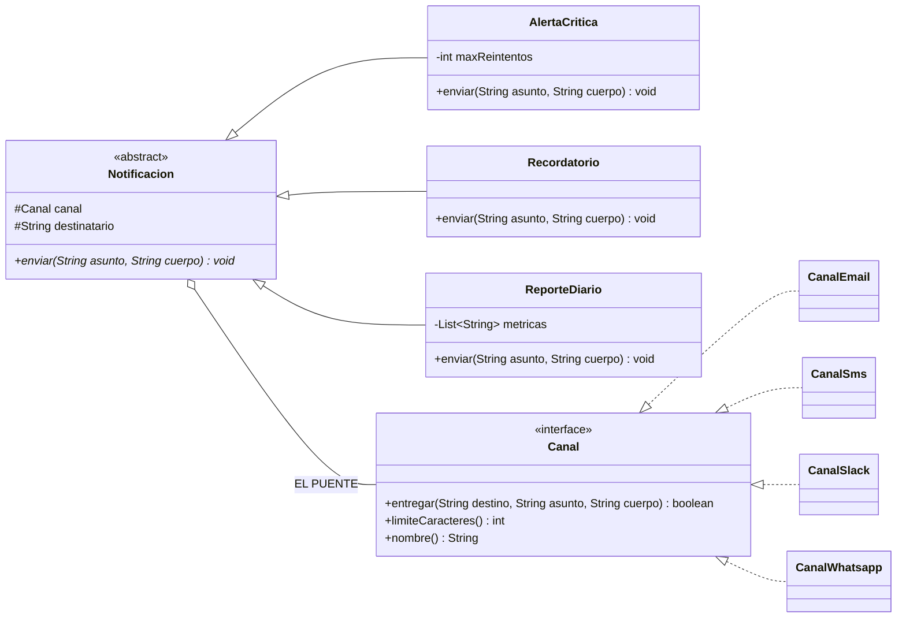

[← Volver al índice](README.md) · [← 07 Adapter](07-adapter.md) · [09 Composite →](09-composite.md)

# 08 · Bridge

> **Familia:** Estructural

---

## En una frase

**Separa dos cosas que varían por su cuenta, para que no tengas que hacer una clase por
cada combinación.**

Como un control remoto y un televisor: hay controles básicos y controles con voz, y hay
televisores Samsung y LG. Un control puede manejar cualquier tele. **No existe el
"control-básico-para-Samsung"**.

---

## El enunciado

> **Ticket NOT-620**
> El sistema envía **notificaciones**. Hoy hay tres tipos:
> - **Alerta crítica**: prefijo `[URGENTE]`, se reintenta 3 veces, escala al líder si falla.
> - **Recordatorio**: se manda una vez, en horario hábil.
> - **Reporte diario**: incluye un resumen y se manda a las 7 a.m.
>
> Y hay tres **canales**: correo, SMS y Slack. La próxima semana entran WhatsApp y
> notificación push.
>
> Hoy tenemos: `AlertaPorEmail`, `AlertaPorSms`, `AlertaPorSlack`, `RecordatorioPorEmail`,
> `RecordatorioPorSms`... **nueve clases**. Con WhatsApp y push serán **quince**. Y si
> agregan un cuarto tipo de notificación, **veinte**.
>
> **Esto no escala.**

---

## El código que duele



**3 tipos × 3 canales = 9 clases.** Y peor: la lógica de "cómo se manda un correo" está
copiada y pegada en `AlertaPorEmail`, `RecordatorioPorEmail` y `ReportePorEmail`.
Arreglar un bug de SMTP significa arreglarlo tres veces.

La fórmula del desastre: **N × M clases**, donde N y M crecen con cada sprint.

---

## La idea del patrón

Detecta que hay **dos ejes independientes** que se están mezclando en una sola jerarquía:

| Eje | Pregunta que responde | En este caso |
|---|---|---|
| **Abstracción** | ¿QUÉ estoy notificando y con qué reglas? | Alerta, Recordatorio, Reporte |
| **Implementación** | ¿POR DÓNDE lo mando? | Email, SMS, Slack, WhatsApp |

Y los separas en dos jerarquías conectadas por **composición** (el "puente"):

1. Una jerarquía de **abstracciones** (`Notificacion` y sus tipos).
2. Una jerarquía de **implementaciones** (`Canal` y sus canales).
3. La abstracción **guarda una referencia** a la implementación.

**3 + 3 = 6 clases** en vez de 9. Y con WhatsApp y push: **3 + 5 = 8** en vez de 15.

> **Regla de oro:** cuando dos cosas varían por separado, deja de multiplicarlas y
> empieza a sumarlas.

---

## El diagrama



Esa única flecha `o--` entre las dos jerarquías **es el bridge**. Todo el patrón es eso:
en vez de que una jerarquía herede de la otra, **una compone a la otra**.

---

## La solución en Java 21

```java
import java.time.LocalTime;
import java.util.List;

// ===============================================================
// EJE 2 — LA IMPLEMENTACIÓN: por dónde se manda
// ===============================================================
interface Canal {
    boolean entregar(String destino, String asunto, String cuerpo);
    int limiteCaracteres();
    String nombre();

    // Comportamiento común a todos los canales, escrito una sola vez.
    default String recortar(String texto) {
        return texto.length() <= limiteCaracteres()
             ? texto
             : texto.substring(0, limiteCaracteres() - 3) + "...";
    }
}

final class CanalEmail implements Canal {
    public boolean entregar(String destino, String asunto, String cuerpo) {
        System.out.println("    [SMTP] To: " + destino);
        System.out.println("    [SMTP] Subject: " + asunto);
        System.out.println("    [SMTP] " + recortar(cuerpo));
        return true;
    }
    public int limiteCaracteres() { return 10_000; }
    public String nombre() { return "Email"; }
}

final class CanalSms implements Canal {
    public boolean entregar(String destino, String asunto, String cuerpo) {
        // El SMS no tiene asunto: lo fusiona con el cuerpo. Detalle propio del canal.
        System.out.println("    [SMS] " + destino + ": " + recortar(asunto + " - " + cuerpo));
        return !destino.startsWith("+0");
    }
    public int limiteCaracteres() { return 160; }
    public String nombre() { return "SMS"; }
}

final class CanalSlack implements Canal {
    public boolean entregar(String destino, String asunto, String cuerpo) {
        System.out.println("    [Slack] POST #" + destino
            + " {\"text\": \"*" + asunto + "*\\n" + recortar(cuerpo) + "\"}");
        return true;
    }
    public int limiteCaracteres() { return 4_000; }
    public String nombre() { return "Slack"; }
}

// Canal NUEVO: una sola clase, y funciona con TODOS los tipos de notificación.
final class CanalWhatsapp implements Canal {
    public boolean entregar(String destino, String asunto, String cuerpo) {
        System.out.println("    [WhatsApp Business API] " + destino
            + " -> *" + asunto + "*\n    " + recortar(cuerpo));
        return true;
    }
    public int limiteCaracteres() { return 1_024; }
    public String nombre() { return "WhatsApp"; }
}

// ===============================================================
// EJE 1 — LA ABSTRACCIÓN: qué se notifica y con qué reglas
// ===============================================================
abstract class Notificacion {
    protected final Canal canal;              // <-- EL PUENTE
    protected final String destinatario;

    protected Notificacion(Canal canal, String destinatario) {
        this.canal = canal;
        this.destinatario = destinatario;
    }
    public abstract void enviar(String asunto, String cuerpo);
}

final class AlertaCritica extends Notificacion {
    private static final int MAX_REINTENTOS = 3;
    private final String lider;

    AlertaCritica(Canal canal, String destinatario, String lider) {
        super(canal, destinatario);
        this.lider = lider;
    }

    @Override public void enviar(String asunto, String cuerpo) {
        System.out.println("  AlertaCritica vía " + canal.nombre());
        for (int intento = 1; intento <= MAX_REINTENTOS; intento++) {
            if (canal.entregar(destinatario, "[URGENTE] " + asunto, cuerpo)) {
                System.out.println("    -> entregada en el intento " + intento);
                return;
            }
            System.out.println("    -> falló el intento " + intento + ", reintentando...");
        }
        System.out.println("    -> ESCALANDO a " + lider);
        canal.entregar(lider, "[ESCALAMIENTO] " + asunto, cuerpo);
    }
}

final class Recordatorio extends Notificacion {
    Recordatorio(Canal canal, String destinatario) { super(canal, destinatario); }

    @Override public void enviar(String asunto, String cuerpo) {
        System.out.println("  Recordatorio vía " + canal.nombre());
        var hora = LocalTime.of(10, 30);      // hora simulada
        if (hora.isBefore(LocalTime.of(8, 0)) || hora.isAfter(LocalTime.of(18, 0))) {
            System.out.println("    -> fuera de horario hábil, se encola para mañana");
            return;
        }
        canal.entregar(destinatario, "Recordatorio: " + asunto, cuerpo);
    }
}

final class ReporteDiario extends Notificacion {
    private final List<String> metricas;

    ReporteDiario(Canal canal, String destinatario, List<String> metricas) {
        super(canal, destinatario);
        this.metricas = metricas;
    }

    @Override public void enviar(String asunto, String cuerpo) {
        System.out.println("  ReporteDiario vía " + canal.nombre());
        var resumen = cuerpo + "\n    Métricas: " + String.join(" | ", metricas);
        canal.entregar(destinatario, "Reporte diario - " + asunto, resumen);
    }
}

public class Demo {
    public static void main(String[] args) {
        var email    = new CanalEmail();
        var sms      = new CanalSms();
        var slack    = new CanalSlack();
        var whatsapp = new CanalWhatsapp();   // canal nuevo, cero clases extra

        System.out.println("=== Misma notificación, canales distintos ===");
        new AlertaCritica(slack, "ops-produccion", "@lider-guardia")
            .enviar("CPU al 98% en prod-db-01", "Sostenido por 12 minutos. Revisar consultas.");
        System.out.println();
        new AlertaCritica(whatsapp, "+573001112233", "+573009998877")
            .enviar("CPU al 98% en prod-db-01", "Sostenido por 12 minutos. Revisar consultas.");

        System.out.println("\n=== Mismo canal, notificaciones distintas ===");
        new Recordatorio(email, "contabilidad@empresa.com")
            .enviar("Cierre contable", "Recuerda cerrar el periodo antes del viernes.");
        System.out.println();
        new ReporteDiario(email, "gerencia@empresa.com",
                          List.of("Ventas: $84M", "Tickets: 312", "Uptime: 99.97%"))
            .enviar("14 de agosto", "Resumen de operación del día.");

        System.out.println("\n=== Caso de fallo con reintentos y escalamiento ===");
        new AlertaCritica(sms, "+0000000000", "+573009998877")
            .enviar("Pasarela de pagos caída", "Timeouts del 100% desde hace 3 minutos.");
    }
}
```

### Salida (recortada)

```
=== Misma notificación, canales distintos ===
  AlertaCritica vía Slack
    [Slack] POST #ops-produccion {"text": "*[URGENTE] CPU al 98%...*\n..."}
    -> entregada en el intento 1

  AlertaCritica vía WhatsApp
    [WhatsApp Business API] +573001112233 -> *[URGENTE] CPU al 98% en prod-db-01*
    Sostenido por 12 minutos. Revisar consultas.
    -> entregada en el intento 1

=== Mismo canal, notificaciones distintas ===
  Recordatorio vía Email
    [SMTP] To: contabilidad@empresa.com
    [SMTP] Subject: Recordatorio: Cierre contable
    ...

=== Caso de fallo con reintentos y escalamiento ===
  AlertaCritica vía SMS
    [SMS] +0000000000: [URGENTE] Pasarela de pagos caída - Timeouts...
    -> falló el intento 1, reintentando...
    ... (3 intentos)
    -> ESCALANDO a +573009998877
    [SMS] +573009998877: [ESCALAMIENTO] Pasarela de pagos caída - ...
```

---

## La cuenta que justifica todo el patrón

| Tipos × Canales | Sin Bridge (herencia) | Con Bridge (composición) |
|---|---|---|
| 3 × 3 | 9 clases | 6 clases |
| 3 × 5 | 15 clases | 8 clases |
| 5 × 5 | 25 clases | 10 clases |
| 5 × 8 | 40 clases | 13 clases |

Sin Bridge **multiplicas**. Con Bridge **sumas**. Y encima, con Bridge la combinación se
elige **en tiempo de ejecución**:

```java
Canal canal = configuracion.esUrgente() ? new CanalSms() : new CanalEmail();
new AlertaCritica(canal, destino, lider).enviar(asunto, cuerpo);
```

Con herencia eso sería imposible: la combinación queda congelada al compilar.

---

## Cómo detectar que necesitas un Bridge

Busca estas tres señales en tu código:

1. **Nombres de clase con "por", "con" o "de" en el medio**:
   `PagoConTarjetaEnColombia`, `ReporteExcelParaGerencia`, `ExportadorPdfConFirma`.
   Cada palabra suele ser un eje que debería estar separado.
2. **Explosión combinatoria**: tienes N×M clases y crecen juntas.
3. **Código duplicado en horizontal**: `AlertaPorEmail` y `RecordatorioPorEmail` tienen
   la misma lógica de SMTP.

---

## ✅ Cuándo usarlo

- Hay **dos o más dimensiones que varían de forma independiente**.
- Quieres poder combinarlas en tiempo de ejecución.
- Tu jerarquía de herencia está explotando en subclases combinatorias.
- Necesitas que dos equipos trabajen en paralelo, uno por cada eje.
- Quieres poder cambiar la implementación (driver, proveedor, motor) sin que el cliente
  se entere.

## ⛔ Cuándo NO usarlo

- Solo hay **un** eje de variación → una interfaz simple con implementaciones basta.
- La abstracción y la implementación siempre van juntas y nunca se recombinan.
- El sistema es pequeño y las combinaciones son 2×2. Bridge agrega indirección: solo
  vale la pena cuando la explosión combinatoria ya duele (o se ve venir).

---

## Se parece a...

| Patrón | Diferencia clave |
|---|---|
| **[Adapter](07-adapter.md)** | Adapter arregla **después** algo que no encaja. Bridge se diseña **desde el principio** para separar ejes. Su estructura se parece; su intención no. |
| **[Strategy](22-strategy.md)** | Estructuralmente casi idénticos (un objeto contiene otro y delega). Strategy intercambia **un algoritmo**; Bridge separa **dos jerarquías completas** que evolucionan aparte. Bridge es "Strategy en grande". |
| **[Abstract Factory](04-abstract-factory.md)** | Suele usarse *junto* con Bridge, para decidir qué implementación se inyecta. |
| **[State](21-state.md)** | Misma forma; State cambia el objeto interno **solo**, según el flujo; en Bridge lo elige el cliente y no cambia. |

---

## Dónde ya lo has visto

- **JDBC**: `Connection`, `Statement`, `ResultSet` son la abstracción; el **driver** de
  cada motor (Postgres, MySQL, Oracle) es la implementación. Cambias el driver y tu SQL
  sigue igual.
- **SLF4J**: la API de logging es la abstracción; Logback, Log4j2 o `java.util.logging`
  son las implementaciones.
- `java.awt` con sus *peers* nativos por sistema operativo.
- Cualquier arquitectura hexagonal: el dominio es la abstracción, los adaptadores de
  infraestructura son la implementación.

---

➡️ Siguiente: **[09 · Composite](09-composite.md)**

[← Volver al índice](README.md)
