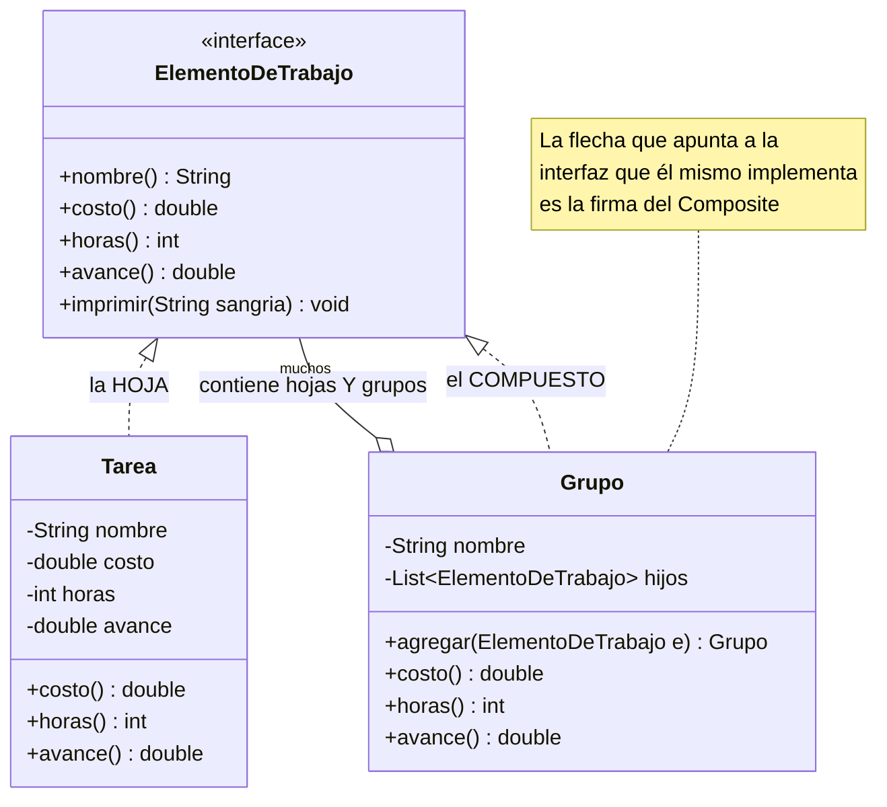
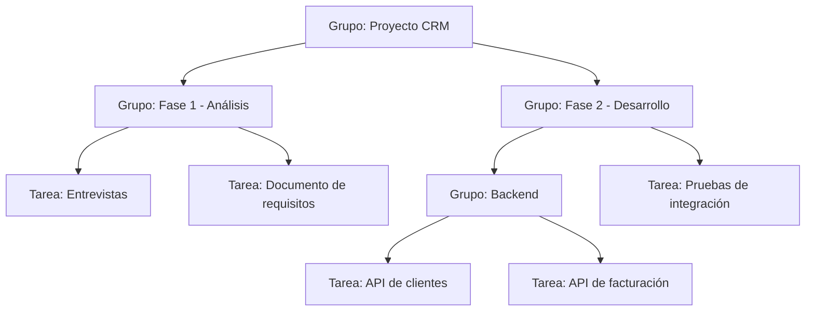

[← Volver al índice](README.md) · [← 08 Bridge](08-bridge.md) · [10 Decorator →](10-decorator.md)

# 09 · Composite

> **Familia:** Estructural

---

## En una frase

**Trata igual a un elemento suelto y a un grupo de elementos, para que el código no tenga
que preguntar "¿esto es uno o son muchos?".**

Como una carpeta en tu computador: puedes pedir el tamaño de un archivo o el tamaño de
una carpeta, y en los dos casos das clic derecho → propiedades. No usas dos menús distintos.

---

## El enunciado

> **Ticket PMO-812**
> La herramienta de gestión de proyectos maneja una **estructura de desglose de trabajo
> (WBS)**: un proyecto tiene fases, cada fase tiene entregables, cada entregable tiene
> tareas, y una tarea puede tener subtareas. **La profundidad es arbitraria.**
>
> Gerencia pide poder ver, en cualquier nivel:
> - El **costo total** acumulado.
> - Las **horas estimadas**.
> - El **porcentaje de avance**.
>
> Hoy el código tiene métodos distintos para tareas y para grupos, y para calcular el
> total de un proyecto hay un `for` anidado de cuatro niveles que se rompe cada vez que
> alguien mete una subtarea un nivel más abajo.

---

## El código que duele

```java
double costoTotal(Proyecto p) {
    double total = 0;
    for (Fase fase : p.getFases()) {
        for (Entregable e : fase.getEntregables()) {
            for (Tarea t : e.getTareas()) {
                total += t.getCosto();
                for (Subtarea s : t.getSubtareas()) {     // ¿y si hay sub-subtareas?
                    total += s.getCosto();
                }
            }
        }
    }
    return total;
}
```

Problemas:

- La profundidad está **cableada en el código**. Un nivel más y hay que reescribirlo.
- Hay cuatro clases casi idénticas (`Fase`, `Entregable`, `Tarea`, `Subtarea`).
- Cada nueva métrica (horas, avance, riesgo) significa **otro** `for` de cuatro niveles.
- Un `if (esGrupo) ... else ...` regado por todo el sistema.

---

## La idea del patrón

Haz que **la hoja y la rama compartan la misma interfaz**:

1. Una interfaz común (`ElementoDeTrabajo`) con las operaciones que el cliente necesita.
2. Una **hoja** (`Tarea`): hace el trabajo real, no tiene hijos.
3. Un **compuesto** (`Grupo`): guarda una lista de `ElementoDeTrabajo` y **delega en sus
   hijos**, sumando/combinando los resultados.
4. El compuesto no sabe si sus hijos son hojas o son otros compuestos. **Y no le importa.**

La recursión reemplaza a los `for` anidados: un compuesto que contiene compuestos se
resuelve solo.

> **Regla de oro:** si el cliente tiene que preguntar "¿es uno o son varios?", te falta
> un Composite.

---

## El diagrama



La estructura que se forma en memoria:



---

## La solución en Java 21

```java
import java.util.ArrayList;
import java.util.List;

// ===============================================================
// LA INTERFAZ COMÚN: hoja y compuesto responden lo mismo
// ===============================================================
sealed interface ElementoDeTrabajo permits Tarea, Grupo {
    String nombre();
    double costo();
    int horas();
    /** Avance ponderado por horas: entre 0.0 y 1.0 */
    double avance();

    default void imprimir() { imprimir(""); }
    void imprimir(String sangria);
}

// ===============================================================
// LA HOJA: hace el trabajo real
// ===============================================================
record Tarea(String nombre, double costo, int horas, double avance)
        implements ElementoDeTrabajo {

    Tarea {
        if (avance < 0 || avance > 1)
            throw new IllegalArgumentException("El avance va de 0.0 a 1.0");
    }

    @Override public void imprimir(String sangria) {
        System.out.printf("%s- %-32s $%,12.0f  %4dh  %3.0f%%%n",
                sangria, nombre, costo, horas, avance * 100);
    }
}

// ===============================================================
// EL COMPUESTO: delega en sus hijos y combina
// ===============================================================
final class Grupo implements ElementoDeTrabajo {
    private final String nombre;
    private final List<ElementoDeTrabajo> hijos = new ArrayList<>();

    Grupo(String nombre) { this.nombre = nombre; }

    // Encadenable, para poder construir el árbol de forma legible
    Grupo agregar(ElementoDeTrabajo... elementos) {
        hijos.addAll(List.of(elementos));
        return this;
    }

    @Override public String nombre() { return nombre; }

    // NO pregunta si el hijo es hoja o grupo. Solo le pide su costo.
    @Override public double costo() {
        return hijos.stream().mapToDouble(ElementoDeTrabajo::costo).sum();
    }

    @Override public int horas() {
        return hijos.stream().mapToInt(ElementoDeTrabajo::horas).sum();
    }

    // El avance de un grupo es el promedio PONDERADO por horas de sus hijos.
    @Override public double avance() {
        var totalHoras = horas();
        if (totalHoras == 0) return 0;
        return hijos.stream()
                .mapToDouble(h -> h.avance() * h.horas())
                .sum() / totalHoras;
    }

    @Override public void imprimir(String sangria) {
        System.out.printf("%s+ %-32s $%,12.0f  %4dh  %3.0f%%%n",
                sangria, nombre.toUpperCase(), costo(), horas(), avance() * 100);
        hijos.forEach(h -> h.imprimir(sangria + "   "));   // <- la recursión
    }

    List<ElementoDeTrabajo> hijos() { return List.copyOf(hijos); }
}

public class Demo {
    public static void main(String[] args) {

        // Se arma el árbol. Fíjate: un Grupo puede contener Tareas Y otros Grupos.
        var proyecto = new Grupo("Proyecto CRM").agregar(

            new Grupo("Fase 1 - Análisis").agregar(
                new Tarea("Entrevistas con usuarios",  3_200_000,  40, 1.00),
                new Tarea("Documento de requisitos",   2_400_000,  30, 1.00),
                new Tarea("Validación con negocio",    1_200_000,  16, 0.75)
            ),

            new Grupo("Fase 2 - Desarrollo").agregar(
                new Grupo("Backend").agregar(
                    new Tarea("API de clientes",       6_400_000,  80, 0.60),
                    new Tarea("API de facturación",    8_000_000, 100, 0.30),
                    new Grupo("Integraciones").agregar(
                        new Tarea("Pasarela de pagos", 4_800_000,  60, 0.10),
                        new Tarea("Correo masivo",     2_400_000,  30, 0.00)
                    )
                ),
                new Grupo("Frontend").agregar(
                    new Tarea("Pantalla de clientes",  4_000_000,  50, 0.40),
                    new Tarea("Tablero de indicadores",5_600_000,  70, 0.00)
                )
            ),

            new Grupo("Fase 3 - Despliegue").agregar(
                new Tarea("Ambiente productivo",       2_000_000,  24, 0.00),
                new Tarea("Capacitación",              1_600_000,  20, 0.00)
            )
        );

        System.out.println("=== ESTRUCTURA DE DESGLOSE DE TRABAJO ===\n");
        proyecto.imprimir();

        System.out.println("\n=== CONSULTAS EN CUALQUIER NIVEL ===");
        // El MISMO código funciona para el proyecto entero...
        reportar(proyecto);
        // ...para una fase...
        reportar(proyecto.hijos().get(1));
        // ...y para una tarea suelta.
        reportar(new Tarea("Ajuste menor", 200_000, 4, 0.5));

        System.out.println("\n=== Tareas sin empezar (recorrido recursivo) ===");
        sinEmpezar(proyecto).forEach(t -> System.out.println("  - " + t.nombre()));
    }

    // El cliente recibe la INTERFAZ. No sabe ni le importa si es hoja o grupo.
    static void reportar(ElementoDeTrabajo elemento) {
        System.out.printf("  %-24s costo=$%,.0f | horas=%d | avance=%.1f%%%n",
                elemento.nombre(), elemento.costo(), elemento.horas(),
                elemento.avance() * 100);
    }

    // Recorrido recursivo con switch de patrones de Java 21.
    static List<Tarea> sinEmpezar(ElementoDeTrabajo elemento) {
        return switch (elemento) {
            case Tarea t when t.avance() == 0.0 -> List.of(t);
            case Tarea t -> List.of();
            case Grupo g -> g.hijos().stream()
                             .flatMap(h -> sinEmpezar(h).stream())
                             .toList();
        };
    }
}
```

### Salida

```
=== ESTRUCTURA DE DESGLOSE DE TRABAJO ===

+ PROYECTO CRM                      $  41,600,000   520h   36%
   + FASE 1 - ANÁLISIS              $   6,800,000    86h   95%
      - Entrevistas con usuarios    $   3,200,000    40h  100%
      - Documento de requisitos     $   2,400,000    30h  100%
      - Validación con negocio      $   1,200,000    16h   75%
   + FASE 2 - DESARROLLO            $  31,200,000   390h   27%
      + BACKEND                     $  21,600,000   270h   31%
         - API de clientes          $   6,400,000    80h   60%
         - API de facturación       $   8,000,000   100h   30%
         + INTEGRACIONES            $   7,200,000    90h    7%
            - Pasarela de pagos     $   4,800,000    60h   10%
            - Correo masivo         $   2,400,000    30h    0%
      + FRONTEND                    $   9,600,000   120h   17%
         - Pantalla de clientes     $   4,000,000    50h   40%
         - Tablero de indicadores   $   5,600,000    70h    0%
   + FASE 3 - DESPLIEGUE            $   3,600,000    44h    0%
      - Ambiente productivo         $   2,000,000    24h    0%
      - Capacitación                $   1,600,000    20h    0%

=== CONSULTAS EN CUALQUIER NIVEL ===
  Proyecto CRM             costo=$41,600,000 | horas=520 | avance=35.8%
  Fase 2 - Desarrollo      costo=$31,200,000 | horas=390 | avance=26.7%
  Ajuste menor             costo=$200,000 | horas=4 | avance=50.0%

=== Tareas sin empezar (recorrido recursivo) ===
  - Correo masivo
  - Tablero de indicadores
  - Ambiente productivo
  - Capacitación
```

Fíjate en `reportar(...)`: **una sola línea de código** sirve para el proyecto completo,
para una fase intermedia y para una tarea suelta. Eso es todo el valor del patrón.

---

## La decisión de diseño más discutida del Composite

¿Dónde van `agregar()` y `quitar()`?

### Opción A — En la interfaz común (composite "transparente")

```java
interface ElementoDeTrabajo {
    double costo();
    void agregar(ElementoDeTrabajo e);   // ← también en la hoja
    void quitar(ElementoDeTrabajo e);
}
```

✅ El cliente trata absolutamente igual a hojas y compuestos.
❌ `Tarea.agregar(...)` no tiene sentido: toca lanzar `UnsupportedOperationException`.
Eso viola el Principio de Sustitución de Liskov.

### Opción B — Solo en el compuesto (composite "seguro") ← **la del ejemplo**

```java
interface ElementoDeTrabajo { double costo(); }        // sin agregar/quitar
final class Grupo implements ElementoDeTrabajo {
    Grupo agregar(ElementoDeTrabajo... e) { ... }      // solo aquí
}
```

✅ No existen métodos que revientan en tiempo de ejecución.
❌ Para agregar hijos, el cliente necesita saber que tiene un `Grupo` en la mano.

**Recomendación:** usa la opción B. Es más segura, y en la práctica el cliente que
*construye* el árbol y el que lo *consulta* casi nunca son el mismo código.

---

## El bonus de `sealed` en Java 21

Declarar `sealed interface ElementoDeTrabajo permits Tarea, Grupo` te da dos regalos:

1. Nadie fuera de tu archivo/paquete puede meter un tercer tipo de elemento por sorpresa.
2. El `switch` del método `sinEmpezar` **no necesita `default`**: el compilador sabe que
   solo hay dos casos posibles. Si mañana agregas `Hito`, el compilador te obliga a
   revisar todos los `switch`.

Eso convierte una estructura recursiva difícil de mantener en algo que el compilador vigila.

---

## ✅ Cuándo usarlo

- Tienes una estructura **jerárquica de profundidad arbitraria**: árbol de categorías,
  organigrama, menús anidados, sistema de archivos, listas de materiales (BOM), un DOM.
- El cliente hace la misma pregunta a un elemento y a un grupo (sumar, contar, renderizar,
  validar, exportar).
- Ves `for` anidados cuya profundidad depende de la estructura de datos.

## ⛔ Cuándo NO usarlo

- La jerarquía es **plana** o de profundidad fija y conocida. Una `List` basta.
- Las hojas y los compuestos tienen operaciones **muy distintas**. Forzar una interfaz
  común te va a dejar con métodos vacíos o que lanzan excepciones.
- La interfaz común termina siendo tan genérica que pierde significado
  (`Object hacer(String operacion, Object... args)` no es diseño, es rendición).
- **Cuidado con el rendimiento:** en un árbol grande, `costo()` recorre todo cada vez que
  lo llamas. Si lo llamas en un bucle, cachea el resultado.

---

## Se parece a...

| Patrón | Diferencia clave |
|---|---|
| **[Decorator](10-decorator.md)** | Ambos envuelven objetos de la misma interfaz. Decorator envuelve **uno solo** para agregarle comportamiento; Composite envuelve **muchos** para agregarlos. |
| **[Iterator](17-iterator.md)** | Se usa muchísimo con Composite para recorrer el árbol sin exponerlo. |
| **[Visitor](24-visitor.md)** | Su pareja natural: permite agregar operaciones nuevas al árbol (exportar, validar, calcular riesgo) sin tocar `Tarea` ni `Grupo`. |
| **[Builder](05-builder.md)** | Muy usado para construir árboles Composite de forma legible, como en el ejemplo. |
| **[Chain of Responsibility](14-chain-of-responsibility.md)** | Una cadena es un árbol degenerado; a veces se combinan (un evento sube por el árbol). |

---

## Dónde ya lo has visto

- `java.io.File`: un `File` puede ser archivo o directorio, con la misma API.
- `java.nio.file.Path` y los `FileVisitor`.
- El **DOM** de HTML/XML: un nodo contiene nodos.
- `java.awt.Container` / Swing: un panel contiene componentes, y un panel *es* un componente.
- La estructura de carpetas de tu proyecto Maven o Gradle.

---

➡️ Siguiente: **[10 · Decorator](10-decorator.md)**

[← Volver al índice](README.md)
