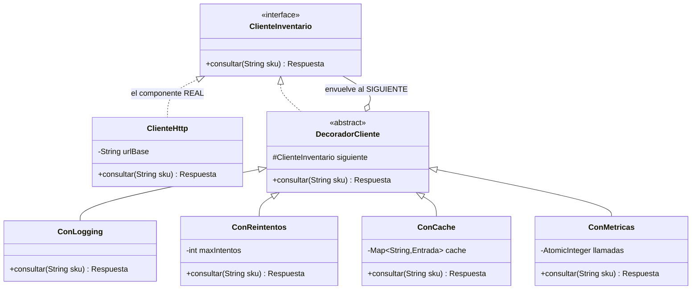
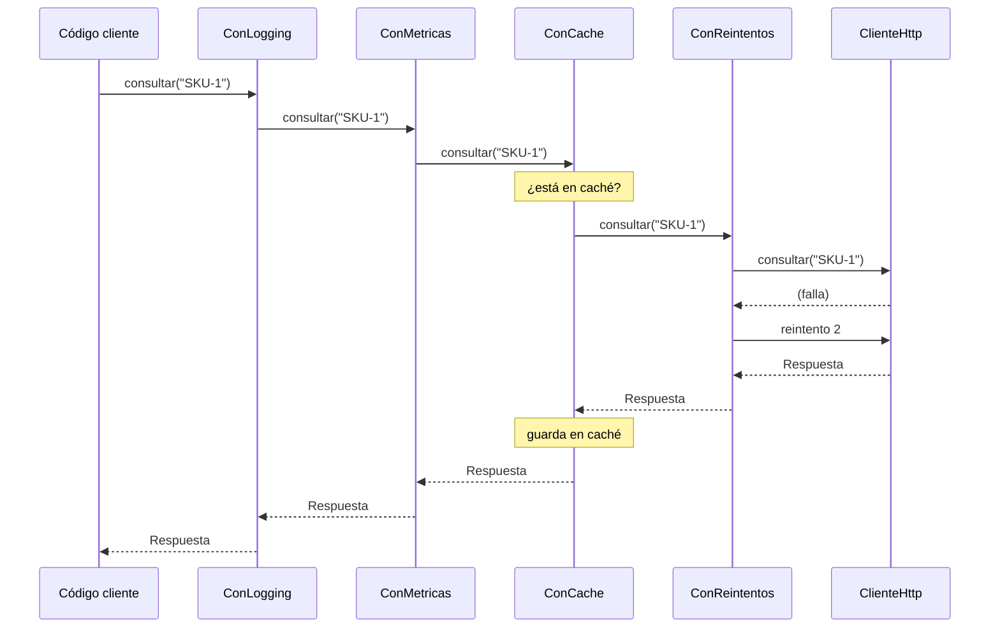

[← Volver al índice](README.md) · [← 09 Composite](09-composite.md) · [11 Facade →](11-facade.md)

# 10 · Decorator

> **Familia:** Estructural

---

## En una frase

**Envuelve un objeto en otro para agregarle comportamiento, sin tocar su código y sin
crear una subclase por cada combinación.**

Como ponerte ropa: la camisa no te modifica, te envuelve. Encima va el saco, encima el
abrigo. Cada capa agrega algo y por fuera sigues siendo tú.

---

## El enunciado

> **Ticket INF-701**
> El cliente HTTP que consulta el servicio de inventario funciona, pero producción pide
> ir agregándole cosas:
>
> - **Logging**: registrar cada llamada con su duración.
> - **Reintentos**: si falla, reintentar hasta 3 veces con espera.
> - **Caché**: no repetir la misma consulta en 60 segundos.
> - **Métricas**: contar llamadas y errores para el tablero.
> - **Circuit breaker**: si falla mucho, dejar de intentar por un rato.
>
> Y no todas las llamadas necesitan todo: la consulta de inventario quiere caché, pero
> la de creación de pedidos **no debe cachearse jamás**. Las llamadas críticas quieren
> reintentos, las de reportes no.
>
> **Necesito poder combinar estas capas a la carta, y en tiempo de ejecución.**

---

## El código que duele

### Intento 1: meter todo en la misma clase

```java
class ClienteInventario {
    Respuesta consultar(String sku) {
        var inicio = System.nanoTime();                    // métricas
        log.info("Consultando {}", sku);                   // logging
        if (cache.containsKey(sku)) return cache.get(sku); // caché
        if (circuitoAbierto) throw new ServicioCaidoException();
        for (int i = 0; i < 3; i++) {                      // reintentos
            try {
                var r = http.get("/inventario/" + sku);
                cache.put(sku, r);
                contador.incrementar();
                log.info("OK en {} ms", ...);
                return r;
            } catch (Exception e) { /* esperar y reintentar */ }
        }
        throw new RuntimeException();
    }
}
```

Cinco responsabilidades en un método. Imposible de probar por partes, imposible de
reutilizar el reintento en otro cliente, e imposible de apagar la caché sin comentar código.

### Intento 2: subclases

`ClienteConLog`, `ClienteConCache`, `ClienteConLogYCache`, `ClienteConLogYReintentos`,
`ClienteConLogYCacheYReintentos`... Con 5 capas opcionales son **2⁵ = 32 clases**.

---

## La idea del patrón

Cada capa es un objeto que **implementa la misma interfaz** y **contiene** al siguiente:

1. Interfaz común (`ClienteInventario`).
2. Un componente concreto que hace el trabajo real (`ClienteHttp`).
3. Una clase base decoradora que implementa la interfaz y guarda un `siguiente`.
4. Cada decorador hace **lo suyo** y llama a `siguiente.consultar(...)`.

Al final envuelves como una cebolla:

```java
new ConLog(new ConMetricas(new ConCache(new ConReintentos(new ClienteHttp()))));
```

> **Regla de oro:** la interfaz por fuera nunca cambia. Lo que cambia es cuántas capas
> hay adentro.

---

## El diagrama



Cómo viaja una llamada por las capas:



---

## La solución en Java 21

```java
import java.util.HashMap;
import java.util.Map;
import java.util.concurrent.atomic.AtomicInteger;

// ===============================================================
// LA INTERFAZ COMÚN
// ===============================================================
record Respuesta(String sku, int disponibles, String bodega) {}

interface ClienteInventario {
    Respuesta consultar(String sku);
}

// ===============================================================
// EL COMPONENTE REAL: hace el trabajo, no sabe nada de capas
// ===============================================================
final class ClienteHttp implements ClienteInventario {
    private int llamadasReales = 0;
    private final int fallarLasPrimeras;   // para simular inestabilidad

    ClienteHttp(int fallarLasPrimeras) { this.fallarLasPrimeras = fallarLasPrimeras; }

    @Override public Respuesta consultar(String sku) {
        llamadasReales++;
        System.out.println("        [HTTP] GET /inventario/" + sku);
        if (llamadasReales <= fallarLasPrimeras) {
            throw new RuntimeException("504 Gateway Timeout");
        }
        return new Respuesta(sku, 42, "BOG-01");
    }
    int llamadasReales() { return llamadasReales; }
}

// ===============================================================
// LA BASE DE LOS DECORADORES
// ===============================================================
abstract class DecoradorCliente implements ClienteInventario {
    protected final ClienteInventario siguiente;
    protected DecoradorCliente(ClienteInventario siguiente) { this.siguiente = siguiente; }
}

// ---------- Capa: logging ----------
final class ConLogging extends DecoradorCliente {
    ConLogging(ClienteInventario siguiente) { super(siguiente); }

    @Override public Respuesta consultar(String sku) {
        System.out.println("  [LOG] -> consultar(" + sku + ")");
        var inicio = System.nanoTime();
        try {
            var r = siguiente.consultar(sku);           // delega
            System.out.printf("  [LOG] <- OK en %.1f ms%n", (System.nanoTime()-inicio)/1e6);
            return r;
        } catch (RuntimeException e) {
            System.out.println("  [LOG] <- ERROR: " + e.getMessage());
            throw e;
        }
    }
}

// ---------- Capa: métricas ----------
final class ConMetricas extends DecoradorCliente {
    private final AtomicInteger exitos = new AtomicInteger();
    private final AtomicInteger errores = new AtomicInteger();

    ConMetricas(ClienteInventario siguiente) { super(siguiente); }

    @Override public Respuesta consultar(String sku) {
        try {
            var r = siguiente.consultar(sku);
            exitos.incrementAndGet();
            return r;
        } catch (RuntimeException e) {
            errores.incrementAndGet();
            throw e;
        }
    }
    String resumen() { return "éxitos=" + exitos.get() + " errores=" + errores.get(); }
}

// ---------- Capa: caché ----------
final class ConCache extends DecoradorCliente {
    private record Entrada(Respuesta respuesta, long expiraEn) {}
    private final Map<String, Entrada> cache = new HashMap<>();
    private final long ttlMillis;

    ConCache(ClienteInventario siguiente, long ttlMillis) {
        super(siguiente);
        this.ttlMillis = ttlMillis;
    }

    @Override public Respuesta consultar(String sku) {
        var entrada = cache.get(sku);
        if (entrada != null && System.currentTimeMillis() < entrada.expiraEn()) {
            System.out.println("      [CACHE] hit para " + sku);
            return entrada.respuesta();               // NO llama al siguiente
        }
        System.out.println("      [CACHE] miss para " + sku);
        var r = siguiente.consultar(sku);
        cache.put(sku, new Entrada(r, System.currentTimeMillis() + ttlMillis));
        return r;
    }
}

// ---------- Capa: reintentos ----------
final class ConReintentos extends DecoradorCliente {
    private final int maxIntentos;
    private final long esperaMillis;

    ConReintentos(ClienteInventario siguiente, int maxIntentos, long esperaMillis) {
        super(siguiente);
        this.maxIntentos = maxIntentos;
        this.esperaMillis = esperaMillis;
    }

    @Override public Respuesta consultar(String sku) {
        RuntimeException ultima = null;
        for (int intento = 1; intento <= maxIntentos; intento++) {
            try {
                return siguiente.consultar(sku);
            } catch (RuntimeException e) {
                ultima = e;
                System.out.println("       [RETRY] intento " + intento + " falló: " + e.getMessage());
                dormir(esperaMillis * intento);       // espera creciente
            }
        }
        throw new RuntimeException("Agotados " + maxIntentos + " intentos", ultima);
    }

    private void dormir(long ms) {
        try { Thread.sleep(ms); } catch (InterruptedException e) { Thread.currentThread().interrupt(); }
    }
}

public class Demo {
    public static void main(String[] args) {

        // ---------- Caso 1: consulta de inventario, con todas las capas ----------
        System.out.println("=== Consulta de inventario (log + métricas + caché + reintentos) ===");
        var http = new ClienteHttp(2);                 // las 2 primeras llamadas fallan
        var metricas = new ConMetricas(
                          new ConCache(
                            new ConReintentos(http, 3, 50), 60_000));
        ClienteInventario cliente = new ConLogging(metricas);

        System.out.println("\n-- primera consulta (llena la caché) --");
        System.out.println("  Resultado: " + cliente.consultar("SKU-1024"));

        System.out.println("\n-- segunda consulta del MISMO sku --");
        System.out.println("  Resultado: " + cliente.consultar("SKU-1024"));

        System.out.println("\n-- consulta de otro sku --");
        System.out.println("  Resultado: " + cliente.consultar("SKU-2048"));

        System.out.println("\n  Métricas: " + metricas.resumen());
        System.out.println("  Llamadas HTTP reales: " + http.llamadasReales());

        // ---------- Caso 2: creación de pedido, SIN caché ----------
        System.out.println("\n=== Otra composición: sin caché, solo log ===");
        ClienteInventario sinCache = new ConLogging(new ClienteHttp(0));
        sinCache.consultar("SKU-1024");
        sinCache.consultar("SKU-1024");   // dos llamadas HTTP reales, como debe ser
    }
}
```

### Salida (recortada)

```
=== Consulta de inventario (log + métricas + caché + reintentos) ===

-- primera consulta (llena la caché) --
  [LOG] -> consultar(SKU-1024)
      [CACHE] miss para SKU-1024
        [HTTP] GET /inventario/SKU-1024
       [RETRY] intento 1 falló: 504 Gateway Timeout
        [HTTP] GET /inventario/SKU-1024
       [RETRY] intento 2 falló: 504 Gateway Timeout
        [HTTP] GET /inventario/SKU-1024
  [LOG] <- OK en 153.2 ms
  Resultado: Respuesta[sku=SKU-1024, disponibles=42, bodega=BOG-01]

-- segunda consulta del MISMO sku --
  [LOG] -> consultar(SKU-1024)
      [CACHE] hit para SKU-1024
  [LOG] <- OK en 0.1 ms
  Resultado: Respuesta[sku=SKU-1024, disponibles=42, bodega=BOG-01]

  Métricas: éxitos=3 errores=0
  Llamadas HTTP reales: 4
```

---

## El orden de las capas IMPORTA (y mucho)

Las mismas cuatro capas, en distinto orden, se comportan distinto:

```java
// A) Caché por fuera de los reintentos  ✅ recomendado
new ConCache(new ConReintentos(http, 3, 50), 60_000)
// -> Si está en caché, ni siquiera entra a la lógica de reintentos.

// B) Reintentos por fuera de la caché   ⚠️ cuidado
new ConReintentos(new ConCache(http, 60_000), 3, 50)
// -> Cada reintento vuelve a consultar la caché. Si el error se cacheó, reintenta en vano.
```

Otra regla práctica: **el logging normalmente va afuera de todo**, para que registre el
tiempo total percibido por el usuario (incluidos los reintentos), no el de la última
llamada HTTP.

**Piensa las capas como una cebolla:** la primera que envuelves es la más interna
(la más cercana al trabajo real); la última que envuelves es la que ve el cliente.

---

## Versión funcional: Decorator con lambdas

Si la interfaz tiene un solo método, puedes decorar con funciones de orden superior:

```java
@FunctionalInterface
interface Consulta { Respuesta aplicar(String sku); }

static Consulta conLog(Consulta siguiente) {
    return sku -> {
        System.out.println("-> " + sku);
        var r = siguiente.aplicar(sku);
        System.out.println("<- " + r);
        return r;
    };
}

static Consulta conCache(Consulta siguiente) {
    var cache = new HashMap<String, Respuesta>();
    return sku -> cache.computeIfAbsent(sku, siguiente::aplicar);
}

// Composición:
Consulta cliente = conLog(conCache(http::consultar));
```

Es lo mismo con otra sintaxis. Úsalo cuando las capas son pequeñas y sin estado propio;
usa clases cuando cada capa tiene configuración, métricas o estado que quieres inspeccionar.

---

## Qué ganamos

| Antes | Después |
|---|---|
| Un método con 5 responsabilidades | 5 clases con 1 responsabilidad cada una |
| 32 subclases para todas las combinaciones | 5 decoradores que se combinan libremente |
| Apagar la caché = comentar código | Apagar la caché = no envolver con `ConCache` |
| Imposible reutilizar el reintento | `ConReintentos` sirve para cualquier `ClienteInventario` |
| Difícil de testear | Cada capa se prueba sola con un doble del siguiente |

---

## ✅ Cuándo usarlo

- Quieres agregar responsabilidades **opcionales y combinables** a un objeto.
- La herencia te llevaría a explosión combinatoria de subclases.
- Necesitas poder activar/desactivar capas **en tiempo de ejecución** o por configuración.
- Estás construyendo **middleware o pipelines**: HTTP, mensajería, procesamiento de datos.
- La clase original es `final` o de un tercero y no puedes heredarla.

## ⛔ Cuándo NO usarlo

- Solo hay **una** capa opcional y no van a llegar más → un `if` es más honesto.
- El orden de las capas es tan delicado que solo una combinación funciona. Ahí no tienes
  decoradores, tienes un algoritmo con pasos fijos → usa
  **[Template Method](23-template-method.md)**.
- Necesitas acceder a métodos concretos del objeto envuelto: los decoradores solo exponen
  la interfaz común, y a los tres niveles ya no sabes qué hay adentro.
- **Depurar es más difícil:** un stack trace con 5 decoradores es una escalera. Ponles
  nombres claros a las clases.
- Tu framework ya lo hace por ti: en Spring esto se resuelve con AOP (`@Cacheable`,
  `@Retryable`), y en Resilience4j con decoradores ya construidos.

---

## Se parece a...

| Patrón | Diferencia clave |
|---|---|
| **[Adapter](07-adapter.md)** | Adapter **cambia** la interfaz sin agregar comportamiento. Decorator **conserva** la interfaz y agrega comportamiento. |
| **[Proxy](13-proxy.md)** | Estructura casi idéntica. Proxy **controla el acceso** (permisos, carga diferida, ubicación remota) y normalmente decide él mismo a quién envuelve. Decorator **enriquece** y el cliente elige las capas. |
| **[Composite](09-composite.md)** | Composite envuelve **muchos** hijos; Decorator envuelve **uno**. Un Decorator es, técnicamente, un Composite de un solo hijo con comportamiento propio. |
| **[Chain of Responsibility](14-chain-of-responsibility.md)** | En una cadena, **un** manejador atiende y la cadena termina. En Decorator, **todos** participan en la misma llamada. |
| **[Strategy](22-strategy.md)** | Strategy cambia **las tripas** del objeto; Decorator cambia **la piel**. |

---

## Dónde ya lo has visto

- Todo `java.io`: `new BufferedReader(new InputStreamReader(new FileInputStream(f)))`.
  Es el ejemplo canónico de Decorator en el JDK.
- `Collections.unmodifiableList(lista)`, `synchronizedList(lista)`.
- `HttpClient` con interceptores; los filtros de un servlet.
- Resilience4j: `Decorators.ofSupplier(...).withRetry(...).withCircuitBreaker(...)`.
- En Spring, cualquier proxy AOP: `@Transactional`, `@Cacheable`, `@Async`.

---

➡️ Siguiente: **[11 · Facade](11-facade.md)**

[← Volver al índice](README.md)
