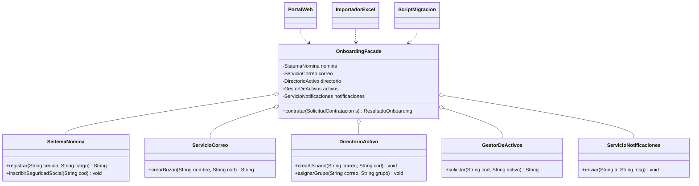

[← Volver al índice](README.md) · [← 10 Decorator](10-decorator.md) · [12 Flyweight →](12-flyweight.md)

# 11 · Facade

> **Familia:** Estructural

---

## En una frase

**Una puerta de entrada simple a un sistema complicado.**

Como cuando llamas al call center del banco: por dentro hay veinte sistemas, pero tú
hablas con una sola persona y le dices *"bloquéame la tarjeta"*.

---

## El enunciado

> **Ticket RH-330**
> Contratar a un empleado nuevo hoy exige que el analista de Recursos Humanos ejecute,
> **en orden y sin equivocarse**, siete pasos en cinco sistemas distintos:
>
> 1. Crear el registro en el sistema de **nómina** (y obtener el código de empleado).
> 2. Crear la **cuenta de correo** corporativa.
> 3. Crear el usuario en el **directorio activo** y asignarle grupos según el cargo.
> 4. Solicitar los **activos** (portátil, monitor, celular) según el perfil.
> 5. Inscribirlo en **seguridad social**.
> 6. Agendarle la **inducción**.
> 7. Notificar al **jefe directo** y al equipo.
>
> El orden importa: sin el código de empleado no se puede crear el correo, y sin el
> correo no se puede crear el usuario del directorio.
>
> Este proceso está copiado en tres lugares: el portal web, el importador masivo de
> Excel y un script de migración. **Y los tres están ligeramente desincronizados.**

---

## El código que duele

```java
// En el controlador del portal web:
var nomina = new SistemaNomina(url, user, pass);
var codigoEmpleado = nomina.registrar(cedula, nombre, cargo, salario, fechaIngreso);
var correoSvc = new ServicioCorreo(tenantId, apiKey);
var correo = correoSvc.crearBuzon(nombre.split(" ")[0], nombre.split(" ")[1], codigoEmpleado);
var ad = new DirectorioActivo(ldapUrl);
ad.crearUsuario(correo, codigoEmpleado);
ad.asignarGrupo(correo, cargo.equals("DEV") ? "GRP_DESARROLLO" : "GRP_GENERAL");
var activos = new GestorDeActivos();
if (cargo.equals("DEV")) { activos.solicitar(codigoEmpleado, "PORTATIL_16GB"); ... }
// ... 40 líneas más, repetidas en el importador y en el script
```

Tres copias del mismo proceso, cada una con su propio conjunto de bugs. Y el portal web
tiene que conocer las credenciales, el orden y los detalles de cinco sistemas.

---

## La idea del patrón

Pon **una clase con un método** que orqueste todo:

1. La fachada conoce los subsistemas y el orden correcto.
2. El cliente le pide **una sola cosa**, en el lenguaje del negocio: `contratar(...)`.
3. Los subsistemas **siguen existiendo y siguen siendo accesibles**: la fachada no los
   oculta a la fuerza, solo ofrece el camino cómodo para el 90% de los casos.

> **Regla de oro:** la fachada no agrega funcionalidad nueva. Solo agrupa y ordena.

---

## El diagrama



Antes: cada cliente con cinco flechas a cinco subsistemas.
Después: cada cliente con **una** flecha.

---

## La solución en Java 21

```java
import java.time.LocalDate;
import java.util.ArrayList;
import java.util.List;

// ===============================================================
// LOS SUBSISTEMAS: complejos, cada uno con su propia jerga
// ===============================================================
final class SistemaNomina {
    String registrar(String cedula, String nombre, String cargo, double salario, LocalDate ingreso) {
        var codigo = "EMP-" + Math.abs(cedula.hashCode() % 10000);
        System.out.println("  [NÓMINA] Registro creado: " + codigo + " (" + cargo + ")");
        return codigo;
    }
    void inscribirSeguridadSocial(String codigo, String eps, String fondoPension) {
        System.out.println("  [NÓMINA] Seguridad social: EPS=" + eps + " AFP=" + fondoPension);
    }
}

final class ServicioCorreo {
    String crearBuzon(String nombreCompleto, String codigoEmpleado) {
        var partes = nombreCompleto.toLowerCase().split(" ");
        var alias = partes[0] + "." + partes[partes.length - 1];
        var correo = alias + "@empresa.com";
        System.out.println("  [CORREO] Buzón creado: " + correo + " (5 GB)");
        return correo;
    }
    void enviarBienvenida(String correo) {
        System.out.println("  [CORREO] Mensaje de bienvenida enviado a " + correo);
    }
}

final class DirectorioActivo {
    void crearUsuario(String correo, String codigoEmpleado) {
        System.out.println("  [AD] Usuario creado: CN=" + correo + ",OU=Empleados");
    }
    void asignarGrupo(String correo, String grupo) {
        System.out.println("  [AD] " + correo + " agregado a " + grupo);
    }
}

final class GestorDeActivos {
    String solicitar(String codigoEmpleado, String activo) {
        var ticket = "ACT-" + (int)(Math.random() * 9000 + 1000);
        System.out.println("  [ACTIVOS] Solicitud " + ticket + ": " + activo);
        return ticket;
    }
}

final class ServicioNotificaciones {
    void enviar(String destinatario, String mensaje) {
        System.out.println("  [NOTIF] a " + destinatario + ": " + mensaje);
    }
}

final class Calendario {
    void agendar(String correo, String evento, LocalDate fecha) {
        System.out.println("  [CALENDARIO] " + evento + " el " + fecha + " para " + correo);
    }
}

// ===============================================================
// LOS DATOS DE ENTRADA Y SALIDA (lenguaje del negocio)
// ===============================================================
enum Cargo {
    DESARROLLADOR("GRP_DESARROLLO", List.of("PORTATIL_32GB", "MONITOR_27", "LICENCIA_IDE")),
    COMERCIAL    ("GRP_VENTAS",     List.of("PORTATIL_16GB", "CELULAR", "LICENCIA_CRM")),
    ADMINISTRATIVO("GRP_GENERAL",   List.of("PORTATIL_8GB", "MONITOR_24"));

    final String grupoAd;
    final List<String> activos;
    Cargo(String grupoAd, List<String> activos) { this.grupoAd = grupoAd; this.activos = activos; }
}

record SolicitudContratacion(String cedula, String nombreCompleto, Cargo cargo,
                             double salario, LocalDate fechaIngreso,
                             String correoJefe, String eps, String fondoPension) {}

record ResultadoOnboarding(String codigoEmpleado, String correoCorporativo,
                           List<String> ticketsActivos, LocalDate fechaInduccion) {}

// ===============================================================
// LA FACHADA
// ===============================================================
final class OnboardingFacade {
    private final SistemaNomina nomina;
    private final ServicioCorreo correo;
    private final DirectorioActivo directorio;
    private final GestorDeActivos activos;
    private final ServicioNotificaciones notificaciones;
    private final Calendario calendario;

    OnboardingFacade(SistemaNomina nomina, ServicioCorreo correo, DirectorioActivo directorio,
                     GestorDeActivos activos, ServicioNotificaciones notificaciones,
                     Calendario calendario) {
        this.nomina = nomina;
        this.correo = correo;
        this.directorio = directorio;
        this.activos = activos;
        this.notificaciones = notificaciones;
        this.calendario = calendario;
    }

    /** Un solo método. El orden correcto vive AQUÍ y en ningún otro lado. */
    ResultadoOnboarding contratar(SolicitudContratacion s) {
        System.out.println("Contratando a " + s.nombreCompleto() + " (" + s.cargo() + ")");

        // 1. Nómina primero: de aquí sale el código de empleado
        var codigo = nomina.registrar(s.cedula(), s.nombreCompleto(),
                                      s.cargo().name(), s.salario(), s.fechaIngreso());

        // 2. Correo (necesita el código)
        var correoCorporativo = correo.crearBuzon(s.nombreCompleto(), codigo);

        // 3. Directorio activo (necesita el correo)
        directorio.crearUsuario(correoCorporativo, codigo);
        directorio.asignarGrupo(correoCorporativo, s.cargo().grupoAd);

        // 4. Activos según el cargo
        var tickets = new ArrayList<String>();
        s.cargo().activos.forEach(a -> tickets.add(activos.solicitar(codigo, a)));

        // 5. Seguridad social
        nomina.inscribirSeguridadSocial(codigo, s.eps(), s.fondoPension());

        // 6. Inducción: el primer lunes desde el ingreso
        var induccion = s.fechaIngreso().plusDays(
                (8 - s.fechaIngreso().getDayOfWeek().getValue()) % 7);
        calendario.agendar(correoCorporativo, "Inducción corporativa", induccion);

        // 7. Notificaciones
        correo.enviarBienvenida(correoCorporativo);
        notificaciones.enviar(s.correoJefe(),
                s.nombreCompleto() + " se une a tu equipo el " + s.fechaIngreso()
                + ". Su correo es " + correoCorporativo + ".");

        System.out.println("Contratación completa.\n");
        return new ResultadoOnboarding(codigo, correoCorporativo, List.copyOf(tickets), induccion);
    }
}

// ===============================================================
// LOS CLIENTES: cada uno con UNA línea
// ===============================================================
public class Demo {
    public static void main(String[] args) {
        var facade = new OnboardingFacade(
                new SistemaNomina(), new ServicioCorreo(), new DirectorioActivo(),
                new GestorDeActivos(), new ServicioNotificaciones(), new Calendario());

        // Cliente 1: el portal web
        var resultado = facade.contratar(new SolicitudContratacion(
                "1020304050", "Ana María Restrepo", Cargo.DESARROLLADOR,
                9_500_000, LocalDate.of(2026, 9, 1),
                "lider.tech@empresa.com", "Sura", "Protección"));
        System.out.println("Portal web recibió: " + resultado + "\n");

        // Cliente 2: el importador masivo. MISMA llamada, en un bucle.
        System.out.println("=== Importación masiva desde Excel ===");
        List.of(
            new SolicitudContratacion("1122334455", "Carlos Prieto", Cargo.COMERCIAL,
                6_200_000, LocalDate.of(2026, 9, 1), "lider.ventas@empresa.com", "Sanitas", "Porvenir"),
            new SolicitudContratacion("9988776655", "Lucía Ortega", Cargo.ADMINISTRATIVO,
                4_100_000, LocalDate.of(2026, 9, 8), "lider.admin@empresa.com", "Sura", "Colfondos")
        ).forEach(facade::contratar);
    }
}
```

### Salida (recortada)

```
Contratando a Ana María Restrepo (DESARROLLADOR)
  [NÓMINA] Registro creado: EMP-3721 (DESARROLLADOR)
  [CORREO] Buzón creado: ana.restrepo@empresa.com (5 GB)
  [AD] Usuario creado: CN=ana.restrepo@empresa.com,OU=Empleados
  [AD] ana.restrepo@empresa.com agregado a GRP_DESARROLLO
  [ACTIVOS] Solicitud ACT-4821: PORTATIL_32GB
  [ACTIVOS] Solicitud ACT-7233: MONITOR_27
  [ACTIVOS] Solicitud ACT-1902: LICENCIA_IDE
  [NÓMINA] Seguridad social: EPS=Sura AFP=Protección
  [CALENDARIO] Inducción corporativa el 2026-09-07 para ana.restrepo@empresa.com
  [CORREO] Mensaje de bienvenida enviado a ana.restrepo@empresa.com
  [NOTIF] a lider.tech@empresa.com: Ana María Restrepo se une a tu equipo el 2026-09-01...
Contratación completa.
```

---

## Lo que una fachada NO debe hacer

Esta es la parte donde el patrón se degrada en la vida real. Ojo con esto:

| ❌ Antipatrón | Por qué está mal |
|---|---|
| **Fachada Dios**: 40 métodos, uno por cada cosa que hace la empresa | Deja de ser una fachada y se vuelve un cuello de botella. Haz varias fachadas por caso de uso. |
| **Fachada con lógica de negocio propia** | Si calcula impuestos o valida reglas, ya no está orquestando: está haciendo. Esa lógica va en el dominio. |
| **Fachada que solo delega 1:1** | `facade.registrar(x)` que solo llama a `nomina.registrar(x)` no aporta nada. Es ruido. |
| **Fachada que oculta a la fuerza los subsistemas** | Si un caso avanzado necesita el subsistema directo, debe poder llegar a él. La fachada es la puerta cómoda, no la única puerta. |

---

## Facade vs. las capas que ya conoces

Muchos ya escriben fachadas sin saberlo:

- Un **`@Service` de Spring** que orquesta 3 repositorios y 2 clientes HTTP **es una fachada**.
- Un **caso de uso** en arquitectura limpia (`ContratarEmpleadoUseCase`) es una fachada
  con un nombre mejor.
- Un **BFF** (Backend For Frontend) es una fachada a escala de servicios.

La versión más limpia del patrón es **una fachada por caso de uso**, no una fachada por
sistema. `OnboardingFacade` con un método es mejor que `RecursosHumanosFacade` con veinte.

---

## Qué ganamos

| Antes | Después |
|---|---|
| 3 copias del proceso, desincronizadas | 1 proceso, 3 clientes que lo llaman |
| El portal web conoce 5 sistemas y sus credenciales | Conoce 1 clase |
| Cambiar de proveedor de correo = tocar 3 archivos | Tocar 1 método de la fachada |
| Imposible saber cuál es "el proceso oficial" | El proceso oficial es el código de la fachada |

---

## ✅ Cuándo usarlo

- Un caso de uso involucra **varios subsistemas en un orden concreto**.
- El mismo flujo está copiado en varios clientes.
- Quieres reducir el acoplamiento entre las capas altas y las de infraestructura.
- Estás envolviendo un sistema legacy horrible y quieres que el resto del código no lo sufra.
- Quieres un punto único para poner transacciones, trazas o auditoría del caso de uso.

## ⛔ Cuándo NO usarlo

- El subsistema ya es simple: una fachada sobre una sola clase es una capa inútil.
- Solo hay un cliente y no va a haber más.
- La fachada terminaría con lógica de negocio → eso pertenece al dominio.
- Vas a necesitar el 80% de los métodos del subsistema de todas formas: la fachada
  terminará replicándolo todo.

---

## Se parece a...

| Patrón | Diferencia clave |
|---|---|
| **[Adapter](07-adapter.md)** | Adapter hace que **una** clase encaje en una interfaz **que ya existía**. Facade inventa una interfaz **nueva y más simple** sobre **varias** clases. |
| **[Mediator](18-mediator.md)** | Mediator coordina objetos que **se comunican entre sí** (bidireccional). Facade solo llama hacia abajo: los subsistemas no conocen la fachada. |
| **[Proxy](13-proxy.md)** | Proxy tiene **la misma interfaz** que el objeto que representa. Facade tiene una interfaz distinta y más simple. |
| **[Abstract Factory](04-abstract-factory.md)** | Puede usarse como fachada para crear objetos, pero su intención es crear familias. |
| **[Singleton](02-singleton.md)** | Las fachadas suelen ser únicas, pero eso es incidental, no parte del patrón. |

---

## Dónde ya lo has visto

- `javax.faces`, `java.net.URL` (que por dentro maneja sockets, DNS, protocolos...).
- `JdbcTemplate` de Spring: esconde `Connection`, `Statement`, `ResultSet` y el cierre.
- `SLF4J`: `LoggerFactory.getLogger(...)` sobre toda la configuración del backend.
- Cualquier SDK: `S3Client.putObject(...)` esconde firmas, reintentos, multipart, etc.

---

➡️ Siguiente: **[12 · Flyweight](12-flyweight.md)**

[← Volver al índice](README.md)
