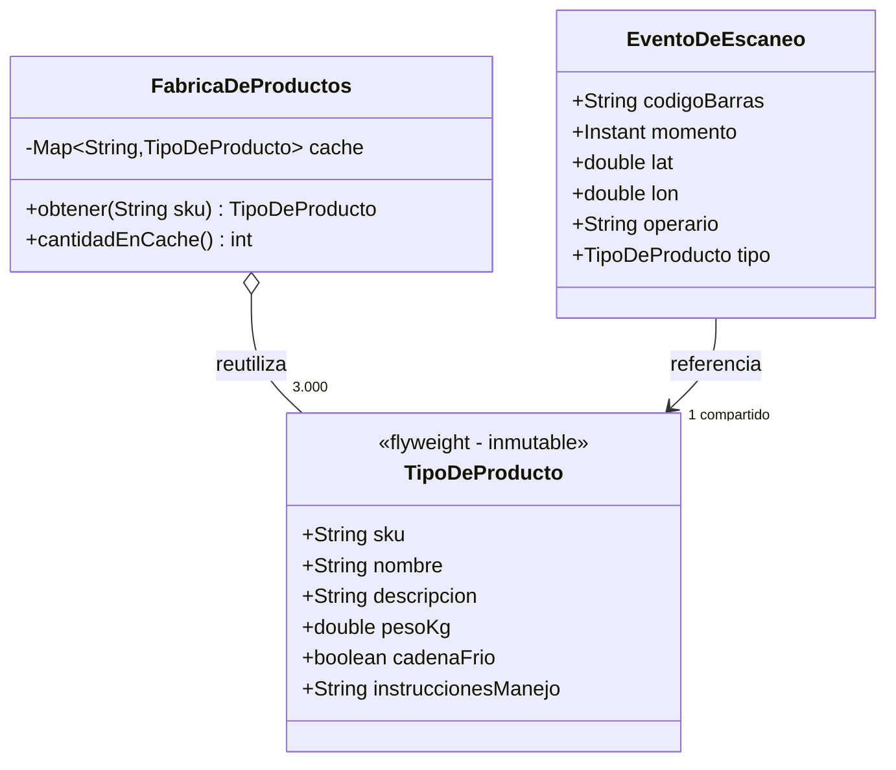
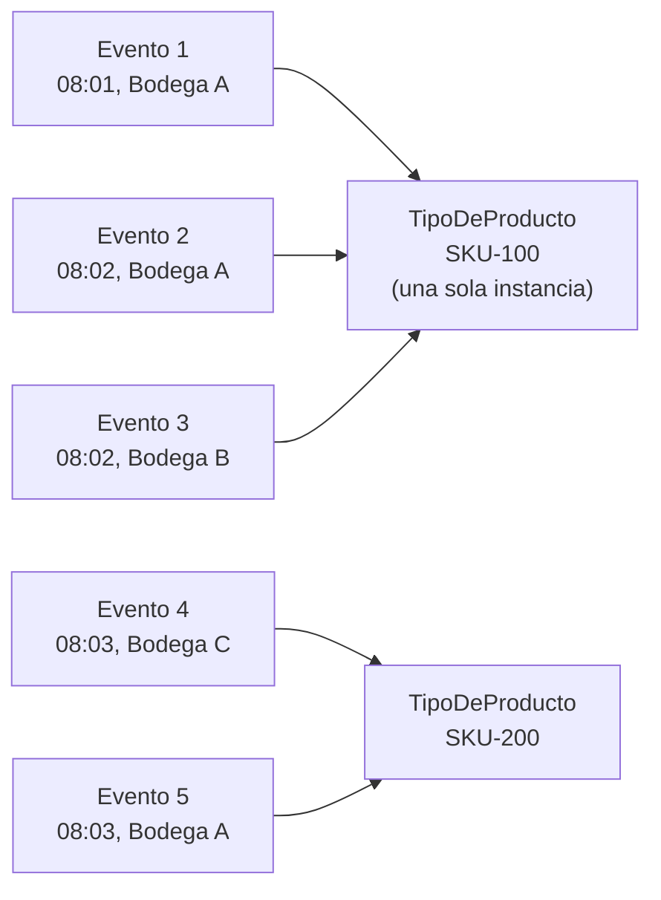

[← Volver al índice](README.md) · [← 11 Facade](11-facade.md) · [13 Proxy →](13-proxy.md)

# 12 · Flyweight

> **Familia:** Estructural

---

## En una frase

**Comparte una sola copia de lo que se repite, en vez de duplicarlo en memoria un millón
de veces.**

Como una imprenta de tipos móviles: no fabricas una letra "a" nueva para cada "a" del
libro. Tienes una pieza "a" y la reutilizas en todas las posiciones.

---

## El enunciado

> **Ticket LOG-940**
> El sistema de trazabilidad de la operación logística procesa **2 millones de eventos
> de escaneo por día**. Cada evento guarda:
>
> - Datos que **cambian** en cada evento: código de barras, timestamp, latitud, longitud,
>   id del operario.
> - Datos que **se repiten muchísimo**: el tipo de producto (SKU, nombre, descripción,
>   dimensiones, peso, categoría, si requiere cadena de frío, texto de manejo especial...).
>
> El catálogo tiene solo **3.000 SKU distintos**, pero como cada evento carga su propia
> copia de la información del producto, el proceso se cae con `OutOfMemoryError` a las
> tres horas.
>
> **Necesitamos procesar el día completo en memoria sin reventar el heap.**

---

## El código que duele

```java
record EventoDeEscaneo(
    String codigoBarras, Instant momento, double lat, double lon, String operario,
    // Y esto, repetido 2 millones de veces para solo 3.000 productos distintos:
    String sku, String nombreProducto, String descripcion, String categoria,
    double pesoKg, double altoCm, double anchoCm, double largoCm,
    boolean cadenaFrio, String instruccionesManejo
) {}

// 2.000.000 de objetos, cada uno con ~600 bytes de texto duplicado = ~1.2 GB solo de basura
```

---

## La idea del patrón

Parte el objeto en dos:

| Parte | Nombre técnico | Ejemplo | ¿Se comparte? |
|---|---|---|---|
| Lo que **se repite** | Estado **intrínseco** | Tipo de producto | ✅ Sí, una sola instancia |
| Lo que es **único** de cada uso | Estado **extrínseco** | Momento, ubicación, operario | ❌ No, va en cada evento |

Y agregas una **fábrica de flyweights** que garantiza que si pides el mismo SKU dos veces,
te devuelve **el mismo objeto**, no una copia.

> **Regla de oro:** el flyweight tiene que ser **inmutable**. Si lo compartes y alguien
> lo modifica, se lo modificas a todos.

---

## El diagrama



La imagen mental:



Cinco eventos, dos objetos de producto. Escálalo a 2.000.000 y 3.000.

---

## La solución en Java 21

```java
import java.time.Instant;
import java.util.HashMap;
import java.util.Map;
import java.util.concurrent.ConcurrentHashMap;

// ===============================================================
// EL FLYWEIGHT: estado INTRÍNSECO, compartido e inmutable
// ===============================================================
record TipoDeProducto(
        String sku, String nombre, String descripcion, String categoria,
        double pesoKg, double altoCm, double anchoCm, double largoCm,
        boolean cadenaFrio, String instruccionesManejo) {

    double volumenM3() { return (altoCm * anchoCm * largoCm) / 1_000_000; }

    /** Aproximación del peso en memoria de este objeto (para la demo). */
    int bytesAproximados() {
        return 2 * (sku.length() + nombre.length() + descripcion.length()
                  + categoria.length() + instruccionesManejo.length()) + 64;
    }
}

// ===============================================================
// LA FÁBRICA DE FLYWEIGHTS: garantiza una instancia por SKU
// ===============================================================
final class CatalogoDeProductos {
    // ConcurrentHashMap: seguro si varios hilos procesan eventos a la vez
    private final Map<String, TipoDeProducto> cache = new ConcurrentHashMap<>();
    private int construcciones = 0;

    /**
     * Si el SKU ya existe devuelve LA MISMA instancia.
     * Si no, la crea una vez y la guarda.
     */
    TipoDeProducto obtener(String sku) {
        return cache.computeIfAbsent(sku, s -> {
            construcciones++;
            return cargarDesdeBaseDeDatos(s);
        });
    }

    private TipoDeProducto cargarDesdeBaseDeDatos(String sku) {
        // Simula la consulta al maestro de productos (cara: I/O)
        var frio = sku.hashCode() % 5 == 0;
        return new TipoDeProducto(
            sku,
            "Producto " + sku,
            "Descripción comercial detallada del producto " + sku
                + ", con especificaciones técnicas, composición y garantía extendida.",
            frio ? "REFRIGERADOS" : "SECOS",
            1.5 + (Math.abs(sku.hashCode()) % 50) / 10.0,
            20, 15, 10,
            frio,
            frio ? "Mantener entre 2°C y 8°C. No exponer a la luz solar directa."
                 : "Apilar máximo 6 cajas. Proteger de la humedad."
        );
    }

    int skusDistintos() { return cache.size(); }
    int construcciones() { return construcciones; }
    long bytesDelCatalogo() {
        return cache.values().stream().mapToInt(TipoDeProducto::bytesAproximados).sum();
    }
}

// ===============================================================
// EL OBJETO LIGERO: estado EXTRÍNSECO + referencia al flyweight
// ===============================================================
record EventoDeEscaneo(
        String codigoBarras, Instant momento, double lat, double lon,
        String operario, String bodega,
        TipoDeProducto tipo) {          // <- referencia compartida, no copia

    String resumen() {
        return "%s | %s | %s | %s | %.1f kg%s"
            .formatted(momento, bodega, tipo.sku(), tipo.nombre(), tipo.pesoKg(),
                       tipo.cadenaFrio() ? " ❄" : "");
    }
}

public class Demo {
    public static void main(String[] args) {
        var catalogo = new CatalogoDeProductos();
        final int TOTAL_EVENTOS = 2_000_000;
        final int SKUS_DISTINTOS = 3_000;

        System.out.println("Procesando " + String.format("%,d", TOTAL_EVENTOS)
            + " eventos sobre " + String.format("%,d", SKUS_DISTINTOS) + " SKU distintos...\n");

        var muestra = new java.util.ArrayList<EventoDeEscaneo>();
        var inicio = System.currentTimeMillis();

        for (int i = 0; i < TOTAL_EVENTOS; i++) {
            var sku = "SKU-" + (i % SKUS_DISTINTOS);
            var evento = new EventoDeEscaneo(
                    "BC-" + i,
                    Instant.now(),
                    4.6 + (i % 100) / 1000.0,
                    -74.0 - (i % 100) / 1000.0,
                    "OP-" + (i % 40),
                    "BODEGA-" + (char)('A' + i % 5),
                    catalogo.obtener(sku)          // <- aquí ocurre la magia
            );
            if (i < 5) muestra.add(evento);
            // en producción: evento se procesa y se descarta
        }

        var ms = System.currentTimeMillis() - inicio;

        System.out.println("=== Primeros eventos ===");
        muestra.forEach(e -> System.out.println("  " + e.resumen()));

        System.out.println("\n=== Verificación de compartición ===");
        var a = catalogo.obtener("SKU-0");
        var b = catalogo.obtener("SKU-0");
        System.out.println("  ¿obtener('SKU-0') dos veces da el MISMO objeto? " + (a == b));

        System.out.println("\n=== Memoria ===");
        var bytesCompartido = catalogo.bytesDelCatalogo();
        var bytesSinPatron  = (long) catalogo.bytesDelCatalogo() / SKUS_DISTINTOS * TOTAL_EVENTOS;
        System.out.printf("  SKU distintos en caché : %,d%n", catalogo.skusDistintos());
        System.out.printf("  Objetos construidos    : %,d  (no %,d)%n",
                catalogo.construcciones(), TOTAL_EVENTOS);
        System.out.printf("  CON Flyweight          : ~%,.1f MB%n", bytesCompartido / 1024.0 / 1024);
        System.out.printf("  SIN Flyweight          : ~%,.1f MB%n", bytesSinPatron / 1024.0 / 1024);
        System.out.printf("  Ahorro                 : %.0f%%%n",
                100.0 * (1 - (double) bytesCompartido / bytesSinPatron));
        System.out.printf("  Tiempo total           : %,d ms%n", ms);
    }
}
```

### Salida (aproximada)

```
Procesando 2,000,000 eventos sobre 3,000 SKU distintos...

=== Primeros eventos ===
  2026-08-14T15:03:11Z | BODEGA-A | SKU-0 | Producto SKU-0 | 1.5 kg
  2026-08-14T15:03:11Z | BODEGA-B | SKU-1 | Producto SKU-1 | 4.3 kg
  ...

=== Verificación de compartición ===
  ¿obtener('SKU-0') dos veces da el MISMO objeto? true

=== Memoria ===
  SKU distintos en caché : 3,000
  Objetos construidos    : 3,000  (no 2,000,000)
  CON Flyweight          : ~1.3 MB
  SIN Flyweight          : ~881.2 MB
  Ahorro                 : 100%
  Tiempo total           : 419 ms
```

Y lo más importante: **el maestro de productos se consultó 3.000 veces, no 2 millones.**

---

## La regla que no puedes romper: inmutabilidad

```java
// ❌ Si el flyweight fuera mutable, esto sería una catástrofe:
var producto = catalogo.obtener("SKU-100");
producto.setPesoKg(999);      // acabas de cambiarle el peso a 666 eventos distintos
```

Por eso el ejemplo usa `record`: campos `final`, sin setters. **Un flyweight mutable no
es un flyweight, es un bug compartido.**

Si necesitas variar algo, esa parte **es estado extrínseco** y va en el objeto ligero.

---

## Cómo dividir intrínseco vs. extrínseco

Hazte esta pregunta por cada campo:

> **"¿Este dato es el mismo para todos los objetos que comparten la misma clave?"**

- **Sí** → intrínseco → va en el flyweight compartido.
- **No** → extrínseco → va en el objeto que lo usa, o se pasa como parámetro.

| Campo | ¿Igual para todos los eventos del mismo SKU? | Dónde va |
|---|---|---|
| Nombre del producto | Sí | Flyweight |
| Peso, dimensiones | Sí | Flyweight |
| Instrucciones de manejo | Sí | Flyweight |
| Timestamp | No | Evento |
| Latitud / longitud | No | Evento |
| Operario | No | Evento |

---

## Cuidado con la caché que nunca se vacía

Un `Map` estático que solo crece es una **fuga de memoria elegante**. Si las claves son
ilimitadas (por ejemplo, IDs de sesión), usa:

```java
// Opción 1: referencias débiles, el GC puede liberar lo que nadie usa
private final Map<String, TipoDeProducto> cache = new WeakHashMap<>();

// Opción 2: caché con límite y expiración (Caffeine, Guava)
Cache<String, TipoDeProducto> cache = Caffeine.newBuilder()
        .maximumSize(10_000)
        .expireAfterAccess(Duration.ofMinutes(30))
        .build();
```

El Flyweight clásico asume un **conjunto acotado y conocido** de valores intrínsecos
(3.000 SKU, 200 países, 50 tipos de documento). Si no está acotado, necesitas una caché
de verdad, con política de desalojo.

---

## ✅ Cuándo usarlo

- Tienes **muchísimas instancias** (cientos de miles, millones) de objetos parecidos.
- La mayoría del estado de esos objetos **se repite**.
- El estado repetido puede hacerse **inmutable**.
- La identidad de cada objeto individual no importa (`==` entre dos eventos del mismo SKU
  no debería significar nada especial).
- El costo de memoria es un problema **medido**, no imaginado.

## ⛔ Cuándo NO usarlo

- **No tienes un problema de memoria.** Este es el patrón más fácil de aplicar sin
  necesidad. Perfila primero, optimiza después.
- Los objetos son pocos (miles, no millones).
- El estado no se puede hacer inmutable.
- El conjunto de claves es ilimitado: la "caché" se vuelve la fuga de memoria que
  querías evitar.
- Estás cambiando legibilidad por microoptimización. El código con Flyweight es más
  indirecto: que valga la pena.

---

## Se parece a...

| Patrón | Diferencia clave |
|---|---|
| **[Singleton](02-singleton.md)** | Singleton = exactamente **una** instancia de una clase. Flyweight = **N instancias compartidas**, una por cada valor distinto. |
| **[Prototype](06-prototype.md)** | Lo opuesto: Prototype **duplica**, Flyweight **comparte**. |
| **[Composite](09-composite.md)** | Se combinan: en un árbol grande, las hojas suelen ser flyweights compartidos. |
| **[Facade](11-facade.md)** | La fábrica de flyweights actúa como fachada del catálogo, pero su intención es reutilizar, no simplificar. |
| **[Proxy](13-proxy.md)** | Un proxy con caché parece Flyweight, pero cachea *resultados de operaciones*, no *objetos de valor compartidos*. |

---

## Dónde ya lo has visto

Java lo usa por todos lados, y ni te has dado cuenta:

- **Pool de String**: `"hola" == "hola"` es `true` porque los literales se comparten.
- **Caché de `Integer`**: `Integer.valueOf(127) == Integer.valueOf(127)` es `true`
  (los valores de −128 a 127 están precacheados); con 128 ya da `false`. Este es el
  origen del clásico bug de comparar `Integer` con `==`.
- `Boolean.TRUE`, `Boolean.FALSE`.
- `Character.valueOf(c)` para caracteres ASCII.
- En juegos y mapas: texturas, tiles y sprites compartidos entre miles de entidades.

```java
System.out.println(Integer.valueOf(127) == Integer.valueOf(127)); // true  (flyweight)
System.out.println(Integer.valueOf(128) == Integer.valueOf(128)); // false (fuera de caché)
```

---

➡️ Siguiente: **[13 · Proxy](13-proxy.md)**

[← Volver al índice](README.md)
