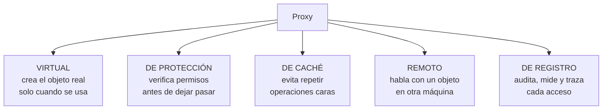
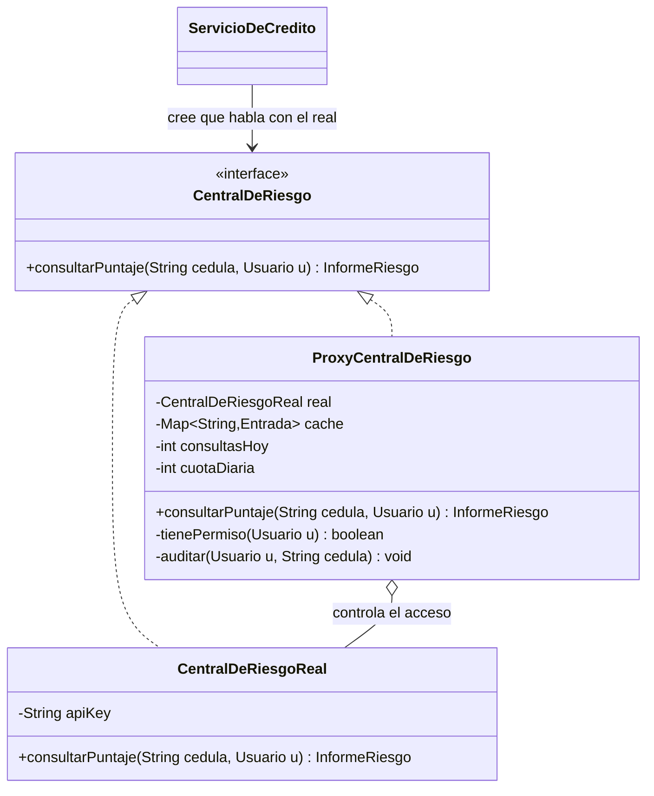
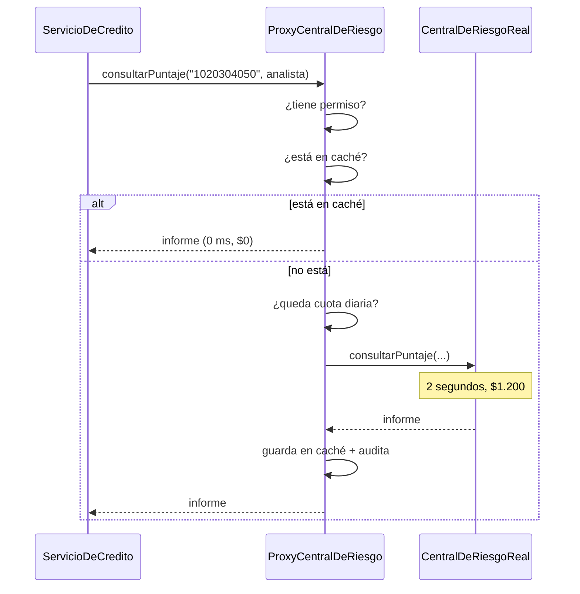

[← Volver al índice](README.md) · [← 12 Flyweight](12-flyweight.md) · [14 Chain of Responsibility →](14-chain-of-responsibility.md)

# 13 · Proxy

> **Familia:** Estructural

---

## En una frase

**Un objeto que se hace pasar por otro para controlar cómo y cuándo se llega a él.**

Como la secretaria de un directivo: tú marcas al mismo número, pero ella decide si te
pasa la llamada, si te agenda para después, o si ella misma te da la respuesta porque ya
la sabe.

---

## El enunciado

> **Ticket RIE-1150**
> El sistema de originación de crédito consulta la **central de riesgo** para obtener el
> puntaje del solicitante. La consulta:
>
> - **Cuesta dinero:** $1.200 pesos por consulta, facturados al cierre de mes.
> - **Es lenta:** entre 1,5 y 3 segundos.
> - **Tiene cuota:** máximo 5.000 consultas diarias; pasado eso, el proveedor bloquea.
> - **Es regulada:** solo perfiles autorizados pueden consultarla, y **toda** consulta
>   debe quedar auditada con usuario, cédula y momento.
>
> Auditoría detectó que la misma cédula se consulta hasta 6 veces en un mismo flujo
> (validación inicial, cálculo de cupo, comité, desembolso...). Estamos pagando 6 veces
> por el mismo dato del mismo día.
>
> **No quiero tocar el código que ya usa `CentralDeRiesgo`. Son 25 sitios.**

---

## El código que duele

```java
class ServicioDeCredito {
    void evaluar(String cedula, Usuario usuario) {
        // ¿Tiene permiso? ¿Ya lo consultamos hoy? ¿Queda cuota? ¿Quedó auditado?
        // Todo eso se repite (o se OLVIDA) en cada uno de los 25 sitios.
        var puntaje = centralDeRiesgo.consultarPuntaje(cedula);   // $1.200, 2 segundos
        ...
    }
}
```

---

## La idea del patrón

Crea una clase que **implementa exactamente la misma interfaz** que el objeto real y lo
contiene por dentro. El cliente no nota el cambio, pero ahora hay alguien en el medio que
puede:

- **Verificar permisos** antes de dejar pasar (proxy de protección).
- **Devolver un resultado cacheado** sin llamar al real (proxy de caché).
- **Crear el objeto real solo cuando de verdad se necesite** (proxy virtual / carga diferida).
- **Registrar auditoría** de cada acceso (proxy de registro).
- **Hablar con un objeto remoto** como si fuera local (proxy remoto).

> **Regla de oro:** misma interfaz, distinto control de acceso.

---

## Los 5 tipos de Proxy



En la vida real casi siempre se combinan varios, como en el ejemplo de abajo.

---

## El diagrama



Flujo de una consulta:



---

## La solución en Java 21

```java
import java.time.Duration;
import java.time.LocalDate;
import java.time.LocalDateTime;
import java.util.ArrayList;
import java.util.HashMap;
import java.util.List;
import java.util.Map;

// ===============================================================
// LA INTERFAZ COMPARTIDA
// ===============================================================
record Usuario(String nombre, String rol) {}

record InformeRiesgo(String cedula, int puntaje, String categoria,
                     int obligacionesVigentes, LocalDate consultadoEl) {}

interface CentralDeRiesgo {
    InformeRiesgo consultarPuntaje(String cedula, Usuario solicitante);
}

// ===============================================================
// EL OBJETO REAL: caro, lento y sin ninguna protección
// ===============================================================
final class CentralDeRiesgoReal implements CentralDeRiesgo {
    private int consultasFacturadas = 0;

    @Override public InformeRiesgo consultarPuntaje(String cedula, Usuario solicitante) {
        System.out.println("      [API REAL] POST /score  (2 s, $1.200) cedula=" + cedula);
        consultasFacturadas++;
        dormir(200);                                     // simula la latencia
        var puntaje = 300 + Math.abs(cedula.hashCode() % 651);   // 300 a 950
        var categoria = switch (puntaje / 100) {
            case 3, 4 -> "ALTO RIESGO";
            case 5, 6 -> "RIESGO MEDIO";
            case 7, 8 -> "BAJO RIESGO";
            default   -> "EXCELENTE";
        };
        return new InformeRiesgo(cedula, puntaje, categoria,
                Math.abs(cedula.hashCode() % 7), LocalDate.now());
    }

    int consultasFacturadas() { return consultasFacturadas; }
    double costoAcumulado() { return consultasFacturadas * 1200.0; }

    private void dormir(long ms) {
        try { Thread.sleep(ms); } catch (InterruptedException e) { Thread.currentThread().interrupt(); }
    }
}

// ===============================================================
// EL PROXY: misma interfaz, control de acceso
// ===============================================================
final class ProxyCentralDeRiesgo implements CentralDeRiesgo {

    private record EntradaCache(InformeRiesgo informe, LocalDateTime expiraEn) {}
    private record RegistroAuditoria(LocalDateTime momento, String usuario,
                                     String cedula, String resultado) {}

    private static final List<String> ROLES_AUTORIZADOS =
            List.of("ANALISTA_CREDITO", "COMITE", "AUDITORIA");

    private CentralDeRiesgoReal real;                    // ← se crea PEREZOSAMENTE
    private final Map<String, EntradaCache> cache = new HashMap<>();
    private final List<RegistroAuditoria> auditoria = new ArrayList<>();
    private final Duration ttl;
    private final int cuotaDiaria;
    private int consultasHoy = 0;

    ProxyCentralDeRiesgo(Duration ttl, int cuotaDiaria) {
        this.ttl = ttl;
        this.cuotaDiaria = cuotaDiaria;
    }

    @Override public InformeRiesgo consultarPuntaje(String cedula, Usuario solicitante) {

        // --- 1. PROXY DE PROTECCIÓN ---
        if (!ROLES_AUTORIZADOS.contains(solicitante.rol())) {
            auditar(solicitante, cedula, "RECHAZADO_SIN_PERMISO");
            throw new SecurityException(
                "El rol " + solicitante.rol() + " no puede consultar la central de riesgo");
        }

        // --- 2. PROXY DE CACHÉ ---
        var entrada = cache.get(cedula);
        if (entrada != null && LocalDateTime.now().isBefore(entrada.expiraEn())) {
            System.out.println("      [PROXY] caché hit para " + cedula + " (gratis, 0 ms)");
            auditar(solicitante, cedula, "CACHE_HIT");
            return entrada.informe();
        }

        // --- 3. CONTROL DE CUOTA ---
        if (consultasHoy >= cuotaDiaria) {
            auditar(solicitante, cedula, "RECHAZADO_CUOTA_AGOTADA");
            throw new IllegalStateException(
                "Cuota diaria agotada (" + cuotaDiaria + " consultas)");
        }

        // --- 4. PROXY VIRTUAL: el objeto real se crea la PRIMERA vez que hace falta ---
        if (real == null) {
            System.out.println("      [PROXY] abriendo conexión con la central (solo una vez)");
            real = new CentralDeRiesgoReal();
        }

        // --- 5. Delegación al objeto real ---
        var informe = real.consultarPuntaje(cedula, solicitante);
        consultasHoy++;

        cache.put(cedula, new EntradaCache(informe, LocalDateTime.now().plus(ttl)));
        auditar(solicitante, cedula, "CONSULTA_REAL");
        return informe;
    }

    private void auditar(Usuario u, String cedula, String resultado) {
        auditoria.add(new RegistroAuditoria(LocalDateTime.now(), u.nombre(), cedula, resultado));
    }

    void imprimirAuditoria() {
        System.out.println("\n=== BITÁCORA DE AUDITORÍA (" + auditoria.size() + " registros) ===");
        auditoria.forEach(r -> System.out.printf("  %s | %-10s | %-12s | %s%n",
                r.momento().toLocalTime().withNano(0), r.usuario(), r.cedula(), r.resultado()));
    }

    int consultasFacturadas() { return real == null ? 0 : real.consultasFacturadas(); }
    double costoAcumulado()   { return real == null ? 0 : real.costoAcumulado(); }
}

// ===============================================================
// EL CLIENTE: NO cambió ni una línea. Sigue viendo CentralDeRiesgo.
// ===============================================================
final class ServicioDeCredito {
    private final CentralDeRiesgo central;

    ServicioDeCredito(CentralDeRiesgo central) { this.central = central; }

    void evaluarSolicitud(String cedula, double monto, Usuario usuario) {
        System.out.println("  Evaluando solicitud de $" + String.format("%,.0f", monto)
            + " para " + cedula);
        var informe = central.consultarPuntaje(cedula, usuario);
        var aprobado = informe.puntaje() >= 600 && informe.obligacionesVigentes() < 5;
        System.out.println("    puntaje=" + informe.puntaje()
            + " (" + informe.categoria() + ") -> " + (aprobado ? "APROBADO" : "NEGADO"));
    }
}

public class Demo {
    public static void main(String[] args) {
        var proxy = new ProxyCentralDeRiesgo(Duration.ofHours(24), 5_000);
        var servicio = new ServicioDeCredito(proxy);

        var analista = new Usuario("ana.lopez", "ANALISTA_CREDITO");
        var pasante  = new Usuario("juan.perez", "PASANTE");

        System.out.println("=== Flujo real: la misma cédula pasa por 4 etapas ===\n");
        System.out.println("[Etapa 1: validación inicial]");
        servicio.evaluarSolicitud("1020304050", 15_000_000, analista);

        System.out.println("\n[Etapa 2: cálculo de cupo]");
        servicio.evaluarSolicitud("1020304050", 15_000_000, analista);

        System.out.println("\n[Etapa 3: comité de crédito]");
        servicio.evaluarSolicitud("1020304050", 15_000_000,
                new Usuario("comite", "COMITE"));

        System.out.println("\n[Etapa 4: otro solicitante]");
        servicio.evaluarSolicitud("9988776655", 8_000_000, analista);

        System.out.println("\n=== Intento sin permisos ===");
        try {
            servicio.evaluarSolicitud("1112223334", 3_000_000, pasante);
        } catch (SecurityException e) {
            System.out.println("  Bloqueado: " + e.getMessage());
        }

        proxy.imprimirAuditoria();

        System.out.println("\n=== Ahorro ===");
        System.out.println("  Consultas del negocio : 5");
        System.out.println("  Consultas facturadas  : " + proxy.consultasFacturadas());
        System.out.printf ("  Costo real            : $%,.0f (en vez de $6.000)%n",
                proxy.costoAcumulado());
    }
}
```

### Salida (recortada)

```
=== Flujo real: la misma cédula pasa por 4 etapas ===

[Etapa 1: validación inicial]
  Evaluando solicitud de $15,000,000 para 1020304050
      [PROXY] abriendo conexión con la central (solo una vez)
      [API REAL] POST /score  (2 s, $1.200) cedula=1020304050
    puntaje=728 (BAJO RIESGO) -> APROBADO

[Etapa 2: cálculo de cupo]
      [PROXY] caché hit para 1020304050 (gratis, 0 ms)
    puntaje=728 (BAJO RIESGO) -> APROBADO

[Etapa 3: comité de crédito]
      [PROXY] caché hit para 1020304050 (gratis, 0 ms)
    puntaje=728 (BAJO RIESGO) -> APROBADO

=== Intento sin permisos ===
  Bloqueado: El rol PASANTE no puede consultar la central de riesgo

=== BITÁCORA DE AUDITORÍA (5 registros) ===
  15:04:11 | ana.lopez  | 1020304050   | CONSULTA_REAL
  15:04:11 | ana.lopez  | 1020304050   | CACHE_HIT
  15:04:11 | comite     | 1020304050   | CACHE_HIT
  15:04:11 | ana.lopez  | 9988776655   | CONSULTA_REAL
  15:04:11 | juan.perez | 1112223334   | RECHAZADO_SIN_PERMISO

=== Ahorro ===
  Consultas del negocio : 5
  Consultas facturadas  : 2
  Costo real            : $2,400 (en vez de $6.000)
```

**Los 25 sitios que ya usaban `CentralDeRiesgo` no se tocaron.** Solo cambió qué objeto
se les inyecta al arrancar.

---

## Proxy dinámico: Java te lo da hecho

Para casos genéricos (auditar TODOS los métodos de una interfaz sin escribir uno por uno),
Java trae `java.lang.reflect.Proxy`:

```java
import java.lang.reflect.Proxy;

CentralDeRiesgo real = new CentralDeRiesgoReal();

var conAuditoria = (CentralDeRiesgo) Proxy.newProxyInstance(
    CentralDeRiesgo.class.getClassLoader(),
    new Class<?>[]{ CentralDeRiesgo.class },
    (proxyObj, metodo, args) -> {
        System.out.println("[AUDIT] -> " + metodo.getName() + " " + java.util.Arrays.toString(args));
        var inicio = System.nanoTime();
        var resultado = metodo.invoke(real, args);
        System.out.printf("[AUDIT] <- %.1f ms%n", (System.nanoTime() - inicio) / 1e6);
        return resultado;
    });
```

**Esto es exactamente lo que hace Spring** cuando pones `@Transactional`, `@Cacheable`,
`@Async` o `@PreAuthorize`: te inyecta un proxy dinámico en vez de tu bean.
Por eso una llamada interna del tipo `this.metodoTransaccional()` **no abre transacción**:
no pasa por el proxy. Ahora ya sabes por qué.

---

## ✅ Cuándo usarlo

- Controlar **quién** accede a un recurso (permisos, roles, licencias).
- Evitar operaciones caras repetidas (**caché**).
- Retrasar la creación de objetos pesados hasta que de verdad se usen (**lazy loading**;
  es lo que hace Hibernate con las relaciones `LAZY`).
- Registrar, medir o auditar accesos sin ensuciar el objeto real.
- Hablar con un servicio remoto como si fuera local (RMI, gRPC, clientes generados).
- Aplicar límites de tasa, cuotas, circuit breakers.

## ⛔ Cuándo NO usarlo

- No hay nada que controlar: es una capa de indirección regalada.
- La lógica del proxy es tan pesada que se vuelve el cuello de botella.
- **Cuidado con la caché mal invalidada:** un proxy que devuelve datos viejos es peor que
  no tener proxy. Define bien el TTL y cómo se invalida.
- Tu framework ya lo hace: en Spring, `@Cacheable` y `@PreAuthorize` son proxies.
  No escribas a mano lo que una anotación resuelve.

---

## Se parece a...

| Patrón | Diferencia clave |
|---|---|
| **[Decorator](10-decorator.md)** | La diferencia es la **intención**: Decorator *agrega funcionalidad* que el cliente pidió apilar; Proxy *controla el acceso* al mismo servicio. Además, el Decorator recibe el objeto envuelto desde afuera; el Proxy suele crearlo o conocerlo él mismo. |
| **[Adapter](07-adapter.md)** | Adapter **cambia** la interfaz. Proxy la **conserva idéntica**. |
| **[Facade](11-facade.md)** | Facade crea una interfaz **nueva y simplificada** sobre varios objetos. Proxy conserva la interfaz de **uno**. |
| **[Flyweight](12-flyweight.md)** | Flyweight comparte objetos de valor inmutables; Proxy con caché guarda resultados de operaciones. |

---

## Dónde ya lo has visto

- **Hibernate/JPA**: `usuario.getPedidos()` devuelve un proxy que consulta la BD cuando
  de verdad recorres la lista. De ahí viene el famoso `LazyInitializationException`.
- **Spring AOP**: `@Transactional`, `@Cacheable`, `@Async`, `@PreAuthorize`.
- `java.lang.reflect.Proxy` y las librerías que lo usan (Mockito, Feign, Retrofit).
- `Collections.unmodifiableList(...)` es un proxy de protección.
- Un CDN, un API Gateway o Nginx delante de tu backend: el mismo patrón, a escala de red.

---

➡️ Siguiente: **[14 · Chain of Responsibility](14-chain-of-responsibility.md)** — empieza
la familia de comportamiento.

[← Volver al índice](README.md)
