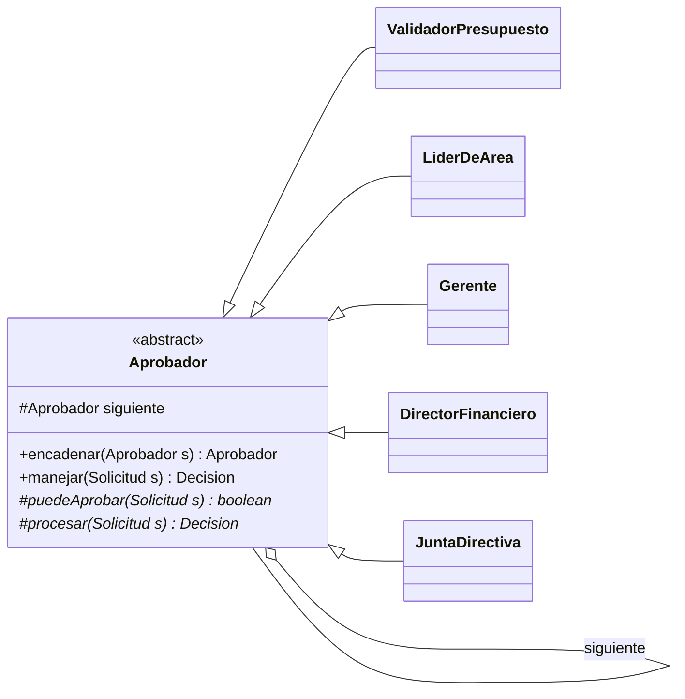
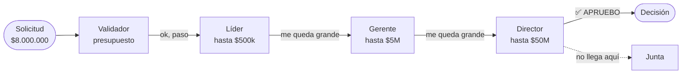

[← Volver al índice](README.md) · [← 13 Proxy](13-proxy.md) · [15 Command →](15-command.md)

# 14 · Chain of Responsibility

> **Familia:** Comportamiento · *Cadena de responsabilidad*

---

## En una frase

**Pasa una petición por una fila de manejadores hasta que uno la atienda (o hasta que
todos la revisen).**

Como un trámite en una empresa: la solicitud llega a tu líder; si es de su monto, la
aprueba; si no, la sube al gerente; si tampoco, va al comité. Tú entregas la solicitud
en un solo lugar y no sabes quién termina firmándola.

---

## El enunciado

> **Ticket FIN-880**
> Toda solicitud de gasto debe pasar por un flujo de aprobación:
>
> | Monto | Quién aprueba |
> |---|---|
> | Hasta $500.000 | El líder de área |
> | Hasta $5.000.000 | El gerente |
> | Hasta $50.000.000 | El director financiero |
> | Más de $50.000.000 | La junta directiva |
>
> Además hay reglas transversales: si el gasto es de una categoría restringida
> (viajes internacionales) siempre sube un nivel; si el solicitante ya gastó su
> presupuesto del mes, se rechaza de una.
>
> El método `aprobar()` actual tiene 180 líneas de `if/else if` anidados. Cada vez que
> Finanzas cambia un tope, alguien rompe otra rama sin darse cuenta.

---

## El código que duele

```java
boolean aprobar(Solicitud s) {
    if (presupuestoAgotado(s.solicitante())) {
        return false;
    } else if (s.categoria().equals("VIAJE_INTERNACIONAL")) {
        if (s.monto() <= 5_000_000) {
            return gerente.aprobar(s);        // sube un nivel
        } else if (s.monto() <= 50_000_000) {
            return director.aprobar(s);
        } else { ... }
    } else if (s.monto() <= 500_000) {
        return lider.aprobar(s);
    } else if (s.monto() <= 5_000_000) {
        ...
    }
    // 150 líneas más
}
```

Un solo método que conoce **todos** los aprobadores, **todos** los topes y **todas** las
excepciones. Cambiar un tope = arriesgarse a romper el resto.

---

## La idea del patrón

Convierte cada `else if` en un objeto:

1. Una interfaz común de manejador con `manejar(peticion)`.
2. Cada manejador guarda una referencia al **siguiente** de la cadena.
3. Cada manejador decide: **¿esto es mío?** Si sí, lo atiende. Si no, se lo pasa al siguiente.
4. El cliente entrega la petición **al primero** y ya. No sabe cuántos hay ni quién resolvió.

> **Regla de oro:** cada manejador conoce solo dos cosas: su propia regla y quién sigue.

---

## El diagrama



Cómo viaja una solicitud de $8.000.000:



---

## La solución en Java 21

```java
import java.util.List;
import java.util.Map;

// ===============================================================
// LA PETICIÓN Y LA RESPUESTA
// ===============================================================
enum Categoria { INSUMOS, SOFTWARE, VIAJE_NACIONAL, VIAJE_INTERNACIONAL, MARKETING }

record Solicitud(String id, String solicitante, String area,
                 double monto, Categoria categoria, String justificacion) {}

sealed interface Decision permits Decision.Aprobada, Decision.Rechazada, Decision.Escalada {
    record Aprobada(String aprobadaPor, String comentario) implements Decision {}
    record Rechazada(String rechazadaPor, String motivo) implements Decision {}
    record Escalada(String motivo) implements Decision {}     // nadie pudo resolverla
}

// ===============================================================
// EL MANEJADOR BASE
// ===============================================================
abstract class Aprobador {
    protected Aprobador siguiente;

    /** Encadena y devuelve el siguiente, para poder escribir a.encadenar(b).encadenar(c) */
    Aprobador encadenar(Aprobador siguiente) {
        this.siguiente = siguiente;
        return siguiente;
    }

    /** Plantilla del recorrido: idéntica para todos. */
    final Decision manejar(Solicitud s) {
        if (meCorresponde(s)) {
            return procesar(s);
        }
        if (siguiente != null) {
            System.out.println("    " + nombre() + ": no me corresponde, paso a "
                    + siguiente.nombre());
            return siguiente.manejar(s);
        }
        return new Decision.Escalada("Ningún aprobador pudo resolver la solicitud " + s.id());
    }

    protected abstract boolean meCorresponde(Solicitud s);
    protected abstract Decision procesar(Solicitud s);
    protected abstract String nombre();
}

// ---------------------------------------------------------------
// Manejador 1: regla transversal, siempre va de primero
// ---------------------------------------------------------------
final class ValidadorPresupuesto extends Aprobador {
    private final Map<String, Double> presupuestoDisponible;

    ValidadorPresupuesto(Map<String, Double> presupuestoDisponible) {
        this.presupuestoDisponible = presupuestoDisponible;
    }

    // Solo me corresponde si hay un problema de presupuesto.
    @Override protected boolean meCorresponde(Solicitud s) {
        return presupuestoDisponible.getOrDefault(s.area(), 0.0) < s.monto();
    }
    @Override protected Decision procesar(Solicitud s) {
        var disponible = presupuestoDisponible.getOrDefault(s.area(), 0.0);
        return new Decision.Rechazada(nombre(),
                "El área %s solo tiene $%,.0f disponibles y la solicitud es de $%,.0f"
                        .formatted(s.area(), disponible, s.monto()));
    }
    @Override protected String nombre() { return "ValidadorPresupuesto"; }
}

// ---------------------------------------------------------------
// Manejadores por tope de monto
// ---------------------------------------------------------------
abstract class AprobadorPorMonto extends Aprobador {
    private final double tope;
    private final String cargo;

    protected AprobadorPorMonto(String cargo, double tope) {
        this.cargo = cargo;
        this.tope = tope;
    }

    @Override protected boolean meCorresponde(Solicitud s) {
        // Los viajes internacionales suben un nivel: se les descuenta la mitad del tope.
        var topeEfectivo = s.categoria() == Categoria.VIAJE_INTERNACIONAL ? tope / 10 : tope;
        return s.monto() <= topeEfectivo;
    }

    @Override protected Decision procesar(Solicitud s) {
        return new Decision.Aprobada(cargo,
                "Dentro de mi tope de $%,.0f".formatted(tope));
    }
    @Override protected String nombre() { return cargo; }
}

final class LiderDeArea        extends AprobadorPorMonto { LiderDeArea()        { super("Líder de área",       500_000); } }
final class Gerente            extends AprobadorPorMonto { Gerente()            { super("Gerente",           5_000_000); } }
final class DirectorFinanciero extends AprobadorPorMonto { DirectorFinanciero() { super("Director financiero", 50_000_000); } }

final class JuntaDirectiva extends Aprobador {
    // La junta siempre acepta revisar: es el último de la cadena.
    @Override protected boolean meCorresponde(Solicitud s) { return true; }
    @Override protected Decision procesar(Solicitud s) {
        if (s.justificacion().length() < 40) {
            return new Decision.Rechazada(nombre(),
                    "Montos sobre $50M exigen justificación detallada (mínimo 40 caracteres)");
        }
        return new Decision.Aprobada(nombre(), "Aprobada en sesión ordinaria");
    }
    @Override protected String nombre() { return "Junta directiva"; }
}

public class Demo {
    public static void main(String[] args) {

        var presupuesto = Map.of(
            "TECNOLOGIA", 120_000_000.0,
            "MARKETING",     2_000_000.0,
            "OPERACIONES",  80_000_000.0
        );

        // ===== Se arma la cadena UNA vez, en un solo lugar =====
        var inicio = new ValidadorPresupuesto(presupuesto);
        inicio.encadenar(new LiderDeArea())
              .encadenar(new Gerente())
              .encadenar(new DirectorFinanciero())
              .encadenar(new JuntaDirectiva());

        List<Solicitud> solicitudes = List.of(
            new Solicitud("SOL-01", "ana",    "TECNOLOGIA",     320_000,
                Categoria.INSUMOS, "Teclados y mouse para el equipo"),
            new Solicitud("SOL-02", "carlos", "TECNOLOGIA",   3_800_000,
                Categoria.SOFTWARE, "Renovación de licencias de IDE"),
            new Solicitud("SOL-03", "lucia",  "OPERACIONES", 22_000_000,
                Categoria.INSUMOS, "Estanterías para la bodega norte"),
            new Solicitud("SOL-04", "pedro",  "TECNOLOGIA",   2_400_000,
                Categoria.VIAJE_INTERNACIONAL, "Congreso de arquitectura en Lisboa"),
            new Solicitud("SOL-05", "sofia",  "MARKETING",    9_000_000,
                Categoria.MARKETING, "Campaña de fin de año"),
            new Solicitud("SOL-06", "diego",  "TECNOLOGIA",  95_000_000,
                Categoria.SOFTWARE, "Migración completa de la plataforma a la nube, "
                    + "incluye licenciamiento, consultoría y soporte por 24 meses")
        );

        for (var s : solicitudes) {
            System.out.printf("%n=== %s | %s | $%,.0f | %s ===%n",
                    s.id(), s.solicitante(), s.monto(), s.categoria());
            var decision = inicio.manejar(s);

            switch (decision) {
                case Decision.Aprobada a ->
                    System.out.println("  ✅ APROBADA por " + a.aprobadaPor() + " — " + a.comentario());
                case Decision.Rechazada r ->
                    System.out.println("  ❌ RECHAZADA por " + r.rechazadaPor() + " — " + r.motivo());
                case Decision.Escalada e ->
                    System.out.println("  ⏫ ESCALADA — " + e.motivo());
            }
        }
    }
}
```

### Salida

```
=== SOL-01 | ana | $320,000 | INSUMOS ===
    ValidadorPresupuesto: no me corresponde, paso a Líder de área
  ✅ APROBADA por Líder de área — Dentro de mi tope de $500,000

=== SOL-02 | carlos | $3,800,000 | SOFTWARE ===
    ValidadorPresupuesto: no me corresponde, paso a Líder de área
    Líder de área: no me corresponde, paso a Gerente
  ✅ APROBADA por Gerente — Dentro de mi tope de $5,000,000

=== SOL-03 | lucia | $22,000,000 | INSUMOS ===
    ValidadorPresupuesto: no me corresponde, paso a Líder de área
    Líder de área: no me corresponde, paso a Gerente
    Gerente: no me corresponde, paso a Director financiero
  ✅ APROBADA por Director financiero — Dentro de mi tope de $50,000,000

=== SOL-04 | pedro | $2,400,000 | VIAJE_INTERNACIONAL ===
    ... (el tope efectivo del gerente baja a $500.000)
  ✅ APROBADA por Director financiero — Dentro de mi tope de $50,000,000

=== SOL-05 | sofia | $9,000,000 | MARKETING ===
  ❌ RECHAZADA por ValidadorPresupuesto — El área MARKETING solo tiene $2,000,000
     disponibles y la solicitud es de $9,000,000

=== SOL-06 | diego | $95,000,000 | SOFTWARE ===
    ...
  ✅ APROBADA por Junta directiva — Aprobada en sesión ordinaria
```

---

## Las dos variantes que debes distinguir

### A) Cadena "el primero que pueda, atiende" ← la del ejemplo

Un manejador atiende y **la cadena se detiene**. Ejemplo: aprobaciones, ruteo de eventos,
manejo de excepciones.

### B) Pipeline "todos participan"

Todos los manejadores procesan y la petición sigue transformándose. Ejemplo: validaciones
(quiero **todos** los errores, no solo el primero), filtros HTTP, middleware.

```java
// Variante B: acumular resultados en vez de cortar
interface Validacion { List<String> validar(Solicitud s); }

static List<String> validarTodo(Solicitud s, List<Validacion> validaciones) {
    return validaciones.stream().flatMap(v -> v.validar(s).stream()).toList();
}

var errores = validarTodo(solicitud, List.of(
    s -> s.monto() <= 0 ? List.of("El monto debe ser positivo") : List.of(),
    s -> s.justificacion().isBlank() ? List.of("Falta la justificación") : List.of(),
    s -> s.solicitante() == null ? List.of("Falta el solicitante") : List.of()
));
```

En la variante B, `List<Validacion>` con un `stream` suele leerse mejor que una cadena de
objetos enlazados. **Usa la cadena enlazada cuando el corte temprano importa.**

---

## Cuidados prácticos

1. **Siempre pon un manejador final que atienda todo** (como `JuntaDirectiva`), o maneja
   explícitamente el caso "nadie respondió". Si no, tienes peticiones que se pierden en
   silencio: el bug más difícil de encontrar de este patrón.
2. **El orden de la cadena es lógica de negocio.** Documéntalo y ármalo en un solo lugar
   (una clase de configuración, no repartido por el código).
3. **Cuidado con cadenas muy largas:** cada salto es una llamada. Con 40 manejadores y un
   volumen alto, mídelo.
4. **Evita que un manejador conozca a otro que no sea el siguiente.** En el momento en que
   `Gerente` pregunte por `DirectorFinanciero`, perdiste el desacoplamiento.

---

## ✅ Cuándo usarlo

- Hay varios candidatos a atender una petición y **quién lo hace se decide en tiempo de
  ejecución**.
- Quieres poder **agregar, quitar o reordenar pasos** sin tocar el resto.
- Tienes un `if/else if` largo donde cada rama es una regla independiente.
- Flujos de aprobación, escalamiento de incidentes, validaciones, filtros, middleware,
  ruteo de mensajes.

## ⛔ Cuándo NO usarlo

- Siempre atiende el mismo manejador: entonces no hay cadena, hay una llamada.
- Solo hay dos casos y son estables: un `if` es más honesto.
- **La petición SIEMPRE debe ser atendida y no puedes garantizarlo.** Ojo con el silencio.
- Depurar una cadena larga es incómodo: el stack trace se llena de `manejar()`. Nombra
  bien las clases y loguea el recorrido, como en el ejemplo.

---

## Se parece a...

| Patrón | Diferencia clave |
|---|---|
| **[Decorator](10-decorator.md)** | En Decorator **todos** los eslabones participan siempre en la misma llamada. En la cadena, **uno solo** atiende y los demás no hacen nada. |
| **[Command](15-command.md)** | Command encapsula *qué hacer*; la cadena decide *quién lo hace*. Se combinan: la petición que viaja por la cadena suele ser un Command. |
| **[Composite](09-composite.md)** | La cadena se usa mucho sobre árboles Composite: el evento sube del hijo al padre hasta que alguien lo atiende (así funcionan los eventos en las interfaces gráficas). |
| **[Mediator](18-mediator.md)** | Mediator centraliza en **un** objeto. La cadena distribuye entre **varios** en secuencia. |

---

## Dónde ya lo has visto

- **Filtros de Servlet** (`javax.servlet.Filter` + `FilterChain`) y los interceptores de Spring.
- **Spring Security**: la `SecurityFilterChain` es literalmente este patrón.
- El manejo de excepciones de Java: el `try/catch` busca el primer `catch` compatible
  subiendo por la pila.
- Los `Logger` de `java.util.logging`: un log sube por los loggers padres.
- El manejo de eventos en interfaces gráficas (event bubbling), igual que en el DOM.
- Middleware de Express, ASP.NET Core, o cualquier framework web moderno.

---

➡️ Siguiente: **[15 · Command](15-command.md)**

[← Volver al índice](README.md)
