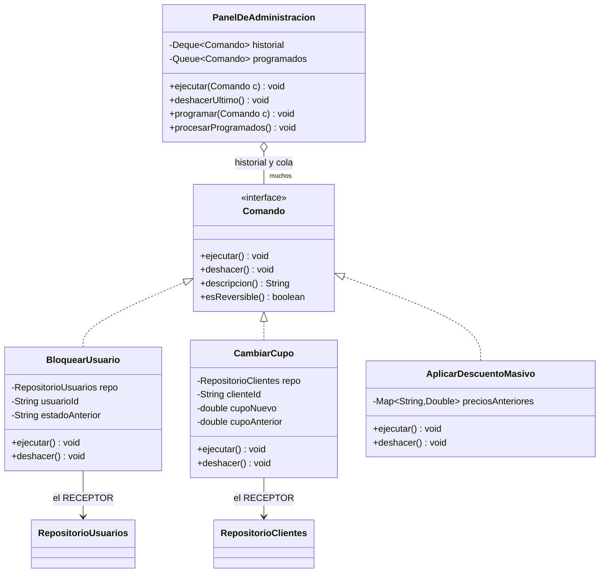
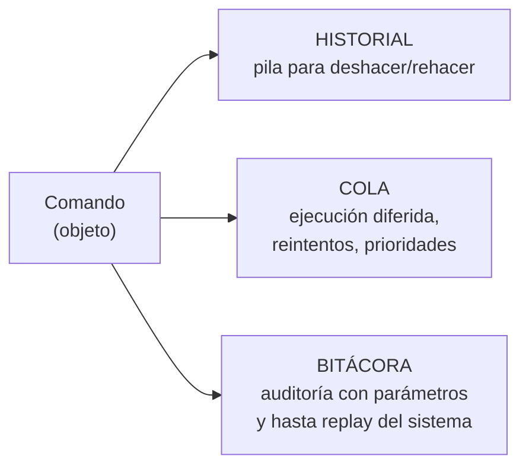

[← Volver al índice](README.md) · [← 14 Chain of Responsibility](14-chain-of-responsibility.md) · [16 Interpreter →](16-interpreter.md)

# 15 · Command

> **Familia:** Comportamiento · *Comando*

---

## En una frase

**Convierte una acción en un objeto, para poder guardarla, encolarla, repetirla,
auditarla o deshacerla.**

Como una orden de trabajo en papel: en vez de gritarle al técnico "cambia el filtro", le
entregas un formato firmado. Ese papel se puede archivar, reasignar, poner en una fila,
o anular.

---

## El enunciado

> **Ticket ADM-1210**
> El panel de administración permite operaciones sensibles: bloquear un usuario, cambiar
> el cupo de un cliente, aplicar un descuento masivo, migrar registros entre planes.
>
> Auditoría y Soporte piden tres cosas:
>
> 1. **Bitácora completa**: quién hizo qué, cuándo y con qué parámetros.
> 2. **Deshacer**: si un administrador se equivoca (ya pasó: alguien aplicó un descuento
>    del 90% a toda la base), poder revertir las últimas N operaciones.
> 3. **Programar y encolar**: algunas operaciones son pesadas y deben ejecutarse de noche.
>
> Hoy cada operación es un método suelto en un `AdminService` de 900 líneas. No hay forma
> de deshacer nada ni de encolar nada.

---

## El código que duele

```java
class AdminService {
    void bloquearUsuario(String id, String motivo) {
        usuarioRepo.actualizarEstado(id, "BLOQUEADO");
        log.info("Usuario {} bloqueado", id);       // "auditoría"
    }
    void cambiarCupo(String clienteId, double nuevo) {
        clienteRepo.actualizarCupo(clienteId, nuevo);
        log.info("Cupo cambiado");                  // ¿cuál era el anterior? nadie sabe
    }
    // ...30 métodos más
}
```

Para deshacer necesitarías saber el **valor anterior**, y nadie lo guardó. Para encolar
necesitarías **serializar la llamada**, y un método no se serializa. Para auditar con
parámetros tendrías que escribir el log a mano en los 30 métodos (y alguien va a olvidarlo).

---

## La idea del patrón

Convierte cada operación en un **objeto** que sabe tres cosas:

1. **Qué datos necesita** (los guarda como campos).
2. **Cómo ejecutarse** (`ejecutar()`).
3. **Cómo deshacerse** (`deshacer()`), guardando el estado previo al ejecutar.

Y separa tres roles:

| Rol | Quién es | Qué hace |
|---|---|---|
| **Invocador** | `PanelDeAdministracion` | Dispara comandos, lleva el historial. No sabe qué hacen. |
| **Comando** | `BloquearUsuario`, `CambiarCupo` | Sabe qué hacer y cómo deshacerlo. |
| **Receptor** | `RepositorioUsuarios` | Hace el trabajo real. Ni sabe que existen comandos. |

> **Regla de oro:** una acción que es un objeto se puede guardar en una lista. Un método,
> no.

---

## El diagrama



---

## La solución en Java 21

```java
import java.time.LocalDateTime;
import java.util.ArrayDeque;
import java.util.ArrayList;
import java.util.Deque;
import java.util.HashMap;
import java.util.LinkedHashMap;
import java.util.List;
import java.util.Map;
import java.util.Queue;

// ===============================================================
// LOS RECEPTORES: hacen el trabajo real, no saben de comandos
// ===============================================================
final class RepositorioUsuarios {
    private final Map<String, String> estados = new LinkedHashMap<>(Map.of(
        "u-100", "ACTIVO", "u-200", "ACTIVO", "u-300", "SUSPENDIDO"));

    String estadoDe(String id) { return estados.get(id); }
    void cambiarEstado(String id, String estado) {
        System.out.println("      [BD] usuarios: " + id + " -> " + estado);
        estados.put(id, estado);
    }
    Map<String, String> todos() { return Map.copyOf(estados); }
}

final class RepositorioClientes {
    private final Map<String, Double> cupos = new LinkedHashMap<>(Map.of(
        "c-1", 5_000_000.0, "c-2", 12_000_000.0));
    private final Map<String, Double> precios = new LinkedHashMap<>(Map.of(
        "p-1", 120_000.0, "p-2", 340_000.0, "p-3", 89_000.0));

    double cupoDe(String id) { return cupos.get(id); }
    void cambiarCupo(String id, double cupo) {
        System.out.printf("      [BD] clientes: %s cupo -> $%,.0f%n", id, cupo);
        cupos.put(id, cupo);
    }
    Map<String, Double> precios() { return Map.copyOf(precios); }
    void cambiarPrecio(String sku, double precio) { precios.put(sku, precio); }
    Map<String, Double> cupos() { return Map.copyOf(cupos); }
}

// ===============================================================
// LA INTERFAZ COMANDO
// ===============================================================
interface Comando {
    void ejecutar();
    void deshacer();
    String descripcion();
    default boolean esReversible() { return true; }
}

// ---------------------------------------------------------------
// Comandos concretos: cada uno guarda el estado previo al ejecutar
// ---------------------------------------------------------------
final class BloquearUsuario implements Comando {
    private final RepositorioUsuarios repo;
    private final String usuarioId;
    private final String motivo;
    private String estadoAnterior;              // <- la clave del deshacer

    BloquearUsuario(RepositorioUsuarios repo, String usuarioId, String motivo) {
        this.repo = repo; this.usuarioId = usuarioId; this.motivo = motivo;
    }

    @Override public void ejecutar() {
        this.estadoAnterior = repo.estadoDe(usuarioId);   // guarda ANTES de cambiar
        repo.cambiarEstado(usuarioId, "BLOQUEADO");
    }
    @Override public void deshacer() {
        repo.cambiarEstado(usuarioId, estadoAnterior);
    }
    @Override public String descripcion() {
        return "Bloquear usuario " + usuarioId + " (motivo: " + motivo + ")";
    }
}

final class CambiarCupo implements Comando {
    private final RepositorioClientes repo;
    private final String clienteId;
    private final double cupoNuevo;
    private double cupoAnterior;

    CambiarCupo(RepositorioClientes repo, String clienteId, double cupoNuevo) {
        this.repo = repo; this.clienteId = clienteId; this.cupoNuevo = cupoNuevo;
    }

    @Override public void ejecutar() {
        this.cupoAnterior = repo.cupoDe(clienteId);
        repo.cambiarCupo(clienteId, cupoNuevo);
    }
    @Override public void deshacer() { repo.cambiarCupo(clienteId, cupoAnterior); }
    @Override public String descripcion() {
        return "Cambiar cupo de %s a $%,.0f".formatted(clienteId, cupoNuevo);
    }
}

/** El comando peligroso: toca muchos registros de una. */
final class AplicarDescuentoMasivo implements Comando {
    private final RepositorioClientes repo;
    private final double porcentaje;
    private final Map<String, Double> preciosAnteriores = new HashMap<>();

    AplicarDescuentoMasivo(RepositorioClientes repo, double porcentaje) {
        this.repo = repo; this.porcentaje = porcentaje;
    }

    @Override public void ejecutar() {
        preciosAnteriores.clear();
        preciosAnteriores.putAll(repo.precios());          // foto completa
        repo.precios().forEach((sku, precio) ->
                repo.cambiarPrecio(sku, precio * (1 - porcentaje / 100)));
        System.out.printf("      [BD] precios: -%.0f%% aplicado a %d SKU%n",
                porcentaje, preciosAnteriores.size());
    }
    @Override public void deshacer() {
        preciosAnteriores.forEach(repo::cambiarPrecio);
        System.out.println("      [BD] precios: restaurados " + preciosAnteriores.size() + " SKU");
    }
    @Override public String descripcion() {
        return "Descuento masivo del %.0f%%".formatted(porcentaje);
    }
}

/** Comando compuesto (macro): varios comandos como uno solo. */
final class ComandoCompuesto implements Comando {
    private final String nombre;
    private final List<Comando> comandos;

    ComandoCompuesto(String nombre, Comando... comandos) {
        this.nombre = nombre; this.comandos = List.of(comandos);
    }
    @Override public void ejecutar() { comandos.forEach(Comando::ejecutar); }
    @Override public void deshacer() {
        // Al revés: el último en ejecutarse es el primero en deshacerse.
        comandos.reversed().forEach(Comando::deshacer);
    }
    @Override public String descripcion() {
        return nombre + " (" + comandos.size() + " operaciones)";
    }
}

// ===============================================================
// EL INVOCADOR: no sabe QUÉ hacen los comandos
// ===============================================================
final class PanelDeAdministracion {
    private record Entrada(LocalDateTime momento, String usuario, Comando comando) {}

    private final Deque<Comando> pilaDeshacer = new ArrayDeque<>();
    private final Queue<Comando> programados = new ArrayDeque<>();
    private final List<Entrada> bitacora = new ArrayList<>();

    void ejecutar(String usuario, Comando comando) {
        System.out.println("  ▶ " + usuario + ": " + comando.descripcion());
        comando.ejecutar();
        bitacora.add(new Entrada(LocalDateTime.now(), usuario, comando));
        if (comando.esReversible()) pilaDeshacer.push(comando);
    }

    void deshacerUltimo() {
        if (pilaDeshacer.isEmpty()) { System.out.println("  Nada que deshacer."); return; }
        var comando = pilaDeshacer.pop();
        System.out.println("  ↩ DESHACIENDO: " + comando.descripcion());
        comando.deshacer();
    }

    void programar(String usuario, Comando comando) {
        programados.add(comando);
        System.out.println("  ⏰ " + usuario + " programó: " + comando.descripcion());
    }

    void procesarProgramados(String usuario) {
        System.out.println("  --- Ejecutando " + programados.size() + " tareas programadas ---");
        while (!programados.isEmpty()) ejecutar(usuario, programados.poll());
    }

    void imprimirBitacora() {
        System.out.println("\n=== BITÁCORA DE AUDITORÍA ===");
        bitacora.forEach(e -> System.out.printf("  %s | %-8s | %s%n",
                e.momento().toLocalTime().withNano(0), e.usuario(), e.comando().descripcion()));
    }
}

public class Demo {
    public static void main(String[] args) {
        var usuarios = new RepositorioUsuarios();
        var clientes = new RepositorioClientes();
        var panel = new PanelDeAdministracion();

        System.out.println("=== Operaciones normales ===");
        panel.ejecutar("ana",   new BloquearUsuario(usuarios, "u-100", "Fraude detectado"));
        panel.ejecutar("carlos",new CambiarCupo(clientes, "c-1", 8_000_000));

        System.out.println("\n=== El error costoso ===");
        panel.ejecutar("pedro", new AplicarDescuentoMasivo(clientes, 90));
        System.out.println("  Precios ahora: " + clientes.precios());

        System.out.println("\n=== Deshacer ===");
        panel.deshacerUltimo();
        System.out.println("  Precios restaurados: " + clientes.precios());

        System.out.println("\n=== Comando compuesto (macro) ===");
        panel.ejecutar("ana", new ComandoCompuesto("Congelar cliente moroso",
                new BloquearUsuario(usuarios, "u-200", "Mora > 90 días"),
                new CambiarCupo(clientes, "c-2", 0)));
        System.out.println("  Estados: " + usuarios.todos());
        System.out.println("  Cupos:   " + clientes.cupos());

        System.out.println("\n=== Deshacer el macro completo ===");
        panel.deshacerUltimo();
        System.out.println("  Estados: " + usuarios.todos());
        System.out.println("  Cupos:   " + clientes.cupos());

        System.out.println("\n=== Programar para la noche ===");
        panel.programar("sofia", new AplicarDescuentoMasivo(clientes, 15));
        panel.programar("sofia", new CambiarCupo(clientes, "c-1", 20_000_000));
        System.out.println("  ... son las 2 a.m. ...");
        panel.procesarProgramados("job-nocturno");

        panel.imprimirBitacora();
    }
}
```

### Salida (recortada)

```
=== Operaciones normales ===
  ▶ ana: Bloquear usuario u-100 (motivo: Fraude detectado)
      [BD] usuarios: u-100 -> BLOQUEADO
  ▶ carlos: Cambiar cupo de c-1 a $8,000,000
      [BD] clientes: c-1 cupo -> $8,000,000

=== El error costoso ===
  ▶ pedro: Descuento masivo del 90%
      [BD] precios: -90% aplicado a 3 SKU
  Precios ahora: {p-1=12000.0, p-2=34000.0, p-3=8900.0}

=== Deshacer ===
  ↩ DESHACIENDO: Descuento masivo del 90%
      [BD] precios: restaurados 3 SKU
  Precios restaurados: {p-1=120000.0, p-2=340000.0, p-3=89000.0}

=== Comando compuesto (macro) ===
  ▶ ana: Congelar cliente moroso (2 operaciones)
      [BD] usuarios: u-200 -> BLOQUEADO
      [BD] clientes: c-2 cupo -> $0

=== Deshacer el macro completo ===
  ↩ DESHACIENDO: Congelar cliente moroso (2 operaciones)
      [BD] clientes: c-2 cupo -> $12,000,000
      [BD] usuarios: u-200 -> ACTIVO

=== BITÁCORA DE AUDITORÍA ===
  15:22:03 | ana      | Bloquear usuario u-100 (motivo: Fraude detectado)
  15:22:03 | carlos   | Cambiar cupo de c-1 a $8,000,000
  ...
```

---

## Las tres cosas que solo puedes hacer si la acción es un objeto



Ese tercero merece un nombre: si guardas **todos** los comandos y los vuelves a ejecutar
en orden, puedes reconstruir el estado del sistema desde cero. Eso es **event sourcing**,
y es Command llevado al extremo.

---

## Versión ligera: `Runnable` y lambdas

Si no necesitas deshacer, Java ya tiene la interfaz Command incorporada:

```java
Queue<Runnable> tareas = new ArrayDeque<>();
tareas.add(() -> repo.cambiarEstado("u-100", "BLOQUEADO"));
tareas.add(() -> repo.cambiarCupo("c-1", 8_000_000));
tareas.forEach(Runnable::run);

// O directamente:
var executor = Executors.newVirtualThreadPerTaskExecutor();
executor.submit(() -> repo.cambiarEstado("u-100", "BLOQUEADO"));
```

`Runnable`, `Callable` y `Supplier` **son** el patrón Command con otro nombre.
Usa clases propias cuando necesites `deshacer()`, una descripción legible para la
bitácora, o serializar el comando para encolarlo en Kafka o en una tabla.

---

## Lo difícil de verdad: deshacer bien

El `deshacer()` es donde este patrón se rompe en producción. Tres reglas:

1. **Guarda el estado anterior en `ejecutar()`, no antes.** Si lo capturas al construir el
   comando, puede haber cambiado para cuando se ejecute.
2. **No todo es reversible.** Enviar un correo, cobrar una tarjeta o llamar a un tercero
   no se deshacen. Marca esos comandos con `esReversible() = false` y, si hace falta,
   implementa una **compensación** (un comando inverso: `Reembolsar` en vez de `deshacer`).
   Eso es el patrón *Saga* en microservicios.
3. **En un macro, deshaz en orden inverso** (`comandos.reversed()` en Java 21). Si
   deshaces en el mismo orden, dejas el sistema en un estado inconsistente.

---

## ✅ Cuándo usarlo

- Necesitas **deshacer / rehacer**.
- Necesitas **encolar, programar o reintentar** operaciones.
- Necesitas **auditar** qué se hizo, con qué parámetros y por quién.
- Quieres desacoplar quién dispara la acción de quién la ejecuta (botones de una UI,
  endpoints, jobs, mensajes de una cola).
- Quieres agrupar operaciones en macros o transacciones lógicas.

## ⛔ Cuándo NO usarlo

- La operación es simple, inmediata y no necesita historial ni cola. Llama al método.
- Terminarías con 50 clases de una línea cada una: si no aportan `deshacer()` ni
  descripción, usa lambdas.
- El estado a guardar para deshacer es enorme → mira **[Memento](19-memento.md)** o
  replantea el enfoque.

---

## Se parece a...

| Patrón | Diferencia clave |
|---|---|
| **[Memento](19-memento.md)** | Memento guarda **el estado**; Command guarda **la operación**. Se combinan: un comando puede usar un memento para saber cómo deshacerse. |
| **[Strategy](22-strategy.md)** | Strategy encapsula **cómo** hacer algo (un algoritmo intercambiable); Command encapsula **qué** hacer, con sus parámetros ya dentro. |
| **[Chain of Responsibility](14-chain-of-responsibility.md)** | Lo que viaja por una cadena suele ser un Command. |
| **[Composite](09-composite.md)** | `ComandoCompuesto` es literalmente un Composite de comandos. |
| **[Observer](20-observer.md)** | Observer notifica que *algo pasó*; Command ordena que *algo se haga*. |

---

## Dónde ya lo has visto

- `Runnable`, `Callable`, y todo `ExecutorService.submit(...)`.
- `Action` en Swing; los `onClick` de cualquier interfaz gráfica.
- Ctrl+Z en cualquier editor.
- Las migraciones de Flyway o Liquibase: cada una con su `up` y su `down`.
- Las transacciones y el *rollback* de una base de datos.
- Los mensajes de una cola (SQS, RabbitMQ, Kafka): un mensaje es un comando serializado.

---

➡️ Siguiente: **[16 · Interpreter](16-interpreter.md)**

[← Volver al índice](README.md)
