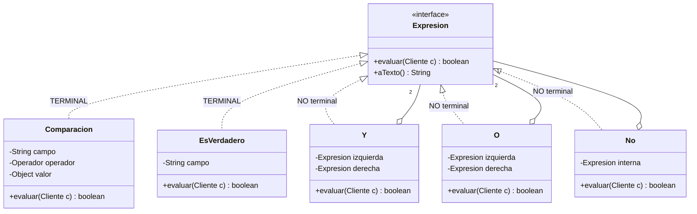
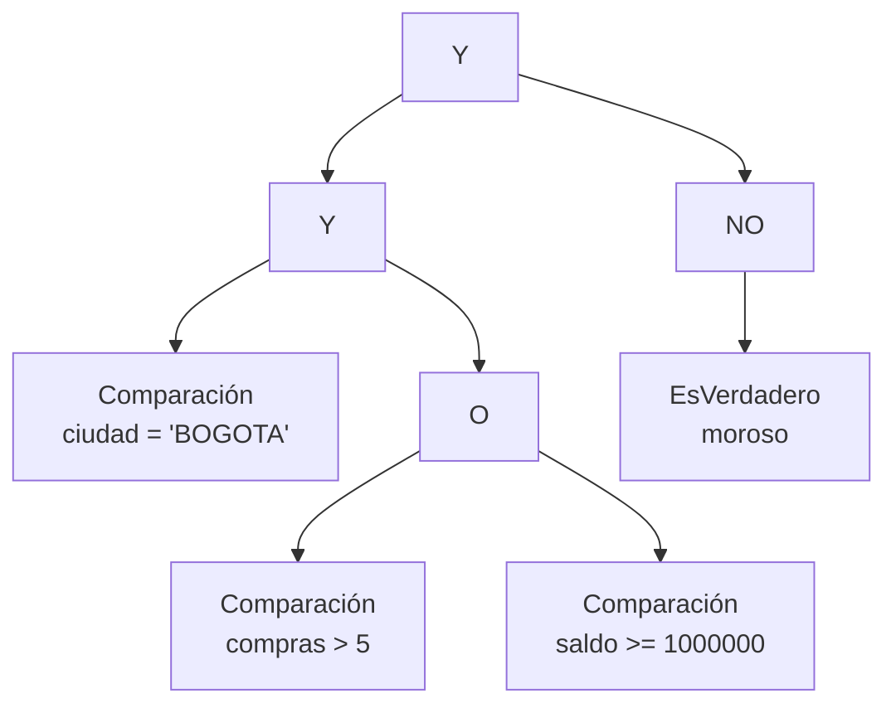

[← Volver al índice](README.md) · [← 15 Command](15-command.md) · [17 Iterator →](17-iterator.md)

# 16 · Interpreter

> **Familia:** Comportamiento · *Intérprete*

---

## En una frase

**Define un mini-lenguaje propio y un objeto por cada regla gramatical, para poder
evaluar expresiones escritas en ese lenguaje.**

Como la barra de búsqueda de tu gestor de correo: escribes
`de:jefe tiene:adjunto después:2026/01/01` y el sistema entiende. Eso es un mini-lenguaje
con su intérprete.

---

## ⚠️ Antes de empezar: el patrón menos usado de los 23

Sé honesto contigo mismo: **la mayoría de programadores nunca implementa un Interpreter**,
y está bien. Si el lenguaje es complicado, usas un generador de parsers (ANTLR) o un motor
de reglas (Drools, Easy Rules). Si es muy simple, un `switch` basta.

Pero vale la pena entenderlo porque:

- Aparece **todo el tiempo** en forma de librerías que usas (expresiones regulares, SpEL,
  JPQL, filtros de búsqueda, motores de plantillas).
- Es el mejor ejemplo de **recursión + Composite** que existe.
- Un caso acotado y bien delimitado es perfectamente razonable de escribir a mano.

---

## El enunciado

> **Ticket SEG-1330**
> El módulo de segmentación permite que el equipo de Marketing defina **audiencias** sin
> pedirle un despliegue a Desarrollo. Hoy tienen que abrir un ticket por cada segmento.
>
> Quieren escribir la regla en un campo de texto, así:
>
> ```
> ciudad = 'BOGOTA' Y (compras > 5 O saldo >= 1000000) Y NO moroso
> ```
>
> Y que el sistema evalúe esa regla contra cada cliente de la base.
>
> Requisitos: soportar `=`, `>`, `>=`, `<`, `<=`, `Y`, `O`, `NO`, paréntesis, campos de
> texto, numéricos y booleanos. Y que sea **auditable**: poder mostrar la regla de vuelta
> en texto para que Marketing verifique lo que escribió.

---

## El código que duele

```java
// Un método por segmento. Cada uno exige desarrollo, pruebas y despliegue.
boolean esSegmentoBogotaPremium(Cliente c) {
    return c.ciudad().equals("BOGOTA") && (c.compras() > 5 || c.saldo() >= 1_000_000)
           && !c.moroso();
}
boolean esSegmentoMedellinFrecuente(Cliente c) { ... }
boolean esSegmentoCaliNuevos(Cliente c) { ... }
// ... 47 métodos, y Marketing pide 3 nuevos por semana
```

---

## La idea del patrón

Cada regla gramatical del mini-lenguaje se convierte en **una clase**, y todas comparten
la misma interfaz `Expresion` con un método `interpretar(contexto)`:

| Tipo | Clases | Qué hacen |
|---|---|---|
| **Terminales** (hojas) | `Literal`, `Campo` | Devuelven un valor. No contienen otras expresiones. |
| **No terminales** (ramas) | `Y`, `O`, `NO`, `Comparacion` | Contienen otras expresiones y las combinan. |

El resultado es un **árbol de expresiones** — que es exactamente un
[Composite](09-composite.md). Evaluar la regla = recorrer el árbol recursivamente.

> **Regla de oro:** una clase por regla gramatical, y la recursión hace el resto.

---

## El diagrama



La regla `ciudad = 'BOGOTA' Y (compras > 5 O saldo >= 1000000) Y NO moroso` se convierte
en este árbol:



Evaluar es recorrer ese árbol de abajo hacia arriba.

---

## La solución en Java 21

```java
import java.util.ArrayDeque;
import java.util.List;
import java.util.Map;
import java.util.function.Function;

// ===============================================================
// EL CONTEXTO: sobre qué se evalúa la expresión
// ===============================================================
record Cliente(String nombre, String ciudad, int compras, double saldo, boolean moroso) {

    /** Acceso a campos por nombre: lo que el mini-lenguaje necesita. */
    Object campo(String nombre) {
        return switch (nombre) {
            case "ciudad"  -> ciudad;
            case "compras" -> compras;
            case "saldo"   -> saldo;
            case "moroso"  -> moroso;
            case "nombre"  -> this.nombre;
            default -> throw new IllegalArgumentException("Campo desconocido: " + nombre);
        };
    }
}

// ===============================================================
// LA GRAMÁTICA: una clase (o record) por regla
// ===============================================================
sealed interface Expresion
        permits Comparacion, EsVerdadero, Y, O, No {

    boolean evaluar(Cliente c);
    String aTexto();          // para devolvérsela a Marketing y que la verifique
}

enum Operador {
    IGUAL("="), MAYOR(">"), MAYOR_IGUAL(">="), MENOR("<"), MENOR_IGUAL("<=");
    final String simbolo;
    Operador(String simbolo) { this.simbolo = simbolo; }

    static Operador desde(String s) {
        return switch (s) {
            case "="  -> IGUAL;
            case ">"  -> MAYOR;
            case ">=" -> MAYOR_IGUAL;
            case "<"  -> MENOR;
            case "<=" -> MENOR_IGUAL;
            default -> throw new IllegalArgumentException("Operador inválido: " + s);
        };
    }
}

// ---------- TERMINALES ----------
record Comparacion(String campo, Operador operador, Object valor) implements Expresion {
    @Override public boolean evaluar(Cliente c) {
        var actual = c.campo(campo);
        if (actual instanceof Number n && valor instanceof Number v) {
            var comparacion = Double.compare(n.doubleValue(), v.doubleValue());
            return switch (operador) {
                case IGUAL       -> comparacion == 0;
                case MAYOR       -> comparacion >  0;
                case MAYOR_IGUAL -> comparacion >= 0;
                case MENOR       -> comparacion <  0;
                case MENOR_IGUAL -> comparacion <= 0;
            };
        }
        if (operador != Operador.IGUAL)
            throw new IllegalStateException("El campo '" + campo + "' solo admite '='");
        return String.valueOf(actual).equalsIgnoreCase(String.valueOf(valor));
    }
    @Override public String aTexto() {
        var v = valor instanceof String s ? "'" + s + "'" : String.valueOf(valor);
        return campo + " " + operador.simbolo + " " + v;
    }
}

record EsVerdadero(String campo) implements Expresion {
    @Override public boolean evaluar(Cliente c) { return (boolean) c.campo(campo); }
    @Override public String aTexto() { return campo; }
}

// ---------- NO TERMINALES ----------
record Y(Expresion izquierda, Expresion derecha) implements Expresion {
    @Override public boolean evaluar(Cliente c) {
        return izquierda.evaluar(c) && derecha.evaluar(c);   // cortocircuito gratis
    }
    @Override public String aTexto() {
        return "(" + izquierda.aTexto() + " Y " + derecha.aTexto() + ")";
    }
}

record O(Expresion izquierda, Expresion derecha) implements Expresion {
    @Override public boolean evaluar(Cliente c) {
        return izquierda.evaluar(c) || derecha.evaluar(c);
    }
    @Override public String aTexto() {
        return "(" + izquierda.aTexto() + " O " + derecha.aTexto() + ")";
    }
}

record No(Expresion interna) implements Expresion {
    @Override public boolean evaluar(Cliente c) { return !interna.evaluar(c); }
    @Override public String aTexto() { return "NO " + interna.aTexto(); }
}

// ===============================================================
// EL PARSER: convierte el texto en el árbol
// (En el patrón GoF esto NO es parte del Interpreter, pero sin él
//  el patrón no sirve para nada en la vida real.)
// ===============================================================
final class ParserDeSegmentos {

    private final ArrayDeque<String> tokens;

    private ParserDeSegmentos(String texto) {
        var normalizado = texto.replace("(", " ( ").replace(")", " ) ");
        this.tokens = new ArrayDeque<>(List.of(normalizado.trim().split("\\s+")));
    }

    static Expresion parsear(String texto) {
        var parser = new ParserDeSegmentos(texto);
        var expresion = parser.expresionO();
        if (!parser.tokens.isEmpty())
            throw new IllegalArgumentException("Texto sobrante: " + parser.tokens);
        return expresion;
    }

    // Gramática por precedencia: O  ->  Y  ->  NO  ->  primario
    private Expresion expresionO() {
        var izquierda = expresionY();
        while ("O".equalsIgnoreCase(tokens.peek())) {
            tokens.poll();
            izquierda = new O(izquierda, expresionY());
        }
        return izquierda;
    }

    private Expresion expresionY() {
        var izquierda = expresionNo();
        while ("Y".equalsIgnoreCase(tokens.peek())) {
            tokens.poll();
            izquierda = new Y(izquierda, expresionNo());
        }
        return izquierda;
    }

    private Expresion expresionNo() {
        if ("NO".equalsIgnoreCase(tokens.peek())) {
            tokens.poll();
            return new No(expresionNo());
        }
        return primario();
    }

    private Expresion primario() {
        var token = tokens.poll();
        if (token == null) throw new IllegalArgumentException("Expresión incompleta");

        if (token.equals("(")) {
            var interna = expresionO();
            if (!")".equals(tokens.poll()))
                throw new IllegalArgumentException("Falta cerrar un paréntesis");
            return interna;
        }

        // ¿Viene un operador después? Entonces es una comparación.
        var siguiente = tokens.peek();
        if (siguiente != null && List.of("=", ">", ">=", "<", "<=").contains(siguiente)) {
            var operador = Operador.desde(tokens.poll());
            var valorTexto = tokens.poll();
            return new Comparacion(token, operador, convertir(valorTexto));
        }
        // Si no, es un campo booleano suelto.
        return new EsVerdadero(token);
    }

    private static Object convertir(String texto) {
        if (texto.startsWith("'") && texto.endsWith("'"))
            return texto.substring(1, texto.length() - 1);
        try { return Double.parseDouble(texto); }
        catch (NumberFormatException e) { return texto; }
    }
}

public class Demo {
    public static void main(String[] args) {

        var clientes = List.of(
            new Cliente("Ana",    "BOGOTA",     8,   400_000, false),
            new Cliente("Carlos", "BOGOTA",     2, 3_500_000, false),
            new Cliente("Lucía",  "BOGOTA",    12, 5_000_000, true),
            new Cliente("Pedro",  "MEDELLIN",  20, 9_000_000, false),
            new Cliente("Sofía",  "BOGOTA",     1,   100_000, false)
        );

        // Marketing escribe esto en un campo de texto, sin desarrollo de por medio:
        var reglas = List.of(
            "ciudad = 'BOGOTA' Y ( compras > 5 O saldo >= 1000000 ) Y NO moroso",
            "saldo >= 3000000 O compras > 15",
            "NO moroso Y ciudad = 'MEDELLIN'"
        );

        for (var texto : reglas) {
            var expresion = ParserDeSegmentos.parsear(texto);

            System.out.println("\n=== Regla ===");
            System.out.println("  Escrita  : " + texto);
            System.out.println("  Entendida: " + expresion.aTexto());
            System.out.println("  Clientes en el segmento:");

            clientes.stream()
                    .filter(expresion::evaluar)
                    .forEach(c -> System.out.printf("    - %-7s %-9s compras=%2d saldo=$%,10.0f moroso=%b%n",
                            c.nombre(), c.ciudad(), c.compras(), c.saldo(), c.moroso()));
        }

        // También se puede construir el árbol a mano, sin parser:
        System.out.println("\n=== Regla construida en código ===");
        Expresion vip = new Y(
            new Comparacion("saldo", Operador.MAYOR_IGUAL, 5_000_000),
            new No(new EsVerdadero("moroso")));
        System.out.println("  " + vip.aTexto());
        clientes.stream().filter(vip::evaluar)
                .forEach(c -> System.out.println("    - " + c.nombre()));
    }
}
```

### Salida

```
=== Regla ===
  Escrita  : ciudad = 'BOGOTA' Y ( compras > 5 O saldo >= 1000000 ) Y NO moroso
  Entendida: ((ciudad = 'BOGOTA' Y (compras > 5.0 O saldo >= 1000000.0)) Y NO moroso)
  Clientes en el segmento:
    - Ana     BOGOTA    compras= 8 saldo=$   400,000 moroso=false
    - Carlos  BOGOTA    compras= 2 saldo=$ 3,500,000 moroso=false

=== Regla ===
  Escrita  : saldo >= 3000000 O compras > 15
  Entendida: (saldo >= 3000000.0 O compras > 15.0)
  Clientes en el segmento:
    - Carlos  BOGOTA    compras= 2 saldo=$ 3,500,000 moroso=false
    - Lucía   BOGOTA    compras=12 saldo=$ 5,000,000 moroso=true
    - Pedro   MEDELLIN  compras=20 saldo=$ 9,000,000 moroso=false

=== Regla construida en código ===
  (saldo >= 5000000.0 Y NO moroso)
    - Pedro
```

---

## Interpreter vs. Composite

Son casi el mismo patrón con distinta intención:

| | Composite | Interpreter |
|---|---|---|
| **Intención** | Tratar igual un objeto y un grupo | Evaluar expresiones de un lenguaje |
| **El árbol representa** | Una estructura (carpetas, tareas) | Una gramática |
| **Método clave** | `costo()`, `imprimir()` | `interpretar(contexto)` |
| **Quién construye el árbol** | El cliente, a mano o con Builder | Normalmente un parser |

**Interpreter = Composite + un contexto de evaluación + una gramática.**

---

## Cuándo esto se te va de las manos

Este patrón escala mal con la complejidad del lenguaje. Señales de alerta:

- La gramática tiene más de 10 o 12 reglas → **usa ANTLR** y genera el parser.
- Necesitas funciones, variables, ciclos → estás escribiendo un lenguaje de programación;
  mejor embebe uno (Groovy, JavaScript vía GraalVM, Lua).
- Necesitas rendimiento alto sobre millones de evaluaciones → el árbol de objetos es lento;
  mira compilación a bytecode o un motor de reglas.
- Ya existe una librería que lo hace: SpEL (Spring), MVEL, JEXL, Drools, Easy Rules.

**Reserva el Interpreter escrito a mano para lenguajes pequeños, estables y muy acotados.**

---

## ✅ Cuándo usarlo

- Tienes un mini-lenguaje **simple y estable**: filtros, reglas de negocio configurables,
  fórmulas, permisos, criterios de búsqueda.
- Los usuarios de negocio necesitan expresar reglas **sin pedir un despliegue**.
- La gramática cabe en unas pocas reglas y no va a crecer mucho.
- Quieres poder mostrar la regla de vuelta en texto, validarla o transformarla
  (por ejemplo, convertirla a SQL).

## ⛔ Cuándo NO usarlo

- La gramática es compleja o va a crecer → generador de parsers.
- Hay una librería madura que ya lo resuelve.
- Solo hay 3 reglas fijas → tres métodos son más claros que un intérprete.
- **Cuidado con la seguridad:** si el texto lo escribe un usuario, valida a fondo. Un
  intérprete mal hecho es una puerta de entrada para inyección.

---

## Se parece a...

| Patrón | Diferencia clave |
|---|---|
| **[Composite](09-composite.md)** | Interpreter *es* un Composite cuyo árbol representa una gramática. |
| **[Visitor](24-visitor.md)** | Muy usado sobre el árbol de expresiones para agregar operaciones nuevas (optimizar, traducir a SQL, calcular complejidad) sin tocar los nodos. |
| **[Iterator](17-iterator.md)** | Se usa para recorrer los tokens durante el parseo. |
| **[Flyweight](12-flyweight.md)** | Los nodos terminales que se repiten mucho pueden compartirse. |
| **[Strategy](22-strategy.md)** | Un intérprete completo es intercambiable como estrategia de evaluación. |

---

## Dónde ya lo has visto

- `java.util.regex.Pattern`: las expresiones regulares son un lenguaje con su intérprete.
- `java.text.SimpleDateFormat` / `DateTimeFormatter`: `"dd/MM/yyyy"` es un mini-lenguaje.
- **SpEL** de Spring: `@Value("#{systemProperties['user.region']}")`.
- **JPQL / Criteria API** de JPA.
- Los motores de plantillas: Thymeleaf, Freemarker, Mustache.
- `String.format("%,.2f")`: sí, ese también.

---

➡️ Siguiente: **[17 · Iterator](17-iterator.md)**

[← Volver al índice](README.md)
