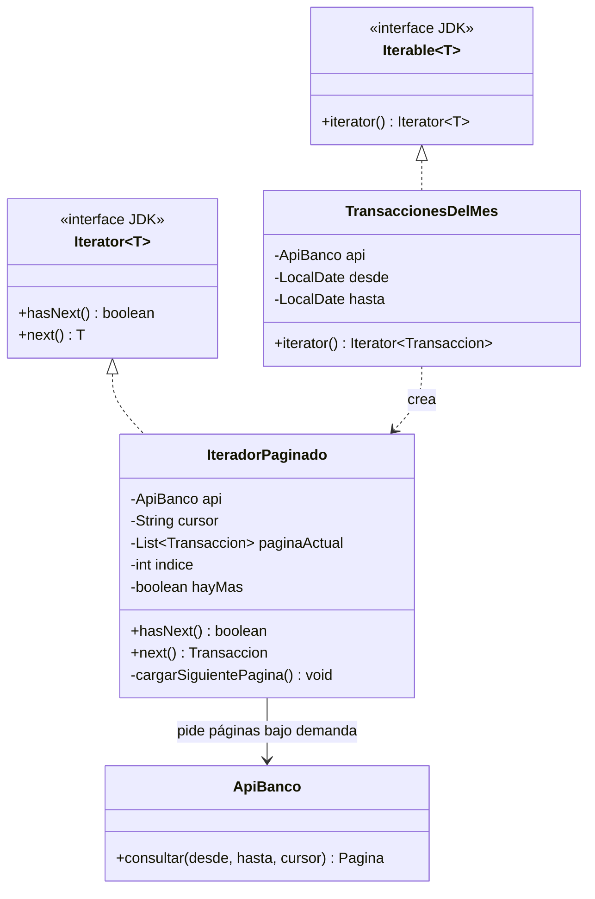
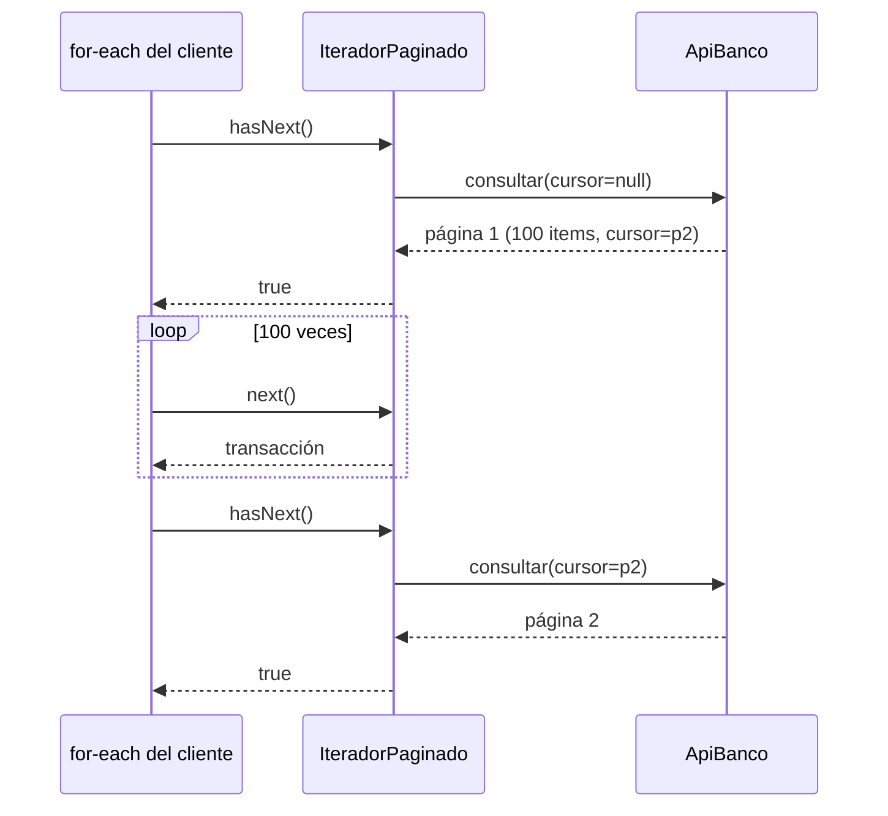

[← Volver al índice](README.md) · [← 16 Interpreter](16-interpreter.md) · [18 Mediator →](18-mediator.md)

# 17 · Iterator

> **Familia:** Comportamiento · *Iterador*

---

## En una frase

**Recorre los elementos de una colección sin que el cliente sepa cómo están guardados
por dentro.**

Como los canales de un televisor: presionas "siguiente" y aparece el siguiente canal. No
te importa si están en una lista, en un arreglo o en una tabla de la memoria del aparato.

---

## El enunciado

> **Ticket INT-1420**
> El servicio de conciliación tiene que recorrer **todas las transacciones del mes** que
> expone la API del banco. La API es paginada:
>
> ```
> GET /transacciones?desde=2026-07-01&hasta=2026-07-31&cursor=abc123
> -> { "items": [...100 transacciones...], "siguienteCursor": "def456" }
> ```
>
> Un mes tiene ~85.000 transacciones = 850 páginas. Además:
> - Traerlas todas a memoria de una vez revienta el heap.
> - A veces una página falla y hay que reintentar solo esa.
> - Algunos procesos solo necesitan las primeras 500 y pueden parar ahí.
>
> Hoy cada proceso que consume la API repite el mismo `while (cursor != null)` con su
> propio manejo de errores. Hay cinco copias, todas ligeramente distintas.

---

## El código que duele

```java
String cursor = null;
List<Transaccion> todas = new ArrayList<>();
do {
    var pagina = api.consultar(desde, hasta, cursor);   // ¿y si falla?
    todas.addAll(pagina.items());                       // 85.000 objetos en memoria
    cursor = pagina.siguienteCursor();
} while (cursor != null);

for (var t : todas) { conciliar(t); }
```

Problemas:

- **Toda la data en memoria** antes de procesar la primera transacción.
- La lógica de paginación está mezclada con la de negocio.
- Repetida en cinco lugares, con cinco manejos de error distintos.
- No se puede parar antes de tiempo: siempre trae las 850 páginas.

---

## La idea del patrón

Saca el "cómo se recorre" a un objeto aparte:

1. La colección expone un método que devuelve un **iterador**.
2. El iterador tiene dos operaciones: `hasNext()` (¿queda algo?) y `next()` (dame el
   siguiente y avanza).
3. **El iterador guarda la posición**, no la colección. Por eso puedes tener varios
   recorridos simultáneos e independientes.
4. El cliente usa `for (var x : coleccion)` y no sabe nada de páginas, cursores ni HTTP.

> **Regla de oro:** el cliente pide "el siguiente"; el iterador se encarga de conseguirlo.

---

## El diagrama



Lo que ocurre por dentro:



---

## La solución en Java 21

```java
import java.time.LocalDate;
import java.util.ArrayList;
import java.util.Iterator;
import java.util.List;
import java.util.NoSuchElementException;
import java.util.stream.Stream;
import java.util.stream.StreamSupport;

// ===============================================================
// EL MODELO Y LA API EXTERNA
// ===============================================================
record Transaccion(String id, LocalDate fecha, double monto, String concepto) {}

record Pagina(List<Transaccion> items, String siguienteCursor) {
    boolean esUltima() { return siguienteCursor == null; }
}

/** Simula la API paginada del banco. */
final class ApiBanco {
    private static final int TAMANO_PAGINA = 100;
    private final int totalTransacciones;
    private int llamadas = 0;

    ApiBanco(int totalTransacciones) { this.totalTransacciones = totalTransacciones; }

    Pagina consultar(LocalDate desde, LocalDate hasta, String cursor) {
        llamadas++;
        var offset = cursor == null ? 0 : Integer.parseInt(cursor);
        System.out.println("      [API] GET /transacciones?cursor=" + offset
                + "  (llamada #" + llamadas + ")");

        var items = new ArrayList<Transaccion>();
        var fin = Math.min(offset + TAMANO_PAGINA, totalTransacciones);
        for (int i = offset; i < fin; i++) {
            items.add(new Transaccion("TX-" + i, desde.plusDays(i % 30),
                    1000 + (i * 137) % 500_000, i % 3 == 0 ? "PAGO PSE" : "COMPRA"));
        }
        var siguiente = fin >= totalTransacciones ? null : String.valueOf(fin);
        return new Pagina(items, siguiente);
    }

    int llamadas() { return llamadas; }
}

// ===============================================================
// LA COLECCIÓN: se ve como cualquier Iterable
// ===============================================================
final class TransaccionesDelMes implements Iterable<Transaccion> {
    private final ApiBanco api;
    private final LocalDate desde;
    private final LocalDate hasta;

    TransaccionesDelMes(ApiBanco api, LocalDate desde, LocalDate hasta) {
        this.api = api; this.desde = desde; this.hasta = hasta;
    }

    @Override public Iterator<Transaccion> iterator() {
        return new IteradorPaginado();          // cada llamada, un recorrido NUEVO
    }

    /** Bonus: exponer también un Stream perezoso. */
    Stream<Transaccion> stream() {
        return StreamSupport.stream(spliterator(), false);
    }

    // ===========================================================
    // EL ITERADOR: aquí vive TODA la complejidad de la paginación
    // ===========================================================
    private final class IteradorPaginado implements Iterator<Transaccion> {
        private List<Transaccion> paginaActual = List.of();
        private int indice = 0;
        private String cursor = null;
        private boolean primeraCarga = true;

        @Override public boolean hasNext() {
            if (indice < paginaActual.size()) return true;      // queda en la página
            if (!primeraCarga && cursor == null) return false;  // no hay más páginas
            cargarSiguientePagina();
            return indice < paginaActual.size();
        }

        @Override public Transaccion next() {
            if (!hasNext()) throw new NoSuchElementException("No hay más transacciones");
            return paginaActual.get(indice++);
        }

        private void cargarSiguientePagina() {
            var pagina = conReintentos(() -> api.consultar(desde, hasta, cursor), 3);
            paginaActual = pagina.items();
            cursor = pagina.siguienteCursor();
            indice = 0;
            primeraCarga = false;
        }

        /** El manejo de errores vive AQUÍ, una sola vez, para todos los clientes. */
        private Pagina conReintentos(java.util.function.Supplier<Pagina> accion, int intentos) {
            RuntimeException ultima = null;
            for (int i = 1; i <= intentos; i++) {
                try { return accion.get(); }
                catch (RuntimeException e) {
                    ultima = e;
                    System.out.println("      [API] fallo, reintento " + i);
                }
            }
            throw new IllegalStateException("La API falló tras " + intentos + " intentos", ultima);
        }
    }
}

public class Demo {
    public static void main(String[] args) {
        var desde = LocalDate.of(2026, 7, 1);
        var hasta = LocalDate.of(2026, 7, 31);

        // ---------- Caso 1: recorrer todo con for-each ----------
        System.out.println("=== Conciliación completa (850 transacciones) ===");
        var api1 = new ApiBanco(850);
        var transacciones = new TransaccionesDelMes(api1, desde, hasta);

        double total = 0;
        int contador = 0;
        for (var t : transacciones) {          // <- for-each sobre una API HTTP paginada
            total += t.monto();
            contador++;
        }
        System.out.printf("  Procesadas: %,d | Total: $%,.0f | Llamadas HTTP: %d%n",
                contador, total, api1.llamadas());

        // ---------- Caso 2: parar antes de tiempo ----------
        System.out.println("\n=== Solo las primeras 250 (corte temprano) ===");
        var api2 = new ApiBanco(850);
        var iterador = new TransaccionesDelMes(api2, desde, hasta).iterator();
        for (int i = 0; i < 250 && iterador.hasNext(); i++) iterador.next();
        System.out.println("  Llamadas HTTP: " + api2.llamadas() + " (no 9)");

        // ---------- Caso 3: usarlo como Stream ----------
        System.out.println("\n=== Con Stream: los 3 PSE más grandes ===");
        var api3 = new ApiBanco(850);
        new TransaccionesDelMes(api3, desde, hasta).stream()
                .filter(t -> t.concepto().equals("PAGO PSE"))
                .sorted((a, b) -> Double.compare(b.monto(), a.monto()))
                .limit(3)
                .forEach(t -> System.out.printf("  %s  $%,.0f  %s%n",
                        t.id(), t.monto(), t.fecha()));

        // ---------- Caso 4: dos recorridos independientes a la vez ----------
        System.out.println("\n=== Dos iteradores simultáneos e independientes ===");
        var api4 = new ApiBanco(250);
        var coleccion = new TransaccionesDelMes(api4, desde, hasta);
        var it1 = coleccion.iterator();
        var it2 = coleccion.iterator();
        System.out.println("  it1 -> " + it1.next().id());
        System.out.println("  it1 -> " + it1.next().id());
        System.out.println("  it2 -> " + it2.next().id() + "  (empieza desde el principio)");
    }
}
```

### Salida (recortada)

```
=== Conciliación completa (850 transacciones) ===
      [API] GET /transacciones?cursor=0  (llamada #1)
      [API] GET /transacciones?cursor=100  (llamada #2)
      ... (9 llamadas en total)
  Procesadas: 850 | Total: $216,340,000 | Llamadas HTTP: 9

=== Solo las primeras 250 (corte temprano) ===
      [API] GET /transacciones?cursor=0  (llamada #1)
      [API] GET /transacciones?cursor=100  (llamada #2)
      [API] GET /transacciones?cursor=200  (llamada #3)
  Llamadas HTTP: 3 (no 9)

=== Dos iteradores simultáneos e independientes ===
  it1 -> TX-0
  it1 -> TX-1
  it2 -> TX-0  (empieza desde el principio)
```

Fíjate en el caso 2: **solo se trajeron 3 páginas de 9**. La carga perezosa es gratis
porque el iterador solo pide la siguiente página cuando alguien la necesita.

---

## Iterator externo vs. interno

### Externo (el clásico GoF) — el cliente controla el avance

```java
var it = coleccion.iterator();
while (it.hasNext()) { procesar(it.next()); }
```

✅ Puedes parar cuando quieras, avanzar a tu ritmo, tener varios recorridos.

### Interno — la colección controla y tú pasas la acción

```java
coleccion.forEach(this::procesar);
lista.stream().filter(...).map(...).toList();
```

✅ Más corto y más declarativo.
❌ Menos control: para "parar en el elemento 250" necesitas `limit()` o `takeWhile()`.

**En Java moderno usas los dos, y está bien.** El `for-each` es azúcar sintáctico sobre
el iterador externo, y `Stream` es el iterador interno.

---

## En Java rara vez lo escribes desde cero

Tienes tres formas de exponer un recorrido, de menos a más trabajo:

```java
// 1. Ya tienes una colección: úsala y ya.
List<Transaccion> lista = ...;
for (var t : lista) { ... }

// 2. Necesitas un recorrido perezoso simple: Stream.iterate o generate
Stream.iterate(primeraPagina, Pagina::tieneSiguiente, Pagina::siguiente)
      .flatMap(p -> p.items().stream());

// 3. Necesitas control fino (paginación, reintentos, recursos): implementa Iterator.
```

La opción 3 es la del ejemplo, y se justifica porque hay HTTP, cursores y reintentos de
por medio.

---

## Qué ganamos

| Antes | Después |
|---|---|
| 85.000 transacciones en memoria | 100 a la vez |
| `while (cursor != null)` repetido 5 veces | 1 iterador reutilizable |
| No se podía parar antes | `break`, `limit()`, `takeWhile()` funcionan |
| Manejo de errores distinto en cada copia | Uno solo, dentro del iterador |
| El negocio conocía cursores y páginas | El negocio ve un `for-each` |

---

## ✅ Cuándo usarlo

- Quieres exponer un recorrido **sin exponer la estructura interna**.
- La fuente de datos es paginada, remota, perezosa o infinita.
- Necesitas **varias formas de recorrer** la misma estructura (en orden, inverso, en
  profundidad, en anchura).
- Quieres que el cliente pueda **parar a mitad de camino** sin traerlo todo.
- Estás implementando tu propia estructura de datos (árbol, grafo, buffer circular).

## ⛔ Cuándo NO usarlo

- Ya usas `List`, `Set` o `Map`: **el JDK ya te da el iterador**. No lo reimplementes.
- La colección es pequeña y siempre se recorre completa: expón la lista y ya.
- **Ojo con la modificación concurrente:** si alguien modifica la colección mientras la
  recorres, `ConcurrentModificationException`. Usa `Iterator.remove()` o una copia.
- Un iterador que abre recursos (HTTP, archivos, conexiones) **necesita cierre**. Si es
  tu caso, considera devolver un `Stream` (que es `AutoCloseable`) y usar `try-with-resources`.

---

## Se parece a...

| Patrón | Diferencia clave |
|---|---|
| **[Composite](09-composite.md)** | Iterator es la forma estándar de recorrer un Composite sin exponer el árbol. |
| **[Factory Method](03-factory-method.md)** | `iterator()` **es** un Factory Method: la colección decide qué iterador concreto devuelve. |
| **[Visitor](24-visitor.md)** | Iterator recorre y entrega elementos uno a uno; Visitor recorre **y** aplica operaciones distintas según el tipo. |
| **[Memento](19-memento.md)** | Un iterador puede usar un memento para guardar y restaurar su posición. |
| **[Proxy](13-proxy.md)** | Un iterador perezoso sobre datos remotos hace algo parecido a un proxy virtual. |

---

## Dónde ya lo has visto

- Absolutamente todo `java.util`: `List`, `Set`, `Map.entrySet()`, `Deque`.
- El `for-each` de Java **es** un iterador: el compilador lo traduce a `hasNext()`/`next()`.
- `Scanner`, `BufferedReader.lines()`, `Files.walk(path)`.
- `ResultSet` de JDBC: `while (rs.next())`.
- `Stream` y `Spliterator`.
- Los cursores de MongoDB y los paginadores de los SDK de AWS (`S3Client.listObjectsV2Paginator`).

---

➡️ Siguiente: **[18 · Mediator](18-mediator.md)**

[← Volver al índice](README.md)
