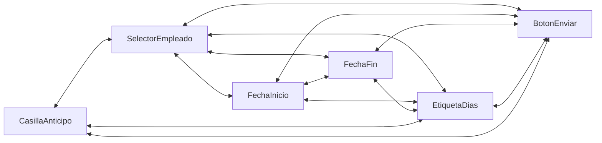
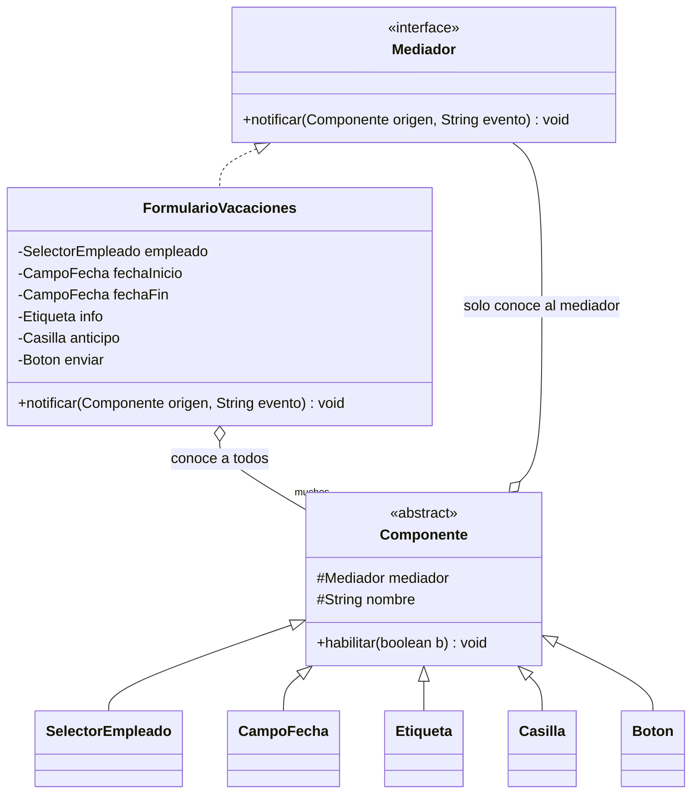
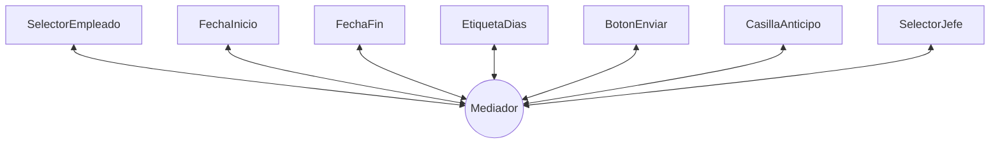

[← Volver al índice](README.md) · [← 17 Iterator](17-iterator.md) · [19 Memento →](19-memento.md)

# 18 · Mediator

> **Familia:** Comportamiento · *Mediador*

---

## En una frase

**Pon un coordinador en el medio para que los objetos dejen de hablarse todos con todos.**

Como la torre de control de un aeropuerto: los aviones no se coordinan entre ellos por
radio ("oye, yo aterrizo primero"). Todos hablan con la torre, y la torre decide.

---

## El enunciado

> **Ticket UI-1505**
> La pantalla de **solicitud de vacaciones** tiene siete componentes que dependen unos
> de otros:
>
> - Al elegir **empleado**, se cargan sus días disponibles y su jefe.
> - Al elegir **fecha de inicio**, la fecha fin no puede ser anterior.
> - Al cambiar cualquiera de las dos fechas, se recalculan los **días hábiles**.
> - Si los días solicitados **superan los disponibles**, sale una advertencia y se
>   habilita la casilla de "solicitar anticipo".
> - Si el periodo cruza un **festivo o cierre de fin de año**, aparece un aviso.
> - El botón **Enviar** solo se habilita si todo está válido.
> - El **jefe aprobador** se autocompleta, pero se puede cambiar si el jefe está de vacaciones.
>
> Hoy cada componente llama directamente a los otros. `SelectorEmpleado` conoce a
> `CampoFechaInicio`, `CampoFechaFin`, `EtiquetaDias`, `BotonEnviar`... y todos se
> conocen entre sí. Agregar un campo nuevo obliga a tocar los siete.

---

## El código que duele

```java
class SelectorEmpleado {
    private CampoFecha fechaInicio;
    private CampoFecha fechaFin;
    private EtiquetaDias etiqueta;
    private BotonEnviar boton;
    private CasillaAnticipo anticipo;
    private SelectorJefe jefe;             // conoce a TODOS

    void alSeleccionar(String empleadoId) {
        var dias = servicio.diasDisponibles(empleadoId);
        etiqueta.mostrar(dias);
        jefe.autocompletar(servicio.jefeDe(empleadoId));
        fechaInicio.habilitar();
        if (fechaInicio.valor() != null && fechaFin.valor() != null) {
            var solicitados = calcular(...);
            anticipo.setVisible(solicitados > dias);
            boton.setHabilitado(solicitados <= dias || anticipo.marcado());
        }
        // ... y esta misma lógica, copiada, en los otros seis componentes
    }
}
```

El grafo de dependencias:



Con 7 componentes que se conocen entre sí hay hasta **21 relaciones**. La fórmula es
n(n−1)/2: cada componente nuevo agrega n−1 relaciones. Ninguno se puede reutilizar ni
probar solo.

---

## La idea del patrón

Ningún componente conoce a otro. **Todos conocen solo al mediador**:

1. Cada componente, cuando le pasa algo, le avisa al mediador: `mediador.notificar(this, evento)`.
2. El mediador tiene **toda** la lógica de coordinación en un solo lugar.
3. El mediador es quien llama a los demás componentes.

Las relaciones bajan de **n(n−1)/2** a **n**.

> **Regla de oro:** los componentes se vuelven tontos y reutilizables; el mediador se
> queda con toda la inteligencia de la pantalla.

---

## El diagrama



El grafo ahora:



De 21 flechas a 7.

---

## La solución en Java 21

```java
import java.time.DayOfWeek;
import java.time.LocalDate;
import java.util.List;
import java.util.Map;

// ===============================================================
// LA INTERFAZ DEL MEDIADOR
// ===============================================================
interface Mediador {
    void notificar(Componente origen, String evento);
}

// ===============================================================
// LOS COMPONENTES: tontos, reutilizables, sin conocerse entre sí
// ===============================================================
abstract class Componente {
    protected Mediador mediador;
    protected final String nombre;
    protected boolean habilitado = true;
    protected boolean visible = true;

    protected Componente(String nombre) { this.nombre = nombre; }

    void asignarMediador(Mediador m) { this.mediador = m; }

    void habilitar(boolean valor) {
        if (habilitado != valor) {
            habilitado = valor;
            System.out.println("      [UI] " + nombre + (valor ? " habilitado" : " deshabilitado"));
        }
    }
    void mostrar(boolean valor) {
        if (visible != valor) {
            visible = valor;
            System.out.println("      [UI] " + nombre + (valor ? " visible" : " oculto"));
        }
    }
    String nombre() { return nombre; }
}

final class SelectorEmpleado extends Componente {
    private String seleccionado;
    SelectorEmpleado() { super("SelectorEmpleado"); }

    void seleccionar(String empleadoId) {
        this.seleccionado = empleadoId;
        System.out.println("  > Usuario selecciona empleado: " + empleadoId);
        mediador.notificar(this, "SELECCION");     // solo avisa; no coordina nada
    }
    String seleccionado() { return seleccionado; }
}

final class CampoFecha extends Componente {
    private LocalDate valor;
    CampoFecha(String nombre) { super(nombre); }

    void escribir(LocalDate fecha) {
        this.valor = fecha;
        System.out.println("  > Usuario escribe " + nombre + ": " + fecha);
        mediador.notificar(this, "CAMBIO");
    }
    LocalDate valor() { return valor; }
    void establecerSinNotificar(LocalDate f) { this.valor = f; }
}

final class Etiqueta extends Componente {
    private String texto = "";
    Etiqueta(String nombre) { super(nombre); }

    void texto(String texto) {
        this.texto = texto;
        System.out.println("      [UI] " + nombre + ": \"" + texto + "\"");
    }
}

final class Casilla extends Componente {
    private boolean marcada;
    Casilla(String nombre) { super(nombre); }

    void marcar(boolean valor) {
        this.marcada = valor;
        System.out.println("  > Usuario marca " + nombre + ": " + valor);
        mediador.notificar(this, "CAMBIO");
    }
    boolean marcada() { return marcada; }
}

final class Boton extends Componente {
    Boton(String nombre) { super(nombre); }
    void presionar() {
        if (!habilitado) { System.out.println("  > (botón deshabilitado)"); return; }
        System.out.println("  > Usuario presiona " + nombre);
        mediador.notificar(this, "CLIC");
    }
}

// ===============================================================
// SERVICIO DE APOYO (datos del negocio)
// ===============================================================
final class ServicioRrhh {
    private static final Map<String, Integer> DIAS = Map.of("ana", 15, "carlos", 4, "lucia", 22);
    private static final Map<String, String> JEFES = Map.of(
            "ana", "jefe.tech@empresa.com", "carlos", "jefe.ventas@empresa.com",
            "lucia", "jefe.admin@empresa.com");
    private static final List<LocalDate> FESTIVOS = List.of(
            LocalDate.of(2026, 8, 17), LocalDate.of(2026, 10, 12));

    int diasDisponibles(String id) { return DIAS.getOrDefault(id, 0); }
    String jefeDe(String id)       { return JEFES.getOrDefault(id, "sin.jefe@empresa.com"); }
    boolean hayFestivoEntre(LocalDate a, LocalDate b) {
        return FESTIVOS.stream().anyMatch(f -> !f.isBefore(a) && !f.isAfter(b));
    }
    int diasHabiles(LocalDate a, LocalDate b) {
        int dias = 0;
        for (var d = a; !d.isAfter(b); d = d.plusDays(1)) {
            if (d.getDayOfWeek() != DayOfWeek.SATURDAY && d.getDayOfWeek() != DayOfWeek.SUNDAY
                && !FESTIVOS.contains(d)) dias++;
        }
        return dias;
    }
}

// ===============================================================
// EL MEDIADOR: TODA la lógica de coordinación, en un solo lugar
// ===============================================================
final class FormularioVacaciones implements Mediador {

    private final SelectorEmpleado empleado = new SelectorEmpleado();
    private final CampoFecha fechaInicio = new CampoFecha("FechaInicio");
    private final CampoFecha fechaFin = new CampoFecha("FechaFin");
    private final Etiqueta infoDias = new Etiqueta("InfoDias");
    private final Etiqueta advertencia = new Etiqueta("Advertencia");
    private final Casilla anticipo = new Casilla("SolicitarAnticipo");
    private final Boton enviar = new Boton("Enviar");
    private final ServicioRrhh rrhh = new ServicioRrhh();

    private int diasDisponibles = 0;
    private String jefeAprobador;

    FormularioVacaciones() {
        List.of(empleado, fechaInicio, fechaFin, infoDias, advertencia, anticipo, enviar)
            .forEach(c -> c.asignarMediador(this));
        // Estado inicial
        fechaInicio.habilitar(false);
        fechaFin.habilitar(false);
        anticipo.mostrar(false);
        advertencia.mostrar(false);
        enviar.habilitar(false);
    }

    @Override public void notificar(Componente origen, String evento) {
        // Aquí se lee, de un vistazo, TODA la lógica de la pantalla.
        if (origen == empleado && evento.equals("SELECCION")) {
            diasDisponibles = rrhh.diasDisponibles(empleado.seleccionado());
            jefeAprobador = rrhh.jefeDe(empleado.seleccionado());
            infoDias.texto("Días disponibles: " + diasDisponibles
                    + " | Aprueba: " + jefeAprobador);
            fechaInicio.habilitar(true);
            fechaFin.habilitar(false);
            revalidar();
        }
        else if (origen == fechaInicio && evento.equals("CAMBIO")) {
            fechaFin.habilitar(true);
            // Regla: la fecha fin no puede ser anterior a la de inicio
            if (fechaFin.valor() != null && fechaFin.valor().isBefore(fechaInicio.valor())) {
                fechaFin.establecerSinNotificar(fechaInicio.valor());
                System.out.println("      [UI] FechaFin ajustada a " + fechaInicio.valor());
            }
            revalidar();
        }
        else if (origen == fechaFin && evento.equals("CAMBIO")) {
            revalidar();
        }
        else if (origen == anticipo && evento.equals("CAMBIO")) {
            revalidar();
        }
        else if (origen == enviar && evento.equals("CLIC")) {
            System.out.println("      [OK] Solicitud enviada a " + jefeAprobador
                    + " por " + diasSolicitados() + " días hábiles.");
        }
    }

    private int diasSolicitados() {
        if (fechaInicio.valor() == null || fechaFin.valor() == null) return 0;
        return rrhh.diasHabiles(fechaInicio.valor(), fechaFin.valor());
    }

    /** Todas las reglas cruzadas, en un método. */
    private void revalidar() {
        var inicio = fechaInicio.valor();
        var fin = fechaFin.valor();
        if (inicio == null || fin == null) { enviar.habilitar(false); return; }

        var solicitados = diasSolicitados();
        infoDias.texto("Solicitados: " + solicitados + " de " + diasDisponibles + " disponibles");

        var excede = solicitados > diasDisponibles;
        anticipo.mostrar(excede);
        advertencia.mostrar(excede || rrhh.hayFestivoEntre(inicio, fin));

        if (excede) {
            advertencia.texto("Excede en " + (solicitados - diasDisponibles)
                    + " días. Marca 'solicitar anticipo' para continuar.");
        } else if (rrhh.hayFestivoEntre(inicio, fin)) {
            advertencia.texto("El periodo incluye días festivos (no se descuentan).");
        }

        enviar.habilitar(!excede || anticipo.marcada());
    }

    // Métodos para simular la interacción del usuario
    SelectorEmpleado empleado() { return empleado; }
    CampoFecha fechaInicio()    { return fechaInicio; }
    CampoFecha fechaFin()       { return fechaFin; }
    Casilla anticipo()          { return anticipo; }
    Boton enviar()              { return enviar; }
}

public class Demo {
    public static void main(String[] args) {
        var form = new FormularioVacaciones();

        System.out.println("=== Caso 1: solicitud dentro del cupo ===");
        form.empleado().seleccionar("ana");
        form.fechaInicio().escribir(LocalDate.of(2026, 8, 17));
        form.fechaFin().escribir(LocalDate.of(2026, 8, 21));
        form.enviar().presionar();

        System.out.println("\n=== Caso 2: solicitud que excede el cupo ===");
        var form2 = new FormularioVacaciones();
        form2.empleado().seleccionar("carlos");           // solo 4 días
        form2.fechaInicio().escribir(LocalDate.of(2026, 9, 1));
        form2.fechaFin().escribir(LocalDate.of(2026, 9, 18));
        form2.enviar().presionar();                        // deshabilitado
        form2.anticipo().marcar(true);
        form2.enviar().presionar();                        // ahora sí
    }
}
```

### Salida (recortada)

```
=== Caso 1: solicitud dentro del cupo ===
  > Usuario selecciona empleado: ana
      [UI] InfoDias: "Días disponibles: 15 | Aprueba: jefe.tech@empresa.com"
      [UI] FechaInicio habilitado
  > Usuario escribe FechaInicio: 2026-08-17
      [UI] FechaFin habilitado
  > Usuario escribe FechaFin: 2026-08-21
      [UI] InfoDias: "Solicitados: 4 de 15 disponibles"
      [UI] Advertencia visible
      [UI] Advertencia: "El periodo incluye días festivos (no se descuentan)."
      [UI] Enviar habilitado
  > Usuario presiona Enviar
      [OK] Solicitud enviada a jefe.tech@empresa.com por 4 días hábiles.

=== Caso 2: solicitud que excede el cupo ===
  > Usuario selecciona empleado: carlos
      [UI] InfoDias: "Días disponibles: 4 | Aprueba: jefe.ventas@empresa.com"
  ...
      [UI] Advertencia: "Excede en 8 días. Marca 'solicitar anticipo' para continuar."
  > (botón deshabilitado)
  > Usuario marca SolicitarAnticipo: true
      [UI] Enviar habilitado
  > Usuario presiona Enviar
      [OK] Solicitud enviada a jefe.ventas@empresa.com por 12 días hábiles.
```

---

## El peligro real: el mediador Dios

Este patrón tiene un efecto secundario garantizado: **toda la complejidad se muda al
mediador**. Si la pantalla crece, el mediador crece con ella hasta volverse un monstruo.

Cómo mantenerlo bajo control:

1. **Un mediador por pantalla o por caso de uso**, nunca uno global para toda la app.
2. Extrae la lógica de negocio a servicios (`ServicioRrhh` en el ejemplo). El mediador
   solo **coordina**, no calcula reglas de negocio.
3. Si el `notificar()` pasa de ~10 ramas, es señal de que la pantalla hace demasiado:
   divídela, o divide el mediador en submediadores.
4. Considera si un **[Observer](20-observer.md)** con eventos con nombre te queda mejor:
   ahí no hay un punto central que lo sepa todo.

---

## Mediator vs. Observer

Son los dos patrones que se confunden más entre sí:

| | Mediator | Observer |
|---|---|---|
| **Quién sabe qué** | El mediador conoce a todos y sabe qué hacer con cada evento | El emisor no conoce a nadie; los suscriptores deciden |
| **Dirección** | Bidireccional: componentes ↔ mediador | Unidireccional: emisor → suscriptores |
| **La lógica vive en** | El mediador (centralizada) | Cada suscriptor (distribuida) |
| **Bueno para** | Reglas cruzadas complejas entre pocos objetos conocidos | Muchos interesados desconocidos en un mismo hecho |
| **Ejemplo típico** | Formulario, torre de control, sala de chat | Eventos de dominio, notificaciones, pub/sub |

Y se combinan muy seguido: un mediador implementado sobre un bus de eventos es lo normal
en aplicaciones grandes.

---

## ✅ Cuándo usarlo

- Un conjunto de objetos se comunica en un enredo de **muchos a muchos**.
- Cambiar un componente te obliga a tocar los otros seis.
- No puedes reutilizar un componente porque arrastra referencias a sus vecinos.
- Formularios con reglas cruzadas, wizards, tableros, salas de chat, coordinación de
  dispositivos o de servicios.

## ⛔ Cuándo NO usarlo

- Solo hay dos o tres objetos con una relación simple: el mediador es burocracia.
- La comunicación ya es unidireccional y clara → **[Observer](20-observer.md)**.
- Corres el riesgo de crear un mediador Dios sin poder dividirlo después.
- El mediador se convertiría en un punto único de fallo o en un cuello de botella de
  rendimiento (ojo con esto en sistemas distribuidos).

---

## Se parece a...

| Patrón | Diferencia clave |
|---|---|
| **[Observer](20-observer.md)** | Ver la tabla de arriba. Se combinan bien. |
| **[Facade](11-facade.md)** | Facade **solo llama hacia abajo** y los subsistemas no la conocen. En Mediator la comunicación es **bidireccional**: los componentes le hablan al mediador. |
| **[Command](15-command.md)** | Lo que se notifica al mediador puede modelarse como un Command. |
| **[Singleton](02-singleton.md)** | Los mediadores suelen ser únicos por pantalla, pero no hace falta que sean singletons globales. |

---

## Dónde ya lo has visto

- `java.util.Timer` coordinando `TimerTask`.
- `ExecutorService`: media entre quien envía tareas y los hilos que las ejecutan.
- Los controladores de MVC: median entre la vista y el modelo.
- Un **API Gateway** o un **service mesh**: mediadores a escala de red.
- Kubernetes: el control plane media entre todos los componentes del clúster.
- El patrón "MediatR" de .NET, y librerías equivalentes en Java para CQRS.

---

➡️ Siguiente: **[19 · Memento](19-memento.md)**

[← Volver al índice](README.md)
