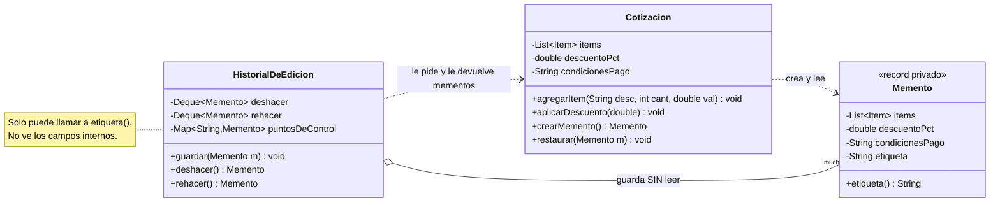
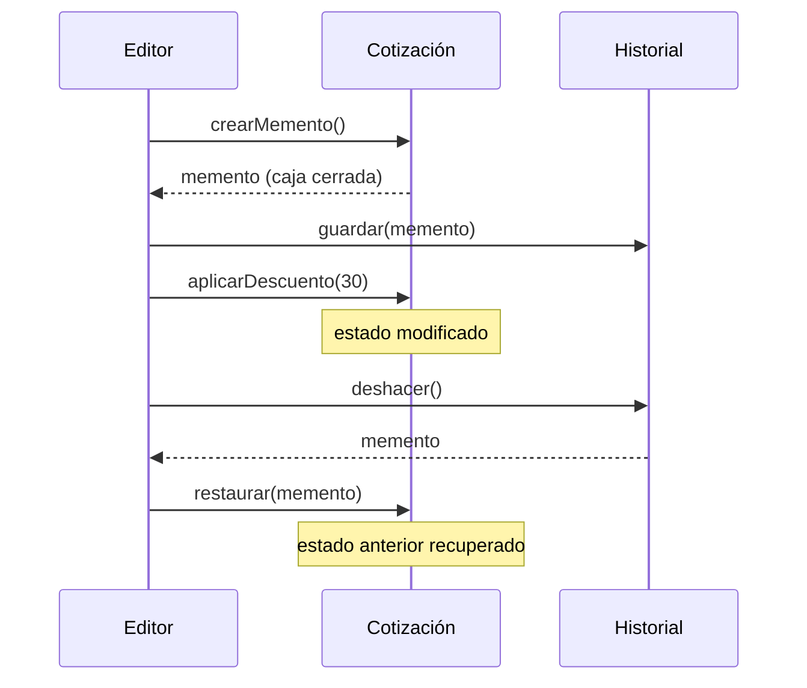

[← Volver al índice](README.md) · [← 18 Mediator](18-mediator.md) · [20 Observer →](20-observer.md)

# 19 · Memento

> **Familia:** Comportamiento · *Recuerdo*

---

## En una frase

**Guarda una foto del estado interno de un objeto para poder volver a ella después, sin
romper su encapsulamiento.**

Como los puntos de guardado de un videojuego: guardas la partida, sigues jugando, te
matan, y vuelves al punto guardado. El juego nunca te dejó editar el archivo de guardado
a mano.

---

## El enunciado

> **Ticket DOC-1610**
> El editor de **cotizaciones** permite armar un documento comercial: ítems, descuentos,
> condiciones de pago, vigencia, notas.
>
> Comercial pide:
> 1. **Ctrl+Z / Ctrl+Y** clásicos, con al menos 20 pasos de historial.
> 2. **Puntos de control con nombre**: "guardar esta versión como 'Propuesta enviada al
>    cliente'" y poder volver a ella después de experimentar.
> 3. Que el historial **no exponga los campos internos** de la cotización: el equipo de
>    Auditoría no quiere que un módulo cualquiera pueda escribir directamente los totales.
>
> Hoy el "deshacer" se hace guardando copias de la cotización en una lista pública, y
> cualquier clase puede modificarlas.

---

## El código que duele

```java
// ❌ Se exponen todos los campos para poder guardarlos y restaurarlos
class Cotizacion {
    public List<Item> items;             // público para que el historial los copie
    public double descuento;
    public String condicionesPago;
    public double total;                 // ¡cualquiera puede escribir el total!
}

class Historial {
    List<Cotizacion> versiones = new ArrayList<>();
    void guardar(Cotizacion c) {
        var copia = new Cotizacion();
        copia.items = c.items;           // ⚠️ misma lista: no es copia
        copia.total = c.total;
        versiones.add(copia);
    }
}
```

Dos pecados: se rompió el encapsulamiento **y** la "copia" comparte la lista original.

---

## La idea del patrón

Tres roles bien separados:

| Rol | Quién | Qué hace |
|---|---|---|
| **Originador** | `Cotizacion` | Sabe crear su propio memento y restaurarse desde uno. **Es el único que ve el contenido.** |
| **Memento** | `Cotizacion.Memento` | Una foto inmutable del estado. Opaca para todos menos el originador. |
| **Cuidador** | `HistorialDeEdicion` | Guarda mementos y los devuelve. **Nunca mira lo que hay dentro.** |

En Java se logra con una **clase interna privada** o un `record` privado: el cuidador
puede guardar el objeto pero no puede leer sus campos.

> **Regla de oro:** el cuidador transporta la caja cerrada; solo el originador tiene la llave.

---

## El diagrama



Cómo funciona el ciclo:



---

## La solución en Java 21

```java
import java.time.LocalDate;
import java.util.ArrayDeque;
import java.util.ArrayList;
import java.util.Deque;
import java.util.LinkedHashMap;
import java.util.List;
import java.util.Map;
import java.util.Optional;

record Item(String descripcion, int cantidad, double valorUnitario) {
    double subtotal() { return cantidad * valorUnitario; }
}

// ===============================================================
// EL ORIGINADOR
// ===============================================================
final class Cotizacion {

    private final String numero;
    private final List<Item> items = new ArrayList<>();
    private double descuentoPct = 0;
    private String condicionesPago = "Contado";
    private LocalDate vigenciaHasta = LocalDate.now().plusDays(15);
    private String notas = "";

    Cotizacion(String numero) { this.numero = numero; }

    // ---------- Operaciones normales ----------
    void agregarItem(String descripcion, int cantidad, double valor) {
        items.add(new Item(descripcion, cantidad, valor));
    }
    void quitarUltimoItem() { if (!items.isEmpty()) items.removeLast(); }
    void aplicarDescuento(double pct) { this.descuentoPct = pct; }
    void condicionesPago(String c) { this.condicionesPago = c; }
    void vigenciaHasta(LocalDate f) { this.vigenciaHasta = f; }
    void notas(String n) { this.notas = n; }

    double subtotal() { return items.stream().mapToDouble(Item::subtotal).sum(); }
    double total()    { return subtotal() * (1 - descuentoPct / 100); }

    // ===========================================================
    // EL MEMENTO: record PRIVADO. Nadie fuera de Cotizacion ve sus campos.
    // ===========================================================
    private record EstadoInterno(List<Item> items, double descuentoPct,
                                 String condicionesPago, LocalDate vigenciaHasta,
                                 String notas, String etiqueta) implements Memento {
        @Override public String etiqueta() { return etiqueta; }
    }

    /** Lo ÚNICO que el mundo exterior puede hacer con un memento. */
    public interface Memento {
        String etiqueta();
    }

    /** Crea la foto. Copia profunda de lo mutable. */
    Memento crearMemento(String etiqueta) {
        return new EstadoInterno(List.copyOf(items), descuentoPct, condicionesPago,
                                 vigenciaHasta, notas, etiqueta);
    }

    /** Restaura desde la foto. Solo el originador sabe abrirla. */
    void restaurar(Memento memento) {
        if (!(memento instanceof EstadoInterno estado)) {
            throw new IllegalArgumentException("Memento de otro originador");
        }
        this.items.clear();
        this.items.addAll(estado.items());
        this.descuentoPct = estado.descuentoPct();
        this.condicionesPago = estado.condicionesPago();
        this.vigenciaHasta = estado.vigenciaHasta();
        this.notas = estado.notas();
    }

    void imprimir() {
        System.out.println("  Cotización " + numero + " (vence " + vigenciaHasta + ")");
        items.forEach(i -> System.out.printf("    - %-24s %2d x $%,10.0f = $%,12.0f%n",
                i.descripcion(), i.cantidad(), i.valorUnitario(), i.subtotal()));
        System.out.printf("    Subtotal: $%,.0f | Descuento: %.0f%% | TOTAL: $%,.0f%n",
                subtotal(), descuentoPct, total());
        System.out.println("    Pago: " + condicionesPago
                + (notas.isBlank() ? "" : " | Notas: " + notas));
    }
}

// ===============================================================
// EL CUIDADOR: guarda mementos sin poder mirarlos por dentro
// ===============================================================
final class HistorialDeEdicion {
    private static final int MAX_HISTORIAL = 20;

    private final Deque<Cotizacion.Memento> pilaDeshacer = new ArrayDeque<>();
    private final Deque<Cotizacion.Memento> pilaRehacer = new ArrayDeque<>();
    private final Map<String, Cotizacion.Memento> puntosDeControl = new LinkedHashMap<>();

    void guardar(Cotizacion.Memento memento) {
        pilaDeshacer.push(memento);
        pilaRehacer.clear();                              // nueva rama: se pierde el rehacer
        while (pilaDeshacer.size() > MAX_HISTORIAL) pilaDeshacer.removeLast();
        System.out.println("      [historial] guardado: " + memento.etiqueta()
                + " (" + pilaDeshacer.size() + " pasos)");
    }

    Optional<Cotizacion.Memento> deshacer(Cotizacion.Memento estadoActual) {
        if (pilaDeshacer.isEmpty()) return Optional.empty();
        pilaRehacer.push(estadoActual);
        var memento = pilaDeshacer.pop();
        System.out.println("      [historial] ↩ volviendo a: " + memento.etiqueta());
        return Optional.of(memento);
    }

    Optional<Cotizacion.Memento> rehacer(Cotizacion.Memento estadoActual) {
        if (pilaRehacer.isEmpty()) return Optional.empty();
        pilaDeshacer.push(estadoActual);
        var memento = pilaRehacer.pop();
        System.out.println("      [historial] ↪ rehaciendo: " + memento.etiqueta());
        return Optional.of(memento);
    }

    void marcarPuntoDeControl(String nombre, Cotizacion.Memento memento) {
        puntosDeControl.put(nombre, memento);
        System.out.println("      [historial] 🏁 punto de control '" + nombre + "'");
    }

    Optional<Cotizacion.Memento> puntoDeControl(String nombre) {
        return Optional.ofNullable(puntosDeControl.get(nombre));
    }

    void listar() {
        System.out.println("      Deshacer disponibles: " + pilaDeshacer.size()
                + " | Rehacer: " + pilaRehacer.size()
                + " | Puntos de control: " + puntosDeControl.keySet());
    }
}

public class Demo {
    public static void main(String[] args) {
        var cotizacion = new Cotizacion("COT-2026-0451");
        var historial = new HistorialDeEdicion();

        System.out.println("=== 1. Se arma la cotización ===");
        cotizacion.agregarItem("Licencia CRM anual", 20, 400_000);
        cotizacion.agregarItem("Implementación", 1, 12_000_000);
        historial.guardar(cotizacion.crearMemento("Versión inicial"));
        cotizacion.imprimir();

        System.out.println("\n=== 2. Se agrega soporte y se marca punto de control ===");
        cotizacion.agregarItem("Soporte premium 12 meses", 12, 900_000);
        cotizacion.condicionesPago("30 días");
        var enviada = cotizacion.crearMemento("Propuesta enviada al cliente");
        historial.guardar(enviada);
        historial.marcarPuntoDeControl("enviada-al-cliente", enviada);
        cotizacion.imprimir();

        System.out.println("\n=== 3. Negociación: se experimenta con descuentos ===");
        cotizacion.aplicarDescuento(10);
        historial.guardar(cotizacion.crearMemento("Descuento 10%"));

        cotizacion.aplicarDescuento(25);
        cotizacion.notas("Descuento por volumen aprobado por gerencia");
        historial.guardar(cotizacion.crearMemento("Descuento 25%"));

        cotizacion.aplicarDescuento(40);
        cotizacion.quitarUltimoItem();
        historial.guardar(cotizacion.crearMemento("Descuento 40% sin soporte"));
        cotizacion.imprimir();

        System.out.println("\n=== 4. Ctrl+Z dos veces ===");
        historial.deshacer(cotizacion.crearMemento("actual"))
                 .ifPresent(cotizacion::restaurar);
        historial.deshacer(cotizacion.crearMemento("actual"))
                 .ifPresent(cotizacion::restaurar);
        cotizacion.imprimir();

        System.out.println("\n=== 5. Ctrl+Y (rehacer) ===");
        historial.rehacer(cotizacion.crearMemento("actual"))
                 .ifPresent(cotizacion::restaurar);
        cotizacion.imprimir();

        System.out.println("\n=== 6. Volver al punto de control con nombre ===");
        historial.puntoDeControl("enviada-al-cliente").ifPresent(cotizacion::restaurar);
        cotizacion.imprimir();

        System.out.println();
        historial.listar();

        System.out.println("\n=== 7. Lo que el cuidador PUEDE hacer con un memento ===");
        var m = cotizacion.crearMemento("prueba");
        System.out.println("  m.etiqueta() -> " + m.etiqueta());
        System.out.println("  m.total()    -> no compila: el memento no expone nada más");
    }
}
```

### Salida (recortada)

```
=== 1. Se arma la cotización ===
      [historial] guardado: Versión inicial (1 pasos)
  Cotización COT-2026-0451 (vence 2026-08-29)
    - Licencia CRM anual       20 x $   400,000 = $   8,000,000
    - Implementación            1 x $12,000,000 = $  12,000,000
    Subtotal: $20,000,000 | Descuento: 0% | TOTAL: $20,000,000

=== 3. Negociación: se experimenta con descuentos ===
      [historial] guardado: Descuento 10% (3 pasos)
      [historial] guardado: Descuento 25% (4 pasos)
      [historial] guardado: Descuento 40% sin soporte (5 pasos)
    Subtotal: $20,000,000 | Descuento: 40% | TOTAL: $12,000,000

=== 4. Ctrl+Z dos veces ===
      [historial] ↩ volviendo a: Descuento 40% sin soporte
      [historial] ↩ volviendo a: Descuento 25%
    Subtotal: $30,800,000 | Descuento: 25% | TOTAL: $23,100,000

=== 6. Volver al punto de control con nombre ===
    Subtotal: $30,800,000 | Descuento: 0% | TOTAL: $30,800,000
    Pago: 30 días

      Deshacer disponibles: 3 | Rehacer: 1 | Puntos de control: [enviada-al-cliente]
```

---

## Lo que hace que esto sea un Memento de verdad

Fíjate en el punto 7 de la salida. `HistorialDeEdicion` guarda mementos, los apila, los
mueve entre pilas... pero **no puede leer ni un solo campo**. Solo ve `etiqueta()`.

Eso se logró con:

```java
public interface Memento { String etiqueta(); }         // lo público: casi nada
private record EstadoInterno(...) implements Memento {} // lo privado: todo el estado
```

Si en cambio hubieras hecho el memento un `record` público con todos los campos, tendrías
una copia del objeto, no un memento: cualquiera podría construir uno falso o leer datos
que no debería.

---

## El costo: memoria

Cada memento es una copia completa del estado. Con 20 pasos de historial y un objeto
grande, eso pesa. Estrategias:

| Estrategia | Cuándo |
|---|---|
| **Límite de historial** (como el `MAX_HISTORIAL` del ejemplo) | Casi siempre. Lo más simple. |
| **Mementos incrementales**: guardar solo el *delta* | Estados muy grandes con cambios pequeños. Más complejo. |
| **Command con `deshacer()`** en vez de mementos | Cuando la operación inversa es fácil de calcular. Ver [Command](15-command.md). |
| **Estructuras persistentes / inmutables** | Si el estado ya es inmutable, "guardar" es solo guardar la referencia: costo cero. |

Ese último punto es importante: **si tu objeto es inmutable, el Memento sale gratis**.
Un `record` inmutable ya *es* su propia foto; el historial es solo una `Deque<MiRecord>`.

---

## ✅ Cuándo usarlo

- Necesitas **deshacer/rehacer** o historial de versiones.
- Necesitas **puntos de guardado** o *checkpoints* antes de una operación arriesgada.
- Quieres poder **revertir una transacción** si algo falla a mitad de camino.
- Necesitas guardar el estado **sin exponer los campos internos** del objeto.
- Comparación de versiones ("¿qué cambió entre la propuesta enviada y la actual?").

## ⛔ Cuándo NO usarlo

- El estado es enorme y se guarda muy seguido → la memoria se dispara.
- La operación inversa es trivial de calcular → **[Command](15-command.md)** con
  `deshacer()` gasta mucho menos.
- El objeto ya es **inmutable** → guardar la referencia es todo lo que necesitas.
- Tu framework ya te lo da: las transacciones de una base de datos son mementos a otro
  nivel, y el control de versiones de un CMS también.

---

## Se parece a...

| Patrón | Diferencia clave |
|---|---|
| **[Command](15-command.md)** | Command guarda **la operación** (y cómo invertirla); Memento guarda **el estado completo**. Se combinan: un comando puede pedir un memento antes de ejecutarse. |
| **[Prototype](06-prototype.md)** | Prototype clona para **crear objetos nuevos**; Memento copia para **restaurar el mismo objeto**. Estructura parecida, intención opuesta. |
| **[State](21-state.md)** | State cambia el comportamiento según el estado; Memento guarda y restaura ese estado. |
| **[Iterator](17-iterator.md)** | Un iterador puede usar un memento para recordar su posición. |

---

## Dónde ya lo has visto

- Ctrl+Z de cualquier editor.
- Los puntos de guardado de un videojuego.
- `Object.clone()` y los constructores de copia (la versión sin encapsulamiento).
- Los *savepoints* de JDBC: `connection.setSavepoint()` / `rollback(savepoint)`.
- Las instantáneas (*snapshots*) de una máquina virtual o de un volumen en la nube.
- El historial de versiones de Google Docs o de un wiki.
- `git stash` y `git commit`: cada commit es un memento del árbol de trabajo.

---

➡️ Siguiente: **[20 · Observer](20-observer.md)**

[← Volver al índice](README.md)
