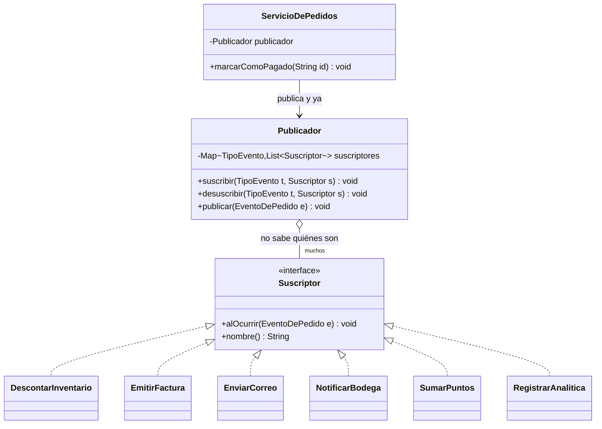
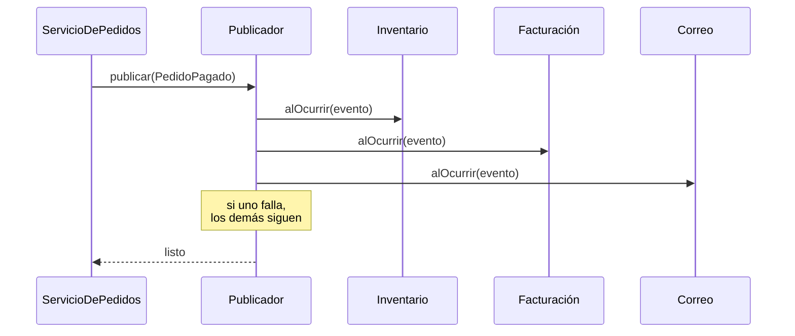

[← Volver al índice](README.md) · [← 19 Memento](19-memento.md) · [21 State →](21-state.md)

# 20 · Observer

> **Familia:** Comportamiento · *Observador*

---

## En una frase

**Un objeto anuncia que algo pasó, y todos los interesados se enteran automáticamente,
sin que el que anuncia sepa quiénes son.**

Como el altavoz de un aeropuerto: anuncia "vuelo 204 abordando por la puerta 12". No sabe
cuántos pasajeros hay ni quiénes son. Los que están esperando ese vuelo reaccionan.

---

## El enunciado

> **Ticket PED-1720**
> Cuando un pedido se marca como **pagado**, hoy hay que:
>
> 1. Descontar el inventario.
> 2. Generar la factura electrónica.
> 3. Enviar el correo de confirmación al cliente.
> 4. Notificar a la bodega para que prepare el despacho.
> 5. Sumar puntos al programa de fidelización.
> 6. Registrar el evento para analítica.
>
> El método `marcarComoPagado()` llama a los seis servicios directamente. Ya va por 120
> líneas. Y esta semana llegaron dos requerimientos más: notificar al canal de Slack de
> ventas, y disparar una encuesta de satisfacción a los 3 días.
>
> Peor: cuando el servicio de fidelización estuvo caído, **el pedido no se pudo pagar**,
> porque la excepción tumbó todo el flujo.

---

## El código que duele

```java
class ServicioDePedidos {
    void marcarComoPagado(String pedidoId) {
        var pedido = repo.buscar(pedidoId);
        pedido.setEstado("PAGADO");
        repo.guardar(pedido);

        inventarioService.descontar(pedido);          // si falla, todo falla
        facturacionService.emitir(pedido);
        correoService.enviarConfirmacion(pedido);
        bodegaService.crearOrdenDespacho(pedido);
        fidelizacionService.sumarPuntos(pedido);      // ← este tumbó producción
        analiticaService.registrar(pedido);
        slackService.notificar(pedido);               // el requerimiento de esta semana
        // ...
    }
}
```

`ServicioDePedidos` conoce **siete** servicios distintos. Cada requerimiento nuevo lo hace
más grande, y cualquiera de los siete puede tumbar la operación principal.

---

## La idea del patrón

Invierte la dirección de la dependencia:

1. El **sujeto** (`Pedido` o un publicador) mantiene una lista de **observadores**.
2. Los observadores **se suscriben** a los eventos que les interesan.
3. Cuando algo pasa, el sujeto **notifica a todos** sin saber quiénes son ni qué hacen.
4. Agregar un comportamiento nuevo = agregar un observador. **Cero cambios en el sujeto.**

> **Regla de oro:** el que publica no debe saber quién escucha.

---

## El diagrama



El flujo:



---

## La solución en Java 21

```java
import java.time.LocalDateTime;
import java.util.ArrayList;
import java.util.EnumMap;
import java.util.List;
import java.util.Map;
import java.util.concurrent.CopyOnWriteArrayList;

// ===============================================================
// LOS EVENTOS
// ===============================================================
record LineaPedido(String sku, int cantidad, double valorUnitario) {}

record Pedido(String id, String clienteId, String correoCliente,
              List<LineaPedido> lineas, double total) {}

enum TipoEvento { PEDIDO_CREADO, PEDIDO_PAGADO, PEDIDO_DESPACHADO, PEDIDO_CANCELADO }

sealed interface EventoDePedido
        permits PedidoCreado, PedidoPagado, PedidoDespachado, PedidoCancelado {
    Pedido pedido();
    LocalDateTime momento();
    TipoEvento tipo();
}

record PedidoCreado(Pedido pedido, LocalDateTime momento) implements EventoDePedido {
    public TipoEvento tipo() { return TipoEvento.PEDIDO_CREADO; }
}
record PedidoPagado(Pedido pedido, LocalDateTime momento, String medioDePago)
        implements EventoDePedido {
    public TipoEvento tipo() { return TipoEvento.PEDIDO_PAGADO; }
}
record PedidoDespachado(Pedido pedido, LocalDateTime momento, String guia)
        implements EventoDePedido {
    public TipoEvento tipo() { return TipoEvento.PEDIDO_DESPACHADO; }
}
record PedidoCancelado(Pedido pedido, LocalDateTime momento, String motivo)
        implements EventoDePedido {
    public TipoEvento tipo() { return TipoEvento.PEDIDO_CANCELADO; }
}

// ===============================================================
// EL OBSERVADOR
// ===============================================================
interface Suscriptor {
    void alOcurrir(EventoDePedido evento);
    default String nombre() { return getClass().getSimpleName(); }
    /** Si es true, un fallo aquí SÍ debe tumbar la operación principal. */
    default boolean esCritico() { return false; }
}

// ===============================================================
// EL SUJETO / PUBLICADOR
// ===============================================================
final class PublicadorDeEventos {
    // CopyOnWriteArrayList: seguro si alguien se suscribe mientras se está notificando
    private final Map<TipoEvento, List<Suscriptor>> suscriptores = new EnumMap<>(TipoEvento.class);

    void suscribir(TipoEvento tipo, Suscriptor s) {
        suscriptores.computeIfAbsent(tipo, t -> new CopyOnWriteArrayList<>()).add(s);
        System.out.println("  [bus] " + s.nombre() + " suscrito a " + tipo);
    }

    void desuscribir(TipoEvento tipo, Suscriptor s) {
        suscriptores.getOrDefault(tipo, List.of()).remove(s);
        System.out.println("  [bus] " + s.nombre() + " desuscrito de " + tipo);
    }

    void publicar(EventoDePedido evento) {
        var lista = suscriptores.getOrDefault(evento.tipo(), List.of());
        System.out.println("\n  [bus] publicando " + evento.tipo()
                + " a " + lista.size() + " suscriptores");

        for (var s : lista) {
            try {
                s.alOcurrir(evento);
            } catch (RuntimeException e) {
                // Un suscriptor que falla NO tumba a los demás.
                System.out.println("    ⚠ " + s.nombre() + " falló: " + e.getMessage());
                if (s.esCritico()) {
                    throw new IllegalStateException(
                        "Falló un suscriptor crítico: " + s.nombre(), e);
                }
            }
        }
    }
}

// ===============================================================
// LOS SUSCRIPTORES CONCRETOS
// ===============================================================
final class DescontarInventario implements Suscriptor {
    @Override public boolean esCritico() { return true; }   // este sí es crítico
    @Override public void alOcurrir(EventoDePedido e) {
        e.pedido().lineas().forEach(l ->
            System.out.println("    [inventario] -" + l.cantidad() + " de " + l.sku()));
    }
}

final class EmitirFactura implements Suscriptor {
    @Override public boolean esCritico() { return true; }
    @Override public void alOcurrir(EventoDePedido e) {
        System.out.printf("    [facturación] factura FE-%s por $%,.0f emitida ante la DIAN%n",
                e.pedido().id(), e.pedido().total());
    }
}

final class EnviarCorreoConfirmacion implements Suscriptor {
    @Override public void alOcurrir(EventoDePedido e) {
        var asunto = switch (e) {
            case PedidoPagado p     -> "Confirmamos tu pago (" + p.medioDePago() + ")";
            case PedidoDespachado d -> "Tu pedido va en camino - guía " + d.guia();
            case PedidoCancelado c  -> "Tu pedido fue cancelado: " + c.motivo();
            case PedidoCreado c     -> "Recibimos tu pedido";
        };
        System.out.println("    [correo] a " + e.pedido().correoCliente() + ": \"" + asunto + "\"");
    }
}

final class NotificarBodega implements Suscriptor {
    @Override public void alOcurrir(EventoDePedido e) {
        System.out.println("    [bodega] orden de alistamiento creada para " + e.pedido().id());
    }
}

final class SumarPuntosFidelizacion implements Suscriptor {
    private final boolean simularCaida;
    SumarPuntosFidelizacion(boolean simularCaida) { this.simularCaida = simularCaida; }

    @Override public void alOcurrir(EventoDePedido e) {
        if (simularCaida) throw new RuntimeException("Servicio de fidelización no responde");
        var puntos = (int) (e.pedido().total() / 10_000);
        System.out.println("    [fidelización] +" + puntos + " puntos a " + e.pedido().clienteId());
    }
}

final class RegistrarAnalitica implements Suscriptor {
    private final List<String> eventos = new ArrayList<>();
    @Override public void alOcurrir(EventoDePedido e) {
        eventos.add(e.tipo() + ":" + e.pedido().id());
        System.out.println("    [analítica] evento registrado (" + eventos.size() + " en total)");
    }
}

// ===============================================================
// EL SERVICIO: adelgazó hasta quedar en 4 líneas
// ===============================================================
final class ServicioDePedidos {
    private final PublicadorDeEventos publicador;
    ServicioDePedidos(PublicadorDeEventos publicador) { this.publicador = publicador; }

    void marcarComoPagado(Pedido pedido, String medioDePago) {
        System.out.println("\n>>> Pedido " + pedido.id() + " marcado como PAGADO");
        // (aquí iría el cambio de estado y el guardado en base de datos)
        publicador.publicar(new PedidoPagado(pedido, LocalDateTime.now(), medioDePago));
    }

    void despachar(Pedido pedido, String guia) {
        System.out.println("\n>>> Pedido " + pedido.id() + " DESPACHADO");
        publicador.publicar(new PedidoDespachado(pedido, LocalDateTime.now(), guia));
    }
}

public class Demo {
    public static void main(String[] args) {
        var bus = new PublicadorDeEventos();

        System.out.println("=== Configuración de suscripciones (en el arranque) ===");
        bus.suscribir(TipoEvento.PEDIDO_PAGADO, new DescontarInventario());
        bus.suscribir(TipoEvento.PEDIDO_PAGADO, new EmitirFactura());
        bus.suscribir(TipoEvento.PEDIDO_PAGADO, new EnviarCorreoConfirmacion());
        bus.suscribir(TipoEvento.PEDIDO_PAGADO, new NotificarBodega());
        bus.suscribir(TipoEvento.PEDIDO_PAGADO, new SumarPuntosFidelizacion(true)); // caído
        bus.suscribir(TipoEvento.PEDIDO_PAGADO, new RegistrarAnalitica());

        // El despacho tiene sus propios interesados
        bus.suscribir(TipoEvento.PEDIDO_DESPACHADO, new EnviarCorreoConfirmacion());
        bus.suscribir(TipoEvento.PEDIDO_DESPACHADO, new RegistrarAnalitica());

        // Un suscriptor nuevo se agrega SIN tocar ServicioDePedidos:
        bus.suscribir(TipoEvento.PEDIDO_PAGADO, evento ->
            System.out.println("    [slack] #ventas: nueva venta de $"
                + String.format("%,.0f", evento.pedido().total())));

        var pedido = new Pedido("PED-9001", "c-42", "ana@correo.com",
                List.of(new LineaPedido("SKU-1", 2, 180_000),
                        new LineaPedido("SKU-7", 1, 340_000)), 700_000);

        var servicio = new ServicioDePedidos(bus);
        servicio.marcarComoPagado(pedido, "PSE");
        servicio.despachar(pedido, "GU-88231");
    }
}
```

### Salida (recortada)

```
=== Configuración de suscripciones (en el arranque) ===
  [bus] DescontarInventario suscrito a PEDIDO_PAGADO
  ...

>>> Pedido PED-9001 marcado como PAGADO

  [bus] publicando PEDIDO_PAGADO a 7 suscriptores
    [inventario] -2 de SKU-1
    [inventario] -1 de SKU-7
    [facturación] factura FE-PED-9001 por $700,000 emitida ante la DIAN
    [correo] a ana@correo.com: "Confirmamos tu pago (PSE)"
    [bodega] orden de alistamiento creada para PED-9001
    ⚠ SumarPuntosFidelizacion falló: Servicio de fidelización no responde
    [analítica] evento registrado (1 en total)
    [slack] #ventas: nueva venta de $700,000

>>> Pedido PED-9001 DESPACHADO

  [bus] publicando PEDIDO_DESPACHADO a 2 suscriptores
    [correo] a ana@correo.com: "Tu pedido va en camino - guía GU-88231"
    [analítica] evento registrado (1 en total)
```

**El servicio de fidelización estaba caído y el pedido se pagó igual.** Ese es el
segundo gran beneficio del patrón, después del desacoplamiento.

---

## Los tres cuidados que te van a morder en producción

### 1. Fugas de memoria por no desuscribirse

Si un observador se suscribe y nunca se desuscribe, el publicador lo mantiene vivo para
siempre. En aplicaciones de larga vida es una fuga garantizada.

```java
// Solución 1: desuscribir explícitamente en el ciclo de vida
@PreDestroy void cerrar() { bus.desuscribir(TipoEvento.PEDIDO_PAGADO, this); }

// Solución 2: referencias débiles
private final List<WeakReference<Suscriptor>> suscriptores = new ArrayList<>();
```

### 2. Orden de notificación no garantizado

Si tu lógica **depende** de que el inventario se descuente antes que la factura, el
Observer es la herramienta equivocada: usa una orquestación explícita (una fachada, una
saga) para esa parte, y deja el bus para los efectos secundarios independientes.

### 3. Notificación síncrona vs. asíncrona

En el ejemplo todo es síncrono: el pago espera a que los 7 suscriptores terminen. Si
alguno es lento, el usuario lo sufre. En producción esto suele ser asíncrono:

```java
// Con hilos virtuales de Java 21: barato y sencillo
private final ExecutorService pool = Executors.newVirtualThreadPerTaskExecutor();

void publicarAsincrono(EventoDePedido evento) {
    suscriptores.getOrDefault(evento.tipo(), List.of())
        .forEach(s -> pool.submit(() -> {
            try { s.alOcurrir(evento); }
            catch (RuntimeException e) { log.error("Falló {}", s.nombre(), e); }
        }));
}
```

Regla práctica: **crítico y transaccional → síncrono; efecto secundario → asíncrono.**

---

## Push vs. Pull

| | Push (el del ejemplo) | Pull |
|---|---|---|
| Qué se manda | El evento con todos los datos | Solo un aviso; el observador consulta lo que necesita |
| Ventaja | El observador no vuelve a consultar nada | El evento es liviano; cada observador pide solo lo suyo |
| Desventaja | El evento puede volverse enorme | N consultas a la base de datos |

En la práctica, **push con un evento bien diseñado** (los datos que todos necesitan, no
la entidad completa) es el mejor punto medio.

---

## ✅ Cuándo usarlo

- Un hecho tiene **varios interesados** y la lista cambia con el tiempo.
- Quieres que agregar un comportamiento nuevo no obligue a tocar el código existente.
- Quieres que un efecto secundario que falla no tumbe la operación principal.
- Eventos de dominio, notificaciones, webhooks, actualización de vistas, cachés que se
  invalidan, auditoría.

## ⛔ Cuándo NO usarlo

- El orden de ejecución importa y debe garantizarse → orquesta explícitamente.
- Necesitas el **resultado** de cada observador → Observer es "dispara y olvida".
- Solo hay un interesado y no van a llegar más → llámalo directamente.
- **El flujo se vuelve difícil de seguir:** con 20 suscriptores, entender qué pasa cuando
  se paga un pedido exige buscar por todo el código. Documenta el catálogo de eventos.
- Cuidado con las **cascadas**: un observador que publica otro evento que dispara otro
  observador... es fácil crear ciclos infinitos.

---

## Se parece a...

| Patrón | Diferencia clave |
|---|---|
| **[Mediator](18-mediator.md)** | Mediator conoce a todos y decide qué hacer (bidireccional, lógica centralizada). Observer solo difunde y cada suscriptor decide (unidireccional, lógica distribuida). |
| **[Command](15-command.md)** | Command dice *haz esto*; Observer dice *esto pasó*. La diferencia está en quién decide qué hacer. |
| **[Chain of Responsibility](14-chain-of-responsibility.md)** | En la cadena, **uno** atiende y para. En Observer, **todos** reciben la notificación. |
| **[Strategy](22-strategy.md)** | Un observador puede verse como una estrategia de reacción, pero Strategy tiene un solo objeto activo a la vez. |

---

## Dónde ya lo has visto

- `java.util.Observer` / `Observable`: **están obsoletos desde Java 9, no los uses.**
- `PropertyChangeListener` de JavaBeans.
- Todos los `addActionListener`, `addEventListener` de interfaces gráficas y del DOM.
- `java.util.concurrent.Flow` (Reactive Streams), RxJava, Project Reactor.
- Spring: `ApplicationEvent`, `@EventListener`, `ApplicationEventPublisher`.
- Kafka, RabbitMQ, SNS/SQS: Observer a escala de sistemas distribuidos (pub/sub).
- Los *webhooks* de cualquier API: te suscribes a un evento y te llaman cuando ocurre.

---

➡️ Siguiente: **[21 · State](21-state.md)**

[← Volver al índice](README.md)
