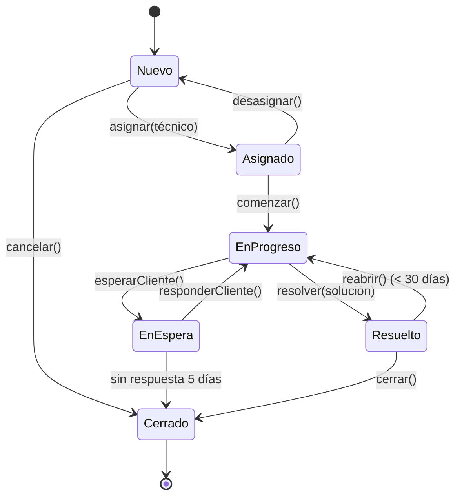
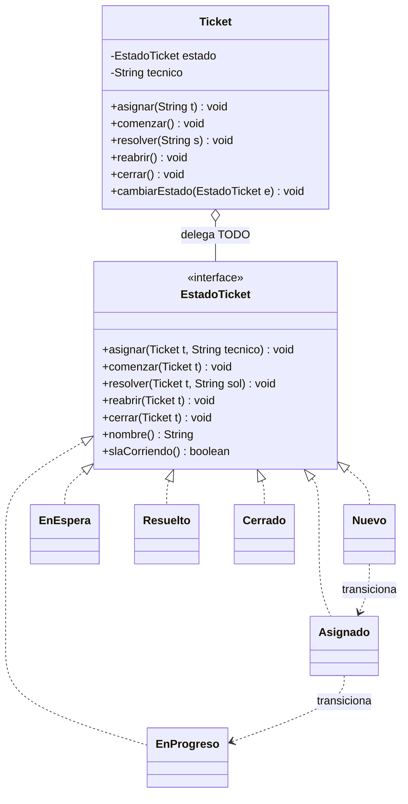

[← Volver al índice](README.md) · [← 20 Observer](20-observer.md) · [22 Strategy →](22-strategy.md)

# 21 · State

> **Familia:** Comportamiento · *Estado*

---

## En una frase

**Un objeto cambia de comportamiento cuando cambia su estado interno, como si cambiara
de clase.**

Como un semáforo: el mismo aparato, pero en verde deja pasar, en amarillo advierte y en
rojo detiene. No es que el semáforo pregunte "¿de qué color estoy?" cada vez: **es** de
ese color, y actúa en consecuencia.

---

## El enunciado

> **Ticket TCK-1810**
> Un **ticket de soporte** pasa por este ciclo de vida:
>
> ```
> NUEVO → ASIGNADO → EN_PROGRESO → RESUELTO → CERRADO
>                         ↓            ↓
>                    EN_ESPERA    REABIERTO
> ```
>
> Y las reglas son específicas de cada estado:
> - Un ticket **NUEVO** se puede asignar o cancelar, pero no resolver.
> - Un ticket **EN_ESPERA** (esperando respuesta del cliente) se cierra solo a los 5 días.
> - Un ticket **RESUELTO** se puede reabrir dentro de los 30 días; después de eso, no.
> - Un ticket **CERRADO** no acepta ninguna operación.
> - El SLA solo corre en `ASIGNADO` y `EN_PROGRESO`, no en `EN_ESPERA`.
>
> El método `cambiarEstado(String nuevo)` es un `switch` de 200 líneas con validaciones
> anidadas. Nadie sabe si una transición es válida sin leerlo entero. Y ya pasó dos veces
> que un ticket cerrado volvió a "en progreso" por un camino que nadie previó.

---

## El código que duele

```java
class Ticket {
    private String estado = "NUEVO";

    void asignar(String tecnico) {
        if (estado.equals("NUEVO")) { this.tecnico = tecnico; estado = "ASIGNADO"; }
        else if (estado.equals("EN_ESPERA")) { ... }
        else if (estado.equals("CERRADO")) throw new IllegalStateException(...);
        else if (estado.equals("RESUELTO")) { ... }
    }
    void resolver(String solucion) {
        if (estado.equals("EN_PROGRESO")) { ... }
        else if (estado.equals("ASIGNADO")) { ... }
        else if (estado.equals("NUEVO")) throw new IllegalStateException(...);
        // ...
    }
    void reabrir() { /* otro switch de 40 líneas */ }
    void cerrar()  { /* y otro */ }
}
```

El mismo `switch` sobre el estado **repetido en cada método**. Si agregas el estado
`ESCALADO`, tienes que acordarte de tocar los seis métodos. Y si olvidas uno, tienes un
agujero silencioso en el ciclo de vida.

---

## La idea del patrón

Convierte cada estado en **una clase**:

1. Una interfaz `EstadoTicket` con **una operación por cada acción posible**.
2. Una clase por estado, que implementa **solo lo que ese estado permite** y rechaza
   el resto (con un comportamiento por defecto compartido).
3. El objeto (`Ticket`) delega todas las acciones en su estado actual.
4. **Es el estado quien decide a qué estado se transiciona.**

> **Regla de oro:** en vez de preguntar "¿en qué estado estoy?", el objeto le pregunta
> a su estado "¿qué hago?".

---

## El diagrama

Primero, el diagrama de estados (esto es lo que le muestras al negocio):



Y ahora el diagrama de clases:



---

## La solución en Java 21

```java
import java.time.LocalDateTime;
import java.time.temporal.ChronoUnit;
import java.util.ArrayList;
import java.util.List;

// ===============================================================
// LA INTERFAZ DE ESTADO
// Los métodos default rechazan por defecto: cada estado solo
// implementa lo que SÍ permite.
// ===============================================================
interface EstadoTicket {
    String nombre();

    /** ¿El reloj del SLA corre en este estado? */
    default boolean slaCorriendo() { return false; }

    default void asignar(Ticket t, String tecnico)   { rechazar("asignar"); }
    default void comenzar(Ticket t)                  { rechazar("comenzar"); }
    default void esperarCliente(Ticket t, String q)  { rechazar("poner en espera"); }
    default void responderCliente(Ticket t)          { rechazar("registrar respuesta"); }
    default void resolver(Ticket t, String solucion) { rechazar("resolver"); }
    default void reabrir(Ticket t)                   { rechazar("reabrir"); }
    default void cerrar(Ticket t)                    { rechazar("cerrar"); }
    default void cancelar(Ticket t, String motivo)   { rechazar("cancelar"); }

    private void rechazar(String accion) {
        throw new IllegalStateException(
            "No se puede " + accion + " un ticket en estado " + nombre());
    }
}

// ===============================================================
// LOS ESTADOS CONCRETOS
// ===============================================================
final class Nuevo implements EstadoTicket {
    public String nombre() { return "NUEVO"; }

    @Override public void asignar(Ticket t, String tecnico) {
        t.asignarTecnico(tecnico);
        t.cambiarEstado(new Asignado());
    }
    @Override public void cancelar(Ticket t, String motivo) {
        t.registrar("Cancelado antes de asignar: " + motivo);
        t.cambiarEstado(new Cerrado());
    }
}

final class Asignado implements EstadoTicket {
    public String nombre() { return "ASIGNADO"; }
    @Override public boolean slaCorriendo() { return true; }

    @Override public void comenzar(Ticket t) { t.cambiarEstado(new EnProgreso()); }

    @Override public void asignar(Ticket t, String tecnico) {   // reasignar
        t.registrar("Reasignado de " + t.tecnico() + " a " + tecnico);
        t.asignarTecnico(tecnico);
    }
    @Override public void cancelar(Ticket t, String motivo) {
        t.registrar("Cancelado: " + motivo);
        t.cambiarEstado(new Cerrado());
    }
}

final class EnProgreso implements EstadoTicket {
    public String nombre() { return "EN_PROGRESO"; }
    @Override public boolean slaCorriendo() { return true; }

    @Override public void esperarCliente(Ticket t, String pregunta) {
        t.registrar("Se solicitó información al cliente: " + pregunta);
        t.cambiarEstado(new EnEspera(LocalDateTime.now()));
    }
    @Override public void resolver(Ticket t, String solucion) {
        t.registrarSolucion(solucion);
        t.cambiarEstado(new Resuelto(LocalDateTime.now()));
    }
    @Override public void asignar(Ticket t, String tecnico) {
        t.registrar("Escalado a " + tecnico);
        t.asignarTecnico(tecnico);
    }
}

/** Estado CON DATOS propios: desde cuándo se está esperando. */
record EnEspera(LocalDateTime desde) implements EstadoTicket {
    private static final int DIAS_PARA_CIERRE_AUTOMATICO = 5;

    public String nombre() { return "EN_ESPERA"; }
    // El SLA NO corre mientras se espera al cliente: regla de negocio real.
    @Override public boolean slaCorriendo() { return false; }

    @Override public void responderCliente(Ticket t) {
        t.registrar("El cliente respondió tras "
                + ChronoUnit.DAYS.between(desde, LocalDateTime.now()) + " días");
        t.cambiarEstado(new EnProgreso());
    }
    @Override public void cerrar(Ticket t) {
        var dias = ChronoUnit.DAYS.between(desde, LocalDateTime.now());
        if (dias < DIAS_PARA_CIERRE_AUTOMATICO) {
            throw new IllegalStateException(
                "Faltan " + (DIAS_PARA_CIERRE_AUTOMATICO - dias)
                + " días para el cierre automático por falta de respuesta");
        }
        t.registrar("Cerrado automáticamente por falta de respuesta");
        t.cambiarEstado(new Cerrado());
    }
}

/** Otro estado con datos: cuándo se resolvió, para la ventana de reapertura. */
record Resuelto(LocalDateTime resueltoEl) implements EstadoTicket {
    private static final int DIAS_PARA_REABRIR = 30;

    public String nombre() { return "RESUELTO"; }

    @Override public void cerrar(Ticket t) {
        t.registrar("Cerrado por confirmación del cliente");
        t.cambiarEstado(new Cerrado());
    }
    @Override public void reabrir(Ticket t) {
        var dias = ChronoUnit.DAYS.between(resueltoEl, LocalDateTime.now());
        if (dias > DIAS_PARA_REABRIR) {
            throw new IllegalStateException("La ventana de reapertura (" + DIAS_PARA_REABRIR
                + " días) venció hace " + (dias - DIAS_PARA_REABRIR) + " días");
        }
        t.registrar("Reabierto por el cliente");
        t.cambiarEstado(new EnProgreso());
    }
}

/** Estado final: no implementa NINGUNA acción. Todo se rechaza por defecto. */
final class Cerrado implements EstadoTicket {
    public String nombre() { return "CERRADO"; }
}

// ===============================================================
// EL CONTEXTO: delega TODO en el estado actual
// ===============================================================
final class Ticket {
    private final String id;
    private final String asunto;
    private EstadoTicket estado = new Nuevo();
    private String tecnico;
    private String solucion;
    private final List<String> bitacora = new ArrayList<>();

    Ticket(String id, String asunto) {
        this.id = id;
        this.asunto = asunto;
        registrar("Ticket creado");
    }

    // --- La API pública: una línea cada una. Cero if. ---
    void asignar(String tecnico)         { estado.asignar(this, tecnico); }
    void comenzar()                      { estado.comenzar(this); }
    void esperarCliente(String pregunta) { estado.esperarCliente(this, pregunta); }
    void responderCliente()              { estado.responderCliente(this); }
    void resolver(String solucion)       { estado.resolver(this, solucion); }
    void reabrir()                       { estado.reabrir(this); }
    void cerrar()                        { estado.cerrar(this); }
    void cancelar(String motivo)         { estado.cancelar(this, motivo); }

    // --- Métodos que los estados usan para cambiar el contexto ---
    void cambiarEstado(EstadoTicket nuevo) {
        System.out.println("      " + estado.nombre() + " -> " + nuevo.nombre()
                + (nuevo.slaCorriendo() ? "  [SLA corriendo]" : "  [SLA pausado]"));
        registrar("Cambio de estado: " + estado.nombre() + " -> " + nuevo.nombre());
        this.estado = nuevo;
    }
    void asignarTecnico(String t) { this.tecnico = t; }
    void registrarSolucion(String s) { this.solucion = s; registrar("Solución: " + s); }
    void registrar(String evento) { bitacora.add(evento); }

    String estadoActual() { return estado.nombre(); }
    String tecnico() { return tecnico; }
    boolean slaCorriendo() { return estado.slaCorriendo(); }

    void imprimirBitacora() {
        System.out.println("\n  Bitácora de " + id + " (" + asunto + "):");
        bitacora.forEach(e -> System.out.println("    · " + e));
    }
}

public class Demo {
    public static void main(String[] args) {

        System.out.println("=== Flujo feliz ===");
        var t1 = new Ticket("TCK-1001", "No puedo generar el reporte de ventas");
        System.out.println("  Estado: " + t1.estadoActual());
        t1.asignar("carlos.soporte");
        t1.comenzar();
        t1.esperarCliente("¿Qué navegador y versión está usando?");
        t1.responderCliente();
        t1.resolver("Se limpió la caché del navegador y se actualizó a la última versión");
        t1.cerrar();
        t1.imprimirBitacora();

        System.out.println("\n=== Transiciones inválidas: rechazadas por el propio estado ===");
        var t2 = new Ticket("TCK-1002", "Error 500 al guardar");
        intentar("resolver un ticket NUEVO",   () -> t2.resolver("algo"));
        intentar("reabrir un ticket NUEVO",    () -> t2.reabrir());
        t2.asignar("ana.soporte");
        intentar("reabrir un ticket ASIGNADO", () -> t2.reabrir());
        t2.cancelar("Duplicado del TCK-1001");
        intentar("asignar un ticket CERRADO",  () -> t2.asignar("otro.tecnico"));
        intentar("comenzar un ticket CERRADO", () -> t2.comenzar());

        System.out.println("\n=== Reglas con datos propios del estado ===");
        var t3 = new Ticket("TCK-1003", "Solicitud de acceso");
        t3.asignar("lucia.soporte");
        t3.comenzar();
        t3.esperarCliente("Necesitamos la aprobación de su jefe");
        intentar("cerrar antes de los 5 días", () -> t3.cerrar());

        System.out.println("\n=== El SLA depende del estado ===");
        var t4 = new Ticket("TCK-1004", "Lentitud en el sistema");
        t4.asignar("pedro.soporte");
        System.out.println("  ASIGNADO   -> SLA corriendo: " + t4.slaCorriendo());
        t4.comenzar();
        t4.esperarCliente("¿Desde cuándo ocurre?");
        System.out.println("  EN_ESPERA  -> SLA corriendo: " + t4.slaCorriendo());
    }

    static void intentar(String descripcion, Runnable accion) {
        try {
            accion.run();
            System.out.println("  ✔ " + descripcion + ": permitido");
        } catch (IllegalStateException e) {
            System.out.println("  ✘ " + descripcion + ": " + e.getMessage());
        }
    }
}
```

### Salida (recortada)

```
=== Flujo feliz ===
  Estado: NUEVO
      NUEVO -> ASIGNADO  [SLA corriendo]
      ASIGNADO -> EN_PROGRESO  [SLA corriendo]
      EN_PROGRESO -> EN_ESPERA  [SLA pausado]
      EN_ESPERA -> EN_PROGRESO  [SLA corriendo]
      EN_PROGRESO -> RESUELTO  [SLA pausado]
      RESUELTO -> CERRADO  [SLA pausado]

=== Transiciones inválidas: rechazadas por el propio estado ===
  ✘ resolver un ticket NUEVO: No se puede resolver un ticket en estado NUEVO
  ✘ reabrir un ticket NUEVO: No se puede reabrir un ticket en estado NUEVO
      NUEVO -> ASIGNADO  [SLA corriendo]
  ✘ reabrir un ticket ASIGNADO: No se puede reabrir un ticket en estado ASIGNADO
      ASIGNADO -> CERRADO  [SLA pausado]
  ✘ asignar un ticket CERRADO: No se puede asignar un ticket en estado CERRADO
  ✘ comenzar un ticket CERRADO: No se puede comenzar un ticket en estado CERRADO

=== Reglas con datos propios del estado ===
  ✘ cerrar antes de los 5 días: Faltan 5 días para el cierre automático por falta de respuesta

=== El SLA depende del estado ===
  ASIGNADO   -> SLA corriendo: true
  EN_ESPERA  -> SLA corriendo: false
```

---

## Los tres regalos de este diseño

1. **Las transiciones inválidas son imposibles por construcción.** No hay un camino oculto
   que lleve de `CERRADO` a `EN_PROGRESO`: `Cerrado` simplemente no implementa nada.
2. **Agregar un estado no toca el código existente.** Para `ESCALADO`, creas una clase.
   El `Ticket` no cambia.
3. **El estado puede tener datos propios.** `EnEspera` guarda desde cuándo espera,
   `Resuelto` guarda cuándo se resolvió. Con un `enum` de estados eso hay que meterlo
   como campos del ticket, aunque solo apliquen a un estado.

---

## State vs. Strategy: la comparación obligada

Estructuralmente son **idénticos**: un contexto que delega en un objeto intercambiable.
La diferencia es de intención y de quién manda:

| | State | Strategy |
|---|---|---|
| **Quién cambia el objeto interno** | El propio estado (se auto-transiciona) | El cliente, desde afuera |
| **Los objetos se conocen entre sí** | Sí: `Nuevo` sabe que sigue `Asignado` | No: `PagoPse` no sabe que existe `PagoTarjeta` |
| **Qué representa** | Una fase del ciclo de vida | Una forma alternativa de hacer lo mismo |
| **Cambia durante la vida del objeto** | Sí, constantemente | Normalmente una vez, al configurar |
| **Analogía** | Un semáforo | Elegir la ruta en un GPS |

**Truco para distinguirlos:** si los objetos intercambiables se nombran unos a otros,
es State. Si son independientes entre sí, es Strategy.

---

## ¿Y si uso un `enum`?

Es una alternativa muy válida en Java, sobre todo para máquinas de estado pequeñas:

```java
enum EstadoTicket {
    NUEVO {
        @Override void asignar(Ticket t, String tecnico) { t.cambiarEstado(ASIGNADO); }
    },
    ASIGNADO {
        @Override void comenzar(Ticket t) { t.cambiarEstado(EN_PROGRESO); }
    },
    // ...
    CERRADO;   // no sobrescribe nada: lo rechaza todo

    void asignar(Ticket t, String tecnico) { throw new IllegalStateException(...); }
    void comenzar(Ticket t) { throw new IllegalStateException(...); }
}
```

| | `enum` con cuerpos | Clases (State clásico) |
|---|---|---|
| Serializar / persistir en BD | ✅ Trivial: es un `String` | ⚠️ Necesitas mapear |
| Estados con datos propios | ❌ No puede (el enum es singleton) | ✅ Sí (`EnEspera(desde)`) |
| Estados con dependencias inyectadas | ❌ Difícil | ✅ Natural |
| Cantidad de código | ✅ Menos | ⚠️ Más |
| Cambiar estados sin recompilar todo | ⚠️ Todo en un archivo | ✅ Un archivo por estado |

**Empieza con `enum`.** Pásate a clases cuando los estados necesiten datos propios o
dependencias, como en el ejemplo de arriba.

---

## ✅ Cuándo usarlo

- Un objeto tiene un **ciclo de vida** con reglas distintas por fase: pedidos, tickets,
  solicitudes, documentos, contratos, conexiones, reproductores.
- Tienes el mismo `switch (estado)` repetido en varios métodos.
- Las transiciones inválidas son un bug recurrente.
- El negocio te dibuja un diagrama de estados en una reunión: eso es una señal clarísima.

## ⛔ Cuándo NO usarlo

- Hay dos o tres estados con una o dos transiciones: un `boolean` o un `enum` simple basta.
- El comportamiento no cambia entre estados; solo cambia un dato → guarda el dato y ya.
- La máquina de estados es enorme (20+ estados con transiciones cruzadas) → considera una
  librería de máquinas de estado (Spring StateMachine) o una tabla de transiciones.
- **Ojo con la persistencia:** guardar y recuperar el objeto-estado desde la base de datos
  requiere un mapeo. Con `enum` es gratis.

---

## Se parece a...

| Patrón | Diferencia clave |
|---|---|
| **[Strategy](22-strategy.md)** | Ver la tabla comparativa de arriba. Es la confusión más común de todo el catálogo. |
| **[Bridge](08-bridge.md)** | Misma estructura; Bridge separa dos jerarquías que evolucionan aparte, State modela fases de un ciclo de vida. |
| **[Singleton](02-singleton.md)** | Los estados sin datos propios (como `Cerrado`) pueden ser singletons para no crearlos una y otra vez. |
| **[Memento](19-memento.md)** | Memento guarda y restaura el estado; State define cómo se comporta el objeto en cada uno. |
| **[Flyweight](12-flyweight.md)** | Si los estados no tienen datos, compártelos como flyweights. |

---

## Dónde ya lo has visto

- El ciclo de vida de un `Thread`: `NEW`, `RUNNABLE`, `BLOCKED`, `WAITING`, `TERMINATED`.
- Una conexión JDBC o un socket TCP.
- El estado de un pedido en cualquier e-commerce.
- Los reproductores de video: reproduciendo, pausado, detenido, cargando.
- El flujo de un pull request en GitHub: abierto, en revisión, aprobado, fusionado, cerrado.
- Los estados de un pod en Kubernetes.

---

➡️ Siguiente: **[22 · Strategy](22-strategy.md)**

[← Volver al índice](README.md)
