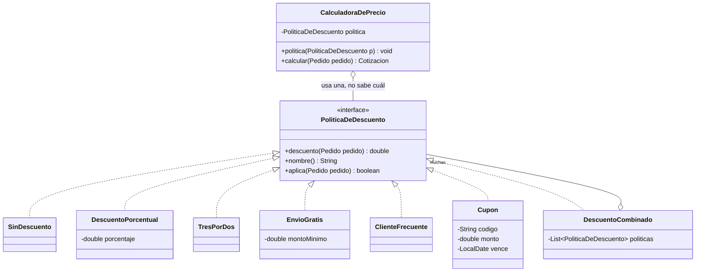

[← Volver al índice](README.md) · [← 21 State](21-state.md) · [23 Template Method →](23-template-method.md)

# 22 · Strategy

> **Familia:** Comportamiento · *Estrategia*

---

## En una frase

**Encapsula cada algoritmo en su propia clase y hazlos intercambiables en tiempo de
ejecución.**

Como el GPS del celular: el destino es el mismo, pero puedes pedir la ruta más rápida, la
más corta, la que evita peajes o la de transporte público. Cambias la estrategia, no el GPS.

---

> **Si solo vas a aprender un patrón de los 23, que sea este.** Es el más usado, el más
> simple de entender y el que más problemas reales resuelve.

---

## El enunciado

> **Ticket VTA-1901**
> El cálculo del **precio final** de un pedido depende de la promoción vigente, y
> Comercial cambia las promociones **cada mes**:
>
> | Promoción | Regla |
> |---|---|
> | Sin promoción | Precio de lista |
> | Descuento porcentual | X% sobre el total |
> | 3x2 | El ítem más barato de cada grupo de 3 sale gratis |
> | Envío gratis | Se descuenta el flete si el pedido supera un monto |
> | Cliente frecuente | 5% + 1% adicional por cada año de antigüedad, tope 15% |
> | Cupón | Monto fijo, con validación de vigencia y de uso único |
>
> Además, algunas promociones **se combinan** y otras son excluyentes.
>
> Hoy hay un método `calcularTotal()` de 340 líneas. La última vez que Comercial pidió
> una promoción nueva, el despliegue tumbó el cálculo de las otras cinco.

---

## El código que duele

```java
double calcularTotal(Pedido pedido, String promocion) {
    double total = pedido.subtotal();
    if (promocion.equals("PORCENTUAL")) {
        total = total * (1 - config.getPorcentaje() / 100);
    } else if (promocion.equals("TRES_POR_DOS")) {
        // 40 líneas de agrupación y ordenamiento
    } else if (promocion.equals("ENVIO_GRATIS")) {
        if (total > config.getMinimoEnvioGratis()) total -= pedido.flete();
    } else if (promocion.equals("FRECUENTE")) {
        // 30 líneas más
    } else if (promocion.equals("CUPON")) {
        // validaciones de vigencia, uso único, monto mínimo...
    }
    return total;
}
```

Síntomas clásicos:

- El método crece **cada mes**.
- Un cambio en una promoción **puede romper otra**.
- Imposible probar una promoción de forma aislada.
- No se pueden combinar promociones sin duplicar todo el `if`.

---

## La idea del patrón

Cada rama del `if` se convierte en **una clase con un solo método**:

1. Una interfaz común (`PoliticaDeDescuento`) con la operación que varía.
2. Una implementación por algoritmo.
3. El contexto (`CalculadoraDePrecio`) **recibe** la estrategia y la usa sin saber cuál es.
4. Cambiar de algoritmo = pasar otro objeto. Sin recompilar el contexto.

> **Regla de oro:** encuentra el `if` que crece cada sprint y conviértelo en una interfaz.

---

## El diagrama



---

## La solución en Java 21

```java
import java.time.LocalDate;
import java.util.Comparator;
import java.util.List;
import java.util.Map;

// ===============================================================
// EL MODELO
// ===============================================================
record LineaPedido(String sku, String nombre, int cantidad, double valorUnitario) {
    double subtotal() { return cantidad * valorUnitario; }
}

record Cliente(String id, String nombre, int aniosDeAntiguedad) {}

record Pedido(String id, Cliente cliente, List<LineaPedido> lineas, double flete) {
    double subtotal() { return lineas.stream().mapToDouble(LineaPedido::subtotal).sum(); }
    int totalUnidades() { return lineas.stream().mapToInt(LineaPedido::cantidad).sum(); }
}

record Cotizacion(double subtotal, double descuento, double flete, String politicaAplicada) {
    double total() { return subtotal - descuento + flete; }
}

// ===============================================================
// LA ESTRATEGIA
// ===============================================================
interface PoliticaDeDescuento {
    /** Cuánto se descuenta (en pesos) para este pedido. */
    double descuento(Pedido pedido);

    String nombre();

    /** ¿Esta política aplica para este pedido? */
    default boolean aplica(Pedido pedido) { return true; }

    /** ¿Este descuento cubre el flete? */
    default boolean incluyeFlete() { return false; }
}

// ---------------------------------------------------------------
// LAS ESTRATEGIAS CONCRETAS: una clase, un algoritmo, una prueba
// ---------------------------------------------------------------
final class SinDescuento implements PoliticaDeDescuento {
    public double descuento(Pedido p) { return 0; }
    public String nombre() { return "Precio de lista"; }
}

record DescuentoPorcentual(double porcentaje) implements PoliticaDeDescuento {
    DescuentoPorcentual {
        if (porcentaje < 0 || porcentaje > 100)
            throw new IllegalArgumentException("Porcentaje fuera de rango");
    }
    public double descuento(Pedido p) { return p.subtotal() * porcentaje / 100; }
    public String nombre() { return "Descuento del %.0f%%".formatted(porcentaje); }
}

/** Por cada 3 unidades del mismo SKU, la más barata sale gratis. */
final class TresPorDos implements PoliticaDeDescuento {
    public double descuento(Pedido p) {
        return p.lineas().stream()
                .mapToDouble(l -> (l.cantidad() / 3) * l.valorUnitario())
                .sum();
    }
    public String nombre() { return "Promoción 3x2"; }
    @Override public boolean aplica(Pedido p) {
        return p.lineas().stream().anyMatch(l -> l.cantidad() >= 3);
    }
}

record EnvioGratis(double montoMinimo) implements PoliticaDeDescuento {
    public double descuento(Pedido p) { return p.flete(); }
    public String nombre() { return "Envío gratis"; }
    @Override public boolean aplica(Pedido p) { return p.subtotal() >= montoMinimo; }
    @Override public boolean incluyeFlete() { return true; }
}

/** 5% base + 1% por año de antigüedad, con tope del 15%. */
final class ClienteFrecuente implements PoliticaDeDescuento {
    public double descuento(Pedido p) {
        var pct = Math.min(15, 5 + p.cliente().aniosDeAntiguedad());
        return p.subtotal() * pct / 100;
    }
    public String nombre() { return "Cliente frecuente"; }
    @Override public boolean aplica(Pedido p) { return p.cliente().aniosDeAntiguedad() >= 1; }
}

record Cupon(String codigo, double monto, LocalDate vence, double compraMinima)
        implements PoliticaDeDescuento {
    public double descuento(Pedido p) { return Math.min(monto, p.subtotal()); }
    public String nombre() { return "Cupón " + codigo; }
    @Override public boolean aplica(Pedido p) {
        return !LocalDate.now().isAfter(vence) && p.subtotal() >= compraMinima;
    }
}

/** Composición de estrategias: aplica varias a la vez. */
record DescuentoCombinado(List<PoliticaDeDescuento> politicas) implements PoliticaDeDescuento {
    public double descuento(Pedido p) {
        return politicas.stream().filter(pol -> pol.aplica(p))
                        .mapToDouble(pol -> pol.descuento(p)).sum();
    }
    public String nombre() {
        return politicas.stream().map(PoliticaDeDescuento::nombre)
                        .reduce((a, b) -> a + " + " + b).orElse("Ninguna");
    }
    @Override public boolean incluyeFlete() {
        return politicas.stream().anyMatch(PoliticaDeDescuento::incluyeFlete);
    }
}

/** Elige automáticamente la política que más le conviene al cliente. */
final class LaMejorParaElCliente implements PoliticaDeDescuento {
    private final List<PoliticaDeDescuento> candidatas;
    LaMejorParaElCliente(List<PoliticaDeDescuento> candidatas) { this.candidatas = candidatas; }

    private PoliticaDeDescuento mejor(Pedido p) {
        return candidatas.stream().filter(pol -> pol.aplica(p))
                .max(Comparator.comparingDouble(pol -> pol.descuento(p)))
                .orElseGet(SinDescuento::new);
    }
    public double descuento(Pedido p) { return mejor(p).descuento(p); }
    public String nombre() { return "La mejor disponible"; }
}

// ===============================================================
// EL CONTEXTO: no sabe NADA de promociones concretas
// ===============================================================
final class CalculadoraDePrecio {
    private PoliticaDeDescuento politica;

    CalculadoraDePrecio(PoliticaDeDescuento politica) { this.politica = politica; }

    /** Se puede cambiar la estrategia en tiempo de ejecución. */
    void politica(PoliticaDeDescuento politica) { this.politica = politica; }

    Cotizacion calcular(Pedido pedido) {
        if (!politica.aplica(pedido)) {
            return new Cotizacion(pedido.subtotal(), 0, pedido.flete(),
                    politica.nombre() + " (no aplica)");
        }
        var descuento = politica.descuento(pedido);
        var flete = politica.incluyeFlete() ? 0 : pedido.flete();
        // Si el descuento incluye el flete, no se descuenta dos veces
        if (politica.incluyeFlete()) descuento -= pedido.flete();
        return new Cotizacion(pedido.subtotal(), Math.max(0, descuento), flete, politica.nombre());
    }
}

public class Demo {
    public static void main(String[] args) {

        var cliente = new Cliente("c-42", "Ana Restrepo", 6);
        var pedido = new Pedido("PED-7700", cliente, List.of(
                new LineaPedido("SKU-1", "Teclado mecánico",   4, 320_000),
                new LineaPedido("SKU-2", "Monitor 27\"",       1, 1_450_000),
                new LineaPedido("SKU-3", "Cable HDMI",         6,    45_000)
        ), 35_000);

        Map<String, PoliticaDeDescuento> promociones = new java.util.LinkedHashMap<>();
        promociones.put("Ninguna",          new SinDescuento());
        promociones.put("15% general",      new DescuentoPorcentual(15));
        promociones.put("3x2",              new TresPorDos());
        promociones.put("Envío gratis",     new EnvioGratis(1_000_000));
        promociones.put("Cliente frecuente",new ClienteFrecuente());
        promociones.put("Cupón",            new Cupon("BIENVENIDO50", 500_000,
                                                LocalDate.of(2026, 12, 31), 1_000_000));

        var calculadora = new CalculadoraDePrecio(new SinDescuento());

        System.out.printf("Pedido %s | %d unidades | subtotal $%,.0f | flete $%,.0f%n%n",
                pedido.id(), pedido.totalUnidades(), pedido.subtotal(), pedido.flete());

        System.out.println("=== Comparación de promociones ===");
        System.out.printf("%-34s %14s %14s%n", "POLÍTICA", "DESCUENTO", "TOTAL");
        System.out.println("-".repeat(64));

        promociones.forEach((etiqueta, politica) -> {
            calculadora.politica(politica);                  // <- se cambia en caliente
            var c = calculadora.calcular(pedido);
            System.out.printf("%-34s %,14.0f %,14.0f%n",
                    c.politicaAplicada(), c.descuento(), c.total());
        });

        System.out.println("\n=== Combinada (frecuente + envío gratis) ===");
        calculadora.politica(new DescuentoCombinado(List.of(
                new ClienteFrecuente(), new EnvioGratis(1_000_000))));
        var combinada = calculadora.calcular(pedido);
        System.out.printf("  %s -> descuento $%,.0f | total $%,.0f%n",
                combinada.politicaAplicada(), combinada.descuento(), combinada.total());

        System.out.println("\n=== La que más le conviene al cliente ===");
        calculadora.politica(new LaMejorParaElCliente(List.copyOf(promociones.values())));
        var mejor = calculadora.calcular(pedido);
        System.out.printf("  descuento $%,.0f | total $%,.0f%n", mejor.descuento(), mejor.total());

        System.out.println("\n=== Una promoción improvisada, con lambda ===");
        calculadora.politica(new PoliticaDeDescuento() {
            public double descuento(Pedido p) { return p.totalUnidades() >= 10 ? 200_000 : 0; }
            public String nombre() { return "Black Friday: $200.000 por 10+ unidades"; }
        });
        var bf = calculadora.calcular(pedido);
        System.out.printf("  %s -> total $%,.0f%n", bf.politicaAplicada(), bf.total());
    }
}
```

### Salida

```
Pedido PED-7700 | 11 unidades | subtotal $3,000,000 | flete $35,000

=== Comparación de promociones ===
POLÍTICA                                DESCUENTO          TOTAL
----------------------------------------------------------------
Precio de lista                                 0      3,035,000
Descuento del 15%                         450,000      2,585,000
Promoción 3x2                             410,000      2,625,000
Envío gratis                                    0      3,000,000
Cliente frecuente                         330,000      2,705,000
Cupón BIENVENIDO50                        500,000      2,535,000

=== Combinada (frecuente + envío gratis) ===
  Cliente frecuente + Envío gratis -> descuento $330,000 | total $2,670,000

=== La que más le conviene al cliente ===
  descuento $500,000 | total $2,535,000

=== Una promoción improvisada, con lambda ===
  Black Friday: $200.000 por 10+ unidades -> total $2,835,000
```

---

## Versión funcional: Strategy con lambdas

Si la interfaz tiene **un solo método**, en Java moderno la estrategia puede ser una lambda:

```java
@FunctionalInterface
interface Descuento { double calcular(Pedido p); }

Map<String, Descuento> promociones = Map.of(
    "NINGUNA",    p -> 0,
    "PORCENTUAL", p -> p.subtotal() * 0.15,
    "FIJO",       p -> Math.min(500_000, p.subtotal())
);

double total = pedido.subtotal() - promociones.get(codigo).calcular(pedido);
```

O directamente con las interfaces funcionales del JDK:

```java
Function<Pedido, Double> politica = p -> p.subtotal() * 0.15;
Comparator<Producto> orden = Comparator.comparing(Producto::precio);   // Strategy puro
Predicate<Cliente> filtro = c -> c.aniosDeAntiguedad() > 5;
```

| Usa lambdas cuando | Usa clases cuando |
|---|---|
| La estrategia es una expresión de 1-3 líneas | Tiene configuración (porcentaje, tope, vigencia) |
| No necesita nombre ni metadatos | Necesitas `nombre()`, `aplica()`, `incluyeFlete()` |
| No la vas a probar por separado | Quieres una prueba unitaria por estrategia |
| No hay que registrarla en ningún catálogo | El catálogo se carga desde base de datos o configuración |

---

## Cómo elegir la estrategia en un caso real

En un proyecto de verdad, el código no hace `new DescuentoPorcentual(15)`. La estrategia
llega de afuera. Tres formas comunes:

```java
// 1. Un Map de estrategias registradas (el más simple)
Map<String, PoliticaDeDescuento> catalogo = Map.of(
    "PORCENTUAL", new DescuentoPorcentual(15),
    "TRES_X_DOS", new TresPorDos());
var politica = catalogo.getOrDefault(codigoPromocion, new SinDescuento());

// 2. Con inyección de dependencias (Spring inyecta TODAS las implementaciones)
@Service
class ServicioDePrecios {
    private final Map<String, PoliticaDeDescuento> politicas;   // Spring lo llena solo
    ServicioDePrecios(List<PoliticaDeDescuento> todas) {
        this.politicas = todas.stream()
            .collect(toMap(PoliticaDeDescuento::nombre, identity()));
    }
}

// 3. Que la propia estrategia diga si aplica (como en el ejemplo)
var politica = todas.stream().filter(p -> p.aplica(pedido)).findFirst()
                    .orElseGet(SinDescuento::new);
```

La opción 2 es la que verás en la mayoría de proyectos Spring, y es la que hace que
"agregar una promoción" sea literalmente **crear una clase nueva y nada más**.

---

## Qué ganamos

| Antes | Después |
|---|---|
| Método de 340 líneas | 7 clases de 5 a 10 líneas |
| Una promoción nueva rompía las otras | Cada una aislada; ninguna conoce a las demás |
| Imposible probar una promoción sola | Una prueba unitaria por clase |
| No se podían combinar | `DescuentoCombinado` combina las que quieras |
| No se podía elegir la mejor | `LaMejorParaElCliente` compara y decide |

---

## ✅ Cuándo usarlo

- Tienes **varias formas de hacer lo mismo** y hay que elegir una.
- Un `if/else` o `switch` sobre un "tipo" crece con cada sprint.
- Quieres poder cambiar el algoritmo **en tiempo de ejecución** (por configuración, por
  tenant, por usuario, por experimento A/B).
- Cada algoritmo debe poder probarse por separado.
- Quieres que agregar una variante no obligue a tocar código existente.

## ⛔ Cuándo NO usarlo

- Solo hay **una** forma de hacerlo y no se ve que vayan a aparecer más.
- Hay dos variantes triviales y estables: un `if` de dos líneas es más legible que dos
  clases y una interfaz.
- Las "estrategias" comparten el 90% del código y solo cambia un pasito en el medio →
  eso es **[Template Method](23-template-method.md)**, no Strategy.
- El cliente tendría que conocer todas las estrategias para elegir: si es así, esconde la
  elección detrás de una fábrica o de un `aplica()`.

---

## Se parece a...

| Patrón | Diferencia clave |
|---|---|
| **[State](21-state.md)** | Idénticos en estructura. En State, los objetos **se conocen entre sí** y se auto-transicionan; en Strategy son independientes y el cliente elige. |
| **[Template Method](23-template-method.md)** | Template Method varía **pasos dentro de un algoritmo fijo**, usando herencia (se decide al compilar). Strategy cambia **el algoritmo completo**, usando composición (se decide al ejecutar). |
| **[Bridge](08-bridge.md)** | Misma estructura, mayor escala: Bridge separa dos jerarquías completas; Strategy intercambia un algoritmo. |
| **[Decorator](10-decorator.md)** | Decorator cambia **la piel** (agrega capas); Strategy cambia **las tripas** (reemplaza el algoritmo). |
| **[Factory Method](03-factory-method.md)** | Muy usado junto: la fábrica decide qué estrategia crear. |
| **[Command](15-command.md)** | Command es *una acción con sus parámetros dentro*; Strategy es *una forma de hacer algo*, sin datos propios de la invocación. |

---

## Dónde ya lo has visto

- `Comparator`: `list.sort(Comparator.comparing(Empleado::salario))` — Strategy puro.
- Todas las interfaces funcionales: `Function`, `Predicate`, `Supplier`, `Consumer`.
- `ThreadPoolExecutor` con su `RejectedExecutionHandler` (qué hacer cuando la cola se llena).
- `LayoutManager` en Swing; los algoritmos de compresión de `Deflater`.
- Spring Security: los distintos `PasswordEncoder` (BCrypt, Argon2, PBKDF2).
- Cualquier `application.yml` que diga `estrategia: X` y el código elija una implementación.

---

➡️ Siguiente: **[23 · Template Method](23-template-method.md)**

[← Volver al índice](README.md)
