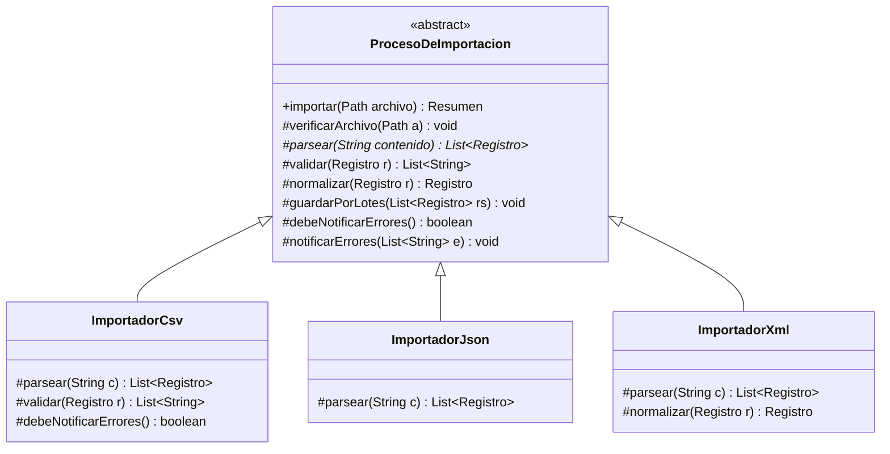
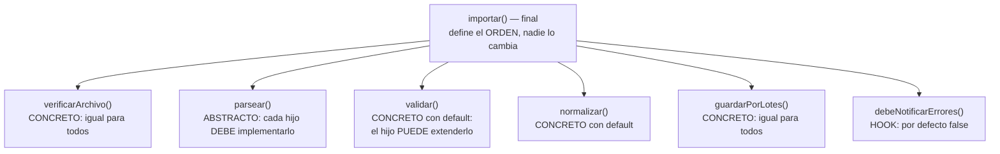

[← Volver al índice](README.md) · [← 22 Strategy](22-strategy.md) · [24 Visitor →](24-visitor.md)

# 23 · Template Method

> **Familia:** Comportamiento · *Método plantilla*

---

## En una frase

**El padre escribe la receta completa y deja huecos para que los hijos rellenen los pasos
que cambian.**

Como el proceso de contratación de una empresa: publicar vacante → filtrar hojas de vida →
entrevistar → decidir → contratar. El proceso es el mismo para todos los cargos; lo que
cambia es *cómo* se entrevista a un desarrollador y *cómo* a un contador.

---

## El enunciado

> **Ticket ETL-2010**
> Cada noche importamos archivos de tres proveedores:
>
> - **Proveedor A**: un CSV separado por `;`, con encabezado, codificación ISO-8859-1.
> - **Proveedor B**: un JSON con un arreglo de objetos.
> - **Proveedor C**: un XML plano con etiquetas `<registro>`.
>
> Pero el proceso es **exactamente el mismo** para los tres:
>
> 1. Abrir el archivo y verificar que no esté vacío.
> 2. Parsear el contenido (← **esto sí cambia**).
> 3. Validar los registros (← **cambia un poco**: cada proveedor tiene campos obligatorios distintos).
> 4. Normalizar (fechas a ISO, montos a `BigDecimal`, quitar espacios).
> 5. Guardar en la base de datos por lotes de 500.
> 6. Registrar el resumen y archivar el archivo procesado.
> 7. Notificar si hubo errores (← **opcional**: solo el proveedor A lo pide).
>
> Hoy hay **tres clases con el 80% del código copiado y pegado**. La semana pasada
> arreglaron un bug de fechas en el importador A, y los otros dos siguen con el bug.

---

## El código que duele

```java
class ImportadorProveedorA {
    void importar(Path archivo) {
        verificarNoVacio(archivo);          // copiado
        var lineas = leerCsv(archivo);      // propio
        var validos = validar(lineas);      // copiado (con una regla extra)
        var normalizados = normalizar(validos);  // copiado
        guardarPorLotes(normalizados, 500); // copiado
        registrarResumen();                 // copiado
        archivar(archivo);                  // copiado
    }
}
class ImportadorProveedorB { /* lo mismo, con leerJson() */ }
class ImportadorProveedorC { /* lo mismo, con leerXml() */ }
```

El 80% duplicado. Cada corrección hay que hacerla tres veces (y siempre se olvida una).

---

## La idea del patrón

Sube el esqueleto al padre y baja los huecos a los hijos:

1. Una clase **abstracta** con un método `final` (la plantilla) que define **el orden
   de los pasos**.
2. Los pasos que **siempre son iguales** se implementan en el padre.
3. Los pasos que **cambian** se declaran `abstract`: el hijo está obligado a implementarlos.
4. Los pasos **opcionales** se declaran como *hooks*: métodos con implementación vacía o
   por defecto que el hijo **puede** sobrescribir si quiere.

> **Regla de oro:** el padre manda. El hijo solo rellena huecos.
> A esto se le llama **"principio de Hollywood"**: *no nos llames, nosotros te llamamos.*

---

## El diagrama



Los tipos de método dentro de la plantilla:



---

## La solución en Java 21

```java
import java.math.BigDecimal;
import java.time.LocalDate;
import java.time.format.DateTimeFormatter;
import java.util.ArrayList;
import java.util.List;

record Registro(String documento, String nombre, LocalDate fecha,
                BigDecimal monto, String referencia) {}

record Resumen(String proveedor, int leidos, int validos, int rechazados,
               List<String> errores, long milisegundos) {}

// ===============================================================
// LA CLASE PLANTILLA
// ===============================================================
abstract class ProcesoDeImportacion {

    // =========================================================
    // EL TEMPLATE METHOD. Es FINAL: el orden no se negocia.
    // =========================================================
    public final Resumen importar(String nombreArchivo, String contenido) {
        var inicio = System.currentTimeMillis();
        System.out.println("\n=== " + nombreProveedor() + " | " + nombreArchivo + " ===");

        // Paso 1 — igual para todos
        verificarArchivo(nombreArchivo, contenido);

        // Paso 2 — cada hijo lo implementa a su manera (ABSTRACTO)
        var crudos = parsear(contenido);
        System.out.println("  [2/6] Parseados " + crudos.size() + " registros");

        // Paso 3 — validación: base común + reglas propias del hijo (HOOK extensible)
        var errores = new ArrayList<String>();
        var validos = new ArrayList<Registro>();
        for (var r : crudos) {
            var problemas = validar(r);
            if (problemas.isEmpty()) validos.add(r);
            else errores.add(r.documento() + ": " + String.join(", ", problemas));
        }
        System.out.println("  [3/6] Válidos: " + validos.size()
                + " | Rechazados: " + errores.size());

        // Paso 4 — normalización: base común, el hijo puede ajustarla
        var normalizados = validos.stream().map(this::normalizar).toList();
        System.out.println("  [4/6] Normalizados");

        // Paso 5 — igual para todos
        guardarPorLotes(normalizados);

        // Paso 6 — HOOK opcional: por defecto no hace nada
        if (debeNotificarErrores() && !errores.isEmpty()) {
            notificarErrores(errores);
        }

        var ms = System.currentTimeMillis() - inicio;
        System.out.println("  [6/6] Listo en " + ms + " ms");
        return new Resumen(nombreProveedor(), crudos.size(), validos.size(),
                errores.size(), errores, ms);
    }

    // ---------- Pasos ABSTRACTOS: obligatorios para el hijo ----------
    protected abstract String nombreProveedor();
    protected abstract List<Registro> parsear(String contenido);

    // ---------- Pasos CONCRETOS: iguales para todos ----------
    private void verificarArchivo(String nombre, String contenido) {
        if (contenido == null || contenido.isBlank())
            throw new IllegalArgumentException("El archivo " + nombre + " está vacío");
        System.out.println("  [1/6] Archivo verificado (" + contenido.length() + " bytes)");
    }

    private void guardarPorLotes(List<Registro> registros) {
        final int LOTE = 500;
        for (int i = 0; i < registros.size(); i += LOTE) {
            var fin = Math.min(i + LOTE, registros.size());
            System.out.println("  [5/6] INSERT lote " + (i / LOTE + 1)
                    + " (" + (fin - i) + " registros)");
        }
        if (registros.isEmpty()) System.out.println("  [5/6] Sin registros que guardar");
    }

    // ---------- Pasos con implementación POR DEFECTO: el hijo puede extenderlos ----------
    protected List<String> validar(Registro r) {
        var problemas = new ArrayList<String>();
        if (r.documento() == null || r.documento().isBlank()) problemas.add("sin documento");
        if (r.monto() == null || r.monto().signum() <= 0)      problemas.add("monto inválido");
        if (r.fecha() == null)                                 problemas.add("sin fecha");
        return problemas;
    }

    protected Registro normalizar(Registro r) {
        return new Registro(
            r.documento().trim().replace(".", "").replace("-", ""),
            r.nombre().trim().toUpperCase(),
            r.fecha(),
            r.monto().setScale(2, java.math.RoundingMode.HALF_UP),
            r.referencia() == null ? "" : r.referencia().trim());
    }

    // ---------- HOOKS: puntos de extensión opcionales ----------
    protected boolean debeNotificarErrores() { return false; }

    protected void notificarErrores(List<String> errores) {
        System.out.println("  [!] Notificando " + errores.size() + " errores a operaciones:");
        errores.stream().limit(3).forEach(e -> System.out.println("        - " + e));
    }
}

// ===============================================================
// LOS HIJOS: cada uno rellena solo sus huecos
// ===============================================================
final class ImportadorCsv extends ProcesoDeImportacion {
    private static final DateTimeFormatter FORMATO = DateTimeFormatter.ofPattern("dd/MM/yyyy");

    @Override protected String nombreProveedor() { return "Proveedor A (CSV)"; }

    @Override protected List<Registro> parsear(String contenido) {
        return contenido.lines()
                .skip(1)                                  // saltar encabezado
                .filter(l -> !l.isBlank())
                .map(linea -> {
                    var c = linea.split(";", -1);
                    return new Registro(c[0], c[1], LocalDate.parse(c[2], FORMATO),
                            new BigDecimal(c[3].replace(",", ".")), c.length > 4 ? c[4] : "");
                })
                .toList();
    }

    // Regla extra propia de este proveedor: reutiliza la validación del padre y suma la suya.
    @Override protected List<String> validar(Registro r) {
        var problemas = new ArrayList<>(super.validar(r));   // <- no repite la base
        if (r.referencia() == null || r.referencia().isBlank())
            problemas.add("el proveedor A exige referencia");
        return problemas;
    }

    // Este proveedor SÍ quiere que le notifiquen los errores.
    @Override protected boolean debeNotificarErrores() { return true; }
}

final class ImportadorJson extends ProcesoDeImportacion {
    @Override protected String nombreProveedor() { return "Proveedor B (JSON)"; }

    @Override protected List<Registro> parsear(String contenido) {
        // Parseo simplificado a mano para que el ejemplo no dependa de librerías.
        var registros = new ArrayList<Registro>();
        for (var bloque : contenido.split("\\},")) {
            if (!bloque.contains("\"documento\"")) continue;
            registros.add(new Registro(
                valor(bloque, "documento"),
                valor(bloque, "nombre"),
                LocalDate.parse(valor(bloque, "fecha")),
                new BigDecimal(valor(bloque, "monto")),
                valor(bloque, "referencia")));
        }
        return registros;
    }

    private String valor(String bloque, String clave) {
        var i = bloque.indexOf("\"" + clave + "\"");
        if (i < 0) return "";
        var inicio = bloque.indexOf(':', i) + 1;
        var fin = bloque.indexOf(',', inicio);
        if (fin < 0) fin = bloque.indexOf('}', inicio);
        if (fin < 0) fin = bloque.length();
        return bloque.substring(inicio, fin).trim().replace("\"", "");
    }
}

final class ImportadorXml extends ProcesoDeImportacion {
    @Override protected String nombreProveedor() { return "Proveedor C (XML)"; }

    @Override protected List<Registro> parsear(String contenido) {
        var registros = new ArrayList<Registro>();
        for (var bloque : contenido.split("<registro>")) {
            if (!bloque.contains("<documento>")) continue;
            registros.add(new Registro(
                etiqueta(bloque, "documento"),
                etiqueta(bloque, "nombre"),
                LocalDate.parse(etiqueta(bloque, "fecha")),
                new BigDecimal(etiqueta(bloque, "monto")),
                etiqueta(bloque, "referencia")));
        }
        return registros;
    }

    private String etiqueta(String xml, String nombre) {
        var abre = "<" + nombre + ">";
        var cierra = "</" + nombre + ">";
        var i = xml.indexOf(abre);
        if (i < 0) return "";
        return xml.substring(i + abre.length(), xml.indexOf(cierra));
    }

    // Este proveedor manda los nombres con caracteres raros: normalización propia.
    @Override protected Registro normalizar(Registro r) {
        var base = super.normalizar(r);                     // reutiliza la del padre
        return new Registro(base.documento(),
                base.nombre().replaceAll("[^A-ZÁÉÍÓÚÑ ]", ""),
                base.fecha(), base.monto(), base.referencia());
    }
}

public class Demo {
    public static void main(String[] args) {
        var csv = """
            documento;nombre;fecha;monto;referencia
            1020304050;Ana Restrepo;14/08/2026;1250000,50;REF-001
            9988776655;Carlos Prieto;13/08/2026;890000,00;REF-002
            1122334455;Lucía Ortega;12/08/2026;0,00;REF-003
            5566778899;Pedro Gómez;11/08/2026;450000,00;
            """;

        var json = """
            [
              {"documento":"1020304050","nombre":"Ana Restrepo","fecha":"2026-08-14",
               "monto":"1250000.50","referencia":"B-001"},
              {"documento":"","nombre":"Sin Documento","fecha":"2026-08-13",
               "monto":"500000.00","referencia":"B-002"}
            ]
            """;

        var xml = """
            <archivo>
              <registro><documento>1020304050</documento><nombre>Ana R#estrepo</nombre>
                <fecha>2026-08-14</fecha><monto>1250000.50</monto>
                <referencia>C-001</referencia></registro>
              <registro><documento>9988776655</documento><nombre>Carlos P@rieto</nombre>
                <fecha>2026-08-13</fecha><monto>890000.00</monto>
                <referencia>C-002</referencia></registro>
            </archivo>
            """;

        List<Resumen> resumenes = List.of(
            new ImportadorCsv().importar("proveedor_a.csv", csv),
            new ImportadorJson().importar("proveedor_b.json", json),
            new ImportadorXml().importar("proveedor_c.xml", xml)
        );

        System.out.println("\n=== RESUMEN DE LA NOCHE ===");
        System.out.printf("%-22s %8s %8s %12s%n", "PROVEEDOR", "LEÍDOS", "VÁLIDOS", "RECHAZADOS");
        resumenes.forEach(r -> System.out.printf("%-22s %8d %8d %12d%n",
                r.proveedor(), r.leidos(), r.validos(), r.rechazados()));
    }
}
```

### Salida (recortada)

```
=== Proveedor A (CSV) | proveedor_a.csv ===
  [1/6] Archivo verificado (215 bytes)
  [2/6] Parseados 4 registros
  [3/6] Válidos: 2 | Rechazados: 2
  [4/6] Normalizados
  [5/6] INSERT lote 1 (2 registros)
  [!] Notificando 2 errores a operaciones:
        - 1122334455: monto inválido
        - 5566778899: el proveedor A exige referencia
  [6/6] Listo en 12 ms

=== Proveedor B (JSON) | proveedor_b.json ===
  [2/6] Parseados 2 registros
  [3/6] Válidos: 1 | Rechazados: 1
  ... (sin notificación: este proveedor no la pidió)

=== RESUMEN DE LA NOCHE ===
PROVEEDOR                LEÍDOS  VÁLIDOS   RECHAZADOS
Proveedor A (CSV)             4        2            2
Proveedor B (JSON)            2        1            1
Proveedor C (XML)             2        2            0
```

**El bug de fechas se arregla en un solo lugar y los tres importadores quedan corregidos.**

---

## Los cuatro tipos de método de una plantilla

Entender esta tabla es entender el patrón completo:

| Tipo | Modificador | ¿El hijo qué hace? | Ejemplo |
|---|---|---|---|
| **Plantilla** | `public final` | Nada. No puede tocarlo. | `importar()` |
| **Concreto** | `private` o `protected final` | Nada. Lo hereda. | `verificarArchivo()` |
| **Abstracto** | `protected abstract` | **Debe** implementarlo. | `parsear()` |
| **Hook** | `protected` con cuerpo | **Puede** sobrescribirlo. | `debeNotificarErrores()` |

Dos reglas prácticas:

1. **El método plantilla SIEMPRE debe ser `final`.** Si un hijo lo sobrescribe, destruye
   todo el propósito del patrón (que era garantizar el orden de los pasos).
2. **Los pasos son `protected`, no `public`.** Son detalles internos del proceso, no parte
   de la API que ven los clientes.

---

## Template Method vs. Strategy

Se confunden porque los dos "permiten variar el comportamiento". La diferencia importa:

| | Template Method | Strategy |
|---|---|---|
| **Mecanismo** | Herencia | Composición |
| **Qué varía** | Pasos **dentro** de un algoritmo fijo | El algoritmo **completo** |
| **Cuándo se decide** | Al compilar (eliges la subclase) | En tiempo de ejecución (cambias el objeto) |
| **Reutilización de código común** | ✅ Excelente: vive en el padre | ⚠️ Hay que repetirlo o extraerlo aparte |
| **Combinar variaciones** | ❌ Explosión de subclases | ✅ Fácil |

**Y se combinan muy bien:** un paso del template method puede recibir una Strategy.

```java
abstract class ProcesoDeImportacion {
    private final ValidadorStrategy validador;   // <- Strategy dentro de la plantilla

    public final Resumen importar(...) {
        var crudos = parsear(contenido);        // Template Method (herencia)
        var validos = validador.validar(crudos); // Strategy (composición)
        ...
    }
}
```

Esa mezcla es lo más común en código real, y suele ser la mejor decisión.

---

## El riesgo: la herencia te ata

Este es el único patrón GoF de esta lista que **depende obligatoriamente de la herencia**,
con todo lo que eso implica (ver [01 · Relaciones entre clases](01-relaciones-entre-clases.md)):

- Un hijo solo puede tener un padre. Si `ImportadorCsv` necesitara heredar de otra clase,
  no puede.
- El padre y el hijo quedan fuertemente acoplados: si el padre agrega un paso, todos los
  hijos cambian de comportamiento sin haber sido tocados.
- Es fácil que el padre crezca hasta convertirse en una clase base gigante que "todo el
  mundo hereda".

**Antídoto:** mantén la clase base pequeña, con pocos pasos abstractos (3 a 5 como máximo),
y si empieza a crecer, saca los pasos a estrategias inyectadas.

---

## ✅ Cuándo usarlo

- Varios procesos comparten **el mismo esqueleto** y solo cambian algunos pasos.
- Ves código duplicado en varias clases hermanas con pequeñas variaciones en el medio.
- Quieres **garantizar que el orden de los pasos no se altere** (auditoría, seguridad,
  transacciones).
- Estás diseñando un framework y quieres darle puntos de extensión controlados a quien lo use.

## ⛔ Cuándo NO usarlo

- Los procesos comparten poco: forzar una clase base común crea acoplamiento sin beneficio.
- Necesitas variar el comportamiento **en tiempo de ejecución** → **[Strategy](22-strategy.md)**.
- La clase base ya tiene 15 métodos abstractos: eso no es una plantilla, es un contrato
  imposible. Divídela.
- Los hijos necesitan heredar de otra clase por razones de framework.

---

## Se parece a...

| Patrón | Diferencia clave |
|---|---|
| **[Strategy](22-strategy.md)** | Ver la tabla de arriba. La diferencia es herencia vs. composición. |
| **[Factory Method](03-factory-method.md)** | Es un caso particular: un Factory Method suele ser **un paso** dentro de un Template Method. Mira el ejemplo del capítulo 03: ahí están los dos patrones juntos. |
| **[Decorator](10-decorator.md)** | Decorator agrega capas alrededor sin tocar el algoritmo; Template Method varía pasos internos. |
| **[Builder](05-builder.md)** | Builder también tiene pasos, pero el cliente los llama en el orden que quiera; aquí el orden lo impone el padre. |

---

## Dónde ya lo has visto

- `AbstractList`, `AbstractMap`, `AbstractSet`: implementan casi todo y te dejan
  `get()` y `size()`.
- `InputStream.read(byte[], int, int)` llamando a `read()`.
- `HttpServlet.service()`: decide y llama a tu `doGet()` o `doPost()`.
- JUnit: `@BeforeEach` → tu test → `@AfterEach`. El framework impone el orden.
- Spring: `AbstractApplicationContext.refresh()`, `JdbcTemplate.execute(...)`.
- Cualquier framework donde tú "rellenas huecos" y él llama a tu código.

---

➡️ Siguiente: **[24 · Visitor](24-visitor.md)**

[← Volver al índice](README.md)
