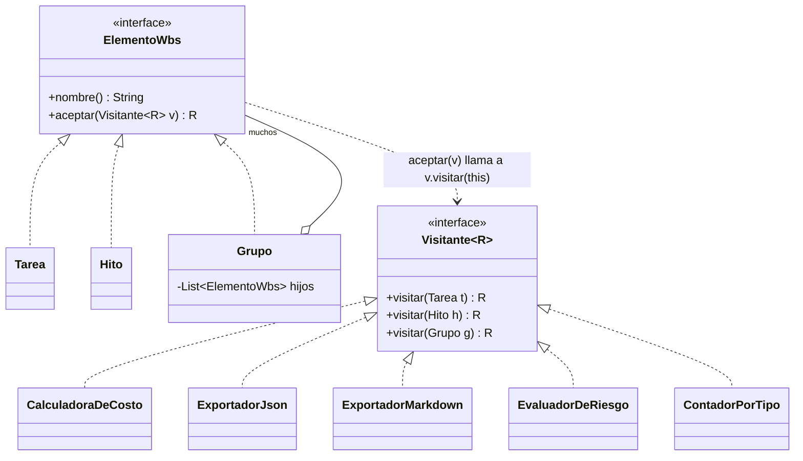
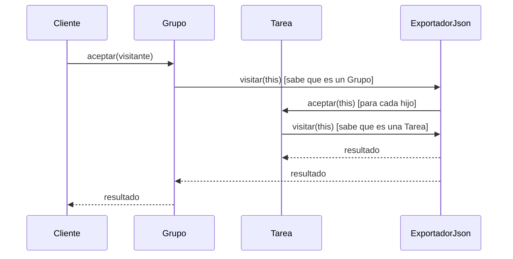

[← Volver al índice](README.md) · [← 23 Template Method](23-template-method.md)

# 24 · Visitor

> **Familia:** Comportamiento · *Visitante*

---

## En una frase

**Agrega operaciones nuevas a una familia de clases sin tocar el código de esas clases.**

Como un auditor externo que recorre las oficinas de una empresa: contabilidad, bodega,
producción. En cada una hace algo distinto, pero ninguna oficina tuvo que cambiar su forma
de trabajar para recibirlo. Y mañana puede venir otro auditor, con otro objetivo, sin que
las oficinas cambien tampoco.

---

## El enunciado

> **Ticket PMO-2110**
> Tenemos la estructura de desglose de trabajo del capítulo
> [09 · Composite](09-composite.md): `Tarea`, `Hito` y `Grupo`, anidados en un árbol.
>
> En seis meses nos han pedido, uno tras otro:
> - Calcular el **costo total**.
> - Exportar a **JSON** para el tablero de gerencia.
> - Exportar a **Markdown** para el acta de comité.
> - Generar una **evaluación de riesgo** por tarea sin terminar.
> - Contar **cuántas tareas** hay por tipo.
> - Calcular la **ruta crítica**.
>
> Cada vez tuvimos que **abrir `Tarea`, `Hito` y `Grupo` y agregarles un método**. Esas
> tres clases ya tienen 14 métodos y son un basurero: hay lógica de JSON, de Markdown y
> de riesgo mezclada con el modelo del negocio.
>
> **Auditoría además exige que el modelo del dominio no cambie más:** cada modificación
> obliga a re-certificar el módulo.

---

## El código que duele

```java
record Tarea(String nombre, double costo, int horas, double avance) {
    double costoTotal() { ... }
    String aJson() { ... }             // ¿qué hace JSON dentro del dominio?
    String aMarkdown() { ... }
    int nivelDeRiesgo() { ... }
    int contarTareas() { ... }
    // ...y crece con cada requerimiento
}
```

Cada operación nueva **modifica las tres clases**. Eso viola el principio Abierto/Cerrado
y mezcla responsabilidades que no tienen nada que ver entre sí.

---

## La idea del patrón

Invierte quién tiene el método:

1. Una interfaz `Visitante` con **un método por cada tipo de elemento**:
   `visitar(Tarea)`, `visitar(Hito)`, `visitar(Grupo)`.
2. Cada elemento implementa **un único método**: `aceptar(Visitante v)`, que llama a
   `v.visitar(this)`.
3. Cada operación nueva es **una clase visitante nueva**. El modelo no se toca jamás.

> **Regla de oro:** si los **tipos** son estables pero las **operaciones** crecen, usa
> Visitor. Si es al revés, no lo uses.

---

## El diagrama



El baile de la **doble despacho** (double dispatch), que es el corazón del patrón:



La clave: **el elemento sabe qué tipo es** (por eso llama a `visitar(this)`) y **el
visitante sabe qué operación hacer**. Cada uno aporta la mitad de la información.

---

## La solución en Java 21

```java
import java.util.ArrayList;
import java.util.LinkedHashMap;
import java.util.List;
import java.util.Map;

// ===============================================================
// EL VISITANTE (genérico, para que cada operación devuelva su tipo)
// ===============================================================
interface Visitante<R> {
    R visitar(Tarea tarea);
    R visitar(Hito hito);
    R visitar(Grupo grupo);
}

// ===============================================================
// LA JERARQUÍA DE ELEMENTOS: cerrada, estable, sin lógica de negocio ajena
// ===============================================================
sealed interface ElementoWbs permits Tarea, Hito, Grupo {
    String nombre();
    <R> R aceptar(Visitante<R> visitante);      // <- el ÚNICO método que agregamos
}

record Tarea(String nombre, double costo, int horas, double avance, String responsable)
        implements ElementoWbs {
    @Override public <R> R aceptar(Visitante<R> v) { return v.visitar(this); }
}

record Hito(String nombre, String fecha, boolean alcanzado) implements ElementoWbs {
    @Override public <R> R aceptar(Visitante<R> v) { return v.visitar(this); }
}

record Grupo(String nombre, List<ElementoWbs> hijos) implements ElementoWbs {
    Grupo(String nombre, ElementoWbs... hijos) { this(nombre, List.of(hijos)); }
    @Override public <R> R aceptar(Visitante<R> v) { return v.visitar(this); }
}

// ===============================================================
// OPERACIÓN 1: costo total
// ===============================================================
final class CalculadoraDeCosto implements Visitante<Double> {
    public Double visitar(Tarea t) { return t.costo(); }
    public Double visitar(Hito h)  { return 0.0; }                 // un hito no cuesta
    public Double visitar(Grupo g) {
        return g.hijos().stream().mapToDouble(h -> h.aceptar(this)).sum();
    }
}

// ===============================================================
// OPERACIÓN 2: exportar a JSON
// ===============================================================
final class ExportadorJson implements Visitante<String> {
    private final String sangria;
    ExportadorJson() { this(""); }
    private ExportadorJson(String sangria) { this.sangria = sangria; }

    public String visitar(Tarea t) {
        return """
            %s{"tipo":"tarea","nombre":"%s","costo":%.0f,"horas":%d,"avance":%.2f,"responsable":"%s"}"""
            .formatted(sangria, t.nombre(), t.costo(), t.horas(), t.avance(), t.responsable());
    }
    public String visitar(Hito h) {
        return """
            %s{"tipo":"hito","nombre":"%s","fecha":"%s","alcanzado":%b}"""
            .formatted(sangria, h.nombre(), h.fecha(), h.alcanzado());
    }
    public String visitar(Grupo g) {
        var interno = new ExportadorJson(sangria + "    ");
        var hijos = g.hijos().stream().map(h -> h.aceptar(interno)).toList();
        return "%s{\"tipo\":\"grupo\",\"nombre\":\"%s\",\"hijos\":[\n%s\n%s]}"
                .formatted(sangria, g.nombre(), String.join(",\n", hijos), sangria);
    }
}

// ===============================================================
// OPERACIÓN 3: exportar a Markdown
// ===============================================================
final class ExportadorMarkdown implements Visitante<String> {
    private final int nivel;
    ExportadorMarkdown() { this(0); }
    private ExportadorMarkdown(int nivel) { this.nivel = nivel; }

    public String visitar(Tarea t) {
        return "%s- **%s** — $%,.0f · %dh · %.0f%% · _%s_"
                .formatted("  ".repeat(nivel), t.nombre(), t.costo(), t.horas(),
                           t.avance() * 100, t.responsable());
    }
    public String visitar(Hito h) {
        return "%s- %s **%s** (%s)".formatted("  ".repeat(nivel),
                h.alcanzado() ? "[x]" : "[ ]", h.nombre(), h.fecha());
    }
    public String visitar(Grupo g) {
        var interno = new ExportadorMarkdown(nivel + 1);
        var hijos = g.hijos().stream().map(h -> h.aceptar(interno)).toList();
        return "%s### %s%n%s".formatted("  ".repeat(nivel), g.nombre(),
                String.join("\n", hijos));
    }
}

// ===============================================================
// OPERACIÓN 4: evaluación de riesgo (con estado acumulado)
// ===============================================================
final class EvaluadorDeRiesgo implements Visitante<Void> {
    private final List<String> alertas = new ArrayList<>();

    public Void visitar(Tarea t) {
        if (t.avance() == 0 && t.costo() > 5_000_000)
            alertas.add("🔴 '%s' ($%,.0f) sin empezar — responsable: %s"
                    .formatted(t.nombre(), t.costo(), t.responsable()));
        else if (t.avance() < 0.3 && t.horas() > 60)
            alertas.add("🟡 '%s' con %.0f%% de avance y %dh estimadas"
                    .formatted(t.nombre(), t.avance() * 100, t.horas()));
        return null;
    }
    public Void visitar(Hito h) {
        if (!h.alcanzado()) alertas.add("🟠 Hito '%s' (%s) no alcanzado"
                .formatted(h.nombre(), h.fecha()));
        return null;
    }
    public Void visitar(Grupo g) {
        g.hijos().forEach(h -> h.aceptar(this));
        return null;
    }
    List<String> alertas() { return List.copyOf(alertas); }
}

// ===============================================================
// OPERACIÓN 5: conteo por tipo
// ===============================================================
final class ContadorPorTipo implements Visitante<Map<String, Integer>> {
    private final Map<String, Integer> conteo = new LinkedHashMap<>();

    private Map<String, Integer> sumar(String tipo) {
        conteo.merge(tipo, 1, Integer::sum);
        return conteo;
    }
    public Map<String, Integer> visitar(Tarea t) { return sumar("tareas"); }
    public Map<String, Integer> visitar(Hito h)  { return sumar("hitos"); }
    public Map<String, Integer> visitar(Grupo g) {
        sumar("grupos");
        g.hijos().forEach(h -> h.aceptar(this));
        return conteo;
    }
}

public class Demo {
    public static void main(String[] args) {

        // El árbol se arma UNA vez. Estas clases nunca más se modifican.
        ElementoWbs proyecto = new Grupo("Proyecto CRM",
            new Grupo("Fase 1 - Análisis",
                new Tarea("Entrevistas con usuarios", 3_200_000, 40, 1.00, "ana"),
                new Tarea("Documento de requisitos",  2_400_000, 30, 1.00, "ana"),
                new Hito("Requisitos aprobados", "2026-05-15", true)),
            new Grupo("Fase 2 - Desarrollo",
                new Grupo("Backend",
                    new Tarea("API de clientes",     6_400_000,  80, 0.60, "carlos"),
                    new Tarea("API de facturación",  8_000_000, 100, 0.30, "carlos"),
                    new Tarea("Pasarela de pagos",   4_800_000,  60, 0.00, "lucia")),
                new Grupo("Frontend",
                    new Tarea("Pantalla de clientes",   4_000_000, 50, 0.40, "pedro"),
                    new Tarea("Tablero de indicadores", 5_600_000, 70, 0.00, "pedro")),
                new Hito("Salida a producción", "2026-11-30", false)));

        System.out.println("=== Operación 1: costo total ===");
        System.out.printf("  $%,.0f%n", proyecto.aceptar(new CalculadoraDeCosto()));

        System.out.println("\n=== Operación 2: JSON ===");
        System.out.println(proyecto.aceptar(new ExportadorJson()));

        System.out.println("\n=== Operación 3: Markdown ===");
        System.out.println(proyecto.aceptar(new ExportadorMarkdown()));

        System.out.println("\n=== Operación 4: riesgo ===");
        var evaluador = new EvaluadorDeRiesgo();
        proyecto.aceptar(evaluador);
        evaluador.alertas().forEach(a -> System.out.println("  " + a));

        System.out.println("\n=== Operación 5: conteo ===");
        System.out.println("  " + proyecto.aceptar(new ContadorPorTipo()));

        System.out.println("""

            Cinco operaciones distintas.
            Cero líneas modificadas en Tarea, Hito y Grupo.""");
    }
}
```

### Salida (recortada)

```
=== Operación 1: costo total ===
  $34,400,000

=== Operación 2: JSON ===
{"tipo":"grupo","nombre":"Proyecto CRM","hijos":[
    {"tipo":"grupo","nombre":"Fase 1 - Análisis","hijos":[
        {"tipo":"tarea","nombre":"Entrevistas con usuarios","costo":3200000,...}
        ...
    ]}
]}

=== Operación 3: Markdown ===
### Proyecto CRM
  ### Fase 1 - Análisis
    - **Entrevistas con usuarios** — $3,200,000 · 40h · 100% · _ana_
    - [x] **Requisitos aprobados** (2026-05-15)
  ### Fase 2 - Desarrollo
    ...

=== Operación 4: riesgo ===
  🟡 'API de facturación' con 30% de avance y 100h estimadas
  🔴 'Pasarela de pagos' ($4,800,000) sin empezar — responsable: lucia
  🔴 'Tablero de indicadores' ($5,600,000) sin empezar — responsable: pedro
  🟠 Hito 'Salida a producción' (2026-11-30) no alcanzado

=== Operación 5: conteo ===
  {grupos=5, tareas=7, hitos=2}

Cinco operaciones distintas.
Cero líneas modificadas en Tarea, Hito y Grupo.
```

---

## El trade-off que define al Visitor

Este patrón es un **canje explícito**, y hay que entenderlo antes de usarlo:

| | Agregar una **OPERACIÓN** nueva | Agregar un **TIPO** nuevo |
|---|---|---|
| **Sin Visitor** (métodos en las clases) | ❌ Caro: tocar las N clases | ✅ Barato: una clase nueva |
| **Con Visitor** | ✅ Barato: un visitante nuevo | ❌ Caro: tocar los N visitantes |

Ese fenómeno tiene nombre: **el problema de la expresión**. No hay solución perfecta;
hay que elegir qué eje quieres que sea barato.

**La pregunta que decide:** *¿qué va a cambiar más en los próximos dos años, los tipos o
las operaciones?*

- ¿El árbol tiene 3 tipos estables y te piden un reporte nuevo cada mes? → **Visitor**.
- ¿Te piden tipos nuevos constantemente y las operaciones son 2? → **métodos normales**.

---

## En Java 21 hay una alternativa mejor para muchos casos

El `switch` con patrones sobre una interfaz `sealed` te da casi lo mismo con mucho menos
ceremonia:

```java
static double costo(ElementoWbs elemento) {
    return switch (elemento) {                       // sin default: el compilador verifica
        case Tarea t -> t.costo();
        case Hito h  -> 0.0;
        case Grupo g -> g.hijos().stream().mapToDouble(Demo::costo).sum();
    };
}
```

| | Visitor clásico | `switch` con patrones + `sealed` |
|---|---|---|
| Código necesario | Interfaz + `aceptar()` en cada tipo + una clase por operación | Un método estático por operación |
| ¿Compilador verifica exhaustividad? | ✅ Sí (la interfaz obliga) | ✅ Sí (`sealed` obliga) |
| ¿Los tipos deben cooperar? | ✅ Sí: necesitan `aceptar()` | ❌ No: funciona con tipos ajenos |
| Estado acumulado entre visitas | ✅ Natural (campo del visitante) | ⚠️ Hay que pasarlo o usar una clase |
| Operaciones desde otro módulo | ✅ Sí | ⚠️ Solo si la jerarquía es visible |

**Recomendación práctica en Java 21:** empieza con `sealed` + `switch` con patrones.
Pásate al Visitor completo cuando la operación necesite **estado acumulado**, cuando haya
**muchas operaciones agrupadas** que se pasan entre sí, o cuando quieras que **otros
equipos agreguen operaciones** sin ver tu jerarquía.

---

## ✅ Cuándo usarlo

- Tienes una jerarquía de tipos **estable** (no cambia casi nunca).
- Las **operaciones** sobre esa jerarquía crecen constantemente.
- Quieres sacar del modelo del dominio lógica que no le pertenece (serialización,
  reportes, validaciones, métricas).
- Necesitas acumular estado mientras recorres una estructura.
- Estás trabajando sobre árboles: AST, XML, DOM, composites, expresiones.

## ⛔ Cuándo NO usarlo

- La jerarquía de tipos **cambia seguido**: cada tipo nuevo te obliga a tocar todos los
  visitantes. Es el peor escenario para este patrón.
- Solo hay una o dos operaciones: no vale la ceremonia.
- El visitante necesita el estado **privado** de los elementos: tendrías que abrir su
  encapsulamiento, y ahí pierdes lo que ganaste.
- Es el patrón **más difícil de leer** de los 23 para alguien que no lo conoce. Si tu
  equipo no lo maneja, considera el `switch` con patrones.

---

## Se parece a...

| Patrón | Diferencia clave |
|---|---|
| **[Composite](09-composite.md)** | Su pareja natural. Composite arma el árbol, Visitor le agrega operaciones. Casi siempre van juntos. |
| **[Iterator](17-iterator.md)** | Iterator recorre y entrega elementos uno a uno, sin distinguir tipos. Visitor recorre **y** hace algo distinto según el tipo. |
| **[Interpreter](16-interpreter.md)** | Visitor se usa mucho sobre árboles de expresiones: optimizar, traducir a SQL, calcular complejidad. |
| **[Strategy](22-strategy.md)** | Cada visitante es como una estrategia de recorrido, pero Visitor sabe distinguir tipos; Strategy no. |
| **[Template Method](23-template-method.md)** | Puede usarse dentro de un visitante para fijar el orden del recorrido. |

---

## Dónde ya lo has visto

- `java.nio.file.FileVisitor` con `Files.walkFileTree(...)`: el ejemplo más limpio del JDK.
- El API de procesamiento de anotaciones: `javax.lang.model.element.ElementVisitor`.
- Los AST de compiladores y linters: ANTLR genera visitantes automáticamente.
- Jackson y los serializadores de JSON al recorrer un grafo de objetos.
- Los *plugins* de análisis estático (SonarQube, SpotBugs) sobre el árbol de tu código.

---

## Y con esto terminamos los 23

Si llegaste hasta acá, ya recorriste el catálogo completo. Recuerda lo del principio:

> **No busques dónde aplicar patrones. Busca dónde duele el código.**
> El patrón correcto casi siempre aparece solo cuando entiendes bien el dolor.

Y si te llevas solo cinco: **Strategy, Factory Method, Adapter, Observer y Decorator**
cubren la enorme mayoría de lo que verás en un proyecto real.

---

[← Volver al índice](README.md)
