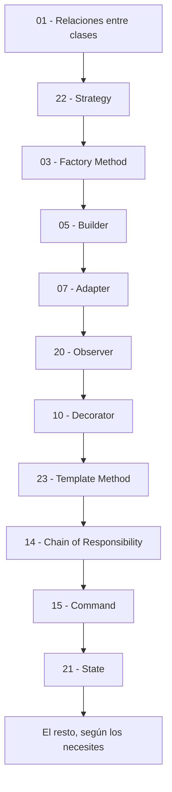
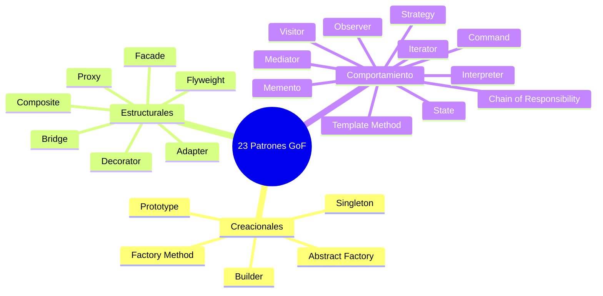

# Patrones de Diseño explicados sin humo

Guía práctica para entender los **23 patrones de diseño GoF** con ejemplos de la vida
laboral real, diagramas y código en **Java 21**.

> **Para quién es esto:** para alguien que ya sabe programar en Java (clases, interfaces,
> listas) pero cada vez que escucha "eso resuélvelo con un Factory" pone cara de póker.
> Aquí no hay academicismo: hay problemas de trabajo, código que duele, y cómo el patrón
> lo arregla.

---

## Cómo está armado cada capítulo

Todos los patrones siguen exactamente la misma estructura, para que no tengas que
reaprender a leer en cada archivo:

| Sección | Qué vas a encontrar |
|---|---|
| **En una frase** | El patrón explicado como se lo explicarías a un amigo en un café. |
| **El enunciado** | Un ticket de trabajo real. Un requerimiento que te podrían asignar mañana. |
| **El código que duele** | Cómo resolverlo "a lo bruto" y por qué se te va a devolver en code review. |
| **La idea del patrón** | Una analogía de la vida cotidiana + la regla de oro. |
| **El diagrama** | Diagrama de clases en Mermaid, para ver la forma antes de leer código. |
| **La solución en Java 21** | Código completo, compilable, con `record`, `sealed`, `switch` con patrones, etc. |
| **Qué ganamos** | El antes vs. después concreto. |
| **Cuándo usarlo / cuándo NO** | Lo más importante y lo que casi nadie te dice. |
| **Se parece a...** | Cómo distinguirlo de sus primos hermanos. |

---

## Tabla de contenido

### Parte 0 — Antes de empezar

| # | Tema | Archivo |
|---|---|---|
| 00 | Qué es un patrón de diseño (y qué NO es) | [00-fundamentos.md](00-fundamentos.md) |
| 01 | **Relaciones entre clases**: herencia, composición, agregación, asociación, dependencia | [01-relaciones-entre-clases.md](01-relaciones-entre-clases.md) |

> Si solo vas a leer dos archivos, que sean estos dos. Los patrones son combinaciones
> de estas relaciones; sin ellas todo lo demás suena a magia.

### Parte 1 — Patrones Creacionales

*Responden a: **¿cómo creo objetos sin llenar el código de `new` por todos lados?***

| # | Patrón | En una frase | Archivo |
|---|---|---|---|
| 02 | **Singleton** | Una sola instancia para toda la aplicación. | [02-singleton.md](02-singleton.md) |
| 03 | **Factory Method** | Una subclase decide qué objeto concreto crear. | [03-factory-method.md](03-factory-method.md) |
| 04 | **Abstract Factory** | Una fábrica que crea *familias* de objetos que combinan entre sí. | [04-abstract-factory.md](04-abstract-factory.md) |
| 05 | **Builder** | Construir un objeto complicado paso a paso y legible. | [05-builder.md](05-builder.md) |
| 06 | **Prototype** | Clonar un objeto ya armado en vez de construirlo de cero. | [06-prototype.md](06-prototype.md) |

### Parte 2 — Patrones Estructurales

*Responden a: **¿cómo armo objetos grandes juntando objetos pequeños?***

| # | Patrón | En una frase | Archivo |
|---|---|---|---|
| 07 | **Adapter** | Un traductor entre dos interfaces que no se entienden. | [07-adapter.md](07-adapter.md) |
| 08 | **Bridge** | Separar el "qué" del "cómo" para que crezcan por separado. | [08-bridge.md](08-bridge.md) |
| 09 | **Composite** | Tratar igual a un elemento suelto y a un grupo de elementos. | [09-composite.md](09-composite.md) |
| 10 | **Decorator** | Envolver un objeto para agregarle funcionalidad sin tocarlo. | [10-decorator.md](10-decorator.md) |
| 11 | **Facade** | Una puerta simple a un sistema complicado. | [11-facade.md](11-facade.md) |
| 12 | **Flyweight** | Compartir lo que se repite para no reventar la memoria. | [12-flyweight.md](12-flyweight.md) |
| 13 | **Proxy** | Un intermediario que controla el acceso al objeto real. | [13-proxy.md](13-proxy.md) |

### Parte 3 — Patrones de Comportamiento

*Responden a: **¿cómo se reparten el trabajo y se comunican los objetos?***

| # | Patrón | En una frase | Archivo |
|---|---|---|---|
| 14 | **Chain of Responsibility** | Una fila de validadores; cada uno atiende o pasa la bolita. | [14-chain-of-responsibility.md](14-chain-of-responsibility.md) |
| 15 | **Command** | Convertir una acción en un objeto que se guarda, encola y deshace. | [15-command.md](15-command.md) |
| 16 | **Interpreter** | Darle sentido a un mini-lenguaje propio. | [16-interpreter.md](16-interpreter.md) |
| 17 | **Iterator** | Recorrer una colección sin saber cómo está guardada por dentro. | [17-iterator.md](17-iterator.md) |
| 18 | **Mediator** | Un coordinador central para que los objetos no se hablen entre todos. | [18-mediator.md](18-mediator.md) |
| 19 | **Memento** | Guardar fotos del estado para poder volver atrás. | [19-memento.md](19-memento.md) |
| 20 | **Observer** | Publicar un evento y que se enteren los interesados. | [20-observer.md](20-observer.md) |
| 21 | **State** | El objeto cambia de comportamiento según su estado. | [21-state.md](21-state.md) |
| 22 | **Strategy** | Intercambiar el algoritmo en tiempo de ejecución. | [22-strategy.md](22-strategy.md) |
| 23 | **Template Method** | La receta fija en el padre, los pasos variables en el hijo. | [23-template-method.md](23-template-method.md) |
| 24 | **Visitor** | Agregar operaciones nuevas a una jerarquía sin modificarla. | [24-visitor.md](24-visitor.md) |

---

## Ruta de aprendizaje sugerida

No los leas en orden numérico. Léelos en orden de **utilidad real en el día a día**:



**Semana 1:** Relaciones + Strategy + Factory Method + Builder.
**Semana 2:** Adapter + Observer + Decorator + Template Method.
**Semana 3:** Chain of Responsibility + Command + State + Facade + Proxy.
**Después:** Composite, Abstract Factory, Singleton, Prototype, Bridge, Iterator, Mediator, Memento, Flyweight, Visitor, Interpreter.

---

## Mapa mental de los 23



---

## Las 3 reglas que sostienen todos los patrones

1. **Programa contra interfaces, no contra implementaciones.**
   `List<String> x = new ArrayList<>();` en vez de `ArrayList<String> x = ...`.
   Suena tonto en ese ejemplo; es la base de 20 de los 23 patrones.

2. **Prefiere composición sobre herencia.**
   Heredar te ata de por vida a la clase padre. Componer te deja cambiar de opinión.
   (Explicado en detalle en [01-relaciones-entre-clases.md](01-relaciones-entre-clases.md)).

3. **Encapsula lo que cambia.**
   Mira tu código, encuentra la parte que te toca modificar cada vez que llega un
   requerimiento nuevo, y sácala a su propia clase o interfaz.

---

## Cómo correr los ejemplos

Todos los ejemplos son **archivos únicos y autocontenidos**. Con Java 21 instalado:

```bash
# Copia el bloque de código del capítulo a un archivo Demo.java
java Demo.java
```

No necesitas Maven, Gradle, ni compilar antes: desde Java 11 puedes ejecutar un
`.java` de un solo archivo directamente.

---

## Advertencia importante

> **Los patrones no son una meta, son una herramienta.**
>
> El error clásico del que acaba de aprender patrones es querer meterlos en todos lados.
> Un `if/else` de tres ramas que no ha cambiado en dos años **no necesita** un Strategy.
>
> La pregunta correcta nunca es *"¿qué patrón aplico aquí?"*.
> Es *"¿qué parte de este código me está doliendo?"*. Si no duele nada, no apliques nada.
